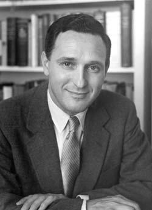

# Andrija Puharich
Medical inventor, physician, and parapsychological researcher who patented a method for splitting water molecules. His home was destroyed by arson in 1979, and he died in 1995 after falling down a flight of stairs.

| Field | Details |
|-------|---------|
| **Full Name** | Andrija Karel Puharich (born Henry Karel Puharich) |
| **Born** | February 19, 1918, Chicago, Illinois |
| **Died** | January 3, 1995 |
| **Age at Death** | 76 |
| **Location of Death** | Dobson, North Carolina (near Winston-Salem) |
| **Cause of Death** | Heart attack and fall down a flight of stairs |
| **Official Ruling** | Accidental death / natural causes |
| **Category** | Energy Inventor / Physicist / Scientist |

## Assessment: SUSPICIOUS

Andrija Puharich was a physician, inventor, and researcher who operated at the intersection of military intelligence, parapsychology, and energy technology. He held U.S. Patent 4,394,230 (1983) for a method and apparatus for splitting water molecules — a technology with implications for hydrogen fuel. In 1979, his home and laboratory in Ossining, New York were destroyed by arson, which he attributed to threats connected to his work (he implicated the CIA). He fled to Mexico for a period. On January 3, 1995, Puharich fell down a flight of stairs and died. While he was 76 and described as extremely frail with failing health at the time, associates have expressed suspicion about the circumstances given his long history of intelligence connections, controversial research, and prior threats.

## Circumstances of Death

On January 3, 1995, Andrija Puharich suffered a heart attack and fell down a flight of stairs at approximately 7:15 p.m. He was living at the time on the Surry County estate of Richard Joshua Reynolds in Dobson, North Carolina, near Winston-Salem. He had been one of three scientists ordered to leave the estate.

According to Susan Mandell, who was caring for Puharich at the time, he was extremely frail and his health had been failing. Mandell stated that Puharich was waiting for his social security check because he could not afford to move following an eviction order.

A death notice appeared in the Winston-Salem Journal on January 4, 1995.

## Background

### Medical and Scientific Career

Andrija Puharich earned his medical degree from Northwestern University School of Medicine in 1947. He was a prolific inventor who held over 50 patents, primarily in the fields of medical electronics and hearing aids. His most significant patents included:

- Miniature hearing aid devices implanted in teeth
- U.S. Patent 4,394,230 (1983): "Method and Apparatus for Splitting Water Molecules" — a technique for decomposing water into hydrogen and oxygen using specific electrical frequencies

### Water Splitting Patent

Puharich's most controversial invention was his water-splitting technology. He discovered a way to split water molecules by tuning into the vibrational frequencies of their atoms, breaking the molecules into hydrogen (usable as fuel) and oxygen. The patent described a method using alternating current electrolysis at specific frequencies to achieve more efficient water decomposition than conventional electrolysis. Supporters claimed this technology could have enabled cheap, abundant hydrogen fuel from water.

### Intelligence Connections

Puharich had deep and well-documented connections to U.S. military and intelligence agencies:

- **Army service:** He served as an Army doctor in the 1950s
- **CIA / MKULTRA:** He was reportedly involved with the CIA's MKULTRA mind control program, working alongside Dr. Sidney Gottlieb on experiments involving techniques to alter thought processes
- **Project ARTICHOKE:** He was also reportedly connected to this CIA interrogation program
- **Edgewood Arsenal:** He conducted chemical and psychological warfare research at the Army's Edgewood Arsenal facility
- **Defense Department mushroom research:** In the early 1950s, the Defense Department tasked Puharich with locating psychoactive mushrooms believed to unlock psychic abilities — research that paralleled the CIA's own work under MKULTRA

### The Round Table Foundation

In the early 1950s, Puharich founded the Round Table Foundation, a parapsychology research laboratory in Glen Cove, Maine. The foundation attracted notable members and conducted research into extrasensory perception, psychokinesis, and related phenomena.

### Uri Geller

Puharich is perhaps best known publicly as the person who brought Israeli psychic Uri Geller to the United States in 1971 for scientific investigation. He also brought Dutch psychic Peter Hurkos to the U.S. for study. His work with Geller — which included claims of extraterrestrial communication under hypnosis — generated significant controversy.

### CIA Assassination Threats and Rockefeller Capitulation

According to accounts in alternative energy circles, Puharich allegedly received direct CIA assassination threats if he continued his water-splitting research. He reportedly capitulated after a meeting with Rockefeller interests — specifically, sources cite a connection to David Rockefeller — effectively agreeing to abandon or suppress further development of his water decomposition technology. This alleged capitulation is cited as an example of how intelligence agencies and financial elites worked together to suppress energy technologies that threatened petroleum-based industries.

### The 1979 Arson

In 1978 or 1979, Puharich's home and laboratory at his estate in Ossining, New York (known as "The Turkey Farm") was destroyed by arson. Puharich attributed the fire to threats connected to his research work and implicated the CIA. The arson may have been connected to the assassination threats he reportedly received over his water-splitting research. Following the fire, he fled to Mexico for a period before eventually returning to the United States.

The arson destroyed much of his research materials, equipment, and records.

## Why This Death Possibly Raises Questions

- **Prior arson:** His home and laboratory were destroyed by arson in 1979, indicating someone had previously targeted him and his research
- **CIA connections and CIA accusations:** Puharich himself implicated the CIA in the arson of his home — he had worked with the agency but apparently fell out of favor
- **Water splitting patent:** His patent for efficient water decomposition into hydrogen fuel had significant implications for the energy industry
- **Intelligence community involvement:** His deep connections to MKULTRA, ARTICHOKE, and military research programs meant he possessed sensitive knowledge
- **Pattern of dying while impoverished:** Like several other unconventional researchers, Puharich died in reduced circumstances — waiting for a social security check, unable to afford to move after an eviction
- **Associates' suspicions:** Some who knew Puharich have expressed doubt about the circumstances of his death, given his history of threats and intelligence connections
- **Fall down stairs:** A fall down stairs is a method of death that can be difficult to distinguish from being pushed, particularly in an elderly person

## The Counterargument

- Puharich was 76 years old and described as "extremely frail" with "failing health" by his caretaker
- Heart attacks followed by falls are a common cause of death in elderly people
- His caretaker's account suggests his death was consistent with his declining physical condition
- No official investigation treated his death as suspicious
- His intelligence work was decades in the past by 1995
- His water splitting patent, while interesting, had not achieved commercial development

## See Also

- [Stanley Meyer](Stanley_Meyer.md) — Another inventor of water-based fuel technology who died suddenly
- [Eugene Mallove](Eugene_Mallove.md) — Cold fusion advocate beaten to death
- [Arie DeGeus](Arie_DeGeus.md) — Clean energy inventor who died of heart failure

## Other Shocking Stories

- [Carl Grillmair](Carl_Grillmair.md): Caltech astrophysicist shot dead on his porch. Suspect's charges dismissed eleven days before the killing.
- [John Bedini](John_Bedini.md): Free energy pioneer died suddenly in 2016. Electromagnetic recovery devices never reached the public.
- [Paul Pantone](Paul_Pantone.md): Plasma reactor inventor locked in a state mental hospital for years. Died after release.
- [Jaime Gustitus](Jaime_Gustitus.md): AFRL analyst with Top Secret/SCI clearance at Wright-Patterson. Found dead October 2025.

## Sources

- [Andrija Puharich — Wikipedia](https://en.wikipedia.org/wiki/Andrija_Puharich)
- [Andrija Puharich — Psi Encyclopedia](https://psi-encyclopedia.spr.ac.uk/articles/andrija-puharich)
- [Andrija Puharich — Find a Grave](https://www.findagrave.com/memorial/175323720/andrija-karel-puharich)
- [The Obituary of Andrija Puharich — Storm Bear Williams](https://stormbear.wordpress.com/2019/12/03/obituary-of-andrija-puharich/)
- [Andrija Puharich: Water Decomposition by AC Electrolysis — Rex Research](http://www.rexresearch.com/puharich/1puhar.htm)
- [U.S. Patent 4,394,230 — Method and Apparatus for Splitting Water Molecules](https://patents.google.com/patent/US4394230A/)
- [Water as Fuel — Andrija Puharich and Suppression by David Rockefeller — Red Ice](https://redice.tv/news/water-as-fuel-andrija-puharich-and-suppression-by-david-rockefeller)
- [Why the United States Government Embraced the Occult — The New Republic](https://newrepublic.com/article/142268/united-states-government-embraced-occult)

*This information was built by Grok and Claude AI research.*

**Status:** Deceased (1995)
