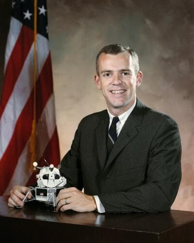

# Brian O'Leary

Former NASA astronaut and zero-point energy advocate who died of aggressive intestinal cancer just six days after diagnosis, after becoming one of the most credible public voices for free energy technology.

| Field | Details |
|-------|---------|
| **Full Name** | Brian Todd O'Leary |
| **Born** | January 27, 1940 |
| **Died** | July 28, 2011 |
| **Age at Death** | 71 |
| **Location of Death** | Vilcabamba, Ecuador |
| **Cause of Death** | Intestinal cancer |
| **Official Ruling** | Natural causes |
| **Category** | Energy Researcher |

## Assessment: MODERATE SUSPICION

Brian O'Leary was a former NASA astronaut (Group 6, selected for the Mars mission) who became one of the most credible public voices advocating for zero-point energy and free energy technology. He co-founded the New Energy Movement, authored books on vacuum energy, and spoke at conferences worldwide. He was diagnosed with intestinal cancer and died just six days later — an extraordinarily rapid progression. He had moved to Ecuador after his colleague Eugene Mallove was beaten to death in 2004. While cancer can be aggressive, the rapid onset in a prominent free energy advocate fits a pattern documented throughout this project.

## Circumstances of Death

O'Leary died on July 28, 2011, at his home in Vilcabamba, Ecuador. He had been diagnosed with intestinal cancer just six days earlier. The speed from diagnosis to death was extraordinarily rapid. He had also survived two heart attacks, the second of which occurred in 2010 during an ayahuasca ceremony.

## Background

Brian O'Leary had impeccable mainstream credentials before becoming a free energy advocate:

- **NASA Astronaut** — Selected in 1967 as part of NASA Astronaut Group 6, designated for the Mars mission
- **Professor** — Taught physics at Princeton, Cornell, and UC Berkeley
- **Published scientist** — Author of numerous academic papers and several books
- **Advisor** — Served as energy policy advisor to presidential candidates

After leaving NASA, O'Leary became increasingly convinced that advanced energy technologies were being suppressed. He co-founded the **New Energy Movement** in 2003 with several other researchers, and authored:
- *Miracle in the Void: Free Energy, UFOs and Other Scientific Revelations* (1996)
- *The Energy Solution Revolution* (2009)
- *The Second Coming of Science* (1993)

O'Leary's credibility as a former NASA astronaut and Princeton/Cornell professor made him one of the most dangerous advocates for free energy — his credentials made it impossible to dismiss him as a crank.

He relocated to Ecuador after his colleague and fellow New Energy Movement advocate Eugene Mallove was beaten to death in 2004. The move was at least partly motivated by safety concerns.

## Why This Death Possibly Raises Questions

- Diagnosed with cancer and dead in six days — extraordinarily rapid progression
- Was one of the most credible public voices for free energy (NASA astronaut, Princeton/Cornell professor)
- His credentials made him uniquely difficult to dismiss — a serious threat to energy suppression efforts
- Moved to Ecuador after his colleague Eugene Mallove was murdered
- The rapid cancer death pattern appears in other cases in this project (James Allen, Shari Adamiak)
- He had survived two heart attacks — another pattern seen among targeted energy researchers
- His death at 71 silenced one of the few people with both scientific credentials and willingness to speak publicly
- He was far from conventional medical care in Ecuador, limiting the possibility of effective treatment

## The Counterargument

- Intestinal cancer can be aggressive and rapidly fatal, especially if diagnosed late
- At 71, cancer is statistically more likely
- He lived in a remote area of Ecuador with limited medical access, which may explain both late diagnosis and rapid death
- He had pre-existing health issues (two heart attacks)
- His participation in ayahuasca ceremonies and alternative health practices may have delayed proper medical care
- His move to Ecuador was partly motivated by lifestyle preferences, not just safety concerns
- Many free energy advocates live long lives without being targeted

## See Also

- [Eugene Mallove](/uaps/Details/Eugene_Mallove/) — Cold fusion advocate beaten to death; O'Leary's colleague in the New Energy Movement
- [James Allen](James_Allen.mdx) — Documentary filmmaker who also died of rapid-onset cancer while working on zero-point energy
- [George Taylor Fulford](George_Taylor_Fulford.mdx) — Major GE shareholder killed in a car crash one week after announcing his intention to fund Tesla's wireless energy project; like O'Leary, a prominent supporter whose financial backing of revolutionary energy made him a target

## Other Shocking Stories

- [Eugene Mallove](/uaps/Details/Eugene_Mallove/): Cold fusion champion beaten to death days after announcing a breakthrough that could have transformed the energy industry.
- [Stanley Meyer](/uaps/Details/Stanley_Meyer/): Gasped "they poisoned me" at dinner with investors, collapsed and died in the parking lot. His water fuel cell vanished.
- [James Allen](James_Allen.mdx): Zero-point energy filmmaker died within 3 months of cancer diagnosis. Blood contained 12 radioactive heavy metals.
- [Fred Bell](/uaps/Details/Fred_Bell/): Found dead in his hotel room two days after filming a TV interview about suppressed technology and death rays.

## Sources

- [Wikipedia — Brian O'Leary](https://en.wikipedia.org/wiki/Brian_O%27Leary)
- [NSS — Decades of Magical Thinking: Dr. Brian O'Leary's Final Years](https://nss.org/decades-of-magical-thinking-dr-brian-olearys-final-years/)
- [Project Camelot — Brian O'Leary Passed Away Today](https://projectcamelotportal.com/2011/07/29/brian-o-leary-passed-away-today/)
- Brian O'Leary, *The Energy Solution Revolution*, 2009

*This information was built by Grok and Claude AI research.*

**Status:** Deceased (2011)
