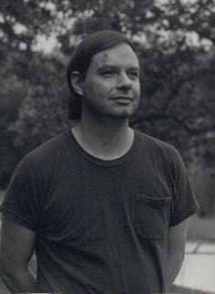

# Bruce DePalma
American inventor of the N-Machine homopolar generator — which he claimed demonstrated over-unity energy output — who moved to New Zealand after "a lifetime of resistance" in the US and died weeks before official testing of his device was to take place.

| Field | Details |
|-------|---------|
| **Full Name** | Bruce Eldridge DePalma |
| **Born** | 1935 |
| **Died** | October 1997 |
| **Age at Death** | ~62 |
| **Location of Death** | New Zealand |
| **Cause of Death** | Internal hemorrhage (attributed to years of alcohol and substance abuse) |
| **Official Ruling** | Natural causes |
| **Category** | Energy Inventor / Physicist / Scientist |

## Assessment: UNCERTAIN

Bruce DePalma was an MIT-educated physicist who spent decades developing and promoting the N-Machine — a type of homopolar generator that he claimed produced more electrical energy output than mechanical energy input, violating the conventional understanding of energy conservation. He was the brother of acclaimed film director Brian De Palma. After years of encountering institutional resistance in the United States — including inability to secure academic positions or mainstream scientific testing — DePalma moved to New Zealand in 1994. He died in October 1997, reportedly weeks before an official test of an N-Machine being built in an Auckland workshop. When tested after his death, the machine failed to demonstrate over-unity performance. His death was attributed to internal bleeding caused by years of heavy alcohol and substance use. While the timing is notable, the medical explanation is consistent with his documented lifestyle.

## Circumstances of Death

In October 1997, Bruce DePalma died in New Zealand. According to accounts from associates, he "bled to death internally" — a description consistent with gastrointestinal hemorrhage, a known consequence of chronic alcohol abuse and liver disease.

DePalma had been living in New Zealand since 1994, working with local collaborators to build and test an N-Machine. At the time of his death, a version of the device was reportedly nearing completion in an Auckland workshop and was scheduled for official independent testing.

After DePalma's death, the N-Machine was tested by the collaborators. It failed to demonstrate the over-unity performance that DePalma had claimed. Supporters have argued that the machine was not properly configured or that DePalma's specific knowledge of tuning and calibration — which died with him — was essential to achieving the claimed results.

## Background

### Education and Early Career

Bruce DePalma graduated from MIT with a degree in electrical engineering and later studied physics at Harvard. He was a lecturer at MIT during the 1960s and 1970s, where he conducted research on rotation, inertia, and electromagnetism. He was regarded as a talented experimentalist with a deep understanding of classical physics.

DePalma was the brother of film director Brian De Palma (*Scarface*, *The Untouchables*, *Mission: Impossible*). The brothers reportedly had a complicated relationship, with Bruce's unconventional scientific pursno and lifestyle choices diverging sharply from Brian's Hollywood career.

### The Spinning Ball Experiment

DePalma's journey into unconventional physics began with what he called the "spinning ball experiment" in the early 1970s. He claimed to demonstrate that a spinning object, when launched vertically, rose higher and fell faster than an identical non-spinning object launched with the same force. He argued this showed that rotation coupled an object to an energy field not accounted for in standard physics.

Mainstream physicists disputed his experimental methodology and conclusions.

### The N-Machine

DePalma's primary invention was the N-Machine (also called the N-1 Homopolar Generator), a variation of Michael Faraday's homopolar generator — a simple device consisting of a magnetized rotating disc. Key claims:

- **Over-unity output:** DePalma claimed the N-Machine produced more electrical energy output than the mechanical energy required to turn it, with some configurations allegedly achieving ratios of 4:1 or higher
- **Tapping space energy:** DePalma theorized the excess energy came from what he called "free energy of space" — a field accessible through the interaction of rotation and magnetism
- **Simple construction:** The N-Machine was mechanically simple — essentially a magnetized flywheel with brush contacts — making it potentially replicable

DePalma built several versions of the N-Machine over the decades and demonstrated them to various audiences. He corresponded extensively with other physicists, including Paramahansa Tewari in India, who built his own version called the Space Power Generator.

### Institutional Resistance

Throughout his career, DePalma encountered significant resistance from the scientific establishment:

- He was unable to secure permanent academic positions after his early MIT lectureship
- Mainstream physics journals refused to publish his papers
- He was unable to arrange independent testing through established institutions
- The U.S. government showed no interest in evaluating his claims
- He described the resistance as systematic and deliberate

### Death Threats

DePalma reportedly received direct death threats connected to his work. According to accounts from associates, astronaut Edgar Mitchell allegedly told DePalma: "CIA... you might get your head blown off." This threat from a figure with intelligence community connections is cited as a key factor that drove DePalma to leave the United States.

### Move to New Zealand

In 1994, DePalma left the United States for New Zealand, describing it as an escape from "a lifetime of resistance" to his ideas. The death threats he reportedly received — including the warning attributed to Edgar Mitchell about CIA retaliation — were allegedly a significant factor in his decision to flee. He hoped to find a more receptive and safer environment for his work. In New Zealand, he connected with local engineers and enthusiasts who helped him set up a workshop to build and test a new N-Machine.

### Substance Abuse

Associates and biographers have noted that DePalma struggled with alcohol and substance abuse for much of his adult life. The frustration of institutional rejection and inability to gain recognition for his work reportedly contributed to his substance use. His death from internal hemorrhage was attributed to the cumulative effects of this abuse.

## Why This Death Possibly Raises Questions

- **Timing before testing:** DePalma died weeks before an official test of his N-Machine was scheduled — the independent verification he had sought for decades. His death ensured the test proceeded without the inventor's direct involvement and expertise
- **Post-death test failure:** When the N-Machine was tested after DePalma's death, it failed to demonstrate over-unity. Supporters argue this was because DePalma's specific calibration knowledge was lost — raising the question of whether his death effectively destroyed the only path to validation
- **Lifetime of suppression:** DePalma experienced decades of institutional rejection that forced him to leave his country. While this does not prove his technology worked, it demonstrates a pattern of suppression
- **Self-exile:** The fact that DePalma felt compelled to leave the United States — where he had trained at MIT and Harvard — to find freedom to test his invention is itself noteworthy
- **Pattern of inventor deaths before testing:** Other alternative energy inventors have died or had their work destroyed shortly before independent verification — a recurring element in suppression narratives

## The Counterargument

- DePalma's death from internal hemorrhage is medically consistent with his documented history of heavy alcohol and substance abuse. Gastrointestinal bleeding from alcohol-related liver disease and esophageal varices is a well-known cause of death
- The N-Machine failed to demonstrate over-unity when tested after his death — suggesting the device may simply not have worked as claimed
- Homopolar generators are well-understood devices in conventional physics. Mainstream physicists have consistently explained that apparent over-unity readings in such devices result from measurement errors, particularly in accounting for mechanical input power
- DePalma's "spinning ball experiment" has not been replicated under controlled conditions by independent researchers
- At age 62, with years of substance abuse, DePalma's death does not require extraordinary explanation
- His move to New Zealand may reflect personal choice and lifestyle preference rather than forced exile

## See Also

- [Nikola Tesla](Nikola_Tesla.md) — Inventor who faced institutional resistance and died in relative obscurity
- [Stanley Meyer](Stanley_Meyer.md) — Water fuel cell inventor who died before commercial development
- [Eugene Mallove](Eugene_Mallove.md) — Cold fusion advocate beaten to death in 2004
- [Stefan Marinov](Stefan_Marinov.md) — Physicist who fell from a building while researching unconventional energy
- [Paramahamsa Tewari](Paramahamsa_Tewari.md) — Indian nuclear executive who built reactionless generator at 250%+ efficiency. Alleged international pressure to suppress
- [Bruce DePalma (UAP Deaths project)](/uaps/Details/Bruce_DePalma) — Parallel profile in UAP Deaths project

## Other Shocking Stories

- [William Neil McCasland](/uaps/Details/William_McCasland): Former AFRL commander over exotic technology programs at Wright-Patterson. Vanished February 2026.
- [Paul Pantone](Paul_Pantone.md): Plasma reactor inventor committed to a state mental hospital. Died after years of forced institutionalization.
- [Thomas Bearden](Thomas_Bearden.md): Patented the Motionless Electromagnetic Generator. Decades of advocacy for zero-point energy met with suppression.
- [Thomas Henry Moray](Thomas_Henry_Moray.md): Shot at multiple times. His own assistant destroyed the radiant energy device with a hammer.

## Sources

- [Bruce DePalma — Natural Philosophy Wiki](https://naturalphilosophy.org/)
- [Bruce DePalma — brucedepalma.com (archived works and papers)](http://www.brucedepalma.com/)
- [Commentary on DePalma's N-Machine — padrak.com](http://www.padrak.com/)
- [Homopolar Generator — Wikipedia](https://en.wikipedia.org/wiki/Homopolar_generator)
- [Paramahansa Tewari and the Space Power Generator — tewari.org](http://www.tewari.org/)

*This information was built by Grok and Claude AI research.*
