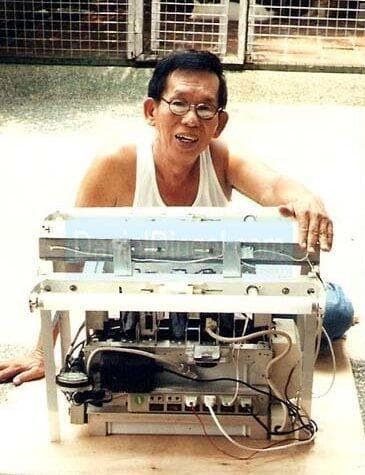

# Daniel Dingel

Filipino inventor who demonstrated a water-powered car for decades, then was convicted of fraud at age 82 and sentenced to 20 years in prison. Died shortly after imprisonment.

| Field | Details |
|-------|---------|
| **Full Name** | Daniel Dingel |
| **Born** | c. 1926 |
| **Died** | October 18, 2010 |
| **Age at Death** | 84 |
| **Location of Death** | Las Pinas City, Philippines |
| **Cause of Death** | Not publicly disclosed |
| **Official Ruling** | Natural causes (in custody) |
| **Category** | Energy Inventor |

## Assessment: UNCERTAIN

Daniel Dingel spent decades demonstrating what he claimed was a water-powered car, attracting media attention and investor interest in the Philippines and internationally. He was convicted of fraud in 2008 at age 82 and sentenced to 20 years imprisonment — effectively a death sentence for an elderly man. He died in 2010. Whether his technology was genuine or fraudulent is debated; what is documented is that his prosecution and imprisonment silenced him permanently and ended any further investigation of his claims.

## Circumstances of Death

Dingel died on October 18, 2010, in Las Pinas City, Philippines. He had been convicted of estafa (fraud) in 2008 and sentenced to 20 years in prison, following a failed partnership with a Taiwanese investor. The specific cause of death was not widely reported, but he was 84 years old and in declining health at the time of his death.

## Background

Daniel Dingel was a Filipino inventor who claimed to have developed a hydrogen reactor that could power an automobile using ordinary water as fuel. He first began demonstrating his water-fueled car in the 1960s and continued for over four decades.

His demonstrations attracted significant attention:
- Multiple Philippine media outlets covered his demonstrations
- He demonstrated the car to foreign journalists and investors
- He claimed to have converted multiple Toyota vehicles to run on water
- The Philippine Department of Science and Technology reportedly tested his claims at various points
- International investors expressed interest, including a Taiwanese businessman named Formosa Plastics executive

In 2000, Dingel entered into a partnership with a Taiwanese investor to develop and commercialize his technology. When the partnership failed to produce results, the investor filed fraud charges. In 2008, at age 82, Dingel was convicted of estafa and sentenced to 20 years.

## Why This Death Possibly Raises Questions

- Demonstrated his water-powered car for over 40 years to multiple witnesses including media and government officials
- Was convicted of fraud only after entering a partnership that would have commercialized the technology
- A 20-year sentence for an 82-year-old is effectively a death sentence — unusually harsh
- Multiple other water fuel cell inventors have died under suspicious circumstances (Stanley Meyer, Yull Brown)
- His supporters argue the fraud conviction was engineered to discredit him
- The Philippine Department of Science and Technology never conclusively debunked or validated his claims
- His death in custody ensured no further investigation of the technology
- The pattern of water fuel inventors being silenced through death, prosecution, or suppression is well-documented

## The Counterargument

- The laws of thermodynamics dictate that splitting water requires more energy than burning the resulting hydrogen produces
- He was convicted by a court of fraud — a legal finding of deception
- The failed partnership with the Taiwanese investor produced no working commercial product
- He had four decades to provide a verifiable demonstration under controlled scientific conditions and never did so conclusively
- Many water fuel cell claims have been thoroughly debunked as scams
- The fraud conviction may be entirely legitimate
- His demonstrations may have used hidden hydrogen tanks or other deception

## See Also

- [Stanley Meyer](Stanley_Meyer.mdx) — American water fuel cell inventor who died under suspicious circumstances
- [Yull Brown](Yull_Brown.mdx) — HHO gas inventor who died penniless despite holding patents
- [Francisco Pacheco](Francisco_Pacheco.mdx) — Seawater hydrogen generator inventor. Demonstrated to VP Wallace in 1942. Never commercialized in 50 years
- [Bob Boyce](Bob_Boyce.mdx) — Hydrogen electrolysis inventor who found a VeriChip RFID implant in his shoulder; his open-source approach to sharing hydrogen technology designs made him a target
- [John Kanzius](John_Kanzius.mdx) — Inventor who demonstrated burning salt water using radio frequencies; another water-energy inventor whose work was suppressed after his death

## Other Shocking Stories

- [Stanley Meyer](Stanley_Meyer.mdx): Gasped "they poisoned me" at dinner with investors, collapsed and died in the parking lot. His water fuel cell vanished.
- [Tom Ogle](Tom_Ogle.mdx): Invented a 100+ MPG engine, demonstrated it on national TV, then was shot and later found dead of a drug overdose.
- [Paul Pantone](Paul_Pantone.mdx): Inventor of a plasma reactor fuel system was committed to a mental institution to silence him and seize his technology.
- [Wilhelm Reich](Wilhelm_Reich.mdx): FDA burned six tons of his books and research, then imprisoned him. He died in federal prison within a year.

## Sources

- [Wikipedia — Daniel Dingel](https://en.wikipedia.org/wiki/Daniel_Dingel)
- [Tribune.net.ph — Hydrogen Cars and the Ghost of Daniel Dingel](https://tribune.net.ph/2025/01/26/hydrogen-cars-and-the-ghost-of-daniel-dingel)
- [Philippine Star — Various Coverage of Dingel Case](https://www.philstar.com/)

*This information was built by Grok and Claude AI research.*

**Status:** Deceased (2010)
