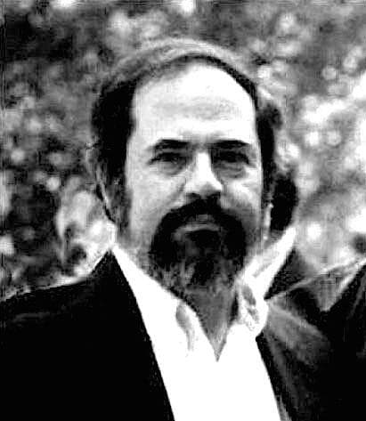

# Eugene Mallove
Cold fusion advocate and former MIT science writer, beaten to death while cleaning a rental property in Norwich, Connecticut.

| Field | Details |
|-------|---------|
| **Full Name** | Eugene Franklin Mallove |
| **Born** | June 9, 1947 |
| **Died** | May 14, 2004 |
| **Age at Death** | 56 |
| **Location of Death** | Norwich, Connecticut |
| **Cause of Death** | Beaten to death — crushed trachea, 32 lacerations to face |
| **Official Ruling** | Homicide (robbery/housing dispute) |
| **Category** | Energy Researcher / Energy Whistleblower |

## Assessment: SUSPICIOUS

Eugene Mallove was the most prominent advocate for cold fusion research in the United States. He was beaten to death in a savage attack that left him with a crushed trachea and 32 lacerations to his face, inflicted by a blunt instrument. While two people were eventually convicted — one of murder, one of manslaughter — and the motive was officially attributed to a housing dispute with former tenants, the timing and brutality of his death have led many in the alternative energy community to question whether more was involved. Mallove was killed just days before a scheduled appearance on Coast to Coast AM radio (audience of millions) and while actively lobbying Congress and the Department of Energy for renewed cold fusion funding.

## Circumstances of Death

On the evening of May 14, 2004, Eugene Mallove drove from his home in Bow, New Hampshire to Norwich, Connecticut to clean out a rental property owned by his parents — the house he had grown up in. The previous tenants, the Schaffer family, had recently been evicted.

Mallove was found beaten to death outside the property. The autopsy revealed:
- A crushed trachea (cause of death)
- 32 lacerations to his face caused by a blunt instrument
- Numerous other cuts and abrasions
- He had been stomped on repeatedly

His van, wallet, wedding band, cell phone, and digital camera were stolen from the scene.

The case went cold for a decade. In 2014, Mozelle Brown was convicted of Mallove's murder and sentenced to 58 years in prison. Chad Schaffer — son of the evicted tenants — pleaded guilty to first-degree manslaughter. A third person, Candace Foster, pleaded guilty to hindering prosecution.

Police stated the killing was motivated by the eviction and was a robbery, not a conspiracy. Detectives said the idea of a hitman was "too far-fetched."

## Background

### Career and Cold Fusion Advocacy

Eugene Mallove held a Bachelor of Science in aeronautical engineering from MIT (1969), a Master of Science from Harvard in environmental health sciences, and a ScD from MIT in environmental health sciences. He served as the Chief Science Writer at the MIT News Office from 1987 to 1991.

Mallove resigned from MIT in 1991 after alleging that MIT researchers had manipulated their cold fusion replication data. He claimed that raw data from MIT's calorimetry experiments actually showed excess heat — confirming Pons and Fleischmann's results — but that the data was processed in a way that eliminated the positive signal. MIT denied the allegation.

After leaving MIT, Mallove dedicated his life to cold fusion research:
- Founded **Infinite Energy** magazine in 1995, which he edited until his death
- Authored **Fire from Ice: Searching for the Truth Behind the Cold Fusion Furor** (1991)
- Founded the **New Energy Foundation**, a nonprofit promoting LENR research
- Testified before Congress and lobbied the Department of Energy
- Wrote an open letter to the scientific community calling for renewed investigation

### What He Was Working On When He Died

At the time of his death, Mallove was:
- Scheduled to appear on **Coast to Coast AM** radio, one of the largest late-night audiences in America, to discuss cold fusion breakthroughs
- Actively lobbying for a **new DOE review of cold fusion** (which did happen later in 2004, months after his death)
- Editing the next issue of *Infinite Energy* magazine
- Working to secure funding for replication experiments

### The MIT Data Manipulation Allegation

Mallove's most explosive claim was that MIT scientists had deliberately manipulated their 1989 cold fusion replication experiment. He alleged:
- MIT's raw calorimetry data showed excess heat consistent with Pons-Fleischmann
- The data was "shifted" during processing to eliminate the positive signal
- The null result was then used as a key piece of evidence to discredit cold fusion nationally
- MIT had financial conflicts of interest — the hot fusion program at MIT's Plasma Fusion Center stood to lose hundreds of millions in funding if cold fusion was validated

MIT conducted an internal review and denied any data manipulation. However, Mallove's allegations have never been fully resolved, and the controversy is documented in detail in his book and in multiple independent investigations.

### Dozens of Replications Ignored

Between 1989 and 2004, anomalous excess heat in cold fusion experiments was reportedly reproduced dozens of times by laboratories around the world — including by U.S. Navy researchers, Japanese institutions, and multiple independent labs. According to Mallove's reporting in *Infinite Energy* and statements documented across multiple sources (including X posts by @AshtonForbes, December 2025, which received over 857,000 views), the DOE and MIT continued to dismiss these replications despite the accumulating evidence. The 2004 DOE review — conducted months after Mallove's murder — again concluded the evidence was unconvincing, without Mallove present to challenge the review's methodology.

## Why This Death Possibly Raises Questions

- **Extreme brutality for a "robbery":** 32 lacerations to the face, crushed trachea, stomping — this level of violence is unusual for a property dispute or opportunistic robbery
- **Timing:** Mallove was killed days before a major media appearance and while actively gaining political traction for cold fusion funding
- **The cold fusion threat:** If cold fusion or LENR technology were validated, it would threaten the multi-trillion-dollar fossil fuel, nuclear, and utility industries
- **MIT whistleblowing:** Mallove had accused MIT — one of the most powerful research institutions in the world — of scientific fraud. He had named specific researchers
- **Stolen items:** His wallet, cell phone, digital camera, and van were taken. The camera and phone could have contained research data or contacts
- **10-year cold case:** Despite the brutal, public nature of the killing, arrests were not made until 2014 — a decade later
- **The Epstein connection:** Jeffrey Epstein later emailed that he had "killed pons years ago," directly claiming involvement in cold fusion suppression. Epstein had deep ties to MIT, donating millions to the institution and to individual researchers
- **DOE review proceeded without him:** The Department of Energy's 2004 review of cold fusion — which Mallove had lobbied for — happened months after his death. It concluded (again) that cold fusion evidence was not convincing. Mallove would have been the most vocal critic of that review

## The Counterargument

Police investigated the conspiracy angle and rejected it:
- The killing was committed by people with a direct, documented grievance (eviction)
- Chad Schaffer's parents had been evicted from the property
- Mozelle Brown and Chad Schaffer were identified through physical evidence
- Brown was convicted of murder; Schaffer pleaded to manslaughter
- Detectives stated the hitman theory was "too far-fetched"

The official explanation — that Mallove was killed by angry former tenants in a confrontation over the property — is plausible. Whether it is the complete explanation remains debated.

## Key Quotes from Media Coverage

> "Gene was the face of cold fusion in the United States. There was no one else who was doing what he was doing at the level he was doing it." — Quoted in *Foreign Policy*, 2016

> "Mallove's killing was devastating to the cold fusion community. He was the one person who had the scientific credentials, the publishing platform, and the political connections to push the field forward." — *Bulletin of the Atomic Scientists*, 2016

> "The nature of Mallove's work led to some conspiracy theories regarding the homicide, but police suspected robbery as the motive." — *Wikipedia*

## See Also

- [B. Stanley Pons](https://intelligencemurders.com/epstein-murders/Details/B_Stanley_Pons) — Co-discoverer of cold fusion; Epstein claimed to have "killed" his career
- Martin Fleischmann — Co-discoverer of cold fusion; career destroyed
- [Stanley Meyer](Stanley_Meyer.md) — Water fuel cell inventor who died suddenly at a restaurant
- [Brian O'Leary](Brian_OLeary.md) — NASA astronaut and New Energy Movement co-founder. Moved to Ecuador after Mallove's murder. Died of rapid-onset cancer 6 days after diagnosis
- [John Mullen](John_Mullen.md) — Nuclear physicist fatally poisoned with arsenic placed in a health supplement; sole suspect died days before arrest, another confirmed murder of a scientist with energy-adjacent research
- [Ken Shoulders](Ken_Shoulders.md) — Father of vacuum microelectronics whose charge cluster research connects to the LENR phenomena Mallove championed; Shoulders' work was institutionally ignored despite validation from Richard Feynman
- [Eugene Mallove (UAP Deaths project)](/uaps/Details/Eugene_Mallove) — Parallel profile in UAP Deaths project

## Other Shocking Stories

- [Frederick Hochstetter](Frederick_Hochstetter.md): Sole passenger killed in a train wreck after publicly debunking a fuelless motor inventor.
- [Wilhelm Reich](Wilhelm_Reich.md): FDA burned six tons of his books. Died in prison one day before parole.
- [Andrija Puharich](Andrija_Puharich.md): Water-splitting patent holder. CIA threats. Home destroyed by arson. Fell down stairs and died.
- [Gerald Schaflander](Gerald_Schaflander.md): Solar hydrogen fuel inventor framed with drug charges after exposing a U.S. senator.

## Social Media Coverage

Mallove's case remains one of the most widely discussed energy suppression deaths on social media. Notable posts include:

- @AshtonForbes (X.com, December 16, 2025) — "In 1989 Eugene Mallove blew the whistle on the cold fusion cover up by the DoE and MIT after anomalous excess heat was reproduced dozens of times. In 2004 he was found brutally murdered in his home." (15,167 likes, 3,862 reposts, 857,622 views)
- @iluminatibot (X.com, March 7, 2026) — Reposted the same narrative with Mallove's whistleblow video (2,274 likes, 58,244 views)
- @ErinnFL (X.com, July 28, 2025) — Listed Mallove as "cold fusion advocate, murdered in 2004; his work on free energy was suppressed amid skepticism" (456 likes)
- @k0k1eth (X.com, December 19, 2025) — "Eugene Mallove cold fusion advocate. Murdered in his home." (290 likes)
- @agent_mock (X.com, March 19, 2026) — "Eugene Mallove bludgeoned '04 for cold fusion expose"

## Sources

- [Eugene Mallove — Wikipedia](https://en.wikipedia.org/wiki/Eugene_Mallove)
- [Death of a Cold Fusion Proponent — MIT Technology Review, May 2004](https://www.technologyreview.com/2004/05/17/101669/death-of-a-cold-fusion-proponent/)
- [The Coldest Case — Foreign Policy, July 2016](https://foreignpolicy.com/2016/07/07/the-coldest-case-cold-fusion-eugene-mallove-mit-infinite-energy/)
- [The Life and Brutal Death of a Cold Fusion Crusader — Bulletin of the Atomic Scientists, July 2016](https://thebulletin.org/2016/07/the-life-and-brutal-death-of-a-cold-fusion-crusader/)
- [Energy Scientist's Murder Leaves a Void — Hartford Courant, October 2014](https://www.courant.com/2014/10/06/energy-scientists-murder-leaves-a-void-in-the-field-hes-missed-daily/)
- [Arrests Made in 2004 Slaying — Keene Sentinel](https://www.keenesentinel.com/arrests-made-in-2004-slaying-of-bow-scientist-by-the-concord-monitor/article_cf19d3d1-6205-5452-9265-d753cadec733.html)
- [Oxygen: Eugene Mallove, Scientist, Murdered After Housing Dispute](https://www.oxygen.com/an-unexpected-killer/crime-news/eugene-mallove-scientist-murdered-after-housing-dispute)
- Eugene Mallove, *Fire from Ice: Searching for the Truth Behind the Cold Fusion Furor* (1991)

*This information was built by Grok and Claude AI research.*
