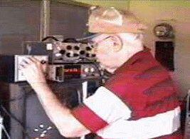

# Floyd Sweet
American inventor and electronics researcher who developed the Vacuum Triode Amplifier (VTA) — a solid-state device using conditioned barium ferrite magnets that reportedly produced 500 watts of output from 33 microwatts of input. Received death threats, and his wife reported that men visited their home shortly before he was found dead.

| Field | Details |
|-------|---------|
| **Full Name** | Floyd "Sparky" Sweet |
| **Born** | 1912 |
| **Died** | July 5, 1995 |
| **Age at Death** | ~83 |
| **Location of Death** | United States (exact city unverified) |
| **Cause of Death** | Heart attack |
| **Official Ruling** | Natural causes |
| **Category** | Energy Inventor |

## Assessment: SUSPICIOUS

Floyd Sweet spent years developing the Vacuum Triode Amplifier — a solid-state device that he claimed could produce usable electrical power output vastly exceeding its input, using specially conditioned barium ferrite magnets. He reportedly demonstrated the device to multiple witnesses, including Tom Bearden, a prominent figure in alternative energy research. Sweet received death threats related to his work and became increasingly reclusive and fearful in his later years. According to his wife's account, on the day he died, men came to their home, had coffee, and left. Hours later, she found Sweet dead. Authorities allegedly confiscated all research materials, devices, and notes the following day. While Sweet was elderly and a heart attack at 83 is not medically unusual, the reported confiscation of materials and the visit from unknown men raise questions.

## Circumstances of Death

On July 5, 1995, Floyd Sweet died at his home. According to accounts from his wife and associates in the alternative energy community:

Sweet's wife reported that earlier on the day of his death (or possibly the day before — accounts vary), men came to their home. They sat with Sweet, had coffee, and left after a period of conversation. The identity of these men and the nature of their visit have never been established.

Hours after the men departed, Sweet's wife found him dead. The cause of death was recorded as a heart attack.

According to multiple sources in the alternative energy community, authorities — described variously as government agents or law enforcement — arrived at Sweet's home the following day and confiscated all of his research materials, devices, conditioned magnets, notes, and documentation. The identity of these "authorities" and the legal basis for the confiscation have not been independently verified.

## Background

### Career and Expertise

Floyd "Sparky" Sweet was an electronics engineer with decades of experience in magnetics and electrical systems. He held positions in the electronics industry and was regarded by colleagues as a skilled and knowledgeable researcher. His nickname "Sparky" reflected his lifelong engagement with electrical engineering.

### The Vacuum Triode Amplifier (VTA)

Sweet's primary invention was the Vacuum Triode Amplifier, a solid-state device that he claimed could produce electrical power output far exceeding its input. Key claims about the VTA included:

- **Output vs. input:** The device reportedly produced approximately 500 watts of usable power output from approximately 33 microwatts of input — an apparent gain of over 15 million to one
- **Conditioned magnets:** The VTA used barium ferrite magnets that Sweet had subjected to a proprietary conditioning process involving specific magnetic and electrical treatments. Sweet guarded this conditioning process closely
- **Solid-state operation:** Unlike rotating generators, the VTA had no moving parts
- **Self-oscillation:** Once activated, the device reportedly self-oscillated at 60 Hz, producing standard AC power
- **Weight anomaly:** Sweet and collaborator Tom Bearden reportedly observed that the device exhibited a slight weight reduction when operating — a gravitational anomaly that, if real, would have profound implications for physics

### Demonstrations and Witnesses

Sweet demonstrated the VTA to several witnesses over the years, most notably:

- **Tom Bearden** — A retired U.S. Army lieutenant colonel and prominent alternative energy theorist who collaborated with Sweet and provided theoretical frameworks for the VTA's operation. Bearden witnessed multiple demonstrations and wrote extensively about the device
- **John Bedini** — Another alternative energy researcher who reportedly saw the device operate
- Various other members of the alternative energy community

Sweet was reportedly reluctant to allow extensive outside examination of the VTA, partly due to fear of theft or suppression and partly because the conditioned magnets were difficult to produce and could be "deactivated" by improper handling.

### Death Threats and Fear

In his later years, Sweet became increasingly fearful and reclusive. According to associates:

- He received explicit death threats related to his work on the VTA
- He became reluctant to demonstrate the device or share technical details
- He reportedly told associates that he feared for his life
- He took steps to limit knowledge of the VTA's construction, particularly the magnet conditioning process

Tom Bearden has written that Sweet was genuinely terrified in the period before his death and that the death threats had a severe impact on his willingness to continue public demonstrations or share information.

## Why This Death Possibly Raises Questions

- **The unknown visitors:** Sweet's wife reported that unidentified men visited their home and had coffee with Sweet shortly before he was found dead. The identity and purpose of these visitors has never been established
- **Material confiscation:** The reported confiscation of all research materials, devices, and notes the day after Sweet's death — if accurate — suggests that someone had both advance knowledge and organized capability to seize the work immediately
- **Death threats:** Sweet had received death threats related to his VTA work, making his death — while possibly natural — occur in a context of documented intimidation
- **Loss of knowledge:** Sweet closely guarded the magnet conditioning process that was central to the VTA's operation. His death, combined with the reported confiscation of materials, effectively destroyed the knowledge needed to replicate the device
- **Pattern of inventor deaths:** Sweet's case parallels other energy inventors who received threats, became reclusive, and then died with their work confiscated or destroyed

## The Counterargument

- Sweet was approximately 83 years old at the time of his death. Heart attacks at that age are common and do not require extraordinary explanation
- The VTA's claimed performance — 15 million to one power gain — violates the laws of thermodynamics as understood by mainstream physics
- No independent, controlled scientific test of the VTA was ever conducted under rigorous laboratory conditions
- Sweet's reluctance to allow thorough examination of his device raises questions about whether it performed as claimed
- The accounts of the visiting men and material confiscation come primarily from alternative energy community sources and have not been independently verified
- Elderly people receive visitors and die of heart attacks without any connection between the two events

## Key Quotes from Media Coverage

> Sweet's wife reported that earlier on the day of his death, men came to their home. They sat with Sweet, had coffee, and left after a period of conversation. Hours after the men departed, Sweet's wife found him dead.
> — **Floyd Sweet's wife**, account of the events surrounding his death on July 5, 1995

> Tom Bearden has written that Sweet was genuinely terrified in the period before his death and that the death threats had a severe impact on his willingness to continue public demonstrations or share information.
> — **Thomas Bearden**, retired U.S. Army Lieutenant Colonel and Sweet's collaborator, on Sweet's state of mind in his final years

> He received explicit death threats related to his work on the VTA. He became reluctant to demonstrate the device or share technical details. He reportedly told associates that he feared for his life.
> — Account of threats against Floyd Sweet, from associates in the alternative energy community

> Authorities — described variously as government agents or law enforcement — arrived at Sweet's home the following day and confiscated all of his research materials, devices, conditioned magnets, notes, and documentation.
> — Account of the reported confiscation of Sweet's work following his death, from alternative energy community sources

## See Also

- [John Bedini](John_Bedini.md) — Alternative energy researcher who reportedly witnessed the VTA
- [Nikola Tesla](Nikola_Tesla.md) — Inventor whose papers were seized after his death
- [Stanley Meyer](Stanley_Meyer.md) — Water fuel cell inventor who died suddenly in 1998
- [Thomas Henry Moray](Thomas_Henry_Moray.md) — Radiant energy inventor whose devices were destroyed
- [Georges Lakhovsky](Georges_Lakhovsky.md) — Multi-Wave Oscillator inventor who built his device with Tesla's assistance; struck by a limousine in 1942, equipment removed from hospitals after death; another electromagnetic frequency researcher whose work was suppressed
- [Floyd Sweet (UAP Deaths project)](/uaps/Details/Floyd_Sweet) — Parallel profile in UAP Deaths project

## Other Shocking Stories

- [John Bedini](John_Bedini.md): Free energy pioneer died suddenly in 2016. Electromagnetic recovery devices never reached the public.
- [Trevor Knight](Trevor_Knight.md): Marconi engineer found dead of carbon monoxide in his car. One of 25 defense scientist deaths.
- [Philo Farnsworth](Philo_Farnsworth.md): Invented television at 21. Later achieved nuclear fusion in his lab — then funding was killed.
- [Stefan Marinov](Stefan_Marinov.md): Bulgarian physicist fell from a university staircase while researching unconventional electromagnetic energy.

## Sources

- [Floyd Sweet VTA — amasci.com (Bill Beaty's Science Website)](http://amasci.com/)
- [Floyd Sweet Vacuum Triode Amplifier — rexresearch.com](http://www.rexresearch.com/)
- [Tom Bearden on the VTA — cheniere.org](http://www.cheniere.org/)
- [Floyd Sweet — Grokipedia / Alternative Energy Archives](https://grokipedia.com/)
- [The Sweet VTA: Background and History — Practical Guide to Free Energy Devices](http://www.free-energy-info.com/)

*This information was built by Grok and Claude AI research.*

**Status:** Deceased (1995)
