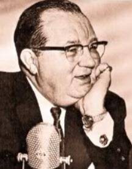

# Frank Edwards
Prominent 1950s–60s UFO author and radio broadcaster who died of a heart attack on the exact 20th anniversary of Kenneth Arnold's June 24, 1947 sighting — the event that launched the modern UFO era.

| Field | Details |
|-------|---------|
| **Full Name** | Frank Allyn Edwards |
| **Born** | 1908 |
| **Died** | June 23, 1967 |
| **Age at Death** | 59 |
| **Location of Death** | Indianapolis, Indiana, United States |
| **Cause of Death** | Heart attack |
| **Official Ruling** | Natural causes |
| **Category** | Journalist / Investigator |

## Assessment: SUSPICIOUS TIMING

Frank Edwards died of a heart attack on June 23, 1967 — literally hours before the 20th anniversary of Kenneth Arnold's sighting on June 24, 1947, the event that launched the modern UFO era and the term "flying saucer." Edwards was one of the most prominent UFO researchers in the United States, with bestselling books and a national radio audience. While heart attacks are a common cause of death, the exact-date coincidence has been noted by UFO historians for decades. The death occurred during a period when multiple early UFO researchers died or were silenced.

## Circumstances of Death

Frank Edwards died of a heart attack on the evening of June 23, 1967, at his home in Indianapolis, Indiana. He was 59 years old.

The timing was extraordinary: Edwards died just hours before midnight on June 23 — the eve of the 20th anniversary of Kenneth Arnold's June 24, 1947 sighting over Mount Rainier, Washington. Arnold's sighting was the foundational event of the modern UFO era and had been the catalyst for Edwards' own decades-long investigation of the phenomenon.

At the time of his death, Edwards remained active in UFO research and broadcasting. His death was ruled natural causes. No autopsy irregularities were publicly reported.

## Background

Frank Edwards was an American journalist, radio broadcaster, and author who became one of the most influential early popularizers of UFO research in the United States.

### Broadcasting Career

Edwards hosted a nationally syndicated radio program on the Mutual Broadcasting System that reached millions of listeners. He was one of the first mainstream broadcasters to take UFO reports seriously and to publicly challenge the U.S. government's dismissal of sightings. His radio coverage of UFO incidents in the late 1940s and 1950s made him a household name.

According to some accounts, Edwards was fired from the Mutual Broadcasting System under pressure from his sponsor, the American Federation of Labor, which was reportedly pressured by government interests unhappy with his UFO coverage. This is one of the earliest documented cases of media suppression related to UFO reporting.

### Books

Edwards wrote several bestselling books on unexplained phenomena:

- ***Flying Saucers — Serious Business*** (1966) — His most influential work, which argued that UFOs were real, that the government knew it, and that a cover-up was underway. The book sold hundreds of thousands of copies and brought UFO discourse to mainstream audiences
- ***Flying Saucers — Here and Now!*** (1967) — Published shortly before his death
- ***Strange World*** (1964) — Coverage of unexplained phenomena beyond UFOs
- ***Stranger Than Science*** (1959) — An earlier compilation of anomalous events

### Connection to Government Cover-Up Claims

Edwards was one of the earliest and most credible voices arguing that the U.S. government was actively suppressing information about UFOs. His work directly fed into the 1950s–60s classification wall described in UAP physics research:

- He publicly challenged Project Blue Book's methodology and conclusions
- He documented cases of military witnesses being silenced
- He reported on radar confirmations of UFO sightings that the Air Force denied
- He advocated for congressional hearings on UFOs

His work laid the groundwork for later researchers and investigators, including many whose deaths are documented in this project.

### Energy and Propulsion Connection

Edwards' UFO research directly addressed the propulsion question — how UFOs could perform the maneuvers reported by credible witnesses. His books discussed:

- Electromagnetic propulsion theories
- Government classification of advanced propulsion research
- The implications of UFO technology for conventional energy systems
- Corporate and military interests in suppressing awareness of alternative propulsion

While Edwards was not an energy inventor or physicist, his role as a public-facing investigator who reached millions with claims about government suppression of advanced technology made him a significant figure in the broader narrative of energy and propulsion suppression.

## Why This Death Possibly Raises Questions

- Died on the **exact 20th anniversary** (within hours) of Kenneth Arnold's UFO sighting — the founding event of the phenomenon Edwards spent his career investigating
- The **timing coincidence** is so precise that UFO historians have noted it for decades as fitting a pattern of "convenient deaths"
- Edwards was reportedly **fired from his radio show under government pressure** — an early documented case of UFO-related media suppression
- At 59, Edwards was active and productive — he had **published a book that same year** (*Flying Saucers — Here and Now!*, 1967)
- His death occurred during a period when **multiple early UFO researchers died or were silenced** in the 1960s
- Heart attacks are **extremely difficult to distinguish from certain poisons** (e.g., potassium chloride, digitalis overdose) unless specific toxicology is performed — and in 1967, such testing was rarely conducted
- Edwards was one of the most **prominent public voices** demanding government transparency on UFOs — his death silenced a major platform

## The Counterargument

- **Heart attacks are extremely common** and are the leading cause of death in American men. A 59-year-old man dying of a heart attack in 1967 is not statistically unusual
- **No evidence of poisoning or foul play** has ever been presented — the heart attack diagnosis was not disputed by family, physicians, or independent investigators
- **The date coincidence, while striking, is just that — a coincidence.** There are 365 days in a year; the probability of dying on any particular day is not vanishingly small, especially for a man in his late 50s with potential cardiac risk factors
- **Edwards' books were already published** and widely distributed. Killing him would not suppress information already in print and selling hundreds of thousands of copies
- **No threats or intimidation** against Edwards were publicly reported in the period before his death
- **The firing from Mutual Broadcasting** may have been a business decision rather than government suppression — broadcasting sponsors routinely dropped controversial hosts
- **Edwards was a journalist and author, not a weapons researcher or inventor** — he did not possess classified information or a device that would make him a target for elimination

## Key Quotes from Media Coverage

> "So many UFO researchers died in non-natural ways."
> — X (formerly Twitter) UFO History accounts, listing Edwards among suspicious deaths

> "Frank Edwards died on the exact anniversary of the event that started it all — Kenneth Arnold's sighting. You can't make this stuff up."
> — Paraphrase of recurring observation in UFO research communities

## See Also

- [Morris Jessup](Morris_Jessup.md) — Astronomer and antigravity researcher found dead by CO poisoning the day after announcing a breakthrough (1959)
- [Paul Vigay](Paul_Vigay.md) — British UFO and crop circle researcher found drowned under mysterious circumstances (2009)
- [Dean Warwick](Dean_Warwick.md) — Collapsed dead mid-presentation at UK conference the exact moment he was about to reveal who killed RFK (2006)
- [Fred Bell](Fred_Bell.md) — Nuclear physicist who died within 48 hours of filming interview about classified directed-energy weapons (2011)
- [Paul Bennewitz](Paul_Bennewitz.md) — Electrical engineer driven to mental breakdown by AFOSI disinformation campaign (1980s)

## Other Shocking Stories

- [Stanley Meyer](Stanley_Meyer.md): Collapsed at dinner with investors, gasped "they poisoned me" — his water fuel cell car vanished.
- [Dean Warwick](Dean_Warwick.md): Collapsed dead on stage the exact instant he was about to name RFK's assassin.
- [Vimal Dajibhai](Vimal_Dajibhai.md): Marconi scientist, age 24, fell from bridge — pants around ankles, unexplained needle wound on buttock.
- [Tom Ogle](Tom_Ogle.md): Built a car getting 100+ MPG, demonstrated it on live TV, then shot and poisoned before age 26.

## Sources

- Frank Edwards, *Flying Saucers — Serious Business* (Lyle Stuart, 1966) — Edwards' most influential book
- Frank Edwards, *Flying Saucers — Here and Now!* (Lyle Stuart, 1967) — published the year of his death
- Frank Edwards, *Strange World* (Lyle Stuart, 1964)
- Frank Edwards, *Stranger Than Science* (Lyle Stuart, 1959)
- [Frank Edwards — Wikipedia](https://en.wikipedia.org/wiki/Frank_Edwards_(writer))
- X (formerly Twitter) UFO History accounts noting the anniversary coincidence — multiple posts, various dates
- Jerome Clark, *The UFO Encyclopedia* — reference on Edwards' role in UFO history

*This information was built by Grok and Claude AI research.*
