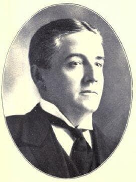

# George Taylor Fulford

Major General Electric shareholder killed in a car crash one week after announcing his intention to fund Nikola Tesla's wireless energy transmission project. Canada's first automobile fatality.

| Field | Details |
|-------|---------|
| **Full Name** | George Taylor Fulford |
| **Born** | August 22, 1852 |
| **Died** | October 15, 1905 |
| **Age at Death** | 53 |
| **Location of Death** | Newton, Massachusetts |
| **Cause of Death** | Injuries from automobile collision |
| **Official Ruling** | Accidental death |
| **Category** | Energy Supporter / Funder |

## Assessment: SUSPICIOUS

George Taylor Fulford died in a car crash one week after publicly announcing his intention to finance Nikola Tesla's Wardenclyffe Tower — a wireless energy transmission system that would have threatened the petroleum industry's dominance. He became Canada's first automobile fatality. His chauffeur survived. After Fulford's death, his GE stock reportedly ended up in Rockefeller hands, and Tesla's Wardenclyffe project was starved of the capital it needed. The Fulford family has maintained for over a century that the crash was arranged.

## Circumstances of Death

On October 8, 1905, Fulford was being driven in his automobile by his chauffeur when the car collided with a streetcar at a blind intersection in Newton, Massachusetts. Fulford sustained severe injuries and died seven days later on October 15, 1905.

The crash made Fulford the first Canadian to die in an automobile accident — a grim historical distinction. His chauffeur survived the collision.

The timing was devastating for Tesla's ambitions. Just one week before the crash, Fulford had publicly announced his intention to provide major financial backing for Tesla's Wardenclyffe Tower project on Long Island — a facility designed to transmit electrical energy wirelessly across great distances. Without Fulford's promised funding, the Wardenclyffe project was left financially vulnerable and ultimately failed.

## Background

George Taylor Fulford was one of the wealthiest men in Canada at the turn of the 20th century. He made his fortune manufacturing and marketing "Dr. Williams' Pink Pills for Pale People," a patent medicine that became one of the most widely advertised products of its era. He was appointed to the Canadian Senate in 1900.

Fulford was also a major shareholder in General Electric. His wealth and GE connections made him one of the few individuals with both the financial resources and the industrial connections to make Tesla's wireless energy vision a reality.

Tesla's Wardenclyffe Tower, under construction on Long Island, was designed to transmit electrical energy without wires — a technology that, if successful, would have eliminated the need for power lines, coal-fired plants, and ultimately petroleum-based energy distribution. The project represented an existential threat to Standard Oil (Rockefeller), coal interests, and the emerging electrical utility monopoly model backed by J.P. Morgan.

## Why This Death Possibly Raises Questions

- Died exactly one week after announcing his intention to fund Tesla's wireless energy project
- The Fulford family has maintained for over a century that the crash was arranged
- Family accounts claim Rockefeller interests (Standard Oil) were responsible, as Tesla's wireless energy would have threatened petroleum dominance
- The chauffeur survived the crash while the passenger (Fulford) died
- After Fulford's death, his GE stock reportedly transferred to Rockefeller-aligned interests
- Without Fulford's funding, Tesla's Wardenclyffe Tower project was financially crippled and eventually demolished
- Tesla's wireless energy technology threatened multiple established industries simultaneously
- The early 1900s were rife with industrial sabotage and violence between competing business interests
- J.P. Morgan had already pulled his own funding from Tesla after learning the technology couldn't be metered for profit

## The Counterargument

- Automobile accidents were extremely common in 1905 — roads were unpaved, cars had no safety features, and traffic rules were largely nonexistent
- Fulford was one of many early automobile fatalities during a period of dangerous early motoring
- The "one week after" timing could be coincidental
- No physical evidence of sabotage to the vehicle has been documented
- The family's belief in a conspiracy may be understandable grief rather than evidence
- The Rockefeller conspiracy angle relies on family oral history, not documented evidence
- Tesla had difficulty attracting funding from many sources, not just Fulford

## Technology Context: Tesla's Wardenclyffe Tower

Tesla's Wardenclyffe facility was designed to transmit electrical energy wirelessly using the Earth itself as a conductor. If successful, the technology would have:

- Eliminated the need for power transmission lines
- Made electrical energy available anywhere on Earth
- Destroyed the business model of every electrical utility company
- Threatened petroleum, coal, and natural gas industries
- Made energy essentially free at the point of use

J.P. Morgan, Tesla's previous primary backer, reportedly withdrew funding after realizing the technology couldn't be metered — meaning there was no way to charge customers for the energy. "If anyone can draw on the power, where do we put the meter?" Morgan allegedly asked.

Fulford's willingness to fund the project without requiring a metered business model made him uniquely valuable — and uniquely threatening — to established energy interests.

## See Also

- [Nikola Tesla](Nikola_Tesla.mdx) — The inventor Fulford was preparing to fund
- [Thomas Henry Moray](Thomas_Henry_Moray.mdx) — Another energy inventor whose funders were targeted

## Other Shocking Stories

- [Nikola Tesla](Nikola_Tesla.mdx): Government agents raided Tesla's hotel room within hours of his death and seized trunks of research. Decades of work vanished.
- [Stanley Meyer](Stanley_Meyer.mdx): Gasped "they poisoned me" at dinner with investors, collapsed and died in the parking lot. His water fuel cell vanished.
- [Rudolf Diesel](Rudolf_Diesel.mdx): Inventor of the diesel engine vanished from a ship crossing the English Channel. His body was found floating days later.
- [Thomas Henry Moray](Thomas_Henry_Moray.mdx): Shot at through his car window after refusing to hand over his radiant energy device. His lab was destroyed multiple times.

## Sources

- [Wikipedia — George Taylor Fulford](https://en.wikipedia.org/wiki/George_Taylor_Fulford)
- [Silver Circle Underground — Was GT Fulford Killed for Funding Tesla's Energy Experiments?](https://silverunderground.com/2012/10/was-gt-fulford-killed-for-funding-teslas-energy-experiments/)
- [Dictionary of Canadian Biography — George Taylor Fulford](https://www.biographi.ca/en/bio/fulford_george_taylor_13E.html)
- [Willow House Chronicles — George Taylor Fulford](https://willowhousechronicles.wordpress.com/tag/george-taylor-fulford/)

*This information was built by Grok and Claude AI research.*

**Status:** Deceased (1905)
