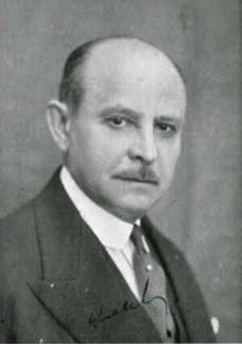

import Head from '@docusaurus/Head';

<Head>
  
</Head>

Russian-born French engineer and inventor of the Multi-Wave Oscillator, struck and killed by a limousine in New York in 1942 just as his electromagnetic therapy device was producing reported results in hospital trials. His equipment was immediately removed from hospitals after his death.

| Field | Details |
|-------|---------|
| **Full Name** | Georges Lakhovsky (born Georgei Lakhovsky) |
| **Born** | September 17, 1869, village of Ilya, near Minsk, Russian Empire (present-day Belarus) |
| **Died** | August 31, 1942 |
| **Age at Death** | 72 |
| **Location of Death** | Adelphi Hospital, Brooklyn, New York |
| **Cause of Death** | Injuries sustained after being struck by a limousine |
| **Official Ruling** | Traffic accident |
| **Category** | Energy Inventor |

## Assessment: MODERATE SUSPICION

Georges Lakhovsky was struck by a limousine in New York at the precise moment his Multi-Wave Oscillator was producing reported clinical results in hospital trials. He died three days later. Within weeks, his equipment was ordered removed from every hospital that had been using it, and patients were told the therapy was no longer available. The timing — killed while his technology was gaining institutional credibility — fits the documented pattern of energy inventors dying at the moment their work threatens to break through. However, there is no forensic evidence the car strike was intentional, no witnesses claiming assassination, and the suspicious framing comes primarily from alternative medicine communities rather than independent investigation.

## Background

Georges Lakhovsky was born in 1869 in the village of Ilya, near Minsk, in the Russian Empire (present-day Belarus). He studied at the Odessa School of Arts and Crafts and later at the Sorbonne in Paris, where he studied physics, bridge and road construction, and human anatomy and physiology. He became a naturalized French citizen.

### Core Theory

Lakhovsky's central theory was that every living cell is an electromagnetic resonator that emits and absorbs radiations of very high frequency. He described disease as "the oscillatory disequilibrium of cells, originating from external causes" and proposed that health could be restored by reinforcing a cell's natural electromagnetic oscillation.

### The Multi-Wave Oscillator (MWO)

Lakhovsky developed and patented the Multi-Wave Oscillator (US Patent 1,962,565, filed November 13, 1931, granted June 12, 1934, titled "Apparatus with Circuits Oscillating under Multiple Wave Lengths"). The device consisted of:

- Two broadband antennae (sending and receiving pair) made of concentric sets of curved open-ended copper pieces suspended by silk threads
- Two metal stands with modified Tesla coils and an electromagnetic spark/pulse generator
- Designed to produce a broad frequency spectrum from 1 Hz to 300 GHz
- Built with assistance from Nikola Tesla, who shared foundational concepts about oscillation from the 1890s

### Key Experiments

**1924 Plant Experiment (Salpetriere Hospital, Paris):** Lakhovsky inoculated geranium plants with *Agrobacterium tumefaciens* (which causes plant tumors). One plant was surrounded by an open-ended copper coil. All untreated plants died; the coiled plant survived, shed its tumor, and grew to twice the size of healthy controls. Results were presented to the Biology Society of Paris on August 26, 1924, by Lakhovsky and Professor Antonin Gosset, and later to the Academy of Sciences by Professor d'Arsonval on April 2, 1928.

**1925-1931 Paris Hospital Trials:** At the Salpetriere Hospital under Professor Gosset, Lakhovsky tested on patients considered incurable. Reports claimed tumors of several inoperable cancer patients disappeared "almost completely." Extended to Val de Grace and Saint-Louis hospitals.

**1941 New York Hospital Trials:** After fleeing Nazi-occupied France (arriving December 4, 1940 aboard the liner *Nyassa*), Lakhovsky conducted a seven-week clinical trial at a major New York City hospital and with a prominent Brooklyn urologist, reporting "remarkable results."

**Important caveat:** These experiments were not subjected to controlled clinical trials by modern scientific standards. No randomization, control groups, or double-blind evaluation. The scientific community has not validated the MWO as an effective treatment.

## Circumstances of Death

In 1942, at age 72, Lakhovsky was struck by a limousine while crossing a street in New York. Despite his protests, he was taken to Adelphi Hospital in Brooklyn. He died three days later from his injuries on August 31, 1942. An AP obituary appeared in the Ottawa Journal on September 2, 1942.

### What Makes the Timing Suspicious

- He was killed just as his MWO was producing reported results in New York hospital trials — the device was gaining institutional credibility for the first time in the United States
- Within weeks of his death, his MWO equipment was ordered removed from every hospital that had been using it
- Patients undergoing MWO therapy were told the treatment was no longer available
- His work remained "completely unknown to the American public" for over two decades after his death
- No investigation into whether the limousine strike was intentional has ever been documented
- He reportedly protested being taken to the hospital and "never returned alive"

### Suppression of Collaborators

In Paris, Professor Gosset — who had collaborated with Lakhovsky and co-presented results to the Biology Society of Paris — reportedly "renounced presenting the results to the Academy of Medicine" after receiving pressure from influential colleagues. This mirrors the pattern seen in the [Royal Rife](Royal_Rife.mdx) case, where physicians who had witnessed results were pressured into denial.

## Why This Death Possibly Raises Questions

- Lakhovsky died at the exact moment his technology was gaining institutional acceptance in the US — fitting the documented pattern of inventors killed before breakthrough
- His equipment was removed from hospitals with notable speed after his death — suggesting institutional eagerness to end the therapy
- His collaborator Professor Gosset was pressured into withdrawing support for the research
- The same period saw the suppression of [Royal Rife](Royal_Rife.mdx)'s frequency-based therapy by the AMA — both electromagnetic frequency researchers were neutralized within years of each other
- Lakhovsky had built his MWO with assistance from [Nikola Tesla](/uaps/Details/Nikola_Tesla/), connecting him to the broader network of suppressed electromagnetic energy researchers
- His work was forgotten for 20+ years after his death — until Dr. Bob Beck found an original MWO in the basement of a well-known hospital in southern California in 1963

## The Counterargument

- No evidence beyond the official traffic accident report supports claims of foul play
- Lakhovsky was 72 years old; pedestrian fatalities from car strikes were common in 1940s New York
- No witnesses have come forward claiming the collision was deliberate
- The suspicious framing comes primarily from alternative medicine communities, not from contemporary investigative journalism
- The connection between his death and suppression is circumstantial — suspicious timing, but no forensic evidence of assassination
- His clinical trials lacked modern scientific controls and have never been independently replicated
- The removal of equipment from hospitals could reflect standard practice when the inventor/advocate dies and there is no one to maintain the program

## Key Quotes

> "The cell is nothing but an electromagnetic resonator, capable of emitting and absorbing radiations of very high frequency."
> — **Georges Lakhovsky**, *The Secret of Life* (1939)

> "Disease is the oscillatory disequilibrium of cells, originating from external causes."
> — **Georges Lakhovsky**

> "All living cells produce and radiate oscillations of very high frequencies, but they also receive and respond to oscillations imposed upon them from outside sources."
> — **Georges Lakhovsky**

## 1963 Rediscovery

In 1963, Dr. Bob Beck found an original Lakhovsky MWO stored in the basement of a well-known hospital in southern California. He opened it up, studied its construction, and wrote a series of articles for the *Borderlands Journal* explaining how it worked. In 1986, Borderlands Science Research Foundation published "The Lakhovsky Multiple Wave Oscillator Handbook" (updated in 1988, 1992, and 1994). Modern reproductions of the MWO continue to be built, though they remain outside mainstream medicine.

## Published Works

- *L'Origine de la vie* (The Origin of Life: Radiation and Living Beings), 1925
- *Les ondes qui guerissent* (The Waves that Heal), 1926
- *La Terre et Nous* (The Earth and Us), 1933
- *The Secret of Life*, London: William Heinemann, 1939

## See Also

- [Royal Rife](Royal_Rife.mdx) — Electromagnetic frequency inventor, lab raided by AMA, equipment destroyed, partner imprisoned
- [Wilhelm Reich](/uaps/Details/Wilhelm_Reich/) — Orgone energy inventor, imprisoned, books burned by federal court order
- [Nikola Tesla](/uaps/Details/Nikola_Tesla/) — Collaborated with Lakhovsky on oscillation concepts; papers seized after death
- [Floyd Sweet](/uaps/Details/Floyd_Sweet/) — Research materials allegedly confiscated the day after his death

## Other Shocking Stories

- [Eugene Mallove](/uaps/Details/Eugene_Mallove/): Cold fusion whistleblower beaten to death with 32 lacerations. Killed days before major media appearance.
- [Arie DeGeus](/uaps/Details/Arie_DeGeus/): Clean energy inventor found dead in airport parking lot while en route to secure European funding.
- [Peter Ferry](/uaps/Details/Peter_Ferry/): Marconi defense scientist found dead with stripped electrical leads jammed into tooth fillings.
- [Lester Hendershot](/uaps/Details/Lester_Hendershot/): Fuelless motor inventor paid $25K to stop building. Found dead of CO poisoning. Son died identically.

## Sources

- [Georges Lakhovsky — Wikipedia](https://en.wikipedia.org/wiki/Georges_Lakhovsky)
- [Dr Georges Lakhovsky (1869-1942) — Find a Grave Memorial](https://www.findagrave.com/memorial/106451358/georges-lakhovsky)
- [Death of George Lakhovsky and Rebirth of the Multi-Wave Oscillator — Inventive Products](https://www.inventiveproducts.com/george-lakhovskys-death/)
- [Lakhovsky's Clinical Trials — Inventive Products](https://www.inventiveproducts.com/lakhovskys-clinical-trials/)
- [US Patent 1,962,565 — Apparatus with Circuits Oscillating under Multiple Wave Lengths — Google Patents](https://patents.google.com/patent/US1962565A/en)
- [Georges Lakhovsky and Oscillators — Natura Sounds](https://natura-sounds.com/en/blogs/news/georges-lakhovsky-et-les-oscillateurs-un-pionnier-de-lelectromagnetisme-applique-au-vivant)
- [The Secret of a Healthy Life is Operating at a Higher Frequency — FAIM](https://www.faim.org/the-secret-of-a-healthy-life-is-operating-at-a-higher-frequency)
- [Multi-Wave Oscillator Use in a New York Hospital](https://multiwaveoscillator.com/articles/multiwaveoscillatorhospitals.htm)
- [1942 AP New York Obituary — Ottawa Journal via Newspapers.com](https://www.newspapers.com/article/the-ottawa-journal-1942-ap-new-york-geor/6823495/)

## Social Media Coverage

- @Earstohearyou (May 28, 2024) — "George Lakovsky and Royal Rife figured out how to use FREQUENCIES to increase CELL HEALTH and target pathogens. Their work was also shut down under extreme opposition by the Rockefeller installed AMA." (867 likes, 52,263 views)

*This information was built by Grok and Claude AI research.*

**Status:** Deceased (1942)
