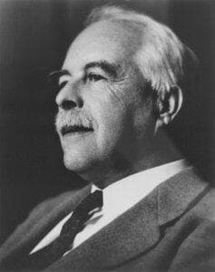

# Gilbert N. Lewis

Pioneering chemist who coined the word "photon" and did foundational work on thermodynamics, found dead in his Berkeley laboratory near a broken line of liquid hydrogen cyanide after lunching with his longtime rival.

| Field | Details |
|-------|---------|
| **Full Name** | Gilbert Newton Lewis |
| **Born** | October 25, 1875 |
| **Died** | March 23, 1946 |
| **Age at Death** | 70 |
| **Location of Death** | University of California, Berkeley laboratory |
| **Cause of Death** | Hydrogen cyanide exposure (found near broken line of liquid HCN) |
| **Official Ruling** | Coronary artery disease |
| **Category** | Physicist / Scientist |

## Assessment: MODERATE SUSPICION

Lewis was found dead in his laboratory with a broken line of liquid hydrogen cyanide nearby. Despite this, the coroner ruled the cause of death as coronary artery disease. He had just lunched with Irving Langmuir — his decades-long professional rival who had won the Nobel Prize that many believed Lewis deserved. Lewis was nominated for the Nobel Prize 35 times but never received it, a source of deep bitterness. His work on thermodynamics, photochemistry, and heavy water had direct implications for nuclear energy development during the Manhattan Project era.

## Circumstances of Death

On March 23, 1946, Gilbert Lewis was found dead in his laboratory at the University of California, Berkeley. A broken line of liquid hydrogen cyanide was found near his body. Hydrogen cyanide is an extremely lethal substance — inhalation of even small amounts can cause death within minutes.

Despite the presence of HCN at the scene, the Berkeley coroner ruled the cause of death as coronary artery disease. This ruling has been questioned by historians and scientists who note the obvious danger of the HCN and the circumstances of the day.

Earlier that day, Lewis had lunched with Irving Langmuir, a General Electric chemist who had won the 1932 Nobel Prize in Chemistry. Lewis deeply resented Langmuir's Nobel, believing that Langmuir's surface chemistry work was derivative of Lewis's own research on chemical bonds. The lunch was reportedly tense.

After the lunch, Lewis returned to his laboratory. He was found dead later that afternoon.

## Background

Gilbert N. Lewis was one of the most influential American chemists of the 20th century:

- **Coined the term "photon"** for the quantum of light
- **Developed the Lewis dot structure** for representing chemical bonds — still taught in every chemistry class worldwide
- **Pioneered the concept of the covalent bond** — the shared-electron model of chemical bonding
- **Made foundational contributions to thermodynamics** — his work on free energy and chemical potential shaped modern physical chemistry
- **Isolated heavy water (deuterium oxide)** in significant quantities — a substance crucial to nuclear reactor design and hydrogen bomb development
- **Received 35 Nobel Prize nominations** but was never awarded the prize

His work on heavy water characterization and thermodynamics had direct relevance to nuclear energy development. Heavy water is used as a neutron moderator in nuclear reactors (particularly the CANDU design), and his thermodynamic principles underpin energy conversion science.

## Why This Death Possibly Raises Questions

- Found dead near a broken line of liquid hydrogen cyanide — one of the most lethal substances known
- Coroner ruled coronary artery disease despite the HCN presence — a questionable determination
- Had just lunched with his bitter professional rival Irving Langmuir
- Nominated for the Nobel Prize 35 times without receiving it — a source of deep resentment
- His work on heavy water had direct implications for nuclear energy and weapons programs
- The death occurred during the early nuclear age when energy physics was of intense strategic importance
- Some historians have suggested murder (by Langmuir or others), suicide (over Nobel Prize bitterness), or accidental HCN exposure
- The official ruling of heart disease conveniently avoided any criminal investigation

## The Counterargument

- Lewis was 70 years old and coronary artery disease was plausible
- He routinely worked with dangerous chemicals in his laboratory, including hydrogen cyanide
- Accidental exposure to HCN is a genuine occupational hazard for chemists of that era
- The bitterness over the Nobel Prize is well-documented but does not prove anyone else was involved
- Suicide is considered a plausible explanation by some historians — he may have been despondent after the lunch with Langmuir
- No murder investigation was conducted, and no evidence of an intruder was reported
- His thermodynamic work, while foundational, was openly published — killing him would not suppress it

## Key Quotes from Media Coverage

> "Lewis's death has been the subject of some speculation. He was found in his lab where hydrogen cyanide gas was present. While the official cause was a heart attack, some have speculated about other possibilities."
> — Multiple historical accounts

## See Also

- [Nikola Tesla](/uaps/Details/Nikola_Tesla/) — Another pioneering physicist whose later work involved energy research
- [Philo Farnsworth](/uaps/Details/Philo_Farnsworth/) — Another inventor whose groundbreaking work was not properly credited

## Other Shocking Stories

- [Eugene Mallove](/uaps/Details/Eugene_Mallove/): Cold fusion champion beaten to death days after announcing a breakthrough that could have transformed the energy industry.
- [Wilhelm Reich](/uaps/Details/Wilhelm_Reich/): FDA burned six tons of his books and research, then imprisoned him. He died in federal prison within a year.
- [Rudolf Diesel](/uaps/Details/Rudolf_Diesel/): Inventor of the diesel engine vanished from a ship crossing the English Channel. His body was found floating days later.
- [Stanley Meyer](/uaps/Details/Stanley_Meyer/): Gasped "they poisoned me" at dinner with investors, collapsed and died in the parking lot. His water fuel cell vanished.

## Sources

- [Wikipedia — Gilbert N. Lewis](https://en.wikipedia.org/wiki/Gilbert_N._Lewis)
- [Listverse — 10 Genius Inventors with Highly Suspicious Deaths](https://listverse.com/2025/01/14/10-genius-inventors-with-highly-suspicious-deaths/)
- [Chemical Heritage Foundation — Gilbert Newton Lewis](https://www.sciencehistory.org/education/scientific-biographies/gilbert-newton-lewis/)
- Patrick Coffey, *Cathedrals of Science: The Personalities and Rivalries That Made Modern Chemistry*, 2008

*This information was built by Grok and Claude AI research.*

**Status:** Deceased (1946)
