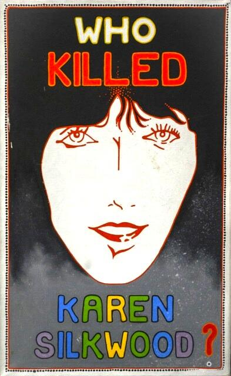

# Karen Silkwood

Nuclear energy safety whistleblower killed in a single-car crash while driving to meet a New York Times journalist with documents about safety violations and missing plutonium at the Kerr-McGee nuclear plant.

| Field | Details |
|-------|---------|
| **Full Name** | Karen Gay Silkwood |
| **Born** | February 19, 1946 |
| **Died** | November 13, 1974 |
| **Age at Death** | 28 |
| **Location of Death** | Highway 74, near Crescent, Oklahoma |
| **Cause of Death** | Single-car crash |
| **Official Ruling** | Accidental death |
| **Category** | Energy Whistleblower |

## Assessment: HIGHLY SUSPICIOUS

Karen Silkwood was killed in a single-car crash while driving to meet a New York Times reporter with a folder of documents exposing safety violations, falsified quality control records, and missing plutonium at Kerr-McGee's Cimarron Fuel Fabrication Site. Dents and scrape marks on her car's rear bumper indicated she was forced off the road by another vehicle. The documents she was carrying were never found. She had been deliberately contaminated with plutonium in the days before her death. Her family sued Kerr-McGee, which settled for $1.38 million without admitting liability.

## Circumstances of Death

On the night of November 13, 1974, Silkwood left a union meeting at the Hub Cafe in Crescent, Oklahoma, and drove south on Highway 74 toward Oklahoma City to meet David Burnham, a reporter for the New York Times. She was carrying a manila folder and a large notebook containing documents she said would prove that Kerr-McGee was manufacturing defective nuclear fuel rods and covering up contamination incidents.

Her white Honda Civic was found off the road, having run off the left side of the highway and hit a concrete culvert wing wall. She was dead inside the vehicle. The folder and notebook were never found — they were not in the car, at her home, or at the union meeting.

An accident reconstruction expert hired by the union, A.O. Pipkin, found fresh dents and rubber marks on her rear bumper that were not consistent with the accident itself. He concluded she had been struck from behind by another vehicle, forcing her off the road.

## Background

Karen Silkwood worked as a chemical technician at the Kerr-McGee Cimarron Fuel Fabrication Site near Crescent, Oklahoma, which manufactured plutonium fuel rods for nuclear reactors. She became a union activist with the Oil, Chemical and Atomic Workers International Union (OCAW) after witnessing safety violations at the plant.

Silkwood documented:
- **Falsified quality control records** — X-rays of fuel rod welds were being touched up to hide defects
- **Missing plutonium** — she believed significant quantities of weapons-grade plutonium were unaccounted for
- **Worker contamination** — including her own deliberate contamination

In the week before her death, Silkwood herself was contaminated with plutonium. The contamination was found on her apartment surfaces, her food, and her body. The source of contamination was never definitively established, but the union believed she was deliberately contaminated to discredit her or warn her.

## Why This Death Possibly Raises Questions

- Killed on the way to deliver evidence to the New York Times
- The documents she was carrying vanished from the crash scene
- Rear bumper damage indicated she was struck by another vehicle
- Had been deliberately contaminated with plutonium in the days before her death
- Kerr-McGee had powerful financial motives to silence her — the plant's reputation and licensing were at stake
- The company settled the family's lawsuit for $1.38 million without admitting liability
- No investigation was ever conducted into the missing documents
- A private investigator hired by the union was unable to locate the documents
- Her death effectively ended the investigation she was conducting
- The case became one of the most famous whistleblower deaths in American history

## The Counterargument

- The Oklahoma Highway Patrol concluded she fell asleep at the wheel
- Quaaludes (methaqualone) were found in her system at autopsy
- The rear bumper damage could theoretically have occurred at another time
- She was under extreme stress and may have been impaired
- The missing documents may never have existed in the form she claimed
- Kerr-McGee maintained her claims were fabricated or exaggerated
- The plutonium contamination may have been self-inflicted to generate attention for her cause

## Key Quotes from Media Coverage

> "Someone decided that Karen Silkwood was going to die."
> — **Bill Paul**, Oil, Chemical and Atomic Workers Union

> "Karen was a young woman who believed that if she could get the truth out about what was happening at that plant, someone would do something about it."
> — **Sara Nelson**, Silkwood family attorney

## See Also

- [Eugene Mallove](Eugene_Mallove.mdx) — Another energy whistleblower beaten to death before a major public appearance
- [Michael Zebuhr](Michael_Zebuhr.mdx) — Graduate student shot execution-style during a "robbery" while researching directed energy. Advisor received death threat after
- [Gilbert N. Lewis](Gilbert_N_Lewis.mdx) — Chemist who isolated heavy water (key to nuclear reactors). Found dead near hydrogen cyanide in his Berkeley lab

## Other Shocking Stories

- [Stanley Meyer](Stanley_Meyer.mdx): Gasped "they poisoned me" at dinner with investors, collapsed and died in the parking lot. His water fuel cell vanished.
- [Eugene Mallove](Eugene_Mallove.mdx): Cold fusion champion beaten to death days after announcing a breakthrough that could have transformed the energy industry.
- [Wilhelm Reich](Wilhelm_Reich.mdx): FDA burned six tons of his books and research, then imprisoned him. He died in federal prison within a year.
- [Phil Schneider](Phil_Schneider.mdx): Found dead with piano wire wrapped around his neck, ruled suicide — despite missing fingers making self-strangulation virtually impossible.

## Sources

- [Wikipedia — Karen Silkwood](https://en.wikipedia.org/wiki/Karen_Silkwood)
- [National Whistleblower Center — Karen Silkwood](https://www.whistleblowers.org/whistleblowers/karen-silkwood/)
- [TIME — Karen Silkwood](https://time.com/3574931/karen-silkwood/)
- [Rolling Stone — Karen Silkwood: The Case of the Activist's Death](https://www.rollingstone.com/culture/culture-news/karen-silkwood-the-case-of-the-activists-death-52287/)
- Richard Rashke, *The Killing of Karen Silkwood*, 1981

*This information was built by Grok and Claude AI research.*

**Status:** Deceased (1974)
