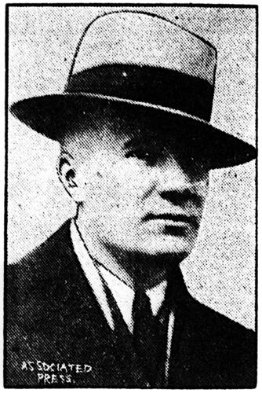

# Lester Hendershot
Inventor of a "fuelless motor" that reportedly drew power from the Earth's magnetic field. Made front-page headlines in 1928, was hospitalized after being shocked by his own device, and died under disputed circumstances in 1961.

| Field | Details |
|-------|---------|
| **Full Name** | Lester Jennings Hendershot |
| **Born** | June 3, 1898 |
| **Died** | April 1961 (reported dates vary: April 19 or April 21, 1961) |
| **Age at Death** | 62 |
| **Location of Death** | Cypress, Orange County, California |
| **Cause of Death** | Carbon monoxide poisoning from car exhaust (official ruling: suicide). Train wreck claim is a conflation with [Dr. Frederick Hochstetter](Frederick_Hochstetter.md)'s death. |
| **Official Ruling** | Suicide |
| **Category** | Energy Inventor |

## Assessment: SUSPICIOUS

Lester Hendershot spent over three decades attempting to develop and commercialize a generator that he claimed drew power from the Earth's magnetic field. His 1928 demonstrations attracted the attention of Major Thomas Lanphier, Charles Lindbergh, and the U.S. military. He was hospitalized on March 10, 1928 after reportedly being shocked by a 2,000-volt bolt from his own device, leaving him temporarily paralyzed with his vocal cords reportedly severed. His death in April 1961 was officially reported as suicide by carbon monoxide poisoning from car exhaust, though alternative accounts claim he was the only passenger killed in a Baltimore and Ohio train wreck. The conflicting death reports and the decades of pressure he faced over his invention raise questions.

## Circumstances of Death

### Official Account: Suicide

According to media reports from April 1961, Lester Hendershot was found dead by his wife. The reported cause was suicide by carbon monoxide poisoning — he had allegedly inhaled exhaust fumes from his car. This is the most widely documented account of his death.

### The Train Wreck Confusion — Solved

Some free energy sources claim Hendershot died in a B&O train wreck. This is a conflation with the death of **[Dr. Frederick Hochstetter](Frederick_Hochstetter.md)**, the Pittsburgh researcher who publicly debunked Hendershot's motor in 1928. Hochstetter died as the sole passenger fatality in a Baltimore and Ohio Railroad train wreck in the late 1920s or early 1930s. See [Hochstetter's profile](Frederick_Hochstetter.md) for details.

### Mark Hendershot's Account

According to Mark Hendershot (Lester's son, age 13 at the time), he came home with his brothers and sister to find their father dead in a car in their back yard in Cypress, California. The official cause was suicide by carbon monoxide poisoning from car exhaust.

### The Son's Death — Same Method, 10 Years Earlier

Lester's eldest son **Lester Jay Hendershot Jr.** died on October 5, 1951, at age 27, also found in a gas-poisoned car. A piece of radiator hose had been run from the exhaust into a window. The motor was still running when police arrived. The Pittsburgh Press reported the death, noting the father's earlier fame. Both father and eldest son died the same way — carbon monoxide in a car — ten years apart.

## Background

### The 1928 Fuelless Motor

On February 28, 1928, Lester Hendershot made front-page headlines across the United States with his invention of what the press called a "fuelless motor." Hendershot claimed the device tapped the Earth's magnetic field and rotation as its energy source — a form of "magnetic induction" generator that required no fuel input.

### Military Interest and Key Witnesses

Hendershot's demonstrations attracted significant attention:

- **Major Thomas Lanphier:** Commandant at Selfridge Field (Detroit). Witnessed demonstrations and reportedly confirmed the device produced power.
- **Charles Lindbergh:** On February 25, 1928, Lindbergh arrived at Selfridge Field with financial backers to potentially fund mass production. He witnessed at least two demonstrations. The inspection was "made in the interests of capitalists who were arranging to purchase the invention."
- **William Mayo** (chief engineer of Ford Motor Company) and **William Stout** (developer of the three-motor airplane design) investigated and reportedly "pronounced it genuine."
- **Selfridge Field demonstration:** The devices were demonstrated at Selfridge Field (a military installation near Detroit), where they reportedly powered a small motor and a radio. Crucially, the devices at Selfridge were constructed by military mechanics — not Hendershot — reducing the possibility of concealed power sources.
- **Congress** proposed a bill allowing government scientists to review Hendershot's invention for patent protection.

### The $25,000 Suppression Payment

While hospitalized after the March 1928 shock, Hendershot was approached by representatives of a large unnamed corporation. The deal: $25,000 in exchange for not building another unit for 20 years. Until the day he died, Hendershot refused to name the company, saying only that his generator "would be a serious threat to their multimillion dollar industry."

Mark Hendershot (his son) believed this corporation had first tried to discredit his father through [Dr. Frederick Hochstetter](Frederick_Hochstetter.md)'s public debunking campaign. When that failed, they bought him off directly.

### The 1935 Backtrack

In a 1935 Pittsburgh Press interview, Hendershot significantly downplayed his claims, stating his principle "worked only for small mechanisms like clock movements" and attributing the earlier controversy to "extravagant ideas of others."

### The 1958 Revival

In July 1958, Ed Skilling (a Columbia University-associated scientist) was brought in by an investor who had secured a 50% interest option. Testing continued from July to October 1958. On October 26, 1958, Skilling finally witnessed a real demonstration of electrical phenomena. Notably, Hendershot's children were able to operate the unit to power a floor lamp and television in the family living room without their father present or aware.

### The 56-Page Earth Magnet Document

According to social media accounts (X.com @andreas_nigbur, March 21, 2026), by 1960 Hendershot had prepared "a 56-page document in which he explained to humanists that the Earth is a giant magnet capable of supplying humanity with hundreds of billions of volts daily." This document reportedly accompanied two new generators that Hendershot presented publicly. According to this account, the publication of the document explaining how to harness "the power of the Earth" for free preceded the purchase of the invention by [Dr. Frederick Hochstetter](Frederick_Hochstetter.md) — though this narrative conflicts with the more established account of Hochstetter as Hendershot's debunker in 1928 (see [Hochstetter's profile](Frederick_Hochstetter.md) for both versions). The 56-page document has not been independently located or verified.

### The March 1928 Hospitalization

On March 10, 1928, Hendershot was rushed to Emergency Hospital in Washington, D.C. According to reports, he was demonstrating his fuelless motor in the office of a patent attorney when a bolt estimated at 2,000 volts shot from the device. The shock:

- Temporarily paralyzed him
- Reportedly severed his vocal cords (temporarily)
- Left him partially incapacitated

Some researchers view this incident as suspicious — questioning whether the "accident" was staged to intimidate Hendershot or to discredit his invention by making it appear dangerous. Others accept it as a genuine electrical accident from an experimental device.

### Decades of Struggle (1928-1961)

After the initial sensation of 1928, Hendershot spent the remaining 33 years of his life attempting to develop and commercialize his generator:

- His claims were alternately supported and attacked by the press and scientific establishment
- He reportedly faced pressure from interests that wanted his technology suppressed
- The "Force Research" project — apparently a later effort to develop his technology — continued until his death in 1961
- He never succeeded in bringing a commercially viable version to market
- His dream of providing the world with free energy remained unrealized at his death

## Why This Death Possibly Raises Questions

- **Conflicting death accounts:** The existence of two completely different narratives (suicide by car exhaust versus sole fatality in a train wreck) is unusual and suggests that the true circumstances may have been obscured
- **The 1928 shock incident:** Being hospitalized after a 2,000-volt shock from his own device — with temporarily severed vocal cords — could have been a warning or intimidation event rather than an accident
- **33 years of suppression:** Hendershot spent over three decades trying to develop technology that threatened fossil fuel industries, enduring constant opposition
- **Military interest:** The U.S. military's initial interest in his device — and its subsequent apparent withdrawal of support — suggests potential government involvement in suppression
- **Pattern:** His death fits the broader pattern of energy inventors who died before bringing their technology to market
- **Son died the same way:** Lester Jay Hendershot Jr. died of carbon monoxide in a car in 1951, age 27 — ten years before his father died identically. Two family members dying the same way is unusual
- **[Dr. Hochstetter](Frederick_Hochstetter.md) also died:** The man who publicly debunked Hendershot's motor was the sole passenger fatality in a B&O train wreck
- **"Suicide" as cover:** Carbon monoxide poisoning from car exhaust was a commonly reported method for deaths that some researchers believe were staged to look like suicides

## The Counterargument

- Mainstream science has never validated claims that generators can extract usable energy from the Earth's magnetic field in the manner Hendershot described
- Some contemporaneous accounts described Hendershot's demonstrations as possibly involving concealed batteries or conventional power sources
- A man who spent 33 years failing to commercialize his life's work could genuinely have become despondent enough for suicide
- The train wreck account is poorly sourced and may be a conflation with another individual
- Hendershot was 62, and decades of frustration and possible ridicule could have contributed to genuine mental health struggles
- No physical evidence of foul play has ever been presented

## See Also

- [Dr. Frederick Hochstetter](Frederick_Hochstetter.md) — The man who debunked Hendershot's motor; sole fatality in a B&O train wreck
- [Andrija Puharich](Andrija_Puharich.md) — Inventor of water splitting technology whose home was destroyed by arson
- [Stanley Meyer](Stanley_Meyer.md) — Water fuel cell inventor who died suddenly at a restaurant
- [Arie DeGeus](Arie_DeGeus.md) — Clean energy inventor who died of heart failure en route to secure funding
- [Eugene Mallove](Eugene_Mallove.md) — Cold fusion advocate beaten to death
- [Thomas Bearden](Thomas_Bearden.md) — MEG inventor whose collaborator John Bedini also died suddenly
- [Andrii Slobodian](Andrii_Slobodian.md) — Magnetic motor inventor also died of CO poisoning — part of the CO death pattern among energy researchers

## Other Shocking Stories

- [Arshad Sharif](Arshad_Sharif.md): Marconi scientist found decapitated — rope tied between his neck and a tree, car driven forward.
- [Ken Rasmussen](Ken_Rasmussen.md): Associate threatened at gunpoint by four suited men with MAC-10s who knew his family's daily routines.
- [Dr. Eric H. Wang](Eric_Wang.md): Headed Special Studies at Wright-Patterson AFB. Allegedly led reverse-engineering of recovered craft. Died 1960.
- [Floyd Sweet](Floyd_Sweet.md): Vacuum Triode Amplifier inventor received death threats by phone. Died of heart attack shortly after.

## Sources

- [Lester Hendershot — Svensons.com](https://www.svensons.com/Energy/hendershot.html)
- [Lester J. Hendershot: Generator and Motor — Rex Research](https://rexresearch.com/hendershot2/hendershot.htm)
- [Lester Hendershot: Fuelless Motor, Free Energy and Suicide? — Chemtrails Substack](https://chemtrails.substack.com/p/lester-hendershot-fuelless-motor)
- [Lester Hendershot's Magnetic Field Motor — Fuel Efficient Vehicles](https://fuel-efficient-vehicles.org/energy-news/?page_id=1166)
- [CM1C Lester Jennings Hendershot — Find a Grave](https://www.findagrave.com/memorial/777475/lester-jennings-hendershot)
- [Lester Hendershot — Kook Science](https://hatch.kookscience.com/wiki/Lester_Hendershot)
- [Hendershot Fuel Less Generator — Instructables (PDF)](https://content.instructables.com/FC2/3PPI/HSHDUKZ8/FC23PPIHSHDUKZ8.pdf)
- [Lester J. Hendershot Invented a Free Energy Generator and Was Eliminated — IntoTheLight.news](https://intothelight.news/2025/11/04/lester-j-hendershot-invented-a-free-energy-generator-was-eliminated/)
- [A Story of Free Energy (Part I) by Ed Skilling — Borderland Sciences](https://borderlandsciences.org/journal/vol/18/n05/A_Story_of_Free_Energy_(Part_I).html)
- [A Story of Free Energy (Part II) by Ed Skilling — Borderland Sciences](https://borderlandsciences.org/journal/vol/18/n06/A_Story_of_Free_Energy_(Part_II).html)
- [From the Archives of Lester J. Hendershot by Mark Hendershot — Scribd](https://www.scribd.com/document/19041370/From-the-Archives-of-Lester-J-Hendershot-by-Mark-Hendershot)
- [Lester J. Hendershot — Natural Philosophy Wiki](https://www.wiki.naturalphilosophy.org/index.php?title=Lester_J_Hendershot)

*This information was built by Grok and Claude AI research.*
