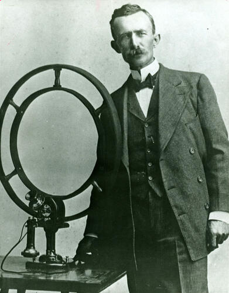

# Nathan Stubblefield

Earth battery inventor and wireless telephone pioneer who was systematically defrauded by business partners, stripped of his patents, and found dead alone in his shack — starved to death, his body gnawed by his starving cat.

| Field | Details |
|-------|---------|
| **Full Name** | Nathan Beverly Stubblefield |
| **Born** | November 22, 1860 |
| **Died** | March 28, 1928 |
| **Age at Death** | 67 |
| **Location of Death** | Near Murray, Kentucky |
| **Cause of Death** | Heart disease (official); starvation suspected |
| **Official Ruling** | Heart disease |
| **Category** | Energy Inventor |

## Assessment: MODERATE SUSPICION

Stubblefield's death was not a murder — it was the final act of a decades-long campaign of financial destruction and intellectual property theft. Business partners defrauded him of 500,000 shares of stock, competitors took credit for his wireless telephone invention, and he was left destitute. He retreated into isolation, destroyed his remaining prototypes so no one else could profit from them, and died alone. His earth battery technology — a device that drew electrical power directly from the ground — died with him.

## Circumstances of Death

Stubblefield was found dead on March 28, 1928, in his shack near Murray, Kentucky. He had been dead for several days. His body showed signs of extreme malnutrition — many accounts say he starved to death. His starving cat had reportedly begun feeding on his remains before the body was discovered.

The coroner listed the cause of death as heart disease, but the extreme emaciation of his body and his well-documented poverty strongly suggest starvation was a contributing factor.

Before his death, Stubblefield had destroyed all of his remaining devices and prototypes, ensuring that no one would profit from his inventions after his death.

## Background

Nathan Stubblefield was an inventor from Murray, Kentucky, who made two major technological breakthroughs:

**Earth Battery**: Stubblefield developed an electrolytic coil device that drew electrical power directly from the earth. The device used buried metal rods and coils to capture naturally occurring telluric currents and ground energy. He demonstrated the earth battery to witnesses on multiple occasions, powering lights and other devices with no external power source.

**Wireless Telephone**: In 1902, Stubblefield publicly demonstrated wireless voice transmission in Murray, Kentucky — before Marconi had achieved wireless voice (Marconi had demonstrated wireless telegraph, not voice). On May 30, 1902, he demonstrated his wireless telephone on the Potomac River in Washington, D.C., transmitting voice signals between boats and shore without wires.

Despite these documented public demonstrations, Stubblefield lost credit for both inventions:
- Reginald Fessenden is generally credited with the first wireless voice transmission (1906) — four years after Stubblefield's demonstration
- Stubblefield's earth battery technology was simply ignored

## Suppression Pattern

- **1902**: Successful wireless telephone demonstration in Washington, D.C., witnessed by scientists and press
- **1903-1908**: Business partners in the Wireless Telephone Company of America defraud him of 500,000 shares of stock and effectively steal control of his technology
- **1908**: Granted US Patent 887,357 for wireless telephone, but it was too late — the company had already collapsed
- **1910s-1920s**: Retreated into increasing isolation in Murray, living in a shack
- **1920s**: Destroyed all remaining prototypes and devices
- **1928**: Found dead, emaciated, in isolation

## Why This Death Possibly Raises Questions

- Systematic financial fraud stripped him of his business and technology
- Credit for wireless telephone went to others despite his earlier documented demonstrations
- His earth battery — a device that extracted power from the ground — was simply ignored by mainstream science
- He died in extreme poverty despite holding patents on revolutionary technology
- He destroyed his prototypes before death, ensuring no one else would profit — an act of desperation that suggests he knew the system was rigged against him
- The pattern of inventor-defrauded-by-business-partners matches other cases in this project
- His earth battery technology, if validated, would have threatened the emerging electrical utility monopoly

## The Counterargument

- His earth battery may have worked on a small scale but not have been commercially viable
- His wireless telephone technology may have been superseded by others who developed it more effectively
- Business fraud, while wrong, is not the same as suppression by government or corporate energy interests
- He may have suffered from mental illness or paranoia in his later years
- His retreat into isolation was self-imposed
- The heart disease ruling is plausible for a 67-year-old in 1928

## See Also

- [Nikola Tesla](/uaps/Details/Nikola_Tesla/) — Another inventor whose work was stolen by business partners and competitors
- [Philo Farnsworth](/uaps/Details/Philo_Farnsworth/) — Television inventor whose credit was taken by corporate interests

## Other Shocking Stories

- [Stanley Meyer](/uaps/Details/Stanley_Meyer/): Gasped "they poisoned me" at dinner with investors, collapsed and died in the parking lot. His water fuel cell vanished.
- [Viktor Schauberger](/uaps/Details/Viktor_Schauberger/): Forced to sign away all rights to his technology. Died five days later, saying "they took everything from me."
- [Nikola Tesla](/uaps/Details/Nikola_Tesla/): Government agents raided Tesla's hotel room within hours of his death and seized trunks of research. Decades of work vanished.
- [Wilhelm Reich](/uaps/Details/Wilhelm_Reich/): FDA burned six tons of his books and research, then imprisoned him. He died in federal prison within a year.

## Sources

- [Wikipedia — Nathan Stubblefield](https://en.wikipedia.org/wiki/Nathan_Stubblefield)
- [Rex Research — Nathan Stubblefield Earth Battery](http://rexresearch.com/stubblefield/stubblefield.html)
- [Murray Ledger & Times — The Father of Radio Broadcast](https://www.murrayledger.com/community/the-father-of-radio-broadcast---nathan-b-stubblefield/article_c3a128a2-56e1-11eb-87b9-3b8e10159292.html)
- Gerry Vassilatos, *Lost Science*, 1999 (covers Stubblefield's earth battery)

*This information was built by Grok and Claude AI research.*

**Status:** Deceased (1928)
