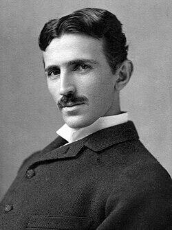

# Nikola Tesla
Pioneer of alternating current, wireless energy transmission, and directed energy weapons, whose papers were seized by the FBI and Office of Alien Property immediately after his death.

| Field | Details |
|-------|---------|
| **Full Name** | Nikola Tesla |
| **Born** | July 10, 1856 |
| **Died** | January 7, 1943 |
| **Age at Death** | 86 |
| **Location of Death** | Room 3327, Hotel New Yorker, New York City |
| **Cause of Death** | Coronary thrombosis |
| **Official Ruling** | Natural causes |
| **Category** | Energy Inventor / Physicist / Scientist |

## Assessment: RESEARCH SEIZED

Nikola Tesla was not murdered — he died of natural causes at age 86. However, his case is central to the pattern of energy technology suppression because of what happened *after* his death: the U.S. government immediately seized his papers, research notes, and personal effects under the authority of the Office of Alien Property (despite Tesla having been a naturalized U.S. citizen since 1891). The papers were reviewed by MIT electrical engineer John G. Trump — uncle of Donald Trump — who declared them to contain nothing of national security significance. Many of Tesla's papers and research materials remain unaccounted for to this day. Tesla had spent his final years claiming breakthroughs in wireless power transmission, particle beam weapons ("death ray"), and other technologies that, if real, would have threatened the utility industry, fossil fuel companies, and the existing military-industrial order.

## Circumstances of Death

Nikola Tesla spent the last decade of his life living alone in room 3327 of the Hotel New Yorker in Manhattan, supported in part by a small pension from the Yugoslav government and by Westinghouse, which paid his hotel bills. He had become increasingly reclusive, spending his time feeding pigeons in Bryant Park, writing notes, and occasionally giving interviews to journalists.

On January 7, 1943, hotel maid Alice Monaghan entered Tesla's room after he had placed a "do not disturb" sign on his door two days earlier. She found him dead in his bed. The New York City medical examiner ruled the cause of death as coronary thrombosis (a heart attack) and estimated he had died approximately 18 to 24 hours before being found.

Tesla died alone and largely forgotten by the public, despite having been one of the most famous scientists in the world during the 1890s and early 1900s.

## What Happened to His Papers

### The Seizure

Within hours of Tesla's death — and before his nephew Sava Kosanovic could secure the room — the FBI contacted the Office of Alien Property Custodian (OAP), which sent agents to seize Tesla's belongings. This was legally unusual: Tesla had been a U.S. citizen for over 50 years, and the OAP's jurisdiction was over property belonging to foreign nationals.

The OAP seized approximately:
- 80 trunks of papers, research notes, and correspondence
- Equipment, prototypes, and personal effects
- Materials from Tesla's hotel room, a storage facility, and a warehouse

### The John G. Trump Review

The government asked Dr. John G. Trump — a professor of electrical engineering at MIT and a technical consultant to the National Defense Research Committee — to review Tesla's papers and assess whether they contained anything of military or scientific significance.

Trump examined the papers over a three-day period and issued a report concluding that:
- Tesla's papers contained primarily "speculative, philosophical, and somewhat promotional" material
- There was nothing that would constitute a hazard in unfriendly hands
- Tesla's particle beam weapon claims were theoretical and did not include workable designs

Critics have questioned whether a three-day review of 80 trunks of material could have been thorough, and whether Trump's conclusions were influenced by the government's desire to control the narrative around Tesla's research.

### Missing Papers

Tesla's papers were eventually released to the Yugoslav government in 1952 and are now housed at the Nikola Tesla Museum in Belgrade. However, multiple researchers and Tesla biographers have noted that the collection appears incomplete. Specific materials that Tesla referenced in interviews and correspondence are not present in the Belgrade archive. Whether these materials were retained by U.S. intelligence agencies, lost, or never existed in the form Tesla described remains an open question.

The FBI maintained a file on Tesla that was declassified in 2016 and is available through the FBI Vault. The file confirms the government's interest in Tesla's claims about directed energy weapons and wireless power transmission.

## Background

### Career and Achievements

Nikola Tesla was born in Smiljan, Croatia (then part of the Austrian Empire) and emigrated to the United States in 1884. His verified contributions to science and technology include:

- **Alternating current (AC) power system** — The foundation of the modern electrical grid. Tesla's AC system defeated Thomas Edison's direct current (DC) system in the "War of the Currents" and became the global standard
- **Tesla coil** — A resonant transformer circuit used in radio technology, television, and numerous other applications
- **Polyphase AC motor** — The induction motor that powers most of the world's industrial equipment
- **Radio** — Tesla demonstrated radio transmission before Guglielmo Marconi, and the U.S. Supreme Court upheld Tesla's radio patent priority in 1943
- **Rotating magnetic field** — Fundamental to electric motor and generator design
- **Hydroelectric power** — Tesla designed the generators for the first major hydroelectric power plant at Niagara Falls (1895)

### Technologies That Threatened Industries

In his later years, Tesla claimed to be working on several technologies that, if realized, would have disrupted major industries:

- **Wireless power transmission:** Tesla's Wardenclyffe Tower project (1901-1906) aimed to transmit electrical power wirelessly around the world. If successful, it would have eliminated the need for power lines, transformers, and the entire electrical utility distribution infrastructure. J.P. Morgan — who was funding the project — allegedly pulled funding when he realized wireless power could not be metered and sold. "Where do I put the meter?" Morgan reportedly asked
- **Particle beam weapons ("death ray"):** Tesla claimed in the 1930s to have developed a directed energy weapon capable of destroying aircraft at a distance of 250 miles. He offered the technology to multiple governments, including the U.S., Britain, Yugoslavia, and the Soviet Union. The U.S. War Department showed interest but did not fund development
- **Free energy from the ionosphere:** Tesla claimed that the Earth's ionosphere contained virtually unlimited energy that could be tapped using resonant circuits. This claim, if valid, would have made all fossil fuels, nuclear power, and conventional power generation obsolete

### The Utility Industry's Interest

Tesla's wireless power transmission work was particularly threatening to the electrical utility industry. The entire business model of utility companies depends on generating electricity centrally and selling it through metered distribution networks. Wireless power — especially power that could be tapped from ambient sources — would have destroyed that model. The decision by J.P. Morgan to defund Wardenclyffe Tower is often cited as the first major act of energy technology suppression by financial interests.

## Why This Death Possibly Raises Questions

- **Immediate government seizure:** The speed with which the OAP seized Tesla's papers — within hours of his death — suggests the government had been monitoring Tesla and had a plan in place. The use of the Office of Alien Property for a naturalized citizen was legally questionable
- **Inadequate review:** John G. Trump reviewed 80 trunks of material in three days. Critics argue this was insufficient for a thorough scientific assessment and that the review was designed to produce a predetermined conclusion
- **Missing papers:** Materials that Tesla described in interviews and correspondence are not in the Belgrade archive. The gap between what Tesla claimed to have and what was returned to Yugoslavia has never been explained
- **Wireless power threat:** Tesla's wireless power transmission technology, if viable, would have threatened the entire electrical utility industry — one of the largest economic sectors in the world
- **Weapons implications:** Tesla's directed energy weapon claims were of obvious military interest. Multiple governments sought the technology. The idea that the U.S. government would simply return these papers without retaining copies or key materials strains credulity
- **Pattern:** Tesla's case established the template for government seizure of inventor research that has been repeated with other inventors in the decades since

## The Counterargument

- Tesla died at age 86 of coronary thrombosis — a natural death consistent with his age
- Tesla had made increasingly grandiose claims in his later years, some of which were clearly beyond the physics of his era
- John G. Trump was a respected MIT professor with no known motive to lie about the contents of Tesla's papers
- The OAP seizure, while legally unusual, occurred during World War II when the government was aggressive about securing any potentially strategic technology
- Many of Tesla's "missing" materials may never have existed in finished form — Tesla was known to work from memory and to describe inventions he had not yet built

## Key Quotes

> "The present is theirs; the future, for which I really worked, is mine." — Nikola Tesla

> "If Edison had a needle to find in a haystack, he would proceed at once with the diligence of the bee to examine straw after straw until he found the object of his search. I was a sorry witness of such doings, knowing that a little theory and calculation would have saved him ninety percent of his labor." — Nikola Tesla

> "Let the future tell the truth, and evaluate each one according to his work and accomplishments." — Nikola Tesla

## See Also

- [Thomas Henry Moray](Thomas_Henry_Moray.md) — Radiant energy inventor whose lab was ransacked and device destroyed
- [Rudolf Diesel](Rudolf_Diesel.md) — Diesel engine inventor who vanished from a ship in 1913
- [Stanley Meyer](Stanley_Meyer.md) — Water fuel cell inventor who died suddenly in 1998
- [Eugene Mallove](Eugene_Mallove.md) — Cold fusion advocate beaten to death in 2004
- [Thomas Townsend Brown](Thomas_Townsend_Brown.md) — Electrogravitics researcher whose work was allegedly classified
- [Brian O'Leary](Brian_OLeary.md) — NASA astronaut who became a zero-point energy advocate. Died of rapid cancer six days after diagnosis
- [Otis T. Carr](Otis_T_Carr.md) — Claimed to be Tesla's protege. Arrested before demonstration, died penniless. FBI maintained file on him
- [John Hutchison](John_Hutchison.md) — Replicated Tesla equipment. Lab seized by Canadian PM, government defied court order to return it
- [Nathan Stubblefield](Nathan_Stubblefield.md) — Earth battery inventor and wireless telephone pioneer. Defrauded by partners, credit stolen. Starved to death
- [George Taylor Fulford](George_Taylor_Fulford.md) — Major GE shareholder killed in a car crash one week after announcing his intention to fund Tesla's Wardenclyffe Tower wireless energy project; the Fulford family has maintained for over a century that the crash was arranged
- [Georges Lakhovsky](Georges_Lakhovsky.md) — Built the Multi-Wave Oscillator with assistance from Tesla; struck by a limousine in New York in 1942 just as his electromagnetic therapy device was producing hospital results
- [Nikola Tesla (UAP Deaths project)](/uaps/Details/Nikola_Tesla) — Parallel profile in UAP Deaths project

## Other Shocking Stories

- [Peter Ferry](Peter_Ferry.md): Retired Army Brigadier at Marconi, found electrocuted with electrical leads in his mouth.
- [Dimitri Petronov](Dimitri_Petronov.md): Russian plasma battery inventor disappeared after demonstrating his technology to military officials.
- [Paul Pantone](Paul_Pantone.md): GEET plasma reactor inventor committed to a state mental hospital. Died after years of institutionalization.
- [Carl Grillmair](Carl_Grillmair.md): Caltech astrophysicist on NEO Surveyor telescope. Shot dead at his LA County home, February 2026.

## Sources

- [Nikola Tesla — Wikipedia](https://en.wikipedia.org/wiki/Nikola_Tesla)
- [Tesla: Life and Legacy — PBS](https://www.pbs.org/tesla/)
- [The Mystery of Nikola Tesla's Missing Files — History.com](https://www.history.com/news/nikola-tesla-files-declassified-fbi)
- [Nikola Tesla — FBI Vault (FOIA documents)](https://vault.fbi.gov/nikola-tesla)
- [Wardenclyffe Tower — Wikipedia](https://en.wikipedia.org/wiki/Wardenclyffe_Tower)
- W. Bernard Carlson, *Tesla: Inventor of the Electrical Age* (Princeton University Press, 2013)
- Marc Seifer, *Wizard: The Life and Times of Nikola Tesla* (Citadel Press, 1996)

*This information was built by Grok and Claude AI research.*

**Status:** Deceased (1943)
