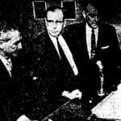

import Head from '@docusaurus/Head';

<Head>
  
</Head>

Protege of Nikola Tesla who claimed to have built an antigravity spacecraft, arrested on fraud charges just before a public demonstration, and died penniless in a Pittsburgh slum.

| Field | Details |
|-------|---------|
| **Full Name** | Otis T. Carr |
| **Born** | December 7, 1904 |
| **Died** | September 20, 1982 |
| **Age at Death** | 77 |
| **Location of Death** | Pittsburgh, Pennsylvania |
| **Cause of Death** | Not publicly documented (died in poverty) |
| **Official Ruling** | Unknown |
| **Category** | Energy Inventor |

## Assessment: SUSPICIOUS

Otis T. Carr claimed to have developed an antigravity spacecraft (the OTC-X1) based on principles learned directly from Nikola Tesla, whom he befriended as a young hotel worker. He was arrested on securities fraud charges just before a scheduled public demonstration of his craft. The demonstration was sabotaged when Carr was suddenly "hospitalized" with a mysterious illness. He was convicted and imprisoned, and his equipment was confiscated. The FBI maintained a file on him. He died penniless in Pittsburgh after being systematically destroyed. The arrest-before-demonstration pattern is a classic suppression signature seen repeatedly in this project.

## Circumstances of Death

Carr died on September 20, 1982, in a Pittsburgh slum. He was destitute. The specific cause of death is not well-documented in public records. He had suffered multiple heart attacks and declining health following his imprisonment and the destruction of his career.

## Background

Carr claimed that as a young hotel worker in New York City, he befriended Nikola Tesla, who allegedly shared principles of antigravity and energy generation with him. Using these principles, Carr founded OTC Enterprises in the late 1950s and announced plans to build and publicly demonstrate the OTC-X1 — a circular craft powered by the "Utron Electrical Accumulator" that allegedly generated lift through interaction with gravitational and electromagnetic fields.

Carr attracted significant investor interest and public attention. He raised funds to build the prototype and scheduled a public demonstration in Oklahoma City.

The demonstration never occurred:
- Just before the scheduled demonstration, Carr was hospitalized with a sudden "mysterious illness"
- He was then arrested on securities fraud charges
- His equipment and prototypes were confiscated
- He was convicted and sentenced to prison

The FBI maintained a file on Carr (available in the FBI Vault), documenting their surveillance of his activities and his claims.

## Why This Death Possibly Raises Questions

- Arrested just before a scheduled public demonstration — the classic suppression pattern
- Hospitalized with a "mysterious illness" on the day of the demonstration
- FBI maintained an active file on him
- Equipment and prototypes confiscated after arrest
- The securities fraud charges could have been legitimate — or could have been the legal tool used to shut him down
- Died penniless despite having attracted significant investment
- The Tesla connection, if genuine, would make his technology extremely threatening to established energy interests
- Multiple other Tesla-connected inventors have been similarly suppressed

## The Counterargument

- His claims about antigravity are extraordinary and have never been independently verified
- The securities fraud conviction may have been entirely legitimate — he raised money for technology that may not have worked
- His claimed relationship with Tesla is unverified
- No physical evidence of a working OTC-X1 has ever been presented
- His demonstrations were always postponed or cancelled, which is consistent with fraud
- The FBI investigation may have been warranted consumer protection rather than suppression
- RationalWiki and other skeptical sources classify him as a fraud

## See Also

- [Nikola Tesla](/uaps/Details/Nikola_Tesla/) — The inventor Carr claimed as his mentor
- [Joseph Westley Newman](/uaps/Details/Joseph_Westley_Newman/) — Another energy inventor who fought the patent office and was denied

## Other Shocking Stories

- [Nikola Tesla](/uaps/Details/Nikola_Tesla/): Government agents raided Tesla's hotel room within hours of his death and seized trunks of research. Decades of work vanished.
- [Stanley Meyer](/uaps/Details/Stanley_Meyer/): Gasped "they poisoned me" at dinner with investors, collapsed and died in the parking lot. His water fuel cell vanished.
- [Wilhelm Reich](/uaps/Details/Wilhelm_Reich/): FDA burned six tons of his books and research, then imprisoned him. He died in federal prison within a year.
- [Paul Pantone](/uaps/Details/Paul_Pantone/): Inventor of a plasma reactor fuel system was committed to a mental institution to silence him and seize his technology.

## Sources

- [FBI Vault — Otis T. Carr File](https://vault.fbi.gov/otis-t.-carr/otis-t.-carr-part-01-of-01)
- [Grokipedia — Otis T. Carr](https://grokipedia.com/page/Otis_T._Carr)
- [HowStuffWorks — Otis Carr](https://science.howstuffworks.com/space/aliens-ufos/otis-carr.htm)

*This information was built by Grok and Claude AI research.*

**Status:** Deceased (1982)
