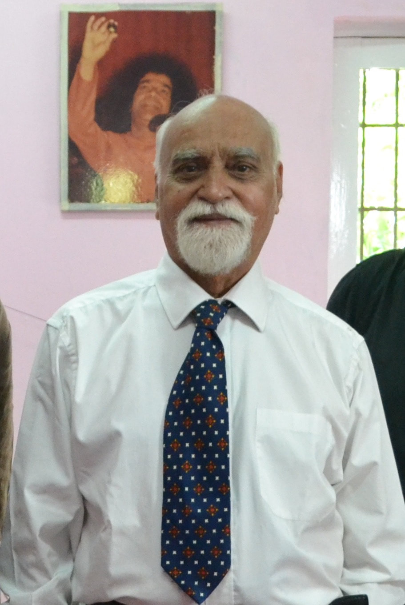

# Paramahamsa Tewari
Retired Executive Director of Nuclear Projects at the Nuclear Power Corporation of India (NPCIL) — one of the most senior nuclear energy officials in India. Developed Space Vortex Theory and built the Tewari Reactionless Generator (T-RLG), which he claimed operated at over 250% efficiency by extracting energy from the structure of space itself. His work received early commendation from Nobel Laureates. According to alternative media sources, India permitted development of his technology despite alleged threats from the UK, US, and Saudi Arabia. Died November 27, 2017, at age 80.

| Field | Details |
|-------|---------|
| **Full Name** | Paramahamsa Tewari |
| **Born** | June 1, 1937 |
| **Died** | November 27, 2017 |
| **Age at Death** | 80 |
| **Location of Death** | Near Varanasi, India |
| **Cause of Death** | Natural causes |
| **Official Ruling** | Natural causes |
| **Category** | Energy Inventor / Physicist / Government Nuclear Executive |

## Assessment: WORK SUPPRESSED — ALLEGED INTERNATIONAL PRESSURE

Paramahamsa Tewari is one of the most credentialed individuals in this project. As Executive Director of Nuclear Projects for India's nuclear power corporation, he had decades of experience at the highest levels of nuclear energy engineering. His Reactionless Generator was independently built and tested by third parties who confirmed his efficiency claims. Multiple alternative media sources report that Petrodollar nations — the UK, US, and Saudi Arabia — pressured India to suppress the technology. India reportedly treated the program as a matter of national pride and resisted the pressure. His death at 80 appears natural, but the suppression of his technology at the international level fits the broader pattern documented in this project.

## Circumstances of Death

Tewari died on November 27, 2017, near Varanasi, India. He was 80 years old. No reports suggest suspicious circumstances around his death. He had been active in his research until late in life.

## Background

Paramahamsa Tewari earned his B.Sc. in Engineering from Benares Hindu University. He spent four decades in India's nuclear energy establishment, rising to **Executive Director of Nuclear Projects** at the **Nuclear Power Corporation of India Limited (NPCIL)** — overseeing the construction and operation of India's nuclear power plants.

### Space Vortex Theory

Tewari developed **Space Vortex Theory (SVT)**, a theoretical framework proposing that space itself has a fundamental structure — a fluid-like medium whose vortices create matter, energy, and the fundamental forces. The theory predicted that energy could be extracted from space through specific electromagnetic configurations.

His theoretical work received early commendation from Nobel Laureates in physics.

### The Tewari Reactionless Generator (T-RLG)

Based on Space Vortex Theory, Tewari built the **Reactionless Generator** — a device that allegedly:

- Produced **no counter-torque** against the prime mover (hence "reactionless")
- Operated at measured efficiencies of **over 250%** — producing 2.5 times more electrical output than the mechanical input
- Was independently built and tested by **Toby Grotz** (President of Wireless Engineering Inc., USA), who confirmed the efficiency claims
- Was also independently verified by engineers in India

The generator's "reactionless" property meant the prime mover (the motor spinning the generator) experienced no resistance from the generator — a phenomenon that conventional electromagnetic theory says should not occur.

### Alleged International Suppression

According to reports in alternative media (We Are Change, alternative energy forums):

- India reportedly permitted the development of Tewari's technology as a matter of **national energy sovereignty**
- **UK, US, and Saudi Arabia** allegedly pressured India to suppress the technology
- Alleged threats included potential military and economic consequences
- India reportedly resisted the pressure, treating it as a matter of **national pride**

These claims come primarily from alternative media sources rather than mainstream outlets or official government statements.

## Why This Death Possibly Raises Questions

- Tewari was one of the **highest-credentialed** energy inventors ever — Executive Director of a national nuclear power corporation
- His generator was **independently tested and confirmed** by international engineers
- Alleged **international pressure from three major nations** to suppress the technology
- Despite his credentials, his work was **never adopted by India's energy infrastructure**
- The technology, if legitimate, would undermine the petroleum-based global energy economy
- His Space Vortex Theory was **ignored by mainstream physics** despite commendation from Nobel Laureates
- After his death, no successor has continued developing the T-RLG at institutional scale

## The Counterargument

- Tewari died at 80 of natural causes — there is no evidence of foul play
- Over-unity generators violate the first and second laws of thermodynamics
- The international suppression claims come from alternative media, not verified government sources
- "Reactionless" generators violate Newton's third law and conservation of momentum
- Independent tests may have had methodological errors in measuring efficiency
- India's failure to adopt the technology may reflect technical limitations rather than suppression
- No peer-reviewed paper in a mainstream physics journal has validated the T-RLG's claims

## See Also

- [Nikola Tesla](/uaps/Details/Nikola_Tesla/) — His papers were seized by the U.S. government after death; also worked on extracting energy from the vacuum
- [Thomas Bearden](/uaps/Details/Thomas_Bearden/) — Inventor of the Motionless Electromagnetic Generator; collaborated on vacuum energy theory
- [John Searl](/uaps/Details/John_Searl/) — Searl Effect Generator also claimed reactionless properties; devices seized, home burned

## Other Shocking Stories

- [Edwin Gray](Edwin_Gray.mdx): LA District Attorney confiscated all prototypes — found dead at his shop, all remaining motors vanished.
- [Andrija Puharich](/uaps/Details/Andrija_Puharich/): Home destroyed by arson attributed to CIA threats, fled to Mexico, died falling down stairs.
- [George Taylor Fulford](George_Taylor_Fulford.mdx): Killed in car crash one week after announcing intent to fund Tesla's wireless energy project.
- [Justin Christofleau](Justin_Christofleau.mdx): Electroculture inventor prosecuted by fertilizer industry — 150,000 devices sold across 9 countries, then shut down.

## Sources

- [Tewari.org — About](https://www.tewari.org/about.html)
- [GAIA Energy — Obituary Paramahamsa Tewari](https://gaia-energy.org/obituary-paramahamsa-tewari/)
- [Novam Research — Reactionless Electromagnetic Generator](https://novam-research.com/tewari.php)
- [Mother Earth News — Energy Breakthrough](https://www.motherearthnews.com/sustainable-living/renewable-energy/energy-breakthrough-zbcz1601/)
- [ZPEnergy — Last Theoretical Paper by Tewari](https://www.zpenergy.com/modules.php?name=News&file=article&sid=3807)
- [We Are Change — India Permits Free Energy Technology](https://wearechange.org/india-permits-free-energy-technology-despite-threats-from-uk-us-saudi-arabia/)

*This information was built by Grok and Claude AI research.*

**Status:** Deceased (2017)
