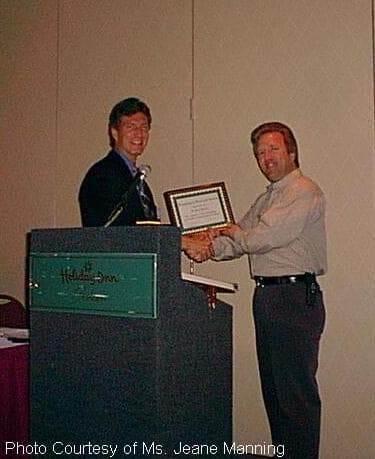

# Paul Brown
Nuclear scientist and inventor of the resonant nuclear battery (Nucell) — a radioisotope power system that converted nuclear decay directly into AC electricity without nuclear reaction or radioactive waste — killed in an automobile accident after years of documented harassment including robberies, vandalism, false drug accusations, and a pipe bombing.

| Field | Details |
|-------|---------|
| **Full Name** | Paul Maurice Brown |
| **Born** | Unknown |
| **Died** | April 7, 2002 |
| **Age at Death** | Unknown (estimated mid-40s to early 50s) |
| **Location of Death** | Boise, Idaho |
| **Cause of Death** | Automobile accident |
| **Official Ruling** | Accidental death |
| **Category** | Energy Inventor / Physicist / Scientist |

## Assessment: SUSPICIOUS

Dr. Paul Brown developed a resonant nuclear battery called the "Nucell" — a device that used radioisotope decay to generate AC electricity directly, without a nuclear chain reaction and without producing radioactive waste. The device was designed to last approximately 25 years. Before his death in an automobile accident in 2002, Brown endured a sustained campaign of harassment that he publicly documented: his home was robbed three times, vandalized four times, he was twice falsely accused of drug manufacturing, he lost his home, and his mother's car was pipe-bombed. In 1991, he distributed a letter stating he was being "persecuted" and appealing for public awareness of his situation. The pattern of escalating harassment followed by death in a car accident fits a documented pattern seen with other energy inventors.

## Circumstances of Death

On April 7, 2002, Dr. Paul Brown was killed in an automobile accident in or near Boise, Idaho. Detailed circumstances of the accident — including whether another vehicle was involved, road conditions, or any mechanical failure — are not well documented in publicly available sources.

Brown had been living and working in the Boise area, where he founded Nuclear Solutions Inc. to develop and commercialize his Nucell technology. At the time of his death, he was actively pursuing development of his resonant nuclear battery.

## Background

### Education and Nuclear Research

Paul Brown held a doctorate in nuclear engineering and had worked in the nuclear energy field for years before developing his independent research. He was knowledgeable in both conventional nuclear power and radioisotope applications.

### The Nucell — Resonant Nuclear Battery

Brown's primary invention was the Nucell, a resonant nuclear battery that he claimed could convert the energy from radioisotope decay directly into usable AC electricity. Key claimed features of the device included:

- **Direct conversion:** Unlike conventional nuclear power plants, which use nuclear fission to generate heat to produce steam to drive turbines, the Nucell reportedly converted decay energy directly into electricity
- **No chain reaction:** The device used naturally decaying radioisotopes rather than sustained nuclear fission, making it inherently safe from meltdown
- **No radioactive waste:** Because no fission occurred, the device reportedly produced no high-level radioactive waste
- **25-year lifespan:** The device was designed to operate continuously for approximately 25 years, based on the half-life of the radioisotopes used
- **Compact form factor:** The Nucell was reportedly small enough for portable and distributed power applications

Brown founded Nuclear Solutions Inc. in Boise, Idaho to commercialize the technology. The company was publicly traded and filed reports with the SEC.

### The Harassment Campaign

Beginning in the late 1980s and continuing through the 1990s, Brown experienced what he described as a systematic campaign of persecution:

- **Home robberies:** His home was broken into and robbed three times. In at least some instances, research materials and documents were reportedly targeted
- **Vandalism:** His property was vandalized four times
- **False drug accusations:** Brown was twice accused of manufacturing illegal drugs — accusations he said were entirely fabricated and which did not result in convictions
- **Pipe bombing:** His mother's car was pipe-bombed in what he described as an act of intimidation
- **Loss of home:** The cumulative effect of the harassment contributed to Brown losing his home

### The 1991 Letter

In 1991, Brown wrote and distributed an open letter describing the harassment he had experienced and stating that he was being "persecuted" for his work on alternative nuclear energy technology. He appealed for public awareness, apparently believing that visibility might provide some protection. The letter was distributed to media outlets, alternative energy organizations, and supporters.

### Nuclear Solutions Inc.

Despite the harassment, Brown continued his work through Nuclear Solutions Inc. The company issued press releases through CSRWire and other channels describing the Nucell technology and its potential applications. The company was pursuing both commercial and military applications for the device at the time of Brown's death.

## Why This Death Possibly Raises Questions

- **Documented harassment pattern:** Unlike many cases where harassment claims are anecdotal, Brown publicly documented and reported the robberies, vandalism, false accusations, and pipe bombing over a period of years
- **Escalating severity:** The harassment escalated from property crimes (robbery, vandalism) to false criminal accusations to explosive violence (pipe bombing) — a pattern consistent with an organized campaign of intimidation
- **The 1991 letter:** Brown was sufficiently concerned about his safety that he issued a public letter about his persecution — analogous to other inventors who warned "if something happens to me, it wasn't an accident"
- **Car accidents as method:** Automobile "accidents" are a well-documented method of assassination because they are difficult to prove as intentional. Several other energy researchers have died in car accidents, including [David Sands](David_Sands.md)
- **Viable technology:** Unlike some free energy claims, Brown's Nucell was based on known physics — radioisotope decay is real and measurable. The innovation was in the conversion method, making the technology potentially more threatening to established interests
- **Publicly traded company:** Nuclear Solutions Inc. was a real, SEC-reporting company, indicating that Brown's work had reached a level of commercial viability that attracted genuine investment
- **Mother targeted:** The pipe bombing of his mother's car suggests that whoever was behind the harassment was willing to threaten family members — a tactic associated with organized intimidation rather than random crime

## The Counterargument

- Automobile accidents are common and are the leading cause of accidental death for many demographics
- The Nucell's claimed performance has not been independently verified by mainstream nuclear engineers
- Brown's harassment, while disturbing, could have been the result of local criminal activity, personal disputes, or other factors unrelated to his research
- The false drug accusations could reflect law enforcement errors rather than deliberate targeting
- No direct evidence links his death to any specific entity or organization

## See Also

- [David Sands](David_Sands.md) — Scientist and researcher who died when his car exploded in 1991
- [Eugene Mallove](Eugene_Mallove.md) — Cold fusion advocate beaten to death in 2004
- [Stanley Meyer](Stanley_Meyer.md) — Water fuel cell inventor who died suddenly in 1998
- [John Bedini](John_Bedini.md) — Free energy researcher
- [Paul Brown (UAP Deaths project)](/uaps/Details/Paul_Brown) — Parallel profile in UAP Deaths project

## Other Shocking Stories

- [Eugene Mallove](Eugene_Mallove.md): Cold fusion advocate beaten to death days before publishing breakthrough findings. Former MIT science writer.
- [Gerald Schaflander](Gerald_Schaflander.md): Solar hydrogen fuel inventor imprisoned on fraud charges after refusing oil industry buyout offers.
- [Thomas Henry Moray](Thomas_Henry_Moray.md): Shot, wounded, lab ransacked. His own assistant destroyed the device with an ax.
- [Monica Jacinto Reza](Monica_Jacinto_Reza.md): Co-inventor of superalloy for US rocket engines. Vanished from a ridgeline. Declared dead four days later.

## Sources

- [Nuclear Solutions Inc. Press Releases — CSRWire](https://www.csrwire.com/)
- [Paul Brown and the Nucell — rexresearch.com](http://www.rexresearch.com/)
- [Paul Brown — Natural Philosophy Wiki](https://naturalphilosophy.org/)
- [Nuclear Battery Technology — Power Engineering Magazine](https://www.power-eng.com/)
- [Resonant Nuclear Battery Overview — Alternative Energy Research](https://www.infinite-energy.com/)

*This information was built by Grok and Claude AI research.*

**Status:** Deceased (2002)
