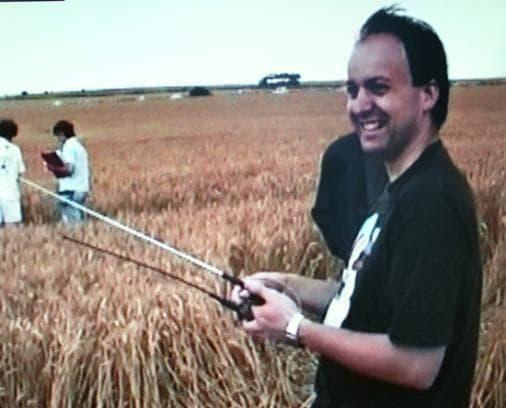

# Paul Vigay
British computer scientist and leading UFO and crop circle researcher who was found drowned off the coast of Portsmouth, UK. The coroner officially called his death "a mystery" — no suicide note, no clear cause.

| Field | Details |
|-------|---------|
| **Full Name** | Paul Vigay |
| **Born** | November 26, 1964 |
| **Died** | February 20, 2009 |
| **Age at Death** | 44 |
| **Location of Death** | Off the coast of Portsmouth, Hampshire, England |
| **Cause of Death** | Drowning |
| **Official Ruling** | Open verdict — coroner called it "a mystery" |
| **Category** | Energy Researcher / Physicist / Scientist |

## Assessment: SUSPICIOUS

Paul Vigay was found drowned off the coast of Portsmouth at age 44, with no suicide note and no established cause for entering the water. The coroner returned an open verdict, explicitly calling the death "a mystery." Vigay was one of the UK's most prominent UFO and crop circle researchers, with his work frequently intersecting electromagnetic field analysis, advanced propulsion physics, and the mathematical properties of crop formations — areas that overlap with electrogravitics and spacetime anomaly research. X users in UFO communities consistently list him alongside other researchers who died in non-natural ways.

## Circumstances of Death

On February 20, 2009, Paul Vigay's body was recovered from the sea near Eastney Beach in Portsmouth, Hampshire, England. He had been reported missing the previous day.

The coroner's inquest found no evidence of suicide — there was no note, no history of suicidal ideation reported by family or friends, and no clear explanation for why he entered the water. The coroner returned an open verdict and described the death as "a mystery."

According to reports, Vigay was last seen alive near the seafront. There were no witnesses to him entering the water. The circumstances left open the possibility of accident, suicide, or foul play, but the investigation did not conclusively establish any of these.

## Background

Paul Vigay was a British computer scientist, software developer, and researcher based in Hampshire, England. He was a prominent figure in the UK's UFO and crop circle research communities from the 1990s through his death in 2009.

### Computer Science Work

Vigay was a well-respected developer for the RISC OS platform (used in Acorn/ARM computers), contributing software and technical expertise to the community. He ran the website Enigma, which covered computing, science, and unexplained phenomena.

### Crop Circle and UFO Research

Vigay was widely regarded as one of the leading scientific investigators of crop circles in the UK. His approach was distinctive because it focused on measurable physical and mathematical properties rather than speculation:

- **Electromagnetic anomalies:** Vigay conducted field measurements of electromagnetic fields within crop formations, documenting anomalies that he argued could not be explained by mechanical flattening of crops
- **Mathematical analysis:** He studied the geometric and mathematical properties of crop formations, including their relationship to sacred geometry, fractal mathematics, and harmonic frequencies
- **Database and documentation:** He maintained one of the most comprehensive databases of crop circle formations, including photographs, measurements, and analysis

### Connection to Advanced Energy and Propulsion Physics

Vigay's crop circle research frequently intersected with topics directly relevant to this project:

- His electromagnetic field measurements within crop formations contributed to discussions about whether the formations were created by some form of directed electromagnetic energy
- The geometric patterns he analyzed are cited in interdimensional and electrogravitics discussions — researchers have drawn connections between crop circle geometries and theoretical models for electromagnetic propulsion and spacetime manipulation
- His work on electromagnetic anomalies overlaps with research into metamaterials, field propulsion, and the physics of the Biefeld-Brown effect documented in [Thomas Townsend Brown](Thomas_Townsend_Brown.md)'s work

Vigay collaborated with other researchers in the crop circle and UFO communities, including contributing to documentary films about the phenomena. He was consulted as a technical expert on the film *Signs* (2002) directed by M. Night Shyamalan.

## Why This Death Possibly Raises Questions

- The coroner **explicitly called the death "a mystery"** and returned an open verdict — the cause of death was never established
- **No suicide note** was found and no history of suicidal ideation was reported
- **No clear reason** for Vigay to have entered the water was established by the investigation
- Vigay was **one of the UK's most prominent UFO and crop circle researchers** — his electromagnetic field measurements and mathematical analyses contributed to discussions about directed energy and advanced propulsion physics
- X users in UFO communities **consistently list Vigay alongside other non-natural researcher deaths**, noting a pattern of researchers dying under unexplained circumstances
- His crop circle research intersected with **electromagnetic energy, metamaterials, and field propulsion** — areas connected to classified programs and suppressed technology
- The death occurred in **Portsmouth** — a major Royal Navy base with significant defense and intelligence presence
- At 44, Vigay was at the height of his research career with no documented health issues that would explain his death

## The Counterargument

- **Drowning deaths near coastlines are not uncommon** in the UK, and not every unexplained coastal death is suspicious
- **An open verdict means the evidence was inconclusive**, not that foul play was indicated — the coroner may simply have been unable to determine whether the death was an accident or suicide
- **Crop circle research, while controversial, is not typically considered a threat** to national security or energy industry interests in the same way that working energy devices are
- **No direct threats or intimidation** were publicly reported against Vigay before his death
- **Personal factors** unknown to the public may have contributed to his death — the open verdict means the full picture was not established
- **The connection to "advanced propulsion physics" through crop circles is indirect** — Vigay was primarily a crop circle researcher, not an energy device inventor or classified programs whistleblower
- **Vigay's RISC OS work and crop circle research** did not involve devices or technologies that would directly threaten established energy industries

## Key Quotes from Media Coverage

> "So many UFO researchers died in non-natural ways."
> — X (formerly Twitter) user in UFO research community, listing Vigay alongside other suspicious deaths

> "The coroner called it 'a mystery.'"
> — Summary of coroner's verdict on Paul Vigay's death, 2009

## See Also

- [Dean Warwick](Dean_Warwick.md) — New Zealand-born inventor who collapsed dead mid-presentation at a UK conference (2006)
- [Morris Jessup](Morris_Jessup.md) — Astronomer and antigravity researcher found dead the day after announcing a breakthrough (1959)
- [Frank Edwards](Frank_Edwards.md) — UFO author and broadcaster who died of heart attack on the exact 20th anniversary of Kenneth Arnold's sighting (1967)
- [Fred Bell](Fred_Bell.md) — Nuclear physicist who died within 48 hours of filming classified technology interview (2011)

## Other Shocking Stories

- [Eugene Mallove](Eugene_Mallove.md): MIT cold fusion researcher beaten to death with 32 lacerations days before a major announcement.
- [Mark McCandlish](Mark_McCandlish.md): Aerospace illustrator shot dead, reportedly about to testify before Senate on electrogravitics.
- [Shani Warren](Shani_Warren.md): Found gagged, bound hand and foot, drowned in 18 inches of water — ruled suicide.
- [Rory Johnson](Rory_Johnson.md): Magnetic motor inventor had a Greyhound Bus contract before DOE seized his work; died mysteriously.

## Sources

- Coroner's inquest into the death of Paul Vigay, 2009 — returned open verdict, described death as "a mystery"
- [Paul Vigay — Enigma website archive](https://web.archive.org/web/2009*/http://www.vigay.com/) — Vigay's personal website covering computing, science, and crop circle research
- X (formerly Twitter) posts in UFO research communities listing Vigay among researchers who died non-naturally — multiple posts, various dates
- [Crop Circle Connector](http://www.cropcircleconnector.com/) — database that Vigay contributed to extensively
- *Signs* (2002, dir. M. Night Shyamalan) — Vigay was consulted as a technical expert

*This information was built by Grok and Claude AI research.*

**Status:** Deceased (2009)
