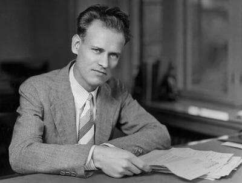

# Philo Taylor Farnsworth
Inventor of electronic television at age 21, who later developed the first device to demonstrably produce nuclear fusion reactions, only to have his fusion research defunded by ITT and abandoned after his death.

| Field | Details |
|-------|---------|
| **Full Name** | Philo Taylor Farnsworth |
| **Born** | August 19, 1906 |
| **Died** | March 11, 1971 |
| **Age at Death** | 64 |
| **Location of Death** | Holladay, Utah |
| **Cause of Death** | Pneumonia |
| **Official Ruling** | Natural causes |
| **Category** | Physicist / Scientist |

## Assessment: CAREER AND RESEARCH SUPPRESSED

Philo Farnsworth was not murdered. He died of pneumonia at age 64 after years of declining health exacerbated by alcoholism and a nervous breakdown. However, his case is significant because his later-life fusion research — which produced demonstrable nuclear fusion reactions — was defunded by corporate pressure and abandoned after his death. The Farnsworth fusor remains the first device to achieve confirmed nuclear fusion, yet the technology was never developed for energy production. ITT, the corporation that owned his research, cut funding in 1966-1967 under pressure from Wall Street, effectively ending the most promising fusion research program of its era. The fusor concept survives today only as a neutron source, not as the energy device Farnsworth envisioned.

## Circumstances of Death

Farnsworth spent his final years in Utah, where he had returned in 1967 after ITT terminated his fusion research program. He attempted to continue his work at Brigham Young University, establishing Philo T. Farnsworth Associates (PTFA) to pursue fusion research independently. However, financing proved impossible to secure.

By Christmas 1970, PTFA had failed to obtain the necessary funding, banks called in outstanding loans, the Internal Revenue Service placed a lock on the laboratory door until delinquent taxes were paid, and in January 1971, PTFA disbanded. Farnsworth, already in poor health from years of heavy drinking and the emotional toll of watching his life's work dismantled, died of pneumonia on March 11, 1971, at his home in Holladay, Utah.

## Background

### Television

Philo Farnsworth is best known as the inventor of fully electronic television. At age 14, while plowing a potato field in Rigby, Idaho, he conceived the idea of scanning an image line by line — the back-and-forth pattern of the plow rows reportedly inspired the concept. By age 21, in 1927, he successfully demonstrated the first fully electronic television system, transmitting the image of a straight line. His invention formed the basis of all modern television technology.

Farnsworth spent years in patent battles with RCA and its chief, David Sarnoff, who sought to control television technology. Farnsworth ultimately won — RCA was forced to pay him royalties, the first time RCA had ever paid patent royalties to an independent inventor. However, the legal battles were financially and emotionally draining, and much of Farnsworth's television patent income was consumed by legal costs.

### The Farnsworth Fusor

In the late 1950s and early 1960s, Farnsworth turned his attention to nuclear fusion. Working at ITT's Farnsworth Electronics subsidiary in Fort Wayne, Indiana, he and his team developed the Farnsworth-Hirsch fusor — a device that uses inertial electrostatic confinement to produce nuclear fusion reactions. Unlike most controlled fusion approaches, which slowly heat a magnetically confined plasma, the fusor injects high-energy ions directly into a reaction chamber.

The fusor achieved confirmed nuclear fusion, producing neutrons as evidence of deuterium-deuterium fusion reactions. At its peak, the Farnsworth team's most advanced fusor was producing measurable fusion reactions consistently. Farnsworth believed the fusor could be scaled up to become a practical energy source.

### ITT Cuts Funding

ITT management had agreed to fund Farnsworth's fusion research, and the program showed genuine results. However, in December 1965, ITT came under pressure from its board of directors to terminate the expensive project. It was only due to the personal intervention of ITT president Harold Geneen that the 1966 budget was approved, extending the program by one additional year.

The most advanced fusor was reportedly constructed in 1965, just before the funding was cut. After Wall Street pressure intensified, further funding was refused. Farnsworth became ill, entered medical retirement, and ITT's fusion experiments ended permanently. The corporation showed no interest in continuing or licensing the technology.

## Why This Case Raises Questions

- Farnsworth's fusor was the first device to demonstrably produce nuclear fusion reactions — a genuine scientific achievement that was abandoned for financial rather than technical reasons
- ITT cut funding not because the technology failed, but because Wall Street pressured the board to eliminate the expense
- After Farnsworth's death, no corporation or government agency picked up his fusion research despite its demonstrated results
- The fusor concept is still used today as a neutron source, confirming the underlying physics was sound — yet it was never developed for energy production
- Farnsworth's television patent battles with RCA established a pattern of corporate interests working to control or suppress independent inventors' work
- His nervous breakdown and alcoholism followed the defunding of his life's work, suggesting the suppression contributed to his early death
- The timing of ITT's funding cut came just as the fusor was achieving its best results, which critics argue was not coincidental

## The Counterargument

- Farnsworth died of pneumonia at 64 — his death was natural, though premature
- His alcoholism and health problems predated the funding cut
- The fusor, while producing fusion reactions, was far from achieving net energy gain (more energy out than in), and mainstream physicists considered it unlikely to scale to practical energy production
- ITT was a corporation with fiduciary duties — cutting an expensive research program that showed no near-term commercial viability is a normal business decision
- Farnsworth's later-life claims about the fusor's potential may have been overly optimistic
- Other approaches to fusion (tokamaks, stellarators) also failed to achieve practical energy production, suggesting the problem was inherently difficult rather than suppressed

## Key Quotes

> "There you are — electronic television!" — Farnsworth to his wife Pem after the first successful demonstration of electronic television in 1927

> "I know what the rest of the world knows — that we've accomplished something that a lot of people said could not be done." — Farnsworth on his fusor achieving fusion reactions

## See Also

- [Nikola Tesla](Nikola_Tesla.md) — Inventor whose wireless power research was defunded by J.P. Morgan and papers seized after death
- [Stanley Meyer](Stanley_Meyer.md) — Water fuel cell inventor who died suddenly in 1998
- [Thomas Henry Moray](Thomas_Henry_Moray.md) — Radiant energy inventor whose lab was ransacked and device destroyed
- [Eugene Mallove](Eugene_Mallove.md) — Cold fusion advocate beaten to death in 2004
- [Gilbert N. Lewis](Gilbert_N_Lewis.md) — Pioneering chemist found dead near hydrogen cyanide in his Berkeley lab. Another inventor whose credit was taken by rivals
- [Nathan Stubblefield](Nathan_Stubblefield.md) — Earth battery inventor whose credit for wireless telephone was stolen. Starved to death in isolation

## Other Shocking Stories

- [Floyd Sweet](Floyd_Sweet.md): Received death threat by phone: "It is not nice to fool Mother Nature." Device went silent after.
- [Dimitri Petronov](Dimitri_Petronov.md): Russian plasma battery inventor disappeared after demonstrating his technology to military officials.
- [Gianni A. Dotto](Gianni_A_Dotto.md): Claimed his Dotto Ring reversed aging. Faced IRS raids and was driven out of the country.
- [Ken Rasmussen](Ken_Rasmussen.md): Water-to-energy researcher. Work halted on orders. Technology confiscated and never returned.

## Sources

- [Philo Farnsworth — Wikipedia](https://en.wikipedia.org/wiki/Philo_Farnsworth)
- [Fusor — Wikipedia](https://en.wikipedia.org/wiki/Fusor)
- [Philo T. Farnsworth: Conversing with Einstein & Achieving Fusion in Fort Wayne — Indiana History Blog](https://blog.history.in.gov/philo-t-farnsworth-conversing-with-einstein-achieving-fusion-in-fort-wayne/)
- [Philo Farnsworth — Britannica](https://www.britannica.com/biography/Philo-Farnsworth)
- [The Farnsworth Fusion — Borderland Sciences](https://borderlandsciences.org/journal/vol/51/n02/Vassilatos_on_Philos_Farnsworth_Fusor.html)

*This information was built by Grok and Claude AI research.*
