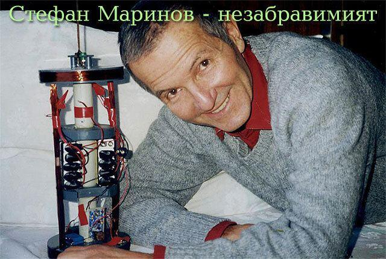

# Stefan Marinov
Bulgarian physicist working on perpetual motion and unconventional electromagnetic theories, fell from the staircase of the University of Graz library in Austria under disputed circumstances.

| Field | Details |
|-------|---------|
| **Full Name** | Stefan Marinov |
| **Born** | February 1, 1931 |
| **Died** | July 15, 1997 |
| **Age at Death** | 66 |
| **Location of Death** | University of Graz, Graz, Austria |
| **Cause of Death** | Fall from external emergency staircase of library building |
| **Official Ruling** | Suicide |
| **Category** | Physicist / Scientist |

## Assessment: SUSPICIOUS

Stefan Marinov's death was officially ruled a suicide — police stated he jumped from the external emergency staircase of the University of Graz library. Suicide notes were reportedly found. However, several circumstances raise questions: there was no news release about his death; despite Marinov leaving letters requesting that specific people be immediately notified, police did not act on these requests; his son Marin Marinov — who was Deputy Minister of Industry of Bulgaria at the time — was not informed for at least two weeks; and Russian quantum physicist Lev Sapogin, who knew Marinov and was planning to visit him, claimed that Marinov "was thrown out of the window by unknown people."

## Circumstances of Death

On July 15, 1997, Stefan Marinov died after falling from the external emergency staircase of the library building (Bibliotheque) of the University of Graz in Austria. Police concluded he had killed himself by jumping.

Several letters were reportedly found at the scene, apparently signed by Marinov, requesting that certain people be immediately notified of his death. However, the police did not act on these requests.

### Delayed Notification

Marinov's son, Marin Marinov, was at the time the Deputy Minister of Industry of Bulgaria. Despite his prominence and despite Marinov's written requests for notification, Marin was not officially informed of his father's death for at least two weeks. The first notification came informally from Panos Pappas, a friend and fellow physicist, who contacted Marin Marinov in Sofia on July 31, 1997 — sixteen days after the death.

### No News Release

There was no public news release about Marinov's death. For a physicist who had been a controversial but publicly active figure — publishing his own journal, writing to major physics publications, and corresponding with scientists worldwide — the absence of any official announcement was unusual.

## Background

### Scientific Work

Stefan Marinov was a Bulgarian-born physicist, researcher, writer, and lecturer who spent much of his career challenging mainstream physics. His key areas of work included:

- **Anti-relativistic experiments:** Marinov claimed to have experimentally disproved aspects of Einstein's theory of special relativity. Using arrangements of coupled mirrors and coupled shutters, he reported in 1974 that he had measured an anisotropy in the velocity of light — a result that, if valid, would contradict a foundational assumption of relativity.
- **Perpetual motion research:** Later in his career, Marinov openly promoted the possibility of perpetual motion machines and free energy devices, positions that placed him firmly outside mainstream physics.
- **Deutsche Physik journal:** Marinov self-published a journal called *Deutsche Physik*, through which he disseminated his experimental results and theoretical arguments.
- **The Siberian Coliu:** In the last issue of *Deutsche Physik* (Issue 21, 1997), Marinov published experimental results that actually disproved his own perpetual motion claims — specifically, that a machine he had constructed called the "Siberian Coliu" did not function as a perpetual motion device.

### Possible Motive for Suicide

According to Wikipedia, Marinov was "devastated by the negative results" of his own experiments disproving the Siberian Coliu as a perpetual motion machine. This has been cited as a possible motive for suicide — that his life's work on unconventional physics had been contradicted by his own experiments.

### Possible Motive for Murder

Marinov's supporters point out that even if some of his claims were wrong, he had been actively challenging powerful scientific institutions for decades and had been working on electromagnetic devices that, if functional, could threaten the energy establishment. His unconventional experiments and persistent public challenges to mainstream physics made him enemies in the scientific community.

## Why This Death Possibly Raises Questions

- **Lev Sapogin's claim:** Russian quantum physicist Lev Sapogin, who personally knew Marinov and was planning to visit him in Austria, stated unequivocally that Marinov "was thrown out of the window by unknown people"
- **No news release:** The complete absence of any public announcement about the death of a publicly active and internationally known physicist is unusual
- **Police ignored notification requests:** Despite Marinov leaving explicit written requests for specific people to be notified, police did not follow through on these requests
- **Son not notified for two weeks:** Marin Marinov, Deputy Minister of Industry of Bulgaria, was not informed of his father's death for sixteen days — and then only informally through a friend, not through official channels
- **Suicide notes versus the claim of defenestration:** The presence of suicide notes could indicate genuine suicide, or could have been planted to cover a murder staged as suicide
- **Timing with negative results:** While the publication of negative experimental results is cited as a motive for suicide, some have questioned whether someone devastated enough to kill himself would simultaneously leave careful letters requesting specific notifications

## The Counterargument

- Suicide notes were found at the scene, reportedly in Marinov's handwriting
- Marinov had just published results disproving his own perpetual motion device, which could have caused genuine despair
- Marinov's scientific claims were largely rejected by mainstream physics, and his career had been characterized by frustration and marginalization
- Lev Sapogin's claim of murder is a secondhand assertion without presented physical evidence
- The police failure to notify his son could reflect bureaucratic incompetence rather than conspiracy

## See Also

- [Eugene Mallove](Eugene_Mallove.md) — Cold fusion advocate beaten to death
- [Arie DeGeus](Arie_DeGeus.md) — Clean energy inventor who died of heart failure
- [Stanley Meyer](Stanley_Meyer.md) — Water fuel cell inventor who died suddenly
- [Bruce DePalma](Bruce_DePalma.md) — N-Machine inventor who died weeks before testing
- [Stefan Marinov (UAP Deaths project)](/uaps/Details/Stefan_Marinov) — Parallel profile in UAP Deaths project

## Other Shocking Stories

- [John Bedini](John_Bedini.md): Died suddenly — four hours after his brother also died. Free energy inventor. He was 67.
- [John Kanzius](John_Kanzius.md): Discovered radio waves could split salt water into hydrogen fuel. Died before commercializing.
- [Jaime Gustitus](Jaime_Gustitus.md): Top Secret/SCI cleared AFRL analyst at Wright-Patterson. Found dead at 28. No public cause given.
- [Floyd Sweet](Floyd_Sweet.md): Told by phone: "It is not nice to fool Mother Nature." His device went silent after.

## Sources

- [Stefan Marinov — Wikipedia](https://en.wikipedia.org/wiki/Stefan_Marinov)
- [Stefan Marinov — Natural Philosophy Wiki](https://wiki.naturalphilosophy.org/index.php?title=Stefan_Marinov)
- [Stefan Marinov — In Memoriam (Last Will and Testament) — Padrak.com](http://www.padrak.com/ine/NEN_5_5_2.html)
- [Update on Stefan Marinov's Death — Emails from Panos Pappas](http://www.padrak.com/ine/PAPPAS_SM.html)
- [Perpetual Motion in the 21st Century: Harassment and Premature Deaths 1989–2004](https://perpetualmotion21.blogspot.com/2015/08/harassment-and-premature-deaths-1989_22.html)
- [Stefan Marinov — Alchetron](https://alchetron.com/Stefan-Marinov)

*This information was built by Grok and Claude AI research.*

**Status:** Deceased (1997)
