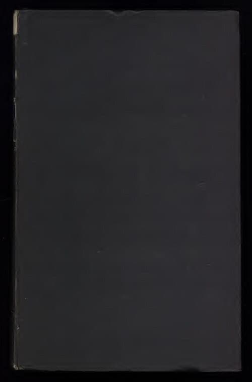

# Trevor James Constable
New Zealand-born merchant marine officer, orgone energy researcher, and etheric weather engineer who spent decades developing and demonstrating Reich-inspired weather modification technology at sea.

| Field | Details |
|-------|---------|
| **Full Name** | Trevor James Constable |
| **Born** | September 17, 1925, Wellington, New Zealand |
| **Died** | March 31, 2016 |
| **Age at Death** | 90 |
| **Location of Death** | San Pedro (Torrance area), California, USA |
| **Cause of Death** | Not publicly disclosed — natural causes at age 90 |
| **Official Ruling** | Natural death |
| **Category** | Energy Researcher |

## Assessment: Suppressed — Career Marginalized

Constable died at 90 of apparently natural causes. His death is not suspicious. However, his work was systematically marginalized by mainstream science and viewed with skepticism even within orgonomy circles. His mentor [Wilhelm Reich](Wilhelm_Reich.mdx) was imprisoned and had six tons of books burned by federal court order — the only government-sanctioned book burning in U.S. history. Constable's etheric weather engineering claims were never tested or validated by mainstream institutions.

## Background

### Merchant Marine Career

Constable enlisted in the Merchant Marines at age 17. He served 31 years at sea, 26 of them as a Radio Electronics Officer in the U.S. Merchant Marine. He spent nearly two decades as Communications Officer aboard the SS Maui, flagship of the Matson Navigation Company, completing more than 300 crossings of the North Pacific. It was aboard these ships that he conducted thousands of weather engineering experiments over the open ocean.

### Etheric Rain Engineering

Beginning in 1968, Constable developed what he called "Etheric Rain Engineering" — using geometric orgone accumulators (simple geometric instruments with no radiation or chemicals) to allegedly engineer rainfall. He claimed to have brought down "billions of tons of water" during his 14-year tenure aboard the SS Maui. His approach used biogeometric forms and phi geometry to directly access what he called "the etheric continuum."

His work drew from three primary influences:
- **[Wilhelm Reich](Wilhelm_Reich.mdx)** — Constable built upon Reich's orgone energy cloudbuster work, expanding and evolving the technology
- **Rudolf Steiner** — He synthesized Steiner's etheric sciences with Reich's orgone concepts
- **Ruth Drown** — He incorporated Drown's radionics theories

In 1991, Constable reportedly worked with the local Malaccan government (Malaysia) on a project to fill the Durian Tunggal Dam using his rain-making technology.

### Sky Creatures Theory

Constable also developed a theory that many UFOs were actually enormous amoeba-like living organisms inhabiting Earth's atmosphere, propelled by orgonic energy. He photographed with ultraviolet and infrared lenses and presented the resulting images as evidence of these "sky creatures" — invisible to the naked eye.

### Aviation History Career

Constable had a parallel career as a prolific WWII aviation historian, co-authoring multiple well-regarded books with Colonel Raymond F. Toliver (1914–2006). Their book *Fighter Aces of the USA* became required reading at the Air Force Academy.

## Key Books

**Alternative Science / UFO Works:**
- *They Live in the Sky!* (1958, as "Trevor James") — his first book on etheric biology and UFOs
- *The Cosmic Pulse of Life: The Revolutionary Biological Power Behind UFOs* (1976) — magnum opus
- *Sky Creatures, Living UFOs* (1976) — Pocket Books/Simon & Schuster edition
- *Loom of the Future: The Weather Engineering Work of Trevor James Constable* (1994) — book-length interview with 130+ photographs
- *Hidden History, Rain Engineering and UFO Reality*

**WWII Aviation History (with Raymond F. Toliver):**
- *Horrido! Fighter Aces of the Luftwaffe* (1968)
- *The Blond Knight of Germany: A Biography of Erich Hartmann* (1970)
- *Fighter Aces of the USA* (1996)
- *Fighter General: The Life of General Adolf Galland* (1999)

## Why This Person Matters

- Constable conducted what may be the most extensive experimental program in orgone-based weather engineering — thousands of experiments over decades at sea
- His mentor [Wilhelm Reich](Wilhelm_Reich.mdx) was imprisoned and had books burned; Constable's work represents the continuation of that suppressed tradition
- His etheric energy concepts overlap with zero-point energy theory — he described orgone as "a mass-free, all pervading energy, characterized as free energy awaiting humanity's enlightened advancements"
- His work was marginalized by both mainstream science and by some within the Reich community itself

## The Counterargument

- Constable died at age 90 of apparently natural causes — there is nothing suspicious about his death
- Orgone energy has never been detected, measured, or validated by any mainstream scientific instrument or peer-reviewed experiment; the theoretical basis for Constable's weather engineering claims does not exist in accepted physics
- His "etheric rain engineering" experiments were conducted without controls, without independent verification, and without any mechanism to distinguish his claimed effects from normal weather variability
- Even within the Wilhelm Reich community, Constable's extensions of orgone theory were viewed with skepticism, suggesting his claims went beyond what even sympathetic practitioners could accept
- His parallel career as a respected WWII aviation historian demonstrates that institutional marginalization was specific to his orgone claims, not a blanket suppression of his person
- Career marginalization is the expected professional outcome for researchers making extraordinary claims without providing reproducible evidence — it does not require a conspiracy to explain

## See Also

- [Wilhelm Reich](Wilhelm_Reich.mdx) — Constable's primary influence; imprisoned and died in federal custody
- [Thomas Henry Moray](Thomas_Henry_Moray.mdx) — Radiant energy inventor, also claimed access to a pervasive field energy
- [Thomas Townsend Brown](Thomas_Townsend_Brown.mdx) — Electrogravitics researcher whose work was classified

## Other Shocking Stories

- [Ning Li](Ning_Li.mdx): Published groundbreaking anti-gravity research, got DOD funding and top secret clearance, then vanished completely.
- [Thomas Henry Moray](Thomas_Henry_Moray.mdx): Shot, wounded, lab ransacked. His own assistant destroyed the radiant energy device with an ax.
- [Charles Nelson Pogue](Charles_Nelson_Pogue.mdx): Demonstrated 200+ MPG carburetor in 1933. Lab burned down. Bought out. Technology buried.
- [Robert Bass](Robert_Bass.mdx): Rhodes Scholar physicist. Three associates in his nuclear transmutation group allegedly assassinated.

## Social Media Note

Some social media posts have incorrectly stated that Constable "disappeared in the 1970s after challenging oil interests with weather control tech" (X.com @ErinnFL, July 28, 2025). This is inaccurate — Constable continued his work for decades after the 1970s, authored multiple books, and died of natural causes at age 90 in 2016 in California. He was marginalized by mainstream science but did not disappear.

## Sources

- [Trevor James Constable — Wikipedia](https://en.wikipedia.org/wiki/Trevor_James_Constable)
- [Trevor Constable Obituary — Legacy.com / Daily Breeze](https://www.legacy.com/us/obituaries/dailybreeze/name/trevor-constable-obituary?id=16255061)
- [Tribute to Trevor James Constable 1925–2016 — Thomas Joseph Brown](https://thomasbrown.org/trevor-james-constable/)
- [A Tribute to Trevor James Constable — Aether Force](https://www.aetherforce.energy/a-tribute-to-trevor-james-constable-by-thomas-joseph-brown/)
- [Etheric Rain Engineering — rainengineering.com](https://rainengineering.com/)
- [Trevor J. Constable: Etheric Weather Control — Borderland Sciences](https://borderlandsciences.org/oldsite/weathercontrol.html)
- [UFOs, MIB, the Occult, and Trevor James Constable — Mysterious Universe](https://mysteriousuniverse.org/2016/04/ufos-mib-the-occult-and-trevor-james-constable/)

*This information was built by Grok and Claude AI research.*

**Status:** Deceased (2016)
