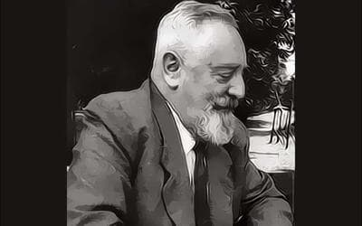

# Viktor Schauberger
Austrian forester and inventor who developed "implosion" vortex energy technology, was forced to work on flying disc designs during WWII, then was brought to the United States in 1958 where he was coerced into signing over all rights to his work — and died five days after returning to Austria.

| Field | Details |
|-------|---------|
| **Full Name** | Viktor Schauberger |
| **Born** | June 30, 1885 |
| **Died** | September 25, 1958 |
| **Age at Death** | 73 |
| **Location of Death** | Linz, Austria |
| **Cause of Death** | Not publicly specified (described as dying "a broken man") |
| **Official Ruling** | Natural causes |
| **Category** | Energy Inventor |

## Assessment: SUPPRESSED — DIED DAYS AFTER SIGNING AWAY RIGHTS

Viktor Schauberger spent decades developing theories of "implosion" energy — based on vortex dynamics observed in natural water systems — which he believed could produce energy far more efficiently than conventional "explosion"-based technologies. His implosion technology was never independently verified by mainstream science. However, the documented circumstances of his final months are striking: he was brought to the United States, held for three months, coerced into signing an agreement that transferred all rights to his work and forbade him from continuing implosion research, had all his documents and models confiscated, and then died five days after returning home to Austria. His son Walter later described him as having returned "a very disillusioned man."

## Circumstances of Death

In June 1958, Viktor Schauberger — then 73 years old — traveled to the United States at the invitation of Karl Gerchsheimer, an Austrian-born American, and Robert Donner, reportedly a wealthy Texas financier. They had promised Schauberger funding and support to develop his implosion technology commercially.

Schauberger spent approximately three months in the United States, primarily in Texas. According to accounts from his son Walter and biographers, the trip quickly turned sour. Schauberger reportedly found himself isolated, unable to communicate effectively in English, and increasingly pressured to sign legal documents he did not fully understand.

Near the end of his stay, Schauberger was presented with a comprehensive agreement. Under duress — according to his family's account — he signed a document that transferred all rights to his inventions, patents, and research to a consortium. The agreement also reportedly prohibited him from conducting any further research into implosion technology. All of his documents, models, prototypes, and equipment were confiscated and remained in the United States.

Schauberger returned to Austria on September 20, 1958. He arrived home in Linz broken in spirit and health. Five days later, on September 25, 1958, he died. His son Walter later said his father had told him: "They took everything from me. Everything. I don't even own myself."

## Background

### The Forester and Water Observer

Viktor Schauberger came from a long line of Austrian foresters. His deep observation of natural water systems — mountain streams, river currents, and vortex patterns — led him to develop unconventional theories about energy and motion. He believed that nature operated primarily through "implosion" (inward-spiraling, centripetal motion) rather than "explosion" (outward-expanding, centrifugal motion), and that human technology had taken the wrong path by relying on explosion-based engines.

In the 1920s and 1930s, Schauberger designed innovative log flumes that could transport heavy logs through waterways that conventional engineering said were too shallow or turbulent. These flumes worked, earning him recognition and contracts from the Austrian government.

### Wartime Work Under Duress

During World War II, Schauberger was reportedly conscripted by the Nazi regime to work on advanced propulsion projects. According to multiple accounts, he was brought to the Mauthausen concentration camp complex, where he was forced to work on flying disc designs using implosion-based propulsion. Camp inmates were allegedly assigned as his laborers.

Schauberger later stated that he was coerced into this work under threat to his life and the lives of his family. The details and outcomes of his wartime research remain disputed — some biographers claim he successfully built a working prototype; others argue the claims are exaggerated or unverifiable.

After the war, Schauberger's work attracted attention from Allied intelligence services. Some of his equipment and documentation were reportedly seized by American forces.

### Implosion Technology Claims

Schauberger's central claim was that vortex-based implosion devices could produce energy with far greater efficiency than conventional engines. He designed several devices, including:

- **Repulsine** — A turbine-like device that used centripetal vortex motion, sometimes described as a potential flying disc propulsion system
- **Trout turbine** — Named for his observation that trout could remain stationary in fast-flowing streams, this device reportedly used vortex dynamics to generate power from water flow
- **Water purification systems** — Devices using vortex motion to restructure and energize water

None of these devices were ever validated through independent, controlled scientific testing.

### The American Trip

The 1958 trip to the United States was orchestrated by Karl Gerchsheimer and Robert Donner. Gerchsheimer, who spoke both German and English, served as intermediary. The stated purpose was to commercialize Schauberger's technology with American investment.

According to Schauberger's letters and his son's testimony, the reality was very different from what had been promised. Schauberger found himself increasingly isolated and pressured. The legal agreement he ultimately signed effectively stripped him of control over his entire body of work.

## Why This Death Possibly Raises Questions

- **Coerced signing:** Schauberger was reportedly pressured into signing away all rights to his life's work under conditions where he could not fully understand the English-language legal documents
- **Total confiscation:** All documents, models, prototypes, and equipment were taken from him and remained in the United States
- **Research ban:** The agreement reportedly prohibited Schauberger from conducting any further research into implosion technology — an extraordinary restriction on a scientist's freedom
- **Rapid death:** Schauberger died just five days after returning to Austria, suggesting either severe physical decline during his American stay or extreme psychological trauma
- **Pattern of suppression:** Schauberger's experience mirrors other cases where inventors with unconventional energy claims were brought to the United States, had their work confiscated, and were silenced — similar to what happened to [Nikola Tesla](Nikola_Tesla.md)'s papers after his death
- **Who benefited:** The consortium that obtained Schauberger's rights, documents, and devices has never publicly demonstrated or released any of his technology
- **Wartime intelligence interest:** The fact that both Nazi Germany and Allied intelligence services took interest in Schauberger's work suggests his ideas were taken more seriously by military and intelligence organizations than by mainstream science

## The Counterargument

- Schauberger was 73 years old at the time of his death — dying at that age, while sudden, is not medically extraordinary
- His implosion technology was never independently verified and may not have worked as claimed
- The stress of international travel, legal disputes, and business negotiations could explain his rapid decline without invoking foul play
- Schauberger may have willingly signed the agreement and later regretted it — coercion is alleged by family members but not independently documented
- No autopsy or forensic evidence suggests anything other than natural death

## Key Quotes from Media Coverage

> "They took everything from me. Everything. I don't even own myself."
> — **Viktor Schauberger**, to his son Walter, after returning to Austria from the United States, September 1958 — five days before his death

> His son Walter later described him as having returned "a very disillusioned man."
> — **Walter Schauberger**, describing his father's condition upon returning from the United States

> Schauberger later stated that he was coerced into this work under threat to his life and the lives of his family.
> — Account of Schauberger's wartime forced labor on flying disc designs at the Mauthausen concentration camp complex

## See Also

- [Nikola Tesla](Nikola_Tesla.md) — Inventor whose papers were seized by the FBI and Office of Alien Property after his death
- [Stanley Meyer](Stanley_Meyer.md) — Water fuel cell inventor who died suddenly in 1998
- [Thomas Henry Moray](Thomas_Henry_Moray.md) — Radiant energy inventor subjected to repeated suppression
- [George Taylor Fulford](George_Taylor_Fulford.md) — Major GE shareholder killed in a car crash one week after announcing his intention to fund Tesla's wireless energy project; like Schauberger, his death ended financial support for revolutionary energy technology
- [Justin Christofleau](Justin_Christofleau.md) — French electroculture inventor whose technology harnessing atmospheric electromagnetic energy was suppressed by the fertilizer industry; like Schauberger, he worked with natural forces that the scientific establishment dismissed

## Other Shocking Stories

- [Robert Bass](Robert_Bass.md): Rhodes Scholar physicist. Three associates in his nuclear transmutation group allegedly assassinated.
- [Bill Yelon](Bill_Yelon.md): Died suddenly in 2018 shortly after announcing his over-unity device was ready for market.
- [Frederick Hochstetter](Frederick_Hochstetter.md): Debunked Hendershot's fuelless motor publicly. Died as the sole passenger fatality in a plane crash.
- [Paulo Correa](Paulo_Correa.md): Holds 12 patents for overunity energy device. Chief advocate Eugene Mallove was beaten to death.

## Sources

- [Viktor Schauberger — Wikipedia](https://en.wikipedia.org/wiki/Viktor_Schauberger)
- [Living Energies by Callum Coats — Comprehensive biography and technical overview of Schauberger's work](https://www.amazon.com/Living-Energies-Callum-Coats/dp/0717133079)
- [Viktor Schauberger — A Life of Learning from Nature — energyh3o2.com](https://energyh3o2.com/)
- [Schauberger and Living Water — alivewater.com](https://alivewater.com/)
- [The Schauberger Archives — PKS (Pythagoras Kepler System)](https://www.pks.or.at/)

*This information was built by Grok and Claude AI research.*

**Status:** Deceased (1958)
