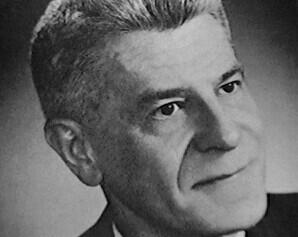

# Wilbert B. Smith
Canadian government engineer who ran Project Magnet -- Canada's official program to investigate whether Earth's magnetic field could be exploited as a propulsion and energy source, possibly inspired by UFO propulsion systems. Died of cancer at 52 after instructing his wife to hide all research files.

| Field | Details |
|-------|---------|
| **Full Name** | Wilbert Brockhouse Smith |
| **Born** | February 17, 1910 |
| **Died** | December 27, 1962 |
| **Age at Death** | 52 |
| **Location of Death** | Ottawa, Ontario, Canada |
| **Cause of Death** | Cancer |
| **Official Ruling** | Natural causes |
| **Category** | Energy Researcher / Physicist |

## Assessment: MODERATE SUSPICION

Smith's death from cancer at 52 falls within a documented pattern of researchers investigating exotic energy and propulsion dying of fast-acting cancers. The most suspicious element is his deathbed instruction to his wife to hide all his research files, suggesting he feared seizure of his materials. Within days of his death, intelligence representatives from three nations reportedly approached his wife seeking the files. His research focused directly on magnetic propulsion and energy extraction -- the core subject matter of this project.

## Circumstances of Death

Wilbert Smith died of cancer on December 27, 1962. Before his death, Smith instructed his wife to hide all his research files and sensitive documents, warning that the material could "get into the wrong hands."

According to multiple sources, shortly after Smith's death, representatives from the Russian, American, and Canadian governments approached his wife seeking access to his files and research materials. The fact that three governments moved quickly to obtain his research underscores the significance of what he was working on.

## Background

Smith was a senior radio engineer for Transport Canada's Broadcast and Measurements Section, holding degrees in electrical engineering from the University of British Columbia. He was the chief engineer for radio station CJOR in Vancouver before joining the federal government.

### Project Magnet -- Magnetic Energy and Propulsion Research

In December 1950, Smith established **Project Magnet**, a Canadian government program formally approved by the Department of Transport. The project's stated goal was to investigate whether Earth's magnetic field could be exploited as a propulsion and energy source -- a research question directly inspired by the possibility that UFO propulsion systems operated on magnetic principles.

This placed Smith at the intersection of two critical fields: advanced energy extraction (harvesting energy from Earth's magnetic field) and exotic propulsion (using magnetism for propulsion rather than conventional thrust). Both are core areas of suppressed energy research.

### Geomagnetic Energy Research

In October 1952, Smith set up a detection observatory at Shirley's Bay outside Ottawa, equipped with instruments to detect and measure magnetic disturbances. The observatory was designed to investigate anomalous magnetic phenomena that might reveal how magnetic fields could be harnessed for energy and propulsion.

Smith's research led him to conclude that the craft he was studying almost certainly operated by manipulating magnetism -- a finding with direct implications for energy technology. If magnetism could be manipulated for propulsion, the same principles could potentially be applied to energy generation, fundamentally challenging the petroleum and nuclear energy paradigms.

### Classified U.S. Connections

A classified Canadian government memo from Smith, dated November 21, 1950, stated that "flying saucers exist" and that "their modus operandi is unknown but concentrated effort is being made by a small group headed by Dr. Vannevar Bush." This reference connected Smith's research to what was allegedly the most classified advanced technology program in the United States.

Smith claimed to have received a fragment of recovered exotic material from the U.S. Navy, which he subjected to metallurgical analysis. The composition and properties of this material were reportedly anomalous and consistent with technology operating on non-conventional energy principles.

## Why This Death Possibly Raises Questions

- Death from cancer at 52, part of a documented pattern of premature cancer deaths among researchers investigating exotic energy and propulsion
- His deathbed instruction to hide all research files suggests he anticipated attempts to seize his work on magnetic energy and propulsion
- Intelligence representatives from three countries reportedly approached his wife within days of his death, confirming the perceived value of his magnetic energy research
- He was running the only government-sanctioned program investigating magnetic field exploitation for energy and propulsion
- His 1950 classified memo confirmed the existence of a U.S. program studying the same propulsion physics under Vannevar Bush
- His research directly investigated whether Earth's magnetic field could serve as an energy source -- a finding that would disrupt established energy industries
- However, cancer at 52, while premature, is not exceptionally rare, and no evidence of deliberately induced illness has been presented

## The Counterargument

- Cancer at age 52 is unfortunate but not statistically extraordinary -- many people develop cancer at this age without any connection to their work
- No evidence has been presented that Smith's cancer was deliberately induced
- The claim about three governments approaching his wife comes from alternative research sources and has not been independently verified through government records
- Smith's Project Magnet was officially closed in 1954 without producing conclusive results about magnetic propulsion or energy extraction
- His conclusions about magnetic propulsion were not adopted by the Canadian government or mainstream physics
- The "cancer cluster" among UFO/energy researchers, while noted by investigators, has not been established as statistically significant compared to baseline cancer rates

## Key Quotes from Media Coverage

> "Before his death from cancer, Mr. Smith asked his wife to hide all his research and sensitive files, as he was afraid that it would get into the wrong hands."
> -- **Mysteries of Canada**

> "Flying saucers exist. Their modus operandi is unknown but concentrated effort is being made by a small group headed by Dr. Vannevar Bush."
> -- **Wilbert Smith**, classified Canadian government memo, November 21, 1950

## See Also

- [Wilbert Smith (UAP profile)](/uaps/Details/Wilbert_Smith) -- Full profile emphasizing the UAP/disclosure angle
- [Thomas Townsend Brown](Thomas_Townsend_Brown.md) -- Electrogravitics researcher whose work on electromagnetic propulsion parallels Smith's magnetic field research
- [Nikola Tesla](Nikola_Tesla.md) -- Pioneer of electromagnetic energy whose papers were seized by the government after his death
- [Thomas Henry Moray](Thomas_Henry_Moray.md) -- Radiant energy researcher who was shot at and had his device destroyed
- [Lester Hendershot](Lester_Hendershot.md) -- Inventor of a magnetic energy device who was allegedly threatened and discredited

## Other Shocking Stories

- [Stanley Meyer](Stanley_Meyer.md): Inventor of water fuel cell collapsed at dinner with investors -- last words: "They poisoned me."
- [Nikola Tesla](Nikola_Tesla.md): FBI seized Tesla's papers within hours of death -- many remain unaccounted for decades later.
- [Eugene Mallove](Eugene_Mallove.md): Chief cold fusion advocate beaten to death with 32 lacerations days before major media appearance.
- [Rory Johnson](Rory_Johnson.md): DOE issued "grab order" for his magnetic motor -- died mysteriously after relocating lab.

## Sources

- [Wilbert Brockhouse Smith -- Wikipedia](https://en.wikipedia.org/wiki/Wilbert_Brockhouse_Smith)
- [Project Magnet -- Wilbert Smith -- Canadian UFO Researcher -- Mysteries of Canada](https://mysteriesofcanada.com/canada/wilbert-smith/)
- [Project Magnet (UFO) -- Wikipedia](https://en.wikipedia.org/wiki/Project_Magnet_(UFO))
- [Canada's Project Magnet/Wilbert Smith -- Enigma Labs](https://enigmalabs.io/library/495daab5-7372-4e04-90a1-483c964819f5)
- [Wilbert Smith and the Canadian UFO Research -- Angelic Visions](https://comfortinaninstant.typepad.com/angelic_visions/2018/01/wilbert-smith-and-the-canadian-ufo-research.html)

*This information was built by Grok and Claude AI research.*
