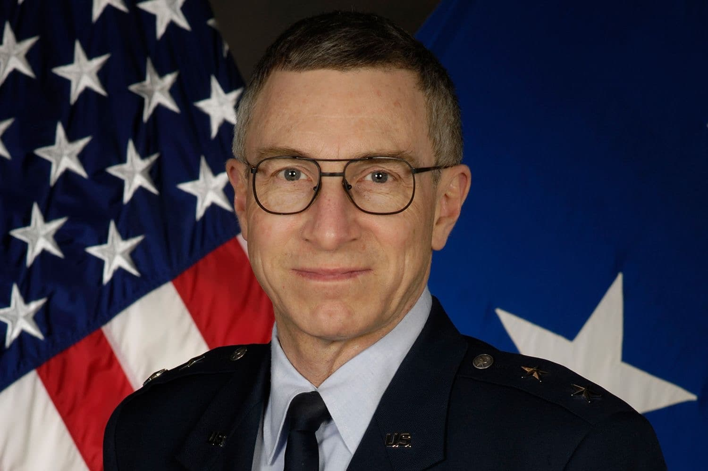

# Major General William Neil McCasland (USAF, Ret.)
Former commander of the Air Force Research Laboratory at Wright-Patterson AFB. Executive secretary of the Special Access Program Oversight Committee (SAPOC) — the body with full purview of every SAP in the Department of Defense. Named in WikiLeaks Podesta emails coordinating UAP disclosure meeting with Clinton campaign and Lockheed Martin Skunk Works head. Vanished from his Albuquerque home on February 27, 2026. His phone, glasses, and wearable devices were left behind. FBI searching. His disappearance occurred eight months after the inventor of the superalloy his budget funded — [Monica Jacinto Reza](/uaps/Details/Monica_Jacinto_Reza/) — vanished from a ridgeline 800 miles away.

| Field | Details |
|-------|---------|
| **Full Name** | William Neil McCasland |
| **Born** | c. 1957–1958 |
| **Status** | **MISSING** since February 27, 2026 |
| **Last Seen** | Albuquerque, New Mexico, approximately 11:00 a.m., February 27, 2026 |
| **Category** | Military / Defense Scientist / UAP Connection / AFRL Commander |

## Assessment: MISSING — AT RISK — NATIONAL SECURITY CRISIS

Major General William Neil McCasland vanished from his Albuquerque home on February 27, 2026. A repairman interacted with him around 10:00 a.m.; his wife returned shortly after noon to find him gone. His phone, prescription glasses, and wearable devices were left behind. Hiking boots, wallet, and a .38-caliber revolver are believed missing. The FBI, Kirtland Air Force Base, and the Bernalillo County Sheriff's Office are involved. Newsweek journalist Ross Coulthart called it a "grave national security crisis," stating McCasland holds "some of the most sensitive secrets of the United States."

McCasland is the third vertex of the Mondaloy triangle: [Dallis Hardwick](/uaps/Details/Dallis_Hardwick/) (died 2014), [Monica Jacinto Reza](/uaps/Details/Monica_Jacinto_Reza/) (vanished June 2025), McCasland (vanished February 2026). Every person who held the complete institutional memory of how Mondaloy went from a laboratory curiosity to a flight-qualified engine component has been removed from the system.

## Current Situation

### The Disappearance

On February 27, 2026, McCasland was at his home at 1701 Quail Run Court NE, Albuquerque, NM 87122 (confirmed by Bernalillo County Assessor records). A cul-de-sac in Sandia Heights where residential streets dead-end into foothills and the Cibola National Forest.

Items left behind:
- Cell phone
- Prescription glasses
- Wearable electronic devices
- Indoor clothing (he changed clothes before leaving)

Items believed missing:
- Hiking boots
- Wallet
- .38-caliber revolver with leather holster

He was gone in under an hour — his wife left for an appointment at approximately 11:10 a.m. and returned at 12:04 p.m. to find him missing. BCSO now believes McCasland left on foot. They are asking anyone in the Sandia Mountains on February 27–28 to check GoPro footage.

### Search Efforts

- **Silver Alert** issued by Bernalillo County Sheriff's Office
- **FBI Albuquerque Field Office** assisting
- **Kirtland Air Force Base** — 377th Air Base Wing activated coordination
- Dedicated **Axon evidence upload portal** built for the case
- BCSO: "utilizing all possible resources, including advanced technologies, and still considering all possible scenarios"
- **No Wireless Emergency Alert (WEA) was ever issued** — The Sentinel Network verified via FEMA IPAWS/PBS WARN logs that no mobile push notification was sent, despite Silver Alerts routinely triggering WEAs in New Mexico. A local resident confirmed no push notification was received
- As of March 18, 2026, he remains missing

### Physical Description

- Age: approximately 68
- Height: 5'11"
- White hair, blue eyes

### Medical Status

The Silver Alert cited medical concerns. However, New Mexico's Silver Alert law was rewritten in 2025 (House Bill 197, signed June 20, 2025). Under the new standard, the reporting party's belief that someone shows signs of cognitive decline is legally sufficient — no formal diagnosis or police verification required. One week before he vanished, McCasland completed a 60-mile bike ride. His trail running community described him as "formidably fit." Australian journalist T.W. Burrows claims sources told him McCasland "was in full possession of his faculties" and that the Silver Alert was triggered because "he has certain medications he is required to take."

## Background

### Military Career (1979–2013)

McCasland served 34 years in the United States Air Force. His father, Lt. William H. McCasland, USAF, was killed in a military flying accident when Neil was a child.

- **B.S. in Astronautical Engineering** — U.S. Air Force Academy (1979)
- **M.S. and Ph.D. in Aerospace Engineering** — MIT (dissertation supervised by Richard Battin, designer of the Apollo guidance computer; dedicated to his late father)
- Degree from **Harvard Kennedy School of Government**
- **Chief Engineer** — DOD Global Positioning System (GPS) program
- **System Program Director** — Space Based Laser Project Office
- **Director of Special Programs** — Office of the Under Secretary of Defense for Acquisition, Technology, and Logistics
- **Executive Secretary, Special Access Program Oversight Committee (SAPOC)** — the body with full purview of every SAP in the Department of Defense. Not an advisory board — the executive secretary runs it
- **Director of Space Acquisition** — Office of the Secretary of the Air Force
- **Commander** — Phillips Research Site, Kirtland AFB, New Mexico (AFRL's Directed Energy Directorate)
- **Director** — AFRL Space Vehicles Directorate
- **Commander, Air Force Research Laboratory (AFRL), Wright-Patterson AFB, Ohio (2011–2013)** — overseeing $4.4 billion portfolio in science, technology, and customer-funded R&D

### Post-Retirement (2013–2026)

McCasland did not retire in any meaningful sense. He privatized:

- **Director of Technology** — Applied Technology Associates (ATA), Albuquerque. Precision sensing for ground, air, and space applications. ATA was absorbed into **BlueHalo** (directed energy, quantum systems, space warfare, missile defense), then acquired by **AeroVironment** in 2025. On March 3, 2026 — four days after McCasland disappeared — AeroVironment announced a $30 million expansion of its Albuquerque campus, creating 450 jobs focused on laser systems and space payloads
- **DBE Consulting LLC** (2021–present) — his own defense consulting firm, advising DOD and DOE clients
- **Board of Trustees** — Riverside Research (since June 2019), a not-for-profit conducting classified and unclassified research. Currently holding ~**$450 million in active defense and intelligence contracts**: $160M Defense Innovation Unit award, $135M C4 intelligence BPA, $49M NASIC geospatial/signatures intelligence contract, DARPA cybersecurity awards
- **Kirtland Partnership Committee** board — nonprofit lobbying to preserve Kirtland AFB's $7.8 billion economic footprint
- **Universities Space Research Association** board

### The Business Partner Nobody Reported

The Albuquerque Journal quoted **Dr. James Tegnelia** as "a board member of the Kirtland Partnership Committee." Every outlet ran him as a concerned community figure.

Tegnelia's actual CV: **Director of the Defense Threat Reduction Agency (DTRA)** 2005–2009 (WMD countermeasures). Acting Deputy Director of **DARPA**. VP of DOD Programs at **Sandia National Laboratories**. Chaired the **Army Science Board**. Sat on the **Defense Science Board**. Currently a research professor in Nuclear Engineering at UNM.

His LinkedIn lists his current professional affiliation as **DBE Consulting LLC** — McCasland's firm. They are business partners. No outlet reported this connection.

### Susan McCasland Wilkerson

McCasland's wife is not a civilian spouse:

- **Ph.D. in Astrophysics** — University of Arizona, 1979
- **Westinghouse Science Talent Search honoree** at age 17 (1971)
- **NASA Mission Specialist astronaut finalist** — Group 9 selection (1980), the class that produced Sally Ride
- Commissioned as USAF Lieutenant in 1980, advanced to **Lieutenant Colonel** in the Air Force Reserve
- Senior scientist at **Air Force Geophysics Laboratory**; Chief of Data Recorder Branch at Headquarters Space Division, **Defense Dissemination Program** (classified satellite imagery distribution); Director of Advanced Studies
- Member of technical staff at **TASC** (The Analytic Sciences Corporation), 1985–1993
- Program manager at **Boeing-SVS Inc.**, **FlightSafety Services**, and **Raytheon**
- Married McCasland on April 7, 1985

Susan posted on Facebook around March 7, 2026, addressing the UFO speculation by name: *"Neil does not have any special knowledge about the ET bodies and debris from the Roswell crash stored at Wright-Patt."* She confirmed he "had access to some highly classified programs" but said he's had "only very commonly held clearances since" retirement.

WikiLeaks email ID 2635 shows Susan **independently accepted** the same "DeLonge/Podesta Meeting" calendar invite — from a separate email account, not CC'd on her husband's reply.

### The @TMBSPACESHIPS Account

An anonymous X account called **@TMBSPACESHIPS** ("ELECTRIC PROPULSIVE SPACECRAFT") had been posting about exotic electric propulsion and plasma physics since November 2022. Bio: "38 year Active Duty USAF PhD Engineer. AFIT/AETC/AFMC - UT/OU." 1,645 posts.

On **February 27, 2026**, the account stopped posting — approximately 30 minutes before McCasland was last seen.

The credentials are deliberately degraded (34 years not 38, MIT not UT/OU) but the technical profile matches: KC-135 flight time, hands-on plasma physics lab experience, knowledge of pulsed power and particle acceleration, deep focus on ionized helium propulsion. The account posted a hand-drawn 1998 schematic showing an observation from the cockpit of a KC-135 with a reverse-engineered propulsion component list on the back page. Attribution to McCasland: probable, not confirmed.

### UAP / WikiLeaks Connections

WikiLeaks email ID 51979 shows **McCasland himself** — writing from neilmcc79@gmail.com — emailing John Podesta directly to coordinate meeting logistics. The CC line: t.delonge@me.com (Tom DeLonge), mfisher@hillaryclinton.com (Clinton campaign), rob.f.weiss@lmco.com (**Rob Weiss, Executive VP/GM of Lockheed Martin Skunk Works, on his corporate email**), carey.mjd@gmail.com (Major General Michael Carey).

This is not DeLonge claiming things on a podcast. These are email headers showing a sitting Lockheed Skunk Works executive using his corporate email to coordinate a UAP disclosure meeting with a Clinton campaign official, the former AFRL commander, and a second Air Force general.

### The Mondaloy Connection

McCasland's $4.4 billion portfolio at AFRL funded the programs that depended on [Monica Jacinto Reza](/uaps/Details/Monica_Jacinto_Reza/)'s alloy: AR1, Hydrocarbon Boost. When he took command in May 2011, [Dallis Hardwick](/uaps/Details/Dallis_Hardwick/) — Reza's co-inventor and mentor — was still one of his senior civilian scientists. All three were on the same program at the same time.

His command history extends beyond Ohio. Before AFRL headquarters, he ran the Phillips Research Site at **Kirtland AFB in New Mexico** — home of AFRL's Directed Energy Directorate. Kirtland and LANL, 100 miles apart, share joint programs in directed energy, weapons physics, and advanced materials. This is the same corridor where [Melissa Casias](/uaps/Details/Melissa_Casias/) vanished from LANL in June 2025.

## Why This Disappearance Raises Questions

- **National security crisis:** McCasland held the most sensitive positions in the Air Force's research apparatus. He was executive secretary of SAPOC — full purview of every SAP in the DOD
- **WikiLeaks exposure:** Identified by name in Podesta emails coordinating UAP disclosure with Skunk Works and the Clinton campaign
- **Left phone and glasses:** Deliberately left behind every device that could locate him
- **Mondaloy triangle:** Third of three people who held complete Mondaloy institutional memory. Hardwick (dead 2014), Reza (missing 2025), McCasland (missing 2026)
- **No WEA issued:** Despite Silver Alert, no Wireless Emergency Alert was pushed to mobile devices — unusual for a missing person search
- **Business partner misidentified:** Every news outlet quoted his DBE Consulting partner (a former DTRA director) as merely a "board member"
- **FBI, Kirtland coordination:** Response exceeds standard missing-person by every measure
- **Part of AFRL cluster:** One of nine AFRL-connected casualties in nine months
- **@TMBSPACESHIPS went silent:** An X account matching his technical profile stopped posting the same day he vanished
- **Albuquerque location:** Near Kirtland AFB, where [Eric Wang](/uaps/Details/Eric_Wang/) died in 1960 and McCasland once commanded

## The Counterargument

- McCasland is an avid outdoorsman in his late 60s with a medical condition. He may have suffered a medical emergency while hiking
- Taking a firearm in New Mexico wilderness is not unusual
- People go missing in the Sandia Mountains with some regularity
- No evidence of foul play at this time
- The disappearance may be unrelated to his military career or UAP associations

## Congressional Demands for Witness Protection

Former Congressman Matt Gaetz has publicly demanded witness protection for key UFO scientists, citing the pattern of deaths and disappearances in this cluster. Gaetz stated:

> "I would have witnesses protection for key witnesses right now. And Congress has the ability to get that done in concert with the Department of Justice."
> — **Matt Gaetz**, demanding witness protection for UFO scientists after researchers were found dead or missing

McCasland is one of five scientists whose deaths or disappearances between June 2025 and March 2026 prompted this unprecedented congressional call for protection:

- **[Monica Jacinto Reza](/uaps/Details/Monica_Jacinto_Reza/)** — Co-inventor of Mondaloy superalloy, funded under McCasland's AFRL budget. Missing since June 22, 2025. No trace found.
- **[Jason Thomas](/uaps/Details/Jason_Thomas)** — Novartis chemical biology director. Vanished December 12, 2025. Body found March 17, 2026.
- **[Nuno Loureiro](/uaps/Details/Nuno_Loureiro/)** — MIT Plasma Science and Fusion Center director. Shot and killed December 15, 2025.
- **[Carl Grillmair](/uaps/Details/Carl_Grillmair/)** — Caltech astrophysicist. Shot on his porch February 16, 2026.
- **William McCasland** (this profile) — Retired USAF Major General, AFRL commander. Missing since February 27, 2026.

The fact that a former member of Congress is calling for DOJ witness protection for scientists connected to UAP research represents an extraordinary escalation — an acknowledgment at the federal level that these deaths and disappearances may not be coincidental and that surviving witnesses may be in danger.

## See Also

- [Monica Jacinto Reza](/uaps/Details/Monica_Jacinto_Reza/) — Co-inventor of Mondaloy, AFRL-funded. Vanished June 2025
- [Dallis Hardwick](/uaps/Details/Dallis_Hardwick/) — Co-inventor of Mondaloy, AFRL Materials Directorate. Died 2014
- [Carl Grillmair](/uaps/Details/Carl_Grillmair/) — Caltech/IPAC astronomer, same institutional family as JPL. Shot dead Feb 2026
- [Melissa Casias](/uaps/Details/Melissa_Casias/) — LANL employee, vanished from NM defense corridor. June 2025
- [Jacob Prichard](/uaps/Details/Jacob_Prichard/) — AFRL Sensors Directorate, Wright-Patterson. Dead Oct 2025
- [Jaime Gustitus](/uaps/Details/Jaime_Gustitus/) — AFRL 711th HPW, TS/SCI, Wright-Patterson. Dead Oct 2025
- [Eric Wang](/uaps/Details/Eric_Wang/) — Defense scientist at Kirtland AFB, died 1960 with no stated cause
- [Ning Li](/uaps/Details/Ning_Li/) — Anti-gravity physicist, DOD-funded, disappeared from public life
- [Amy Eskridge](/uaps/Details/Amy_Eskridge/) — Anti-gravity researcher, died 2022 in Huntsville
- [William McCasland (UAP Deaths project)](/uaps/Details/William_McCasland) — Parallel profile

## Other Shocking Stories

- [John Kanzius](/uaps/Details/John_Kanzius/): Discovered radio waves could split salt water into hydrogen fuel. Died before commercializing.
- [Jaime Gustitus](/uaps/Details/Jaime_Gustitus/): Top Secret/SCI cleared AFRL analyst at Wright-Patterson. Found dead at 28. No public cause given.
- [Dimitri Petronov](/uaps/Details/Dimitri_Petronov/): Russian plasma battery inventor disappeared after demonstrating his technology to military officials.
- [Trevor Knight](/uaps/Details/Trevor_Knight/): Marconi engineer found dead of carbon monoxide. Eighth defense scientist dead in 18 months.

## Sources

- [Neil McCasland — Wikipedia](https://en.wikipedia.org/wiki/Neil_McCasland)
- [USAF Official Biography — Major General William N. McCasland](https://www.af.mil/About-Us/Biographies/Display/Article/104776/major-general-william-n-mccasland/)
- [CNN: FBI involved in search for retired Air Force general](https://www.cnn.com/2026/03/11/us/retired-air-force-general-fbi-search)
- [CBS News: Retired Air Force general still missing](https://www.cbsnews.com/news/retired-air-force-major-general-missing-new-mexico-william-neil-mccasland/)
- [Fox News: Retired Air Force general vanishes](https://www.foxnews.com/us/retired-air-force-general-vanishes-1-hour-window-from-home-gun-wallet-missing)
- [Newsweek: Disappearance is "grave national security crisis"](https://www.newsweek.com/disappearance-of-ufo-expert-is-national-security-crisis-11645230)
- [The Debrief: Disappearance of Neil McCasland](https://thedebrief.org/the-disappearance-of-neil-mccasland-authorities-continue-searching-for-missing-usaf-official-linked-to-ufo-speculations/)
- [WikiLeaks Podesta Email #3099](https://wikileaks.org/podesta-emails/emailid/3099)
- [WikiLeaks Podesta Email #51979 — McCasland to Podesta](https://wikileaks.org/podesta-emails/emailid/51979)
- [WikiLeaks Podesta Email #2635 — Susan McCasland accepts meeting](https://wikileaks.org/podesta-emails/emailid/2635)
- [The Sentinel Briefing: THE GHOST GENERAL — Every News Outlet Ran the Same Story. We Ran the Public Records. (Mar 9, 2026)](https://thesentinelnetwork.substack.com/p/the-ghost-general-every-news-outlet)
- [The Sentinel Briefing: THE DEAD DROP — An Anonymous X Account Went Silent the Day the General Vanished (Mar 11, 2026)](https://thesentinelnetwork.substack.com/p/the-dead-drop-an-anonymous-x-account)
- [The Sentinel Briefing: THE GREEN BURIAL — She Was Declared Dead Four Days After She Vanished (Mar 16, 2026)](https://thesentinelnetwork.substack.com/p/the-green-burial-she-was-declared)
- [The Sentinel Briefing: THE LONG COUNT — We Started With Two Names. The List Didn't Stop. (Mar 18, 2026)](https://thesentinelnetwork.substack.com/p/the-long-count-we-started-with-two)
- [NM House Bill 197 — Silver Alert revision](https://www.nmlegis.gov/Legislation/Legislation?Chamber=H&LegType=B&LegNo=197&year=25)

## Social Media Coverage

McCasland's disappearance has been widely discussed on X.com:

- @BowesChay (March 23, 2026) — "Retired Air Force Major General William Neil McCasland former commander overseeing very secretive projects in aerospace tech, space weapons, directed weapons and space intelligence and closely linked to UFO files. This should be a national security issue" (985 likes, 22,493 views)
- @zardoz_zed19432 (March 22, 2026) — "Retired Generals Neil McCasland went missing last month. He was top dog overseeing very secretive projects in aerospace tech, space weapons, directed weapons and space intelligence and closely linked to UFO files. This should be a national security issue. Why is it not?"
- @rogue185263 (March 22, 2026) — "UFO-Linked Defense Figures Disappear as Pattern of Deaths Raises Alarm"

*This information was built by Grok and Claude AI research.*

**Status:** Unknown (missing since February 2026)
