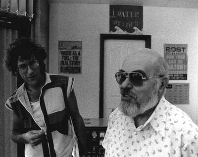

# Yull Brown

Bulgarian-born inventor of "Brown's Gas" (HHO) — a water-derived fuel demonstrated to cut through metals and neutralize radioactive waste — who died penniless despite holding valuable patents.

| Field | Details |
|-------|---------|
| **Full Name** | Yull Brown (born Ilya Velbov) |
| **Born** | May 23, 1922 |
| **Died** | May 22, 1998 |
| **Age at Death** | 75 |
| **Location of Death** | Westmead Hospital, Auburn, Australia |
| **Cause of Death** | Heart and kidney failure |
| **Official Ruling** | Natural causes |
| **Category** | Energy Inventor |

## Assessment: UNCERTAIN

Yull Brown died at 75 of organ failure, which is not inherently suspicious for a man of his age. However, the broader pattern of his life — declared an "enemy of the state" in Bulgaria, fled to Australia, demonstrated a functional water-derived fuel technology, held patents, yet died penniless with his technology never commercialized — fits the suppression pattern documented throughout this project. Whether his death itself was suspicious is unclear; what is clear is that his technology was systematically prevented from reaching the market.

## Circumstances of Death

Yull Brown died on May 22, 1998 — one day before his 76th birthday — at Westmead Hospital in Auburn, Australia. The cause was heart and kidney failure. He died in poverty despite holding patents on a technology he had demonstrated publicly for decades.

## Background

Yull Brown was born Ilya Velbov in Bulgaria in 1922. He was trained as a chemist and engineer. After being declared an "enemy of the state" by the Bulgarian communist government, he fled to Turkey and eventually settled in Australia.

In Australia, Brown developed what became known as "Brown's Gas" — a stoichiometric mixture of hydrogen and oxygen (HHO) produced by the electrolysis of water. He filed his first patent in 1974.

Brown's Gas had several remarkable demonstrated properties:
- **Metal cutting and welding** — the gas could cut through metals with a focused flame, demonstrated publicly
- **Radioactive waste neutralization** — Brown demonstrated that his gas could reduce radioactivity in nuclear waste, a claim that was witnessed by scientists and journalists
- **Clean fuel** — the gas burned cleanly with water as its only byproduct
- **Variable flame temperature** — the flame temperature changed based on the material it contacted, an unusual property not fully explained by conventional chemistry

Brown spent decades attempting to commercialize his technology. He gave public demonstrations, attracted investor interest, and held multiple patents. Despite this, no major company ever licensed or developed the technology for commercial use.

## Suppression Pattern

- Declared an "enemy of the state" in Bulgaria and forced to flee
- Despite holding patents and giving public demonstrations, his technology was never commercialized
- Investors who showed interest reportedly withdrew under pressure (details uncertain)
- Died penniless despite holding potentially valuable patents
- His demonstrations of radioactive waste neutralization, if verified, would have threatened the entire nuclear waste management industry
- The technology required only water and electricity — no fossil fuels

## Why This Death Possibly Raises Questions

- Died penniless despite holding patents on a demonstrated technology
- The technology threatened multiple industries (fossil fuels, nuclear waste management, welding/cutting)
- Was declared an enemy of the state in his home country
- Despite decades of demonstrations, no commercial adoption occurred
- The nuclear waste neutralization claim, if real, would have been worth billions
- His death eliminated the most knowledgeable advocate for the technology
- Multiple other water fuel inventors (Stanley Meyer, Daniel Dingel) also died or were prosecuted

## The Counterargument

- Heart and kidney failure at 75 is not inherently suspicious
- Brown's Gas claims have been disputed by mainstream scientists
- Electrolysis of water is well-understood and the energy input exceeds the energy output of burning the resulting gases — the laws of thermodynamics apply
- The radioactive waste neutralization claims have not been independently replicated under controlled conditions
- Some investors may have withdrawn due to legitimate scientific skepticism
- His poverty may reflect the commercial unviability of the technology rather than suppression
- Brown was a polarizing figure who made claims that alienated mainstream scientific support

## See Also

- [Stanley Meyer](/uaps/Details/Stanley_Meyer/) — Another water fuel cell inventor who died under suspicious circumstances
- [Tom Ogle](/uaps/Details/Tom_Ogle/) — Automotive fuel efficiency inventor who was killed
- [Bob Boyce](Bob_Boyce.mdx) — Hydrogen electrolysis inventor who achieved high-efficiency HHO systems using frequency-tuned electrolysis; his work on Brown's Gas-related technology directly continues the HHO research Brown pioneered
- [Daniel Dingel](Daniel_Dingel.mdx) — Filipino inventor who demonstrated a water-powered car for decades; convicted of fraud at 82 and died in custody, representing the legal suppression path for water fuel inventors

## Other Shocking Stories

- [Stanley Meyer](/uaps/Details/Stanley_Meyer/): Gasped "they poisoned me" at dinner with investors, collapsed and died in the parking lot. His water fuel cell vanished.
- [Eugene Mallove](/uaps/Details/Eugene_Mallove/): Cold fusion champion beaten to death days after announcing a breakthrough that could have transformed the energy industry.
- [Wilhelm Reich](/uaps/Details/Wilhelm_Reich/): FDA burned six tons of his books and research, then imprisoned him. He died in federal prison within a year.
- [Tom Ogle](/uaps/Details/Tom_Ogle/): Invented a 100+ MPG engine, demonstrated it on national TV, then was shot and later found dead of a drug overdose.

## Sources

- [Natural Philosophy Wiki — Yull Brown](https://wiki.naturalphilosophy.org/index.php?title=Yull_Brown)
- [Hydrox Systems — Yull Brown: The Bulgarian Innovator Who Harnessed Water to Create Fire](https://www.hydroxsystems.com/yull-brown-the-bulgarian-innovator-who-harnessed-water-to-create-fire/)
- [Foreigner.bg — The Bulgarian Inventor That Made Fire from Water](https://www.foreigner.bg/the-bulgarian-inventor-that-made-fire-from-water/)

*This information was built by Grok and Claude AI research.*

**Status:** Deceased (1998)
