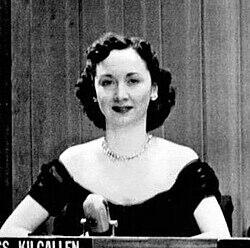

# Dorothy Kilgallen
Pioneering American journalist, syndicated columnist, and television personality on CBS's *What's My Line?*, who investigated both the JFK assassination and UFO phenomena, and whose death at age 52 from a combination of barbiturates and alcohol was ruled "circumstances undetermined" by the New York City medical examiner.

| Field | Details |
|-------|---------|
| **Full Name** | Dorothy Mae Kilgallen |
| **Born** | July 3, 1913, Chicago, Illinois |
| **Died** | November 8, 1965 (age 52), Manhattan, New York |
| **Role** | Journalist / Syndicated Columnist / Television Panelist / Author |
| **Platform** | New York Journal-American, International News Service (INS), CBS *What's My Line?*, WOR Radio |
| **Notable Works** | "Voice of Broadway" syndicated column, *What's My Line?* panelist (1950-1965), 1955 UFO report from London, JFK assassination investigation |

## Biography

Dorothy Mae Kilgallen was born on July 3, 1913, in Chicago, Illinois, the eldest daughter of James Lawrence Kilgallen, a prominent journalist with the Hearst Corporation's International News Service, and Mae Ahern Kilgallen. She grew up in Chicago, Indianapolis, and Brooklyn, New York, following her father's career. She graduated from Erasmus Hall High School in Brooklyn in 1930 and briefly attended the College of New Rochelle before leaving to pursue journalism full-time.

Kilgallen began her career at the New York Evening Journal shortly before her 18th birthday. By age 20, she had earned substantial stature at the paper. In 1936, she won national acclaim for her "Girl Around the World" series, chronicling a competing round-the-world race by air that placed her among the most recognized reporters in America.

She married actor and producer Richard Kollmar on April 6, 1940. The couple had three children and hosted the popular radio program "Breakfast with Dorothy and Dick" on WOR from their Park Avenue apartment beginning in 1945.

Kilgallen became a panelist on CBS's *What's My Line?* beginning with its first broadcast on February 2, 1950, appearing nearly every Sunday evening for 15 years. Her syndicated column "Voice of Broadway" reached millions of readers daily through the Hearst newspaper chain and the King Features Syndicate. At the height of her career, she was among the most influential media figures in the United States, with a readership estimated at 20 million people.

## UFO Investigation and Reporting

Kilgallen's connection to UAP-related topics is documented through her journalism and her access to high-ranking military and government officials.

On May 22, 1955, Kilgallen published a column from London, syndicated through the International News Service, that appeared on the front page of the New York Journal-American. In the column, she reported:

> "British scientists and airmen, after examining the wreckage of one mysterious flying ship, are convinced these strange aerial objects are not optical illusions or Soviet inventions, but are flying saucers which originate on another planet."

Kilgallen attributed this information to "a British official of Cabinet rank who prefers to remain unidentified." The column further stated that the source claimed: "We believe, on the basis of our inquiry thus far, that the saucers were staffed by small men -- probably under four feet tall. It's frightening, but there is no denying the flying saucers come from another planet."

This report is significant for several reasons:

- **Source credibility**: Kilgallen identified her source as a Cabinet-rank British government official, placing the claim at the highest levels of government
- **Physical evidence claim**: The report referenced examination of actual wreckage, not merely sightings or radar contacts
- **Mainstream platform**: The column appeared on the front page of a major American newspaper, not in a fringe publication
- **Access and contacts**: Kilgallen's social circles included aristocracy, royalty, and military leadership, giving her access to information unavailable to most reporters

The 1955 column represents one of the earliest instances of a mainstream American journalist reporting, on the record, that a senior government official had confirmed the extraterrestrial origin of UFOs based on physical evidence examination.

## JFK Assassination Investigation

Beginning in 1963, Kilgallen devoted significant investigative effort to the assassination of President John F. Kennedy. She found the official conclusion that Lee Harvey Oswald acted alone "laughable" and spent 18 months cultivating sources and gathering evidence.

In 1964, Kilgallen secured a private interview with Jack Ruby, the Dallas nightclub owner who shot Oswald on live television two days after the assassination. She was reportedly the only journalist granted such access. During this period, Kilgallen told associates, including her lawyer, "I'm going to break the real story and have the biggest scoop of the century."

At the time of her death, Kilgallen was reportedly working on a book about the Kennedy assassination. The intersection of her JFK investigation and her earlier UFO reporting has led some researchers to speculate that her access to classified information extended across multiple sensitive topics.

## Death Circumstances

On the morning of November 8, 1965, Dorothy Kilgallen was found dead in her Manhattan townhouse. The circumstances surrounding her death contained multiple anomalies that have never been satisfactorily explained:

**Wrong room**: Kilgallen was found in a third-floor bedroom that she reportedly never used for sleeping. She customarily slept on the fifth floor of the townhouse, while her husband slept on the fourth floor.

**Wrong attire**: She was found wearing full makeup, false eyelashes, and a hairpiece -- not the pajamas she normally wore to bed. This has been cited as inconsistent with someone who had voluntarily gone to sleep.

**The book**: She was positioned as though she had fallen asleep reading a novel by Robert Ruark, but she had written in her own column months earlier that she had already finished the book, even revealing that the protagonist dies at the end.

**Toxicology**: Dr. James Luke, the New York City medical examiner, determined the cause of death was "acute ethanol and barbiturate intoxication." Neither the alcohol nor the barbiturate levels alone were sufficient to cause death, but their combination proved fatal. The amount of secobarbital sodium found in her bloodstream would have required ingestion of 15 to 20 Seconal capsules, far exceeding her normal prescription dose of two capsules nightly.

**1968 retesting**: Three years after her death, retesting of preserved tissue samples using a newer analytical process revealed that Kilgallen had died from a combination of three barbiturates: secobarbital, amobarbital, and pentobarbital. This was significant because Kilgallen had a prescription only for Seconal (secobarbital); the presence of two additional barbiturates was never explained.

**Official ruling**: Dr. Luke classified the manner of death as "circumstances undetermined," stating there was no way of determining whether the death was suicide, accident, or homicide.

## Disappearance of Research Files

Following Kilgallen's death, her extensive JFK assassination research files -- including notes from her private interview with Jack Ruby and materials she had gathered over 18 months of investigation -- disappeared. No comprehensive inventory of her papers was made public. The files were never logged, catalogued, or recovered. Family members and colleagues stated they never received the notes, and no archive or institution has acknowledged holding them.

The New York Public Library holds the Dorothy Kilgallen papers and scrapbooks, but these do not contain the JFK investigation materials.

## Legacy

Dorothy Kilgallen remains one of the most prominent American journalists whose death has been classified as undetermined. The combination of her UFO reporting, her JFK assassination investigation, her access to high-level government and military sources, and the anomalous circumstances of her death have made her case a focal point for researchers examining the suppression of investigative journalism on sensitive national security topics.

Author Mark Shaw documented the case in his 2016 book *The Reporter Who Knew Too Much* and its 2019 follow-up *Denial of Justice*, arguing that the evidence supports the conclusion that Kilgallen was murdered to prevent publication of her findings. In 2020, Shaw formally requested that the NYPD reopen the investigation into her death.

## Related Perspectives

- [Exotic Metamaterials](Exotic_Metamaterials.md) -- Kilgallen's 1955 report referenced examination of physical wreckage, connecting to the broader study of recovered UAP materials
- [Hal Puthoff](Hal_Puthoff.md) -- Physicist who has investigated exotic physics through government-connected programs, part of the broader pattern of classified UAP research
- [Eugene Mallove](Eugene_Mallove.md) -- Another researcher investigating unconventional physics who was killed under suspicious circumstances
- [Amy Eskridge](Amy_Eskridge.md) -- Scientist whose death was alleged to be connected to her antigravity research; represents the pattern of suppressed researchers
- [John Murphy](John_Murphy.md) -- Radio journalist who documented the 1965 Kecksburg UFO crash, had his documentary censored by government officials, and was killed in an unsolved hit-and-run; another journalist who died after investigating sensitive topics

## Sources

- [Dorothy Kilgallen - Britannica](https://www.britannica.com/biography/Dorothy-Kilgallen)
- [Dorothy Kilgallen - Wikipedia](https://en.wikipedia.org/wiki/Dorothy_Kilgallen)
- [Dorothy Kilgallen, The Journalist Who Died Probing The JFK Assassination - All That's Interesting](https://allthatsinteresting.com/dorothy-kilgallen)
- [Did Journalist Dorothy Kilgallen's Probe of JFK's Assassination Lead to Her Death? - HowStuffWorks](https://history.howstuffworks.com/historical-figures/dorothy-kilgallen.htm)
- [Dorothy Kilgallen - Spartacus Educational](https://spartacus-educational.com/JFKkilgallen.htm)
- [Dorothy Kilgallen: British Official Says Objects Originate From Some Other Planet - The UFO Chronicles](https://www.theufochronicles.com/2007/10/dorothy-kilgallen-british-official-says.html)
- [Kilgallen, Dorothy (1913-1965) - Encyclopedia.com](https://www.encyclopedia.com/women/encyclopedias-almanacs-transcripts-and-maps/kilgallen-dorothy-1913-1965)
- [Circumstances Undetermined: Dorothy Kilgallen and JFK's Murder - Donald E. Wilkes Jr., University of Georgia](https://digitalcommons.law.uga.edu/fac_pm/278/)
- [Dorothy Kilgallen papers and scrapbooks - New York Public Library Archives](https://archives.nypl.org/the/21296)
- [The Reporter Who Knew Too Much - Mark Shaw (2016)](http://www.thereporterwhoknewtoomuch.com/)

*This information was compiled by Claude AI research.*

**Status:** Deceased (1965)
