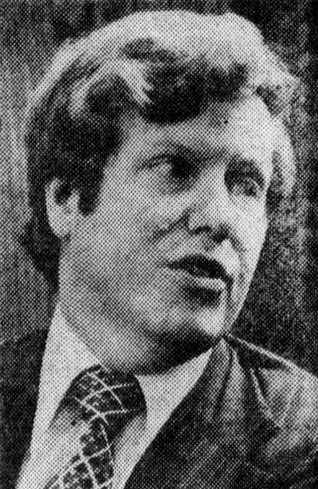

# Harald Malmgren
Economist and diplomat who served four U.S. presidents, then made dramatic late-life claims about handling UFO debris and witnessing a craft shoot-down in 1962. His claims gained traction in UAP physics communities before being debunked by declassified FBI files proving he fabricated key assertions about his security clearances and role.

| Field | Details |
|-------|---------|
| **Full Name** | Harald B. Malmgren |
| **Role** | Former Government Official / Debunked UAP Claimant |
| **Platform** | X (formerly Twitter), podcast interviews, UAP media (2024-2025) |
| **Notable Works** | Claims about handling UFO debris and witnessing 1962 craft shoot-down; served as trade policy advisor under Kennedy, Johnson, Nixon, and Ford |

## Their Claims

In 2024-2025, during the final year of his life, Malmgren made a series of claims directly relevant to UAP physics and materials science:

**UFO Debris Handling:** Malmgren claimed to have personally handled physical debris from a recovered UAP craft. If true, this would represent direct testimony from a credentialed government official about the existence of exotic materials from non-human technology. He described the material in general terms but did not provide specific metallurgical or physical property data.

**1962 Craft Shoot-Down:** Malmgren claimed to have been briefed on or witnessed the shoot-down of an unidentified craft in 1962 while allegedly serving as an advisor to President Kennedy. This claim, if verified, would have provided evidence that the U.S. military possessed weapons capable of engaging UAP and that recovered technology existed for analysis.

**AEC Q-Clearance:** Malmgren claimed to have held an Atomic Energy Commission Q-level security clearance — the clearance level that would grant access to nuclear weapons technology and, by extension, the most classified physics programs in the U.S. government. This was a critical credential for his other claims.

**Kennedy Administration UFO Investigation:** Malmgren positioned himself as a national security advisor who was tasked by JFK to investigate a UFO incident, implying direct White House engagement with the UAP phenomenon at the presidential level.

### The Debunking

Following Malmgren's death on February 13, 2025, researcher Douglas Dean Johnson conducted a thorough investigation using declassified FBI documents obtained through FOIA requests, corroborated by the Metabunk research community. The findings were definitive:

- **FBI files proved Malmgren never held an AEC Q-clearance** — directly contradicting the foundational credential for his UAP claims
- **Malmgren spent 1962-1964 as an economics researcher at the Institute for Defense Analyses (IDA)** — not as a presidential advisor investigating UFOs
- **His own certified government job applications** contradicted his later public claims about his roles and clearances
- The declassified documents contained what Johnson described as "incontrovertible evidence" that he fabricated his principal 2024-2025 claims

### Physics Relevance

Despite being debunked, Malmgren's case is relevant to UAP physics documentation for several reasons:

1. **Cautionary case study** — His claims were widely amplified in UAP communities, demonstrating how credentialed individuals can introduce false data points into the evidence base
2. **Materials science claims** — His debris-handling claims, while fabricated, briefly influenced discussions about exotic metamaterials and crash-retrieval programs
3. **Methodology lesson** — The debunking process (FOIA requests, cross-referencing government employment records) demonstrates how UAP physics claims should be verified

## Key Quotes

> "I handled debris from a crashed UFO."
> — **Harald Malmgren**, X posts and interviews, 2024 (subsequently debunked)

> "The declassified FBI documents contain incontrovertible evidence that Malmgren fabricated his principal claims."
> — **Douglas Dean Johnson**, investigative researcher, May 2025

## Key Arguments & Evidence They Cite

- **Malmgren cited:** His service under four presidents as credential; claimed AEC Q-clearance; claimed direct handling of UAP debris; claimed 1962 shoot-down witness
- **Debunking evidence:** Declassified FBI files showing no Q-clearance; government job applications contradicting his claims; IDA employment records placing him as an economics researcher in 1962-1964; no corroboration from any Kennedy administration source

## Where They've Said It

- X (formerly Twitter) posts throughout 2024-2025
- Podcast interviews in the UAP media ecosystem
- Above The Norm News interview (April 2025 posthumous publication)
- WikiDisc compilation of his claims

## The Counterargument

- Declassified FBI files definitively prove Malmgren never held the security clearances he claimed
- His own government employment records contradict his public statements
- He was an economics researcher, not a national security advisor or UFO investigator
- The case demonstrates that legitimate government service (trade policy advising) can be embellished into extraordinary claims that are difficult to verify while the claimant is alive
- No independent source has corroborated any of his UAP-specific claims
- His advanced age (88-89) when making the claims raises questions about cognitive accuracy

## Related Perspectives

- [David Grusch](David_Grusch.md) — Unlike Malmgren, Grusch testified under oath and his background claims have been verified by the Intelligence Community Inspector General; the contrast illustrates the importance of verification
- [Garry Nolan](Garry_Nolan.md) — Stanford immunologist who has studied alleged UAP materials using rigorous scientific methodology, in contrast to Malmgren's unverified claims
- [Jacques Vallee](Jacques_Vallee.md) — Researcher who has documented the difficulty of separating genuine UAP evidence from fabrication and disinformation

## See Also

- [Exotic_Metamaterials](Exotic_Metamaterials.md) — The materials science claims Malmgren made before debunking, and the rigorous analysis required to evaluate such claims
- [Gravity_Manipulation](Gravity_Manipulation.md) — Theoretical context for recovered craft technology claims
- [Harald Malmgren (UAP Deaths)](/uaps/Details/Harald_Malmgren) — Profile documenting his death (natural causes) and the full debunking timeline

## Sources

- [Douglas Dean Johnson: Harald Malmgren: fabricated history, bogus UFO secrets](https://douglasjohnson.ghost.io/harald-malmgren-history-vs-fantasy/)
- [Metabunk: Harald Malmgren (1935-2025): his self-glorifying fictions versus his documented prosaic history](https://www.metabunk.org/threads/harald-malmgren-1935-2025-his-self-glorifying-fictions-versus-his-documented-prosaic-history.14234/)
- [WikiDisc: Harald Malmgren](https://www.wikidisc.org/wiki/Harald_Malmgren)
- [The UFO Chronicles: Harald Malmgren's UFO and Alien Proclamations](https://www.theufochronicles.com/2025/05/harald-malmgrens-ufo-alien-proclamations.html.html)
- [Above The Norm News: Final Testimony from Harald Malmgren](https://www.abovethenormnews.com/2025/04/23/final-testimony-malmgren-says-u-s-shot-down-ufo/)

*This information was compiled by Claude AI research.*
