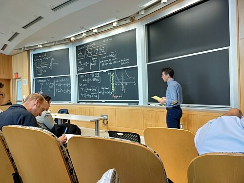

# Nuno Loureiro
Portuguese-born plasma physicist, Herman Feshbach Professor of Physics at MIT, and director of the MIT Plasma Science and Fusion Center, who was fatally shot at his home in Brookline, Massachusetts on December 15, 2025, at the age of 47.

| Field | Details |
|-------|---------|
| **Full Name** | Nuno Filipe Gomes Loureiro |
| **Role** | Physicist / Fusion Scientist / Research Director |
| **Platform** | MIT Plasma Science and Fusion Center, MIT Department of Physics, MIT Department of Nuclear Science and Engineering |
| **Notable Works** | Transformative contributions to the theory of magnetic reconnection, plasmoid instability theory, plasma turbulence research, directorship of MIT PSFC |

## Video Report

<video controls width="100%" style={{maxWidth: '720px'}}>
  <source src="https://ipfs.io/ipfs/QmPUTSoChvkH1XVcbpGoPR6Y2yKwcxUcxs6QPcE4FRHKEZ" type="video/mp4" />
  <source src="https://dweb.link/ipfs/QmPUTSoChvkH1XVcbpGoPR6Y2yKwcxUcxs6QPcE4FRHKEZ" type="video/mp4" />
  <source src="https://cloudflare-ipfs.com/ipfs/QmPUTSoChvkH1XVcbpGoPR6Y2yKwcxUcxs6QPcE4FRHKEZ" type="video/mp4" />
  Your browser does not support the video tag.
</video>

*Detailed video report on Nuno Loureiro's murder, the SPARC vs TAE fusion rivalry, and the $6 billion Trump Media merger announced days after his death. Source: [@nic_moneypenny on X](https://x.com/nic_moneypenny/status/2040135310101672250), April 3, 2026.*

## Biography

Nuno Filipe Gomes Loureiro was born in 1977 in Viseu, a city in central Portugal. Even as a child, he aspired to be a scientist. He attended Alves Martins Secondary School before enrolling at the Instituto Superior Tecnico (IST) in Lisbon in 1995, where he studied physics and graduated in 2000 with undergraduate and master's degrees.

Loureiro earned his doctorate in physics from Imperial College London in 2005, with a dissertation on tearing modes in plasma. He then joined Princeton University as a postdoctoral researcher at the Princeton Plasma Physics Laboratory. In 2007, he moved to the Culham Centre for Fusion Energy, a laboratory under the UK Atomic Energy Authority, where he worked until 2009. He returned to Portugal as a researcher at the Instituto de Plasmas e Fusao Nuclear at IST Lisbon for seven years.

In 2016, Loureiro joined MIT as an assistant professor. His rise was remarkably swift: he received tenure in 2017, was promoted to full professor in 2021, and was named the Herman Feshbach Professor of Physics. In May 2024, he was appointed director of the MIT Plasma Science and Fusion Center (PSFC), one of the world's leading fusion research facilities.

In January 2025, President Joe Biden presented Loureiro with the Presidential Early Career Award for Scientists and Engineers, the highest U.S. government honor for young scientists. He was also a Fellow of the American Physical Society and recipient of the Thomas H. Stix Award for Outstanding Early Career Contributions to Plasma Physics Research (2015) and the National Science Foundation Career Award.

He is survived by his wife and children.

## Research

Loureiro was a theoretical physicist whose research spanned magnetic confinement fusion, fundamental plasma physics, and plasma astrophysics. His work had particular significance in several areas:

### Magnetic Reconnection

Loureiro's most celebrated contribution was demonstrating that the half-century-old textbook mechanism for magnetic reconnection -- the Sweet-Parker model -- is fundamentally unstable. He showed that the reconnection site (the "current sheet") is unstable to the formation of multiple magnetic islands, known as plasmoids. This plasmoid instability greatly accelerates the reconnection process and resolved a longstanding puzzle in plasma physics about why magnetic reconnection occurs far faster in nature than classical theory predicted.

Magnetic reconnection is a ubiquitous phenomenon responsible for solar flares, magnetospheric substorms, and sawtooth instabilities in fusion reactors. Understanding it is essential for both astrophysics and controlled fusion energy.

### Fusion Plasma Confinement

His laboratory at the PSFC worked to illuminate how plasma behaves inside fusion reactors, research critical for preventing material failures and improving plasma containment to harvest electricity. His work on confinement and transport in fusion plasmas had direct implications for the viability of fusion as an energy source.

### Broader Research Areas

Loureiro maintained active research interests in magnetic field generation and amplification, turbulence in strongly magnetized and weakly collisional plasmas, and plasma astrophysics. His work connected laboratory plasma physics to phenomena observed throughout the universe.

The American Physical Society cited his fellowship election "for transformative contributions to the theory of magnetic reconnection and for elucidating the fundamental role of hierarchical reconnection phenomena in plasma turbulence, with broad applications in laboratory, space, and astrophysical systems."

## Death Circumstances

On the evening of December 15, 2025, Nuno Loureiro was shot at his residence on Gibbs Street in Brookline, Massachusetts. He died from his injuries the following day, December 16, 2025. He was 47 years old.

Two days prior, on December 13, 2025, a mass shooting had occurred at Brown University in Providence, Rhode Island, killing two students. Authorities subsequently identified the perpetrator of both attacks as Claudio Manuel Neves Valente, a 47-year-old Portuguese national.

Valente and Loureiro had attended the Instituto Superior Tecnico in Lisbon during the same period, from approximately 1995 to 2000. Reports indicate that Valente graduated first in his class from IST, ahead of Loureiro, and subsequently enrolled in the physics doctoral program at Brown University in September 2000. Valente took a leave of absence from Brown in April 2001 and formally withdrew from the program in July 2003.

Valente was later found dead of an apparent suicide. The Connecticut State Police Forensic Science Lab confirmed that one of the firearms found with Valente matched the weapon used in Loureiro's murder.

In video recordings found in a storage facility, Valente reportedly confessed to the killings and stated he had been planning them for years. Reports described his motivation as connected to a lengthy personal grudge, though the full details of his stated reasoning remain under investigation.

Brookline police and the Norfolk County District Attorney's Office conducted the homicide investigation. The case was considered solved with the identification of Valente as the shooter.

## Why This Case Is Notable

### The Official Account

Law enforcement concluded that Loureiro's murder was the act of a former classmate who harbored a years-long grudge. The connection between the Brown University shooting and Loureiro's murder was established through ballistic evidence linking the same firearm to both attacks. This account presents the killing as a targeted act of personal violence unrelated to Loureiro's professional work.

### The Broader Pattern

Rep. Tim Burchett (R-TN), a leading Congressional advocate for UAP transparency, has publicly cited Loureiro's death as part of what he describes as a concerning pattern of deaths and disappearances among scientists whose work intersects with topics relevant to unidentified anomalous phenomena. Burchett has characterized this pattern as "dark" and called for greater scrutiny.

As of April 2026, the count has grown to **eight** scientists and researchers dead or missing. The cases Burchett and others have referenced in this pattern include:

- **Frank Maiwald** (July 4, 2024) -- NASA Jet Propulsion Laboratory researcher, age 61, died in Los Angeles. Cause of death was never disclosed and no autopsy was performed.
- **Anthony Chavez** (May 4, 2025) -- Former Los Alamos National Laboratory worker, disappeared without a trace.
- **[Monica Reza](Monica_Jacinto_Reza.md)** (June 2025) -- Aerospace and materials scientist at NASA's JPL, co-inventor of Mondaloy nickel superalloy critical to advanced rocket propulsion. Vanished while hiking in California's Angeles National Forest with no confirmed trace.
- **Melissa Casias** (June 26, 2025) -- Administrative assistant at Los Alamos National Laboratory, age 54. Last spotted walking alone without wallet, phone, or keys, miles from her home. Missing since.
- **Jason Thomas** (December 12, 2025) -- Novartis pharmaceutical researcher and chemical biology director. Vanished approximately 10 miles from Loureiro's home, three days before Loureiro was shot. Body discovered in Lake Quannapowitt, Wakefield, Massachusetts on March 17, 2026.
- **Nuno Loureiro** (December 15, 2025) -- MIT plasma physicist and PSFC director, shot at home in Brookline, Massachusetts.
- **Carl Grillmair** (February 16, 2026) -- Caltech-affiliated astrophysicist, age 67. Shot and killed on his front porch at 6:00 AM.
- **[William McCasland](William_McCasland.md)** (February 27, 2026) -- Retired Air Force Major General who oversaw the Air Force's $2.2 billion science and technology program at Wright-Patterson AFB. Named in 2016 WikiLeaks emails as an advisor on UFO disclosure. Walked out of his New Mexico home without phone, wearable devices, or prescription glasses. Not seen since.

No law enforcement agency has established any connection between these cases, and no official investigation has confirmed a link to UAP research, fusion energy competition, or Congressional testimony on unidentified anomalous phenomena.

### Plasma Physics and UAP Relevance

While Loureiro himself was not publicly known to be involved in UAP research, his areas of expertise have significant theoretical overlap with phenomena associated with UAP observations:

- **Plasma physics**: Many UAP sightings describe luminous phenomena consistent with plasma behavior. Understanding plasma dynamics is potentially central to explaining UAP observables.
- **Magnetic reconnection**: The rapid energy release mechanisms Loureiro studied could be relevant to the extreme acceleration and energy output reported in UAP encounters.
- **Fusion energy**: Compact fusion power sources are among the speculative technologies proposed to explain UAP propulsion capabilities. As director of one of the world's leading fusion research centers, Loureiro oversaw research at the frontier of this field.
- **Electromagnetic phenomena**: Plasma confinement and magnetic field manipulation are directly relevant to theoretical frameworks for electromagnetic propulsion systems.

It should be emphasized that these connections are speculative. Loureiro's published research was in mainstream plasma physics and fusion science. There is no public evidence that he was involved in classified programs, UAP-related research, or that his death was connected to anything other than the personal grudge described by investigators.

### The SPARC / TAE Fusion Rivalry and the Trump Deal

Loureiro's murder takes on additional significance when placed in the context of the multi-billion-dollar commercial fusion race.

**SPARC and Commonwealth Fusion Systems (CFS)**

Commonwealth Fusion Systems was spun out of MIT's Plasma Science and Fusion Center in 2018. CFS is building SPARC, a compact high-field tokamak using high-temperature superconducting magnets, at a facility in Devens, Massachusetts. SPARC aims to demonstrate net energy gain by 2027, with a follow-on commercial plant called ARC planned for the early 2030s. CFS has raised over $2 billion from investors including Nvidia, Google, Mitsubishi, and Bill Gates -- making it the most funded private fusion company in the world.

Loureiro was the director of the very institution that gave birth to CFS. His theoretical work on plasma turbulence and magnetic reconnection was directly relevant to the confinement problems SPARC needs to overcome. He was, in effect, the academic godfather of the SPARC program.

**TAE Technologies and the Trump Media Merger**

TAE Technologies, founded in 1998, pursues a fundamentally different approach to fusion: field-reversed configuration (FRC) using aneutronic hydrogen-boron fuel, bypassing the tokamak design entirely. TAE holds 1,600 patents and has raised over $1.8 billion from investors including Google, Chevron, and Goldman Sachs. In April 2025, TAE achieved a breakthrough with its "Norm" experimental device, producing stable plasma at 70 million degrees Celsius using only neutral beam injection.

On **December 18, 2025** -- exactly three days after Loureiro was shot and two days after he was pronounced dead -- Trump Media & Technology Group (TMTG) announced a definitive merger agreement with TAE Technologies in an all-stock transaction valued at more than **$6 billion**. Under the deal, shareholders of each company would own approximately 50% of the combined entity. TMTG committed up to $200 million in cash at signing plus an additional $100 million upon filing the Form S-4. Devin Nunes (TMTG CEO) and Michl Binderbauer (TAE CEO) would serve as co-CEOs. DJT stock soared 33% on the announcement.

The combined company would become one of the world's first publicly traded fusion companies, with plans to site and begin construction of the world's first utility-scale fusion power plant (50 MWe) in 2026.

**The Competitive Stakes**

TAE and CFS/SPARC are the two most funded private fusion companies on Earth, representing fundamentally incompatible approaches. Both are racing to demonstrate net energy gain first. The Trump-TAE merger gave TAE a massive capital infusion and public market access. The director of the institution that birthed TAE's primary competitor was killed three days before the deal was announced.

A third competitor, Helion Energy (backed by $1 billion+ in funding and a power purchase agreement with Microsoft), uses a pulsed colliding plasma approach and became the first privately developed fusion machine to operate with deuterium-tritium fuel in February 2026.

The potential payoff for whoever wins the fusion race is staggering -- commercial fusion energy represents a multi-trillion-dollar market over decades.

**DOE and DARPA Fusion Funding**

Approximately ten days after Loureiro's murder, the US government escalated its fusion commitments. The DOE had already announced $134 million in fusion leadership funding in September 2025, including the FIRE Collaboratives (up to $220 million over four years) and INFUSE program awards. Following Loureiro's death, DOE and DARPA fusion energy tenders went live and a further $140 million deal was reportedly signed with Standard Nuclear, signaling an unprecedented federal commitment to commercializing fusion energy.

### The Question of Timing

Loureiro's death occurred during a period of heightened Congressional interest in UAP disclosure, at the tipping point of the commercial fusion race, and at a time when scientists with expertise in relevant fields were receiving increased public attention.

The timeline raises questions that observers have noted:

| Date | Event |
|------|-------|
| April 2025 | TAE Technologies achieves plasma breakthrough |
| September 2025 | DOE announces $134 million fusion funding |
| **December 15, 2025** | **Nuno Loureiro shot at his Brookline home** |
| December 16, 2025 | Loureiro pronounced dead |
| **December 18, 2025** | **Trump Media announces $6 billion merger with TAE Technologies** |
| December 2025 | CFS completes first superstrong magnet delivery for SPARC |
| ~December 25, 2025 | DOE/DARPA fusion energy tenders go live; $140M Standard Nuclear deal |

Whether this timing is coincidental or significant remains a matter of debate. As one social media user noted on Threads: "Trump media has agreed to merge with nuclear fusion firm TAE Technologies today in an all-stock deal valued at more than $6 billion. This comes 2 days after a leading MIT fusion scientist Nuno Loureiro was assassinated in his home."

## Related Perspectives

- [Electromagnetic Propulsion](Electromagnetic_Propulsion.md) -- Plasma physics and magnetic field manipulation are foundational to electromagnetic propulsion theories
- [Zero Point Energy](Zero_Point_Energy.md) -- Alternative energy frameworks that intersect with plasma physics research
- [Eugene Mallove](Eugene_Mallove.md) -- MIT-trained engineer and cold fusion advocate who was murdered in 2004; another case of a physicist with energy research connections dying violently
- [Amy Eskridge](Amy_Eskridge.md) -- Researcher in gravity modification and plasma physics (through her father's NASA background) whose death was alleged to be connected to her research
- [Hal Puthoff](Hal_Puthoff.md) -- Physicist who has investigated advanced energy and propulsion concepts through government-connected programs
- [Salvatore Pais](Salvatore_Pais.md) -- Navy physicist whose patents describe plasma-related propulsion and energy concepts
- [Monica Jacinto Reza](Monica_Jacinto_Reza.md) -- Aerospace scientist who disappeared in 2025, cited alongside Loureiro in the pattern of scientist deaths
- [William McCasland](William_McCasland.md) -- Retired Air Force Major General reported missing in 2026, also cited in the same pattern
- [Nikola Tesla](Nikola_Tesla.md) -- Pioneer of electromagnetic science whose work on plasma and energy transmission remains relevant to UAP physics discussions

## Sources

- [Nuno Loureiro - Wikipedia](https://en.wikipedia.org/wiki/Nuno_Loureiro)
- [Nuno Loureiro, professor and director of MIT's Plasma Science and Fusion Center, dies at 47 - MIT News](https://news.mit.edu/2025/nuno-loureiro-professor-director-plasma-science-and-fusion-center-dies-1216)
- [MIT professor Nuno Loureiro killed at his home - NBC News](https://www.nbcnews.com/news/us-news/mit-professor-killed-shooting-home-rcna249582)
- [Shooter who killed MIT professor and Brown students planned attack for months, DOJ says - PBS News](https://www.pbs.org/newshour/nation/shooter-who-killed-mit-professor-and-brown-students-planned-attack-for-months-doj-says)
- [Suspect in Brown University and MIT Shootings - Time](https://time.com/7341792/claudio-neves-valente-mit-brown/)
- [What MIT Physicist Nuno Loureiro Was Working on Before Fatal Shooting - Newsweek](https://www.newsweek.com/mit-professor-fatally-shot-nuno-loureiro-research-11226085)
- [Lengthy grudge motivated Brown mass shooting, MIT professor killing - ABC News](https://abcnews.com/US/lengthy-grudge-motivated-brown-mass-shooting-mit-professor/story?id=128961044)
- [UFO Scientists Found Dead or Missing Post Congress Testimony, Rep. Tim Burchett Warns of 'Dark' Trend - IBTimes](https://www.ibtimes.co.uk/mysterious-deaths-disappearances-ufo-scientists-1788054)
- [Nuno Loureiro named director of MIT's Plasma Science and Fusion Center - MIT News](https://news.mit.edu/2024/nuno-loureiro-named-director-mit-plasma-science-fusion-center-0501)
- [Nuno Loureiro: A theorist seeks the elusive fundamentals of magnetic reconnection - MIT News](https://news.mit.edu/2016/nuno-loureiro-seeks-fundamentals-of-magnetic-reconnection-0512)
- [2025 Brown University shooting - Wikipedia](https://en.wikipedia.org/wiki/2025_Brown_University_shooting)
- [Professor Nuno Loureiro (1977-2025) - MIT](https://orgchart.mit.edu/letters/professor-nuno-loureiro-1977-2025)
- [Trump Media announces $6 billion merger with TAE Technologies - CNBC](https://www.cnbc.com/2025/12/18/trump-media-djt-tae-fusion-merger.html)
- [Trump Media & Technology Group to Merge with TAE Technologies - GlobeNewsWire](https://www.globenewswire.com/news-release/2025/12/18/3207544/0/en/Trump-Media-Technology-Group-to-Merge-with-TAE-Technologies-a-Premier-Fusion-Power-Company-in-All-Stock-Transaction-Valued-at-More-Than-6-Billion.html)
- [Trump Media $6B merger with nuclear fusion company - ABC News](https://abcnews.com/Business/trump-media-announces-6-billion-merger-nuclear-fusion/story?id=128516029)
- [Ethics watchdogs alarmed by Trump-TAE deal - CNN](https://edition.cnn.com/2025/12/22/business/trump-stock-fusion)
- [The Count Is Now Eight - The Liberty Line](https://thelibertyline.com/2026/04/01/ufo-researches-missing-dead-8/)
- [Mystery of missing scientists with troubling link - Daily Mail](https://www.dailymail.co.uk/sciencetech/article-14607417/mystery-five-missing-scientists-three-dead-troubling-link-dc.html)
- [DOE announces $134 million to advance US fusion leadership](https://www.energy.gov/articles/energy-department-announces-134-million-advance-us-fusion-leadership-through-targeted)
- [@nic_moneypenny video report on Loureiro murder, SPARC/TAE rivalry, and Trump Media merger - X](https://x.com/nic_moneypenny/status/2040135310101672250)

*This information was compiled by Claude AI research.*

**Status:** Deceased (2025)
