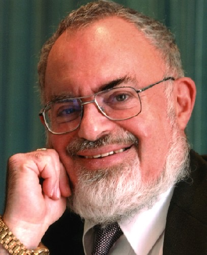

# Stanton Friedman
Nuclear physicist who worked on classified fission and fusion rocket programs, later became the world's foremost scientific UFO researcher, and proposed magnetohydrodynamic (MHD) propulsion as the physics behind UFO flight characteristics.

| Field | Details |
|-------|---------|
| **Full Name** | Stanton Terry Friedman |
| **Role** | Nuclear Physicist / UFO Researcher |
| **Platform** | Lectures, books, television, congressional testimony |
| **Notable Works** | *Flying Saucers and Science* (2008), *Crash at Corona* (1992), *TOP SECRET/MAJIC* (1996), 1968 Congressional testimony |

## Their Claims

Stanton Friedman brought a rare combination of credentials to UAP physics: he was a working nuclear physicist with 14 years of experience on classified advanced propulsion programs before dedicating the rest of his career to scientific UFO investigation. His central physics contribution was the argument that UFO flight characteristics -- silent operation, sudden acceleration, glowing auras, extreme maneuverability -- were consistent with **magnetohydrodynamic (MHD) propulsion** powered by compact nuclear reactors.

Friedman worked at General Electric, Aerojet General Nucleonics, General Motors, Westinghouse, TRW Systems, and McDonnell Douglas on programs including nuclear aircraft propulsion, fission and fusion rockets, and compact nuclear power plants for space applications. This hands-on experience with advanced propulsion systems informed his analysis of UFO capabilities in ways few other researchers could match.

His MHD propulsion thesis proposed that UFOs use ionized, electrically conducting air manipulated by superconducting magnets to achieve propulsion. He noted that such a system would be symmetric (disc-shaped), highly maneuverable, relatively silent, surrounded by a visible glow (from ionized air), and capable of sudden starts and stops -- matching the most commonly reported UFO flight characteristics.

Friedman also argued that interstellar travel was achievable without violating known physics, using nuclear propulsion systems not fundamentally different from programs he had worked on. He contended that the gap between what the public believed was possible and what classified programs had achieved was enormous.

## Key Quotes

> "The evidence is overwhelming that planet Earth is being visited by intelligently controlled extraterrestrial spacecraft."
> -- **Stanton Friedman**, testimony before the U.S. House Committee on Science and Astronautics, 1968

> "I've distilled more than 40 years of research on UFOs and have established that travel to nearby stars is within reach without violating the laws of physics."
> -- **Stanton Friedman**, *Flying Saucers and Science* (2008)

> "The biggest secret in the history of mankind is that we are being visited, that the government has known about it since at least 1947, and that they have covered it up."
> -- **Stanton Friedman**, various lectures

## Key Arguments & Evidence They Cite

- **MHD propulsion framework**: Drew on his nuclear physics expertise and work on electromagnetic submarine propulsion (built in the 1960s by a Westinghouse colleague) to argue that an airborne MHD system using ionized air with superconducting magnets could explain UFO performance
- **Nuclear propulsion feasibility**: Argued from direct professional experience that compact nuclear reactors could power interstellar vehicles; cited programs he personally worked on as evidence that the physics was already partially understood by the 1960s
- **Roswell physical evidence**: Was the first civilian researcher to systematically document the 1947 Roswell crash site evidence, interviewing intelligence officer Jesse Marcel in 1978 about the debris he handled
- **MJ-12 documents**: Investigated and defended the authenticity of documents describing a classified group (Majestic 12) allegedly formed to manage recovered extraterrestrial technology
- **Classification as concealment**: Argued that the U.S. government had classified UAP physics breakthroughs just as it had classified nuclear weapons technology, stealth aircraft, and signals intelligence

## Where They've Said It

- Testimony before the U.S. House Committee on Science and Astronautics, July 29, 1968
- Over 600 lectures at colleges and more than 100 professional groups across 50 U.S. states, 10 Canadian provinces, and 19 countries
- *Flying Saucers and Science: A Scientist Investigates the Mysteries of UFOs* (2008)
- *Crash at Corona: U.S. Military Retrieval and Cover-Up of a UFO* (1992)
- *TOP SECRET/MAJIC: Operation Majestic-12 and the United States Government's UFO Cover-Up* (1996)
- Numerous appearances on *Coast to Coast AM*, CNN, Fox News, and documentary programs

## The Counterargument

- Mainstream physicists argue that MHD propulsion in air faces enormous engineering challenges, including the energy required to ionize atmosphere and the efficiency losses involved
- Skeptics point out that interstellar travel, even with nuclear propulsion, would require travel times of decades or centuries to reach nearby stars
- The MJ-12 documents Friedman defended have been deemed forgeries by many researchers, including some within the UFO research community
- Critics argue Friedman's credentials in nuclear physics did not extend to expertise in the specific fields (electromagnetic theory, plasma physics) most relevant to MHD propulsion
- The absence of peer-reviewed publications on his MHD propulsion thesis weakened its standing in the scientific community

## Related Perspectives

- [Bob Lazar](Bob_Lazar.md) -- Claimed hands-on experience with alien propulsion systems at S-4; Friedman was publicly skeptical of Lazar's educational credentials but their propulsion frameworks had some overlap
- [Hal Puthoff](Hal_Puthoff.md) -- Physicist who also investigated exotic propulsion; worked on zero-point energy approaches to the same questions Friedman addressed through MHD
- [Electromagnetic Propulsion](Electromagnetic_Propulsion.md) -- Friedman's MHD thesis is a specific variant of electromagnetic propulsion frameworks
- [Zero Point Energy](Zero_Point_Energy.md) -- Alternative energy source thesis that some researchers combine with MHD propulsion concepts
- [Philip Corso](Philip_Corso.md) -- Military insider who claimed Roswell debris was seeded to defense contractors; Friedman's Roswell research provided the evidentiary foundation for Corso's claims
- [David Grusch](David_Grusch.md) -- Congressional testimony on retrieval programs decades after Friedman first documented Roswell evidence
- [Stanton Friedman (UAP Deaths)](/uaps/Details/Stanton_Friedman) -- Profile emphasizing the circumstances of his death
- [John Murphy](John_Murphy.md) -- Radio journalist who was the first reporter at the 1965 Kecksburg UFO crash site; his confiscated materials and censored documentary represent the kind of primary evidence suppression that Friedman documented throughout his career

## Sources

- [Stanton T. Friedman - Wikipedia](https://en.wikipedia.org/wiki/Stanton_T._Friedman)
- [Stanton Friedman 1968 Congressional Testimony](https://ufologie.patrickgross.org/htm/friedman68.htm)
- [Stanton Friedman: UFO Investigator and Physicist - Hangar 1 Publishing](https://hangar1publishing.com/blogs/ufos-uaps-and-aliens/stanton-friedman)
- [Flying Saucers and Science - Amazon](https://www.amazon.com/Flying-Saucers-Science-Investigates-Interstellar/dp/1601630115)
- [CBC News - Stanton Friedman, famed UFO researcher, dead at 84](https://www.cbc.ca/news/canada/new-brunswick/stanton-friedman-ufologist-dead-1.5135588)
- [Science? Fiction? - University of Chicago Magazine](https://mag.uchicago.edu/science-medicine/science-fiction)

*This information was compiled by Claude AI research.*

**Status:** Deceased (2019)
