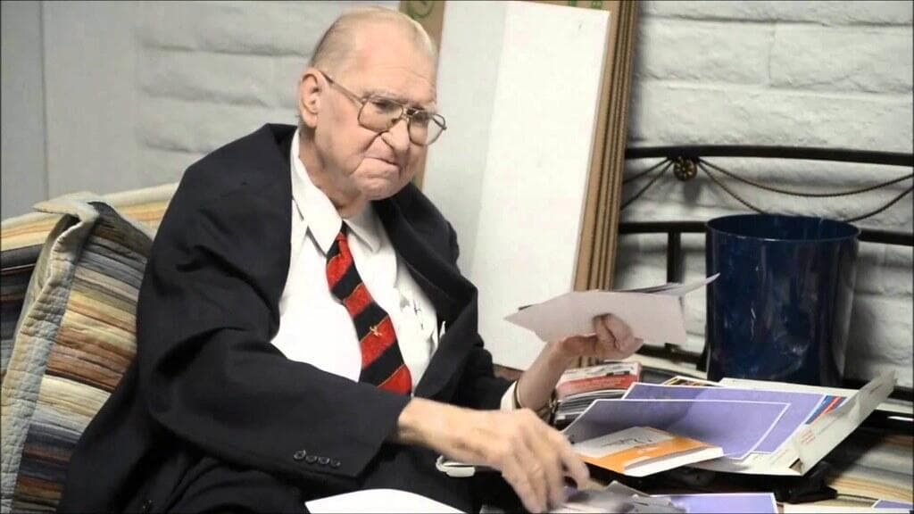

import Head from '@docusaurus/Head';

<Head>
  
</Head>

Lockheed Martin senior scientist with a 40-year career in defense aerospace, holder of 26 patents, who recorded a deathbed video in 2014 claiming he had direct contact with aliens and reverse-engineered technology at Area 51.

| Field | Details |
|-------|---------|
| **Full Name** | Boyd Bushman |
| **Born** | c. 1936 |
| **Died** | August 7, 2014 |
| **Age at Death** | 78 |
| **Location of Death** | United States |
| **Cause of Death** | Natural causes (age-related) |
| **Official Ruling** | Natural death |
| **Category** | Whistleblower / Defense Industry Insider |

## Assessment: MODERATE SUSPICION

Bushman's death at 78 appears to have been from natural causes, and his deathbed video was apparently recorded voluntarily shortly before his death. The timing -- releasing extraordinary claims only when he knew he was dying -- is consistent with the pattern of defense insiders who wait until they are beyond professional or legal retaliation to speak. The key question is not whether he was killed, but whether his claims were genuine or a disinformation effort. His verified credentials (40 years at major defense contractors, 26 patents) make dismissing him as a simple hoaxer difficult.

## Circumstances of Death

Bushman died on August 7, 2014, at the age of 78. Shortly before his death, he recorded a lengthy video interview with aerospace engineer Mark Q. Patterson in which he made extraordinary claims about alien contact and reverse-engineering programs at Area 51. The video was posted to YouTube on October 8, 2014, approximately two months after his death, and quickly went viral.

## Background

Boyd Bushman had a verified 40-year career in the defense aerospace industry, holding positions at Hughes Aircraft, General Dynamics, Texas Instruments, and Lockheed Martin. He was awarded 26 patents (some sources say 28) related to various aerospace and defense technologies, confirming his credentials as a legitimate senior engineer in the defense sector.

In his deathbed video, Bushman claimed:
- He had worked on reverse-engineering alien technology at Area 51
- He had direct contact with living and deceased alien beings
- The "most crucial aspect" of their work involved reverse-engineering -- extracting usable technology from alien craft
- He worked on anti-gravity technology
- He produced photographs allegedly showing alien beings, aircraft, and technologies

## Why This Death Possibly Raises Questions

- Bushman's verified credentials (40 years at top defense contractors, 26 patents) make him one of the most credentialed individuals to make alien contact claims
- The deathbed timing is consistent with the pattern of insiders who wait until they are dying to speak, suggesting fear of retaliation during their active careers
- His claims about reverse-engineering programs align with those later made by [David Grusch](David_Grusch.mdx) before Congress in 2023
- Some photographs he presented were later identified by skeptics as resembling commercially available alien toy figures, raising questions about whether he was a genuine whistleblower, was deceived, or was part of a disinformation effort
- His death itself does not appear suspicious, but the decades-long silence followed by a deathbed confession suggests the suppression he reportedly felt during his career

## Key Quotes from Media Coverage

> "The most crucial aspect of their work involved 'reverse engineering' -- extracting usable technology from the alien craft they studied." -- Boyd Bushman, deathbed video (2014)

## See Also

- [Bob Lazar](Bob_Lazar.mdx) -- Another Area 51 insider who claimed reverse-engineering of alien craft
- [David Grusch](David_Grusch.mdx) -- Testified before Congress about UAP retrieval programs
- [Phil Schneider](Phil_Schneider.mdx) -- Another defense industry insider who made extraordinary claims before dying
- [James Ryder](James_Ryder.mdx) — Fellow senior Lockheed Martin figure who proposed transferring UAP crash retrieval materials and died unexpectedly in 2018

## Other Shocking Stories

- [Keith Bowden](Keith_Bowden.mdx): Senior GEC-Marconi computer scientist killed when his car plunged off a bridge into a disused railway cutting in...
- [Bruce DePalma](Bruce_DePalma.mdx): MIT physicist and former Polaroid senior scientist who invented the N-Machine homopolar generator, a claimed over-unity free energy...
- [Michael Baker](Michael_Baker.mdx): 22-year-old Plessey digital communications expert and part-time SAS member killed when his car crashed through a barrier near...
- [Thomas F. Mantell](Thomas_Mantell.mdx): Kentucky Air National Guard pilot who became the first person to die while pursuing an unidentified flying object

## Sources

- [Area 51 Scientist's Deathbed Confession - The Mirror](https://www.themirror.com/news/weird-news/area-51-scientists-deathbed-confession-1541081)
- [Did Boyd Bushman Provide Evidence of Alien Contact? - Snopes](https://www.snopes.com/fact-check/boyd-bushman-aliens/)
- [Boyd Bushman - RationalWiki](https://rationalwiki.org/wiki/Boyd_Bushman)
- [Boyd Bushman's Astonishing Area 51 Deathbed Confession - Geek Slop](https://www.geekslop.com/life/strange/ufos-and-aliens/2014/boyd-bushmans-area-51-deathbed-confession-alien-ufo-photos)
- [Scientist Boyd Bushman: Did He Publish Evidence Before His Death? - Medium](https://medium.com/@markeetafrydrychova/scientist-boyd-bushman-did-he-publish-evidence-of-the-existence-of-ufos-before-his-death-432f715d4b2f)

*This information was built by Grok and Claude AI research.*

**Status:** Deceased (2014)

---

## Additional context from the UAP Energy Systems Murders investigation

Lockheed Martin senior scientist with 26 patents and a 40-year defense aerospace career who recorded a deathbed video claiming direct involvement in antigravity research and reverse-engineering of exotic propulsion technology at Area 51.

| Field | Details |
|-------|---------|
| **Full Name** | Boyd Bushman |
| **Born** | c. 1936 |
| **Died** | August 7, 2014 |
| **Age at Death** | 78 |
| **Location of Death** | United States |
| **Cause of Death** | Natural causes (age-related) |
| **Official Ruling** | Natural death |
| **Category** | Defense Scientist |

## Assessment: MODERATE SUSPICION

Bushman's death at 78 appears to have been from natural causes. The case is significant not because of how he died but because of what his deathbed confession reveals about the suppression of advanced propulsion and energy technology within the defense-industrial complex. His verified credentials -- 40 years at Hughes Aircraft, General Dynamics, Texas Instruments, and Lockheed Martin, with 26 patents -- make him one of the most credentialed individuals to claim firsthand involvement in antigravity and reverse-engineering programs. The fact that he waited until he was dying to speak publicly is itself evidence of the suppression regime that keeps advanced energy technology classified.

## Circumstances of Death

Bushman died on August 7, 2014, at the age of 78. Shortly before his death, he recorded a lengthy deathbed video interview with aerospace engineer Mark Q. Patterson in which he made detailed claims about antigravity research and reverse-engineering of exotic propulsion systems at Area 51. The video was posted to YouTube on October 8, 2014, approximately two months after his death, and quickly went viral.

## Background

Boyd Bushman had a verified 40-year career in the defense aerospace industry, holding positions at Hughes Aircraft, General Dynamics, Texas Instruments, and Lockheed Martin. He was awarded 26 patents (some sources say 28) related to various aerospace and defense technologies, confirming his credentials as a legitimate senior engineer in the defense sector.

### Antigravity and Advanced Propulsion Claims

In his deathbed video, Bushman described what he claimed was firsthand involvement in advanced energy and propulsion research:

- He stated he had worked on **antigravity technology** -- the core energy-propulsion connection that places him in the advanced energy suppression context
- He claimed the "most crucial aspect" of the work involved **reverse-engineering** exotic propulsion systems -- extracting usable technology from craft that operated on principles beyond conventional aerospace engineering
- He described propulsion systems that allegedly manipulated gravity and electromagnetic fields in ways not publicly acknowledged by mainstream physics
- He produced photographs allegedly showing craft and technologies operating on non-conventional propulsion principles

### Significance for Energy Suppression

Bushman's claims are significant because they come from a verifiably credentialed defense scientist describing classified programs that allegedly possess working antigravity and advanced propulsion technology. If even partially accurate, these claims suggest that breakthroughs in energy and propulsion physics have been achieved within classified programs and deliberately withheld from civilian science and commercial application. His 26 patents demonstrate he was a working engineer, not a theorist, and his descriptions of reverse-engineering suggest hands-on involvement with physical hardware.

The deathbed timing -- releasing extraordinary claims only when he knew he was beyond professional or legal retaliation -- is consistent with the pattern of defense insiders who remain silent for decades under fear of consequences. This pattern itself constitutes a form of energy technology suppression: knowledge of advanced propulsion and energy systems is locked inside classified programs, and the people with direct knowledge are prevented from sharing it by secrecy oaths, security clearances, and the threat of prosecution.

## Why This Death Possibly Raises Questions

- Bushman's verified credentials (40 years at top defense contractors, 26 patents) make him one of the most credentialed individuals to claim involvement in antigravity research
- The deathbed timing suggests decades of suppression -- he reportedly felt unable to speak during his active career
- His claims about reverse-engineering advanced propulsion systems align with later testimony by David Grusch before Congress in 2023
- His descriptions of antigravity technology are consistent with claims by other defense insiders, including [Thomas Townsend Brown](Thomas_Townsend_Brown.mdx), who researched electrogravitics decades earlier
- Some photographs he presented were later identified by skeptics as resembling commercially available alien toy figures, raising questions about whether he was a genuine whistleblower, was deceived, or was part of a disinformation effort
- His death itself does not appear suspicious, but his career-long silence followed by a deathbed confession documents the suppression of advanced energy knowledge within defense programs

## The Counterargument

- Bushman died at 78 of apparent natural causes -- there is no evidence of foul play
- Some photographs he presented were identified as resembling commercially available toy figures, which skeptics argue undermines his entire testimony
- His claims about antigravity and reverse-engineering have not been independently verified through declassified documents
- It is possible that Bushman, while genuinely credentialed as an engineer, was not involved in the specific programs he described and embellished his role late in life
- Deathbed statements, while culturally given weight, are not subject to cross-examination and carry no legal penalty for falsehood
- His 26 patents are all in conventional aerospace engineering, not antigravity or exotic propulsion

## Key Quotes from Media Coverage

> "The most crucial aspect of their work involved 'reverse engineering' -- extracting usable technology from the alien craft they studied."
> -- **Boyd Bushman**, deathbed video (2014)

## See Also

- [Boyd Bushman (UAP profile)](/uaps/Details/Boyd_Bushman) -- Full profile emphasizing the UAP/disclosure angle
- [Thomas Townsend Brown](Thomas_Townsend_Brown.mdx) -- Electrogravitics pioneer whose work was allegedly classified by the military
- [Bruce DePalma](Bruce_DePalma.mdx) -- MIT physicist who invented the N-Machine and claimed over-unity energy generation
- [Eric Wang](Eric_Wang.mdx) -- Wright-Patterson scientist allegedly involved in reverse-engineering exotic technology

## Other Shocking Stories

- [Stanley Meyer](Stanley_Meyer.mdx): Inventor of water fuel cell collapsed at dinner with investors -- last words: "They poisoned me."
- [Eugene Mallove](Eugene_Mallove.mdx): Chief cold fusion advocate beaten to death with 32 lacerations days before major media appearance.
- [Nikola Tesla](Nikola_Tesla.mdx): FBI seized Tesla's papers within hours of death -- many remain unaccounted for decades later.
- [Arie DeGeus](Arie_DeGeus.mdx): Clean energy inventor found dead in airport parking lot en route to secure European funding.

## Sources

- [Area 51 Scientist's Deathbed Confession - The Mirror](https://www.themirror.com/news/weird-news/area-51-scientists-deathbed-confession-1541081)
- [Did Boyd Bushman Provide Evidence of Alien Contact? - Snopes](https://www.snopes.com/fact-check/boyd-bushman-aliens/)
- [Boyd Bushman - RationalWiki](https://rationalwiki.org/wiki/Boyd_Bushman)
- [Boyd Bushman's Astonishing Area 51 Deathbed Confession - Geek Slop](https://www.geekslop.com/life/strange/ufos-and-aliens/2014/boyd-bushmans-area-51-deathbed-confession-alien-ufo-photos)
- [Scientist Boyd Bushman: Did He Publish Evidence Before His Death? - Medium](https://medium.com/@markeetafrydrychova/scientist-boyd-bushman-did-he-publish-evidence-of-the-existence-of-ufos-before-his-death-432f715d4b2f)

*This information was built by Grok and Claude AI research.*

**Status:** Deceased (2014)

---

## Additional context from the UAP Physics Murders investigation

Lockheed Martin senior research scientist with a 40-year career at major defense contractors, holder of 26 patents in aerospace and defense technologies, who conducted magnetic field experiments allegedly demonstrating gravitational anomalies and made deathbed claims about reverse-engineering alien technology at Area 51.

| Field | Details |
|-------|---------|
| **Full Name** | Boyd B. Bushman |
| **Role** | Engineer / Defense Industry Insider |
| **Platform** | Patents, deathbed video interview (2014), informal demonstrations |
| **Notable Works** | 26 patents (some classified), magnetic beam amplification apparatus (US Patent 5,929,732), laser propulsion patents (US Patents 5,542,247 and 5,680,135), deathbed video testimony |

## Their Claims

Boyd Bushman's contribution to UAP physics operates on two levels: his documented, patented engineering work on electromagnetic and propulsion systems, and his late-life claims about direct involvement in reverse-engineering alien technology.

**Documented Engineering Work:**

Bushman spent over 40 years at Hughes Aircraft, General Dynamics, Texas Instruments, and Lockheed Martin. He was on the development teams for the Stinger missile and the F-16 fighter, among other advanced weapons and propulsion systems. His 26 patents (some sources say 28) cover a range of aerospace technologies, with several directly relevant to exotic propulsion:

- **US Patent 5,929,732** -- Apparatus and method for amplifying a magnetic beam, describing techniques to concentrate and direct magnetic fields
- **US Patents 5,542,247 and 5,680,135** -- Laser systems that dissociate air molecules to produce propulsion effects
- **Electromagnetic propulsion fan patents** -- Devices using hub-mounted magnets and controllable electromagnets for propulsion

**Gravity-Magnetic Field Experiments:**

At Lockheed Martin's Fort Worth, Texas facilities, Bushman conducted experiments he claimed demonstrated that magnetic fields affect gravitational behavior. His most publicized experiment involved dropping two rocks of identical weight from a height of 59 feet -- one containing a pair of opposing (inversely aligned) super magnets, the other without magnets. Bushman claimed the magnetized rock consistently fell slower, with the opposing magnetic fields producing a measurable interaction with Earth's gravitational field. He reported 500 controlled drops conducted on December 12, 1995, at Lockheed Martin Tactical Aircraft Systems, with documented results.

**Deathbed Reverse-Engineering Claims:**

Shortly before his death in August 2014, Bushman recorded a video interview with aerospace engineer Mark Q. Patterson in which he claimed:

- He had worked on reverse-engineering alien technology at Area 51
- He had direct contact with living and deceased alien beings
- The core of the classified work involved extracting usable technology from recovered alien craft
- Anti-gravity technology was among the subjects of this reverse-engineering

## Key Quotes

> "The most crucial aspect of their work involved 'reverse engineering' -- extracting usable technology from the alien craft they studied."
> -- **Boyd Bushman**, deathbed video interview, 2014

> "Lockheed Martin researched antigravity technology, specifically gravity manipulation by means of magnetic fields."
> -- **Boyd Bushman**, describing his experiments at Lockheed Martin's Fort Worth facilities

## Key Arguments & Evidence They Cite

- **26 verified patents**: Bushman's patent portfolio confirms he was a senior engineer working on advanced propulsion and electromagnetic systems at major defense contractors
- **Magnetic-gravity interaction experiments**: The 500-drop test at Lockheed Martin facilities, using opposing magnets to allegedly slow gravitational fall, represents a specific, testable claim about the interaction between magnetic fields and gravity
- **Institutional access**: His 40-year career at Hughes, General Dynamics, Texas Instruments, and Lockheed Martin placed him inside the defense contractors most frequently alleged to be involved in UAP reverse-engineering programs
- **Stinger missile and F-16 development**: Confirmed involvement in major weapons programs demonstrates access to classified projects
- **Deathbed timing**: The decision to speak only when dying is consistent with the pattern of defense insiders who fear professional or legal retaliation during their active careers
- **Alignment with later testimony**: His claims about reverse-engineering programs preceded and align with [David Grusch](David_Grusch.mdx)'s 2023 congressional testimony

## Where They've Said It

- Deathbed video interview with Mark Q. Patterson, recorded shortly before August 7, 2014, published to YouTube October 8, 2014
- Informal demonstrations and discussions of his gravity-magnetic experiments, documented in various online forums and presentations
- Patent filings with the United States Patent and Trademark Office spanning his career
- Interviews about antigravity and magnetic propulsion research

## The Counterargument

- **Photographs debunked**: Some photographs Bushman presented in his deathbed video were identified by skeptics as resembling commercially available alien toy figures, raising questions about the authenticity of all his visual evidence
- **No peer review**: The gravity-magnetic field experiments were never published in peer-reviewed journals; the 500-drop experiment results have not been independently verified under controlled conditions
- **Disinformation possibility**: Given his career in defense intelligence, some researchers suggest Bushman may have been tasked with spreading disinformation, either deliberately or by being fed false information
- **Conventional explanation for drop experiments**: Critics argue that differences in fall rates could be explained by aerodynamic effects (magnets changing the object's center of mass and air resistance properties) rather than gravitational anomalies
- **Deathbed reliability**: The accuracy of claims made by an elderly, dying individual cannot be verified; cognitive decline or misremembering could explain discrepancies
- **Institutional silence**: Lockheed Martin has neither confirmed nor denied Bushman's specific claims about antigravity research at their facilities

## Related Perspectives

- [Bob Lazar](Bob_Lazar.mdx) -- Another Area 51 insider claiming reverse-engineering of alien craft; Bushman's claims provide potential institutional corroboration from the contractor side
- [David Grusch](David_Grusch.mdx) -- Congressional testimony about UAP retrieval programs that aligns with Bushman's reverse-engineering claims
- [Philip Corso](Philip_Corso.mdx) -- Described the military mechanism for seeding alien technology to defense contractors; Bushman's account describes what happened at the contractor end
- [Gravity Manipulation](Gravity_Manipulation.mdx) -- Bushman's magnetic-gravity experiments are directly relevant to gravity manipulation physics
- [Electromagnetic Propulsion](Electromagnetic_Propulsion.mdx) -- His patented laser dissociation and magnetic beam amplification work relate to electromagnetic propulsion frameworks
- [Salvatore Pais](Salvatore_Pais.mdx) -- Navy physicist with exotic propulsion patents; both represent credentialed engineers with institutional backing making extraordinary claims
- [Exotic Metamaterials](Exotic_Metamaterials.mdx) -- Bushman's claims about recovered craft materials connect to exotic metamaterials research
- [Boyd Bushman (UAP Deaths)](/uaps/Details/Boyd_Bushman) -- Profile emphasizing the circumstances and timing of his death and deathbed confession

## Sources

- [Boyd Bushman Patents - Justia Patents Search](https://patents.justia.com/inventor/boyd-b-bushman)
- [US Patent 5,929,732 - Apparatus and method for amplifying a magnetic beam](https://patents.google.com/patent/US5929732A/en)
- [Boyd Bushman - Experimental Quantum Antigravity](https://qedspacepropulsion.wordpress.com/boyd-bushman/)
- [Boyd Bushman Magnetic Beam Apparatus - Rex Research](http://rexresearch.com/bushman/bushman.htm)
- [Did Boyd Bushman Provide Evidence of Alien Contact? - Snopes](https://www.snopes.com/fact-check/boyd-bushman-aliens/)
- [Area 51 Scientist's Deathbed Confession - The Mirror](https://www.themirror.com/news/weird-news/area-51-scientists-deathbed-confession-1541081)

*This information was compiled by Claude AI research.*

**Status:** Deceased (2014)

---

**Investigations:** UAPs Murders (General), UAP Energy Systems Murders, UAP Physics Murders
