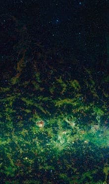

import Head from '@docusaurus/Head';

<Head>
  
</Head>

Caltech/IPAC astrophysicist with nearly 30 years at the Infrared Processing and Analysis Center, 147 peer-reviewed papers, and instrument characterization work on NEO Surveyor — the first space telescope built specifically to detect objects that could hit Earth. Shot and killed on the porch of his home in Llano, California on February 16, 2026, at age 67. Suspect Freddy Snyder, 29, was arrested and charged with murder. According to The Sentinel Network's investigation, Snyder had been found on Grillmair's property with an unregistered loaded rifle 58 days earlier, was arrested on two felonies, had both charges dismissed 11 days before the killing, and then returned to shoot Grillmair dead. Detectives say the two men did not know each other. No motive has been publicly disclosed.

| Field | Details |
|-------|---------|
| **Full Name** | Carl Johann Grillmair |
| **Born** | 1959, Calgary, Alberta, Canada |
| **Died** | February 16, 2026 |
| **Age at Death** | 67 |
| **Location of Death** | Llano, California (Antelope Valley), USA |
| **Cause of Death** | Gunshot wound |
| **Official Ruling** | Homicide |
| **Spouse** | Louise Grillmair |
| **Education** | B.Sc. Honours Astrophysics, University of Calgary (1983); M.Sc. Astronomy, University of Victoria (1986); Ph.D. Astronomy & Astrophysics, Australian National University (1993) |
| **Category** | Scientist / Astrophysicist / Victim |

## Assessment: SUSPICIOUS

According to The Sentinel Network's "THE LONG COUNT" investigation, the sequence of events surrounding Grillmair's murder goes well beyond random crime. The suspect, Freddy Snyder, was found on Grillmair's property carrying a loaded, unregistered rifle on December 20, 2025 — arrested on two felonies — had both charges dismissed under judicial discretion on February 5, 2026 — and was back on Grillmair's porch with a gun eleven days later, killing him. No motive has been publicly disclosed. Grillmair's work on infrared detection algorithms for finding dark, cold objects in space is described by The Sentinel Network as dual-use technology applicable to both planetary defense and military surveillance — the same math that finds near-Earth asteroids can reportedly find adversary satellites or hypersonic glide vehicles.

## Circumstances of Death

On February 16, 2026, at approximately 6:10 a.m., Carl Grillmair was found shot to death on the porch of his home in rural Llano, California, in the Antelope Valley region of Los Angeles County.

Later that day, sheriff's deputies arrested 29-year-old Freddy Snyder of Llano on charges related to carjacking his own relative and burglarizing a home. During the investigation, authorities linked Snyder to Grillmair's shooting. Detectives say they do not believe the two men knew each other. No motive for the killing has been publicly disclosed.

Snyder was charged with multiple felonies, including murder, burglary, and carjacking. His bail was set at $3.175 million. His arraignment was scheduled for March 26 in Lancaster. According to The Sentinel Network, he is the only perpetrator in the kinetic cases from the 2025-2026 scientist cluster who is still alive.

### The 11-Day Snyder Sequence

According to The Sentinel Network's investigation, the timeline leading to Grillmair's murder reveals a deeply troubling sequence:

- **December 20, 2025:** Grillmair spotted someone on his property and called law enforcement. Deputies responded and found Freddy Snyder in the area carrying a loaded, **unregistered** rifle.
- According to The Sentinel Network, Snyder told deputies he was walking to the post office, but property records reportedly show the post office is in the **opposite direction** from Snyder's address.
- Snyder was arrested and charged with two felonies: carrying a loaded firearm in a personal vehicle and attempted escape from jail.
- **February 5, 2026:** Both felony charges were **dismissed** under California Penal Code 1385 — judicial discretion, described as "in the furtherance of justice."
- According to subsequent reporting, the presiding judge was **Judge Osman Abbasi**, appointed by Governor Gavin Newsom. Snyder had been **released on his own recognizance** on December 23, 2025 — three days after arrest. On **December 28**, Snyder allegedly broke into a neighbor's home (burglary).
- Snyder **failed to appear** for his February 5 court date. Despite the no-show, Judge Abbasi dismissed both felony charges.
- **February 16, 2026 — eleven days later:** Snyder was back on Grillmair's porch with a gun. He shot and killed him.

The Sentinel Network describes this as "the 11-day Snyder sequence" and frames the dismissal of felony weapons charges against a man found on the future victim's property as a critical unexplained element of the case.

## Background

Carl Grillmair worked at Caltech as an astronomer and astrophysicist for nearly 30 years, based at the Infrared Processing and Analysis Center (IPAC). He published 147 peer-reviewed papers over his career, with three more in preparation at the time of his death. He secured over **400 hours as principal investigator** and **2,700+ hours as co-investigator** on the Hubble and Spitzer Space Telescopes. He was renowned for his research on the collisions and tidal interactions of galaxies, dark matter, and the search for water on planets outside our solar system (exoplanets). According to the Daily Mail, he contributed to the discovery of water on a distant planet, with colleagues calling his work "ingenious" and adding that the research could point to signs of life less than 160 light-years from Earth. In 2007, as lead author, he made a landmark discovery capturing sufficient light from distant planets to identify atmospheric molecules — a first in the field. He also discovered dozens of stellar streams — ancient remnants from collisions between the Milky Way and other galaxies.

### Awards and Recognition

- **NASA Exceptional Scientific Achievement Medal** (2011)
- Named one of **MacLean's Magazine's "Thirty-Nine Canadians Who Make the World a Better Place"** (2006)
- Multiple NASA Group Achievement Awards
- **LA County Board of Supervisors** posthumous honor (March 3, 2026)

### Education and Career Path

Grillmair earned his B.Sc. Honours in Astrophysics from the University of Calgary (1983), his M.Sc. in Astronomy from the University of Victoria (1986, Petrie fellowship), and his Ph.D. in Astronomy & Astrophysics from the Australian National University (1993, NSERC scholarship). Before joining IPAC, he held positions at the Space Telescope Science Institute in Baltimore (1985-1987), UC Santa Cruz (1992-1995), and Caltech as a Research Fellow (1996-1997).

### NEO Surveyor and Dual-Use Technology

According to The Sentinel Network, Grillmair's most consequential recent work was as an instrument characterization specialist for **NEO Surveyor** — the first space telescope built specifically to find objects that could hit Earth. He also ran quality assurance on the **NEOWISE Science Data Center**. The algorithms he built and validated find dark, cold objects against the black of space using infrared heat signatures.

The Sentinel Network describes this technology as inherently **dual-use**: finding asteroids reportedly uses the same math as finding Chinese satellites or Russian hypersonic glide vehicles. According to their investigation, AFOSR (an Air Force Research Laboratory directorate) funds research in the same spectral bands that NEOWISE operates in. As The Sentinel Network puts it: "Planetary defense and missile defense are the same physics problem with different names."

### IPAC-JPL Institutional Connection

IPAC processes all NEO Surveyor data. NEO Surveyor is developed by JPL, which is managed by Caltech. According to The Sentinel Network, Grillmair's IPAC and [Monica Jacinto Reza](Monica_Jacinto_Reza.mdx)'s JPL are the same institutional family — the same campus corridor, the same San Gabriel Valley. His data pipeline ran through the same JPL campus where Reza worked when she vanished.

### Personal Life

His colleague Sergio Fajardo-Acosta, who worked alongside him for 26 years, mourned his loss. Caltech released a statement saying he "passed away suddenly" — notably, according to The Sentinel Network, without using the word "shot."

Grillmair lived in the desert because the nighttime darkness was better for watching the sky. He built his own observatory at his home with multiple telescopes. According to colleagues, he flew small planes and gliders that he maintained himself, and would cheerfully take anyone up who asked. He was also an avid cyclist with interests in renewable energy and classical and rock music.

At the time of his death, he had recently begun a project to **test new instrumentation at Palomar Observatory** to monitor for meteor impacts on the Moon's surface during an upcoming lunar eclipse. As NEO Surveyor lead scientist Joe Masiero said: "It is a really exciting project, and I know he was looking forward to seeing what we could learn about the near-space environment from that."

### UAP and Defense Relevance

Following Grillmair's death, some social media accounts drew connections between his work and alleged UAP-related research. His death came less than two months after the murder of MIT plasma physicist Nuno Loureiro, contributing to pattern speculation.

According to The Sentinel Network, while Grillmair's published work was in observational astrophysics, his infrared detection expertise has direct defense applications. The algorithms for finding dark objects in space using thermal signatures are reportedly applicable to both near-Earth object detection and military space surveillance. The Sentinel Network notes that AFOSR funds research in the same spectral bands, placing Grillmair's work within the broader AFRL ecosystem that connects several of the scientists in the 2025-2026 cluster.

### The Fireball Blind Spot (March 2026)

In the weeks following Grillmair's murder, the American Meteor Society and NASA confirmed a March 2026 spike in bright fireballs causing real-world damage across multiple countries. On March 8 and 11, fireballs were reported over Germany. On March 17, a sonic boom accompanied by meteorite falls hit Ohio. On March 21, a daytime fireball estimated at approximately one ton, traveling at 35,000 mph with an explosive yield of roughly 26 tons of TNT, struck the Houston, Texas area — a meteorite pierced through a residential roof into a bedroom. Additional events were reported in California and Michigan.

The Sentinel Network's March 25, 2026 article "The Blind Spot: Rocks Are Falling Through Our Roofs" explicitly connected the fireball spike to the scientist cluster, noting that Grillmair was the person who validated the instruments and sensors for NEO Surveyor — the specific telescope designed to spot Earth-impacting objects before they hit. As The Sentinel Network framed it: the man who tested whether we would see these rocks coming was shot dead on his porch, and within weeks, rocks began falling through roofs. The article characterized the deaths as the removal of the exact talent pipeline that could detect, characterize, or publicly explain incoming NEO threats.

### The 3I/ATLAS Connection

The Sentinel Network's "Blind Spot" article also tied the scientist cluster to 3I/ATLAS — the third confirmed interstellar object, discovered in 2025 by the ATLAS survey. While officially classified as a natural comet, The Sentinel Network's forensic audits of JWST, Keck, Tianwen-1, and Hubble data claim it fails every natural model: three engineered jets in harmonic 120-degree array acting as attitude control (gyro-stabilized, Sun-pointed), methane deuterium ratios 14 times higher than solar system comets, dark side hotter than sunlit side, gas venting in multiple directions faster than simulations allow, and zero ice detected where the comet model demands it. SETI reportedly scanned 3I/ATLAS like a probe (radio search, data purging). NASA papers reportedly continue to force "icy grain sublimation" explanations that The Sentinel Network says were already debunked. The Sentinel Network linked the fireball spike to a possible debris field in 3I/ATLAS's wake and noted NASA/CNEOS data edits and blackouts on fireball velocities. Grillmair's NEO Surveyor validation work — the ability to independently detect and characterize objects entering Earth's atmosphere — is positioned by The Sentinel Network as precisely the capability being neutralized.

## Why This Death Possibly Raises Questions

- **The 11-Day Snyder Sequence:** According to The Sentinel Network, the suspect was found on Grillmair's property with a loaded unregistered rifle on December 20, 2025, arrested on two felonies, had both charges dismissed under judicial discretion on February 5, 2026, and killed Grillmair eleven days later on February 16, 2026
- **Release, burglary, no-show, dismissal:** Snyder was released on his own recognizance three days after arrest (Dec 23), allegedly burgled a neighbor's home five days later (Dec 28), failed to appear in court (Feb 5), and had his charges dismissed anyway by Judge Osman Abbasi
- **The post office story:** According to The Sentinel Network, Snyder's claim that he was walking to the post office is contradicted by property records showing the post office is in the opposite direction from his address
- **No disclosed motive:** Detectives say the two men did not know each other, and no motive has been publicly released
- **Dual-use technology:** Grillmair's infrared detection algorithms for finding dark objects in space are described by The Sentinel Network as applicable to military surveillance — the same physics as missile defense
- **AFRL funding overlap:** According to The Sentinel Network, AFOSR funds research in the same spectral bands that NEOWISE operates in
- **Institutional proximity to Monica Reza:** His IPAC data pipeline ran through the same JPL campus where Reza worked before her disappearance
- **Part of a cluster:** His murder occurred less than two months after the killing of MIT plasma physicist Nuno Loureiro, and within the broader 2025-2026 scientist cluster
- **Caltech's careful language:** Their statement said he "passed away suddenly" without using the word "shot"

## The Counterargument

- Snyder was also linked to carjacking his own relative and burglarizing a home on the same day as Grillmair's murder, suggesting a broader crime spree rather than a targeted killing
- Llano is a remote, rural area where property crime is not uncommon
- The dismissal of Snyder's prior felony charges under PC 1385 is not unusual in California's overburdened court system — charges are routinely dismissed under judicial discretion
- Grillmair's published work was in observational astrophysics (galaxy dynamics, exoplanet atmospheres, stellar streams), not in classified programs
- The dual-use framing of his infrared detection work, while technically accurate, could apply to many astronomers working in infrared surveys
- No evidence has emerged that Grillmair held a security clearance or worked on classified defense projects
- Snyder had no known connection to aerospace, defense, or intelligence communities

## The 2025-2026 Scientist Cluster

Grillmair's murder is one of nine scientist deaths, disappearances, or attacks between June 2025 and March 2026 identified by The Sentinel Network's investigation. Congressman Tim Burchett has publicly linked a subset of these cases as a pattern. The Daily Mail reported on March 22, 2026, on five cases involving scientists who specialized in advanced technologies with a shared link to UFO-related research or defense contracts. The Sentinel Network's broader count of nine includes additional cases. Among the most prominent:

- **[Monica Jacinto Reza](Monica_Jacinto_Reza.mdx)** — Co-inventor of Mondaloy superalloy. Missing since June 22, 2025.
- **[Jason Thomas](Jason_Thomas.mdx)** — Novartis chemical biology director. Vanished December 12, 2025. Body found March 17, 2026.
- **[Nuno Loureiro](Nuno_Loureiro.mdx)** — MIT Plasma Science and Fusion Center director. Shot December 15, 2025.
- **Carl Grillmair** (this profile) — Caltech astrophysicist. Shot on his porch February 16, 2026.
- **[William McCasland](William_McCasland.mdx)** — Retired USAF Major General. Missing since February 27, 2026.

## Congressional Demands for Witness Protection

Former Congressman Matt Gaetz has publicly demanded witness protection for key UFO scientists, citing the pattern of deaths and disappearances in this cluster. Gaetz stated:

> "I would have witnesses protection for key witnesses right now. And Congress has the ability to get that done in concert with the Department of Justice."
> — **Matt Gaetz**, demanding witness protection for UFO scientists after researchers were found dead or missing

Grillmair is one of five scientists whose deaths or disappearances between June 2025 and March 2026 prompted this unprecedented congressional call for protection:

- **[Monica Jacinto Reza](Monica_Jacinto_Reza.mdx)** — Co-inventor of Mondaloy superalloy. Missing since June 22, 2025. No trace found.
- **[Jason Thomas](Jason_Thomas.mdx)** — Novartis chemical biology director. Vanished December 12, 2025. Body found March 17, 2026.
- **[Nuno Loureiro](Nuno_Loureiro.mdx)** — MIT Plasma Science and Fusion Center director. Shot and killed December 15, 2025.
- **Carl Grillmair** (this profile) — Caltech astrophysicist. Shot on his porch February 16, 2026.
- **[William McCasland](William_McCasland.mdx)** — Retired USAF Major General, AFRL commander. Missing since February 27, 2026.

The fact that a former member of Congress is calling for DOJ witness protection for scientists connected to UAP research represents an extraordinary escalation — an acknowledgment at the federal level that these deaths and disappearances may not be coincidental and that surviving witnesses may be in danger.

## See Also

- [JPL / LANL / AFRL Scientist Cluster 2023–2026](/uaps/JPL_LANL_AFRL_Scientist_Cluster) — Full overview of the nine scientists and defense insiders who died or vanished
- [NASA JPL](NASA_JPL.mdx) — Organization overview: four JPL-corridor scientists gone in three years
- [Carl Grillmair (Zero Point Energy)](https://uapmurders.com/uaps/Details/Carl_Grillmair/) — This case also appears in the Zero Point Energy project
- [Nuno Loureiro](Nuno_Loureiro.mdx) — MIT plasma physicist murdered two months earlier, also subject of UAP speculation
- [Jason Thomas](Jason_Thomas.mdx) — Novartis scientist found dead; part of the same scientist cluster
- [Michael David Hicks](Michael_David_Hicks.mdx) — JPL research scientist (DART Project), died July 2023 with no cause disclosed; extends JPL corridor losses to four scientists in three years
- [Monica Jacinto Reza](Monica_Jacinto_Reza.mdx) — Aerospace materials scientist missing since June 2025; same IPAC-JPL institutional family
- [William McCasland](William_McCasland.mdx) — Retired USAF Major General missing since February 2026
- [Philip Leonard](Philip_Leonard.mdx) — LANL chemist killed February 2024, possible precursor to the 2025 scientist cluster
- [Christopher Fallen](Christopher_Fallen.mdx) — AFRL/HAARP physicist murdered February 2024, same month as Leonard

## Other Shocking Stories

- [Mae Brussell](Mae_Brussell.mdx): Pioneering conspiracy researcher and radio host who died of fast-acting cancer in 1988, seven months after receiving death...
- [Michael Baker](Michael_Baker.mdx): 22-year-old Plessey digital communications expert and part-time SAS member killed when his car crashed through a barrier near...
- [Shani Warren](Shani_Warren.mdx): GEC/Micro Scope employee found gagged, bound, and drowned in 18 inches of water at Taplow Lake — originally...
- [Dylan Borland](Dylan_Borland.mdx): Former U.S. Air Force geospatial intelligence specialist who testified before Congress in September 2025 about witnessing a silent...

## Key Quotes from Colleagues

> "He was part of IPAC's bedrock for many years, and his passing impacts all of us across IPAC."
> — Tom Greene, IPAC Executive Director

> "His methods on exoplanets and galactic structure studies were truly detective work. It was always a pleasure to experience Carl's creativity in doing science."
> — Sergio Fajardo-Acosta, IPAC Astronomer (colleague for 26 years)

> "It is a really exciting project, and I know he was looking forward to seeing what we could learn about the near-space environment from that."
> — Joe Masiero, NEO Surveyor lead scientist, on Grillmair's lunar meteor impact project

## Sources

- [Caltech Mourns the Passing of Carl Grillmair (1959-2026)](https://www.caltech.edu/about/news/caltech-mourns-the-passing-of-carl-grillmair-19592026)
- [IPAC Mourns the Passing of Carl Grillmair](https://www.ipac.caltech.edu/news/408)
- [Carl Grillmair Curriculum Vitae — IPAC/Caltech](https://web.ipac.caltech.edu/staff/carl/cgcv.html)
- [ABC7 Los Angeles: Man charged with killing Caltech astrophysicist Carl Grillmair in Llano](https://abc7.com/post/man-charged-killing-caltech-astrophysicist-carl-grillmair-llano-carjacking-own-relative-burglarizing-home/18626990/)
- [FOX 11 Los Angeles: Man charged with killing Caltech scientist was arrested 2 months earlier](https://www.foxla.com/news/caltech-scientist-carl-grillmair-suspect-freddy-snyder-charged)
- [CBS News LA: Caltech scientist shot to death in front of Los Angeles County home](https://www.cbsnews.com/losangeles/news/caltech-scientist-shot-to-death-in-front-of-los-angeles-county-home/)
- [Newsweek: Man Who Allegedly Killed Scientist Released From Jail Weeks Earlier](https://www.newsweek.com/man-allegedly-killed-scientist-released-from-jail-weeks-earlier-11574228)
- [KTLA: Caltech scientist identified as victim in Antelope Valley homicide](https://ktla.com/news/local-news/caltech-scientist-identified-as-victim-in-antelope-valley-homicide/)
- [Daily News: Caltech scientist, 67, shot to death in Llano](https://www.dailynews.com/2026/02/19/caltech-scientist-67-shot-to-death-in-llano/)
- [Pasadena Star News: Caltech scientist, 67, shot to death in Llano](https://www.pasadenastarnews.com/2026/02/19/caltech-scientist-67-shot-to-death-in-llano/)
- [Pasadena Now: Man Charged With Killing Caltech Scientist Had Been Released After Loaded-Gun Arrest](https://pasadenanow.com/main/man-charged-with-killing-caltech-scientist-had-been-released-after-loaded-gun-arrest)
- [AV Press: Llano shooting suspect had prior gun arrest](https://www.avpress.com/news/llano-shooting-suspect-had-prior-gun-arrest/article_9ee90e7c-9050-4b41-aab5-81eb90c81da8.html)
- [Daily Mail: Mystery of five missing scientists sends chill across America](https://www.dailymail.co.uk/sciencetech/article-14607417/mystery-five-missing-scientists-three-dead-troubling-link-dc.html)
- [THE LONG COUNT — The Sentinel Network](https://thesentinelnetwork.substack.com/p/the-long-count-we-started-with-two) (March 18, 2026)
- [THE BLIND SPOT: Rocks Are Falling Through Our Roofs — The Sentinel Network](https://thesentinelnetwork.substack.com/p/the-blind-spot-rocks-are-falling) (March 25, 2026)
- [Wikipedia: Carl Grillmair](https://en.wikipedia.org/wiki/Carl_Grillmair)
- [Carl Grillmair — Google Scholar](https://scholar.google.com/citations?user=skWK5ssAAAAJ&hl=en)

## Sentinel Network Cluster (March 2026 compiled list)

Grillmair's case is included in an 11-person cluster compiled by @thesentinelnet on X (March 25, 2026) spanning July 2024–February 2026 across CA, NM, MA, OH/Wright-Patterson, connecting JPL, Caltech/IPAC, LANL, AFRL, and MIT. Shared signatures across cases include factory-reset phones, items left behind, negative scent/cadaver-dog searches, and institutional silence. The cluster emphasizes overlaps with orbital surveillance, NEO/fireball detection, rocket propulsion/alloys, plasma/fusion, and UAP-adjacent research.

Specific to Grillmair: Caltech/IPAC astrophysicist shot on his porch in Llano, CA (Antelope Valley), Feb 16, 2026, at age 67. Worked on NEOWISE data quality and NEO Surveyor instruments for detecting hazardous comets, asteroids, and fireballs. Suspect Freddy Snyder (29) was charged after a linked carjacking/burglary; prior trespassing-related charges were reportedly dismissed 11 days before the killing. Research also included exoplanets and dark matter.

See also: [JPL/LANL/AFRL Scientist Cluster](../JPL_LANL_AFRL_Scientist_Cluster)

- [@TruthXVector — US Scientist Cluster & BROWN-CAHILL METHOD Diagram — X](https://x.com/TruthXVector/status/2044216591840125300) — Documents pattern of 8 dead/missing US scientists; Grillmair's dual-use asteroid/comet sensors expertise maps onto the dual-use sensors subsystem of the alleged classified antigravity propulsion diagram

*This information was built by Grok and Claude AI research.*

**Status:** Deceased (2026)

---

## Additional context from the UAP Energy Systems Murders investigation

Caltech astrophysicist at IPAC. Instrument characterization specialist for NEO Surveyor — the first space telescope built to find objects that could hit Earth. Ran QA on the NEOWISE Science Data Center. 147 peer-reviewed papers. Shot dead on his front porch at 6:10 a.m. on February 16, 2026, in Llano, California. The suspect, Freddy Snyder, had been arrested on Grillmair's property two months earlier with a loaded, unregistered rifle — but the charges were dismissed eleven days before the killing. Snyder has been charged with murder and is awaiting trial.

| Field | Details |
|-------|---------|
| **Full Name** | Carl Johann Grillmair |
| **Born** | 1959, Calgary, Alberta, Canada |
| **Died** | February 16, 2026 |
| **Age at Death** | 67 |
| **Location of Death** | 30700 block of 165th Street East, Llano, Antelope Valley, Los Angeles County, California |
| **Cause of Death** | Gunshot wound to the torso |
| **Official Ruling** | Homicide |
| **Category** | Scientist / Astrophysicist / Defense-Adjacent |

## Assessment: HIGHLY SUSPICIOUS

Carl Grillmair was murdered by a man who had been caught armed on his property two months earlier and whose charges were inexplicably dismissed eleven days before the killing. Grillmair's field — infrared detection of objects in space — is explicitly dual-use: the same physics that finds asteroids tracks adversarial satellites and hypersonic weapons. AFOSR, an AFRL directorate, funds research in the same spectral bands as Grillmair's NEOWISE telescope. His IPAC at Caltech and [Monica Jacinto Reza](Monica_Jacinto_Reza.mdx)'s JPL are the same institutional family — the same campus corridor in the San Gabriel Valley where America's planetary defense infrastructure lives. He was killed eleven days after the man who'd been arrested on his property had his charges dismissed, and eleven days before [William Neil McCasland](/uaps/Details/William_McCasland) vanished.

## Circumstances of Death

On the morning of **February 16, 2026**, at approximately 6:10 a.m., LA County Sheriff's deputies responded to a 911 call in the 30700 block of 165th Street East in Llano — a rural desert community in the Antelope Valley. They found Grillmair on his front porch. Gunshot wound to the torso. Dead at the scene.

**Freddy Snyder**, 29, was arrested later that day after a carjacking in the same area. He was charged with murder, carjacking, and a December 28 burglary. Bail set at $3.175 million. Arraignment scheduled for March 26 in Lancaster.

Detectives say they don't believe the two men knew each other. No motive has been publicly disclosed.

### The Eleven Days

On **December 20, 2025**, Grillmair spotted someone on his property who didn't belong there. He called law enforcement. Deputies found Snyder in the area carrying a **loaded, unregistered rifle**. Snyder told them he was walking to the post office.

Property records show Grillmair's home and the local post office are in **opposite directions** from Snyder's address.

Snyder was arrested. Charged with carrying a loaded firearm in a personal vehicle and attempted escape from jail. Two felonies.

On **February 5, 2026**, both charges were **dismissed** under California Penal Code 1385 — judicial discretion, "in the furtherance of justice."

**Eleven days later**, Snyder was back on Grillmair's porch with a gun.

The identity of the presiding judge who dismissed the charges has not been located in accessible public records. The case number has not been located. Snyder was released on his own recognizance on December 23, 2025.

Snyder is the only surviving suspect in the AFRL-connected casualty cluster. His arraignment is scheduled for March 26 in Lancaster. He has not yet been tried.

## Background

### Scientific Career

Grillmair was an Associate Research Scientist at **IPAC** (Infrared Processing and Analysis Center) at Caltech for nearly 30 years, joining in 1997. His research:

- **Stellar streams** — remnants of ancient galactic collisions
- **Exoplanets** — discovering atmospheric compositions of distant planets (led 2007 team that captured light from exoplanets identifying water)
- **Dark matter** — using stellar streams to map dark matter distribution
- **Infrared astronomy** — NASA's Spitzer Space Telescope and NEOWISE missions
- **NEO Surveyor** — instrument characterization specialist for the first space telescope built specifically to find objects that could hit Earth
- **NEOWISE Science Data Center** — quality assurance

### Key Achievements

- 147 peer-reviewed papers
- 400+ hours as Hubble/Spitzer telescope principal investigator
- 2,700+ hours as co-principal investigator
- **2011 NASA Exceptional Scientific Achievement Medal**
- Named to Maclean's magazine honor roll (2006) — "Thirty-Nine Canadians Who Make the World a Better Place"

### The Dual-Use Connection

The algorithms Grillmair built and validated find dark, cold objects against the black of space using nothing but the heat they borrowed from the sun. That's how you find an asteroid. **It's also how you find a Chinese satellite. Or a Russian hypersonic glide vehicle.** Same math. Same pipeline. Different customer.

**AFOSR** — one of AFRL's own directorates — funds research into long-wavelength infrared detection in the same spectral bands that Grillmair's NEOWISE telescope operates in. Planetary defense and missile defense are the same physics problem with different names.

### Institutional Connection to Reza

IPAC doesn't exist in isolation. It processes all NEO Surveyor data. NEO Surveyor is developed by **JPL**. JPL is managed by **Caltech**. Grillmair's IPAC and [Monica Jacinto Reza](Monica_Jacinto_Reza.mdx)'s JPL are the same institutional family. The same campus corridor. The same stretch of the San Gabriel Valley where America's planetary defense infrastructure is built.

Both vanished/died in LA County. Both connected to the JPL/Caltech corridor.

### Personal Life

He lived in the desert because the nighttime darkness was better for watching the sky. He built his own observatory at his home. He flew small planes and gliders that he maintained himself and cheerfully took anyone up who asked.

## Why This Death Is Highly Suspicious

- **Dismissed charges enabled the killing:** Snyder was arrested with a loaded, unregistered rifle on Grillmair's property. Charges dismissed 11 days before the murder. Had they not been dismissed, Snyder would have been in custody
- **No motive:** No relationship between victim and suspect, no motive publicly released
- **Lied about destination:** Snyder told deputies he was walking to the post office — which was in the opposite direction from his address
- **Dual-use infrared work:** Grillmair's infrared detection algorithms have direct military applications in satellite tracking and hypersonic weapons detection
- **AFRL funding connection:** AFOSR funds the same spectral band research
- **JPL/Caltech institutional family:** Same campus corridor as where Reza worked before vanishing
- **Timeline acceleration:** Snyder's charges dismissed Feb 5, Grillmair dead Feb 16, McCasland gone Feb 27 — three events in 22 days
- **Part of AFRL cluster:** One of nine AFRL-connected casualties in nine months (June 2025 – Feb 2026)

## The Counterargument

- Freddy Snyder had a documented criminal history and erratic behavior; the murder may have been a random act by a disturbed individual with no connection to Grillmair's work
- Snyder was also charged with a December 28 burglary and a carjacking on the day of the murder, consistent with a pattern of escalating criminal behavior rather than a targeted assassination
- The charge dismissal under California Penal Code 1385 is a routine judicial mechanism — California courts dismiss cases for procedural and resource reasons thousands of times per year
- Grillmair's infrared astronomy work was unclassified and published in peer-reviewed journals; eliminating him would not remove any secret knowledge from circulation
- Rural desert communities in the Antelope Valley experience property crime and violent incidents; a violent encounter with a trespasser, while tragic, is not unprecedented in the area
- The "AFRL cluster" framing groups together events across different states, agencies, and circumstances that may share no actual connection beyond loose institutional proximity

## Congressional Demands for Witness Protection

Former Congressman Matt Gaetz has publicly demanded witness protection for key UFO scientists, citing the pattern of deaths and disappearances in this cluster. Gaetz stated:

> "I would have witnesses protection for key witnesses right now. And Congress has the ability to get that done in concert with the Department of Justice."
> — **Matt Gaetz**, demanding witness protection for UFO scientists after researchers were found dead or missing

Grillmair is one of five scientists whose deaths or disappearances between June 2025 and March 2026 prompted this unprecedented congressional call for protection:

- **[Monica Jacinto Reza](Monica_Jacinto_Reza.mdx)** — Co-inventor of Mondaloy superalloy. Missing since June 22, 2025. No trace found.
- **[Jason Thomas](/uaps/Details/Jason_Thomas)** — Novartis chemical biology director. Vanished December 12, 2025. Body found March 17, 2026.
- **[Nuno Loureiro](Nuno_Loureiro.mdx)** — MIT Plasma Science and Fusion Center director. Shot and killed December 15, 2025.
- **Carl Grillmair** (this profile) — Caltech astrophysicist. Shot on his porch February 16, 2026.
- **[William Neil McCasland](/uaps/Details/William_McCasland)** — Retired USAF Major General, AFRL commander. Missing since February 27, 2026.

The fact that a former member of Congress is calling for DOJ witness protection for scientists connected to UAP research represents an extraordinary escalation — an acknowledgment at the federal level that these deaths and disappearances may not be coincidental and that surviving witnesses may be in danger.

## See Also

- [Monica Jacinto Reza](Monica_Jacinto_Reza.mdx) — Inventor of Mondaloy, JPL employee. Same institutional family. Vanished June 2025
- [William Neil McCasland](/uaps/Details/William_McCasland) — Former AFRL Commander. Vanished 11 days after Grillmair's murder
- [Dallis Hardwick](Dallis_Hardwick.mdx) — AFRL Materials Directorate senior scientist. Died 2014
- [Nuno Loureiro](Nuno_Loureiro.mdx) — MIT fusion scientist shot dead in 2025
- [Jacob Prichard](Jacob_Prichard.mdx) — AFRL Sensors Directorate (same technological pipeline). Dead Oct 2025
- [Melissa Casias](Melissa_Casias.mdx) — LANL employee who vanished June 2025
- [Carl Grillmair (UAP Deaths project)](/uaps/Details/Carl_Grillmair) — Parallel profile

## Other Shocking Stories

- [Stefan Marinov](Stefan_Marinov.mdx): Bulgarian physicist fell from a university staircase while researching unconventional electromagnetic energy.
- [Trevor Constable](Trevor_Constable.mdx): Orgone weather engineer demonstrated technology on ships for decades. Military observed but never acknowledged.
- [Eric Wang](Eric_Wang.mdx): Headed Wright-Patterson's Office of Special Studies. Died at 54 — no cause of death stated.
- [Nuno Loureiro](Nuno_Loureiro.mdx): MIT plasma physicist and fusion center director shot dead outside his apartment, December 2025.

## Sources

- [Caltech: Mourns the Passing of Carl Grillmair](https://www.caltech.edu/about/news/caltech-mourns-the-passing-of-carl-grillmair-19592026)
- [IPAC: Caltech and IPAC Mourn the Passing of Carl Grillmair](https://www.ipac.caltech.edu/news/408)
- [Carl Grillmair's CV at IPAC](https://web.ipac.caltech.edu/staff/carl/cgcv.html)
- [FOX LA: Caltech scientist fatally shot](https://www.foxla.com/news/caltech-scientist-carl-grillmair-killed-antelope-valley)
- [ABC7: Man charged with killing Caltech astrophysicist](https://abc7.com/post/man-charged-killing-caltech-astrophysicist-carl-grillmair-llano-carjacking-own-relative-burglarizing-home/18626990/)
- [Newsweek: Suspect released from jail weeks earlier](https://www.newsweek.com/man-allegedly-killed-scientist-released-from-jail-weeks-earlier-11574228)
- [Antelope Valley Press: Llano shooting suspect had prior gun arrest](https://www.avpress.com/news/llano-shooting-suspect-had-prior-gun-arrest/)
- [LA County Supervisor Barger memorial resolution](https://kathrynbarger.lacounty.gov/supervisor-barger-adjourns-board-of-supervisors-meeting-in-memory-of-slain-antelope-valley-astrophysicist-dr-carl-grillmair-caltech-scientist-honored-for-groundbreaking-space-research/)
- [The Sentinel Briefing: THE LONG COUNT](https://thesentinelnetwork.substack.com/p/the-long-count-we-started-with-two)

*This information was built by Grok and Claude AI research.*

**Status:** Deceased (2026)

---

## Additional context from the UAP Physics Murders investigation

Canadian-born astrophysicist and 28-year Caltech/IPAC research scientist who characterized the detection blind spots in the NEO Surveyor planetary-defense telescope — work with direct dual-use relevance — and was shot and killed on his front porch in rural California on February 16, 2026. His alleged killer had been arrested for carrying a loaded unregistered rifle on Grillmair's property eleven weeks earlier; gun charges were dismissed eleven days before the murder, and Grillmair was never notified.

| Field | Details |
|-------|---------|
| **Full Name** | Carl Johann Grillmair |
| **Born** | 1959, Calgary, Alberta, Canada |
| **Died** | February 16, 2026, Llano, California (age 67) |
| **Age at Death** | 67 |
| **Location of Death** | 30700 block of 165th Street East, Llano, California (unincorporated Antelope Valley, Los Angeles County) |
| **Cause of Death** | Single gunshot wound to the torso |
| **Official Ruling** | Homicide — suspect charged |
| **Nationality** | Canadian (long-term US resident, career at US federal institutions) |
| **Killed on US Soil** | Yes |
| **Category** | Scientist / Astrophysicist |
| **Investigation** | Physics |

## Assessment: SUSPICIOUS

Grillmair's death is categorized as a homicide with a named suspect and filed charges — it is not an officially mysterious death. What raises questions is the institutional failure preceding it: the alleged killer was arrested on Grillmair's property carrying a loaded, unregistered firearm in November 2025, yet the charges were dismissed eleven days before the murder under a discretionary "in the interest of justice" provision. Grillmair was not notified of the dismissal. No motive has been released. The timing of his death — in the middle of a documented cluster of deaths among scientists working in plasma physics, advanced propulsion materials, and dual-use sensors — and the nature of his specific work (finding coverage blind spots in planetary-defense instruments) add context that warrants inclusion here.

## Circumstances of Death

### The Shooting

On the morning of February 16, 2026, at approximately 6:10 a.m., Carl Grillmair was found shot on the front porch of his rural property at the 30700 block of 165th Street East in Llano, California — an unincorporated stretch of the Antelope Valley in Los Angeles County. He had suffered a single gunshot wound to the torso. Paramedics responded but were unable to save him.

### The Alleged Shooter and Prior Incident

The Los Angeles County Sheriff's Department identified Freddy Snyder, 29, a Llano resident, as the suspect.

A documented prior incident had occurred eleven weeks before the murder:

- **December 20, 2025:** Grillmair called LA County Sheriff's deputies to report Snyder trespassing on his rural property while carrying a loaded, unregistered rifle. Snyder was arrested on suspicion of carrying a loaded firearm in public and attempted jail escape.
- **December 23, 2025:** Snyder was released on his own recognizance.
- **February 5, 2026 — eleven days before the murder:** The felony gun charges were dismissed under California Penal Code 1385, described by prosecutors as dismissal "in the furtherance of justice." Grillmair was not notified of the dismissal.

On the morning of the shooting, Snyder also allegedly carjacked a vehicle belonging to a family member. The family did not report the carjacking until after learning that Snyder had allegedly killed Grillmair.

### Charges and Legal Proceedings

On February 18, 2026, the Los Angeles County District Attorney filed charges against Snyder: murder, carjacking, and burglary, with the allegation of personal and intentional discharge of a firearm causing great bodily injury. Bail was set at approximately $2–3 million. An arraignment was scheduled for March 26, 2026.

Law enforcement stated: "Detectives don't believe the two men knew each other." No motive has been publicly released.

## Background

Carl Johann Grillmair was born in 1959 in Calgary, Alberta, Canada. He earned his B.S. in Astrophysics from the University of Calgary (1983), his M.S. from the University of Victoria (1986), and his Ph.D. from the Australian National University (1993), with a dissertation on the dynamics of globular cluster systems.

In 1997, Grillmair joined Caltech's Infrared Processing and Analysis Center (IPAC), where he remained for the rest of his career — nearly 30 years. He was married to Louise Grillmair. He was awarded more than 400 hours of Hubble and Spitzer Space Telescope time as principal investigator and 2,700+ hours as co-PI. He published 147 peer-reviewed papers and received the 2011 NASA Exceptional Scientific Achievement Medal. MacLean's magazine named him in 2006 as one of "Thirty-Nine Canadians Who Make the World a Better Place to Live."

## Physics Connections

### NEOWISE — Infrared Asteroid and Comet Detection

The Wide-field Infrared Survey Explorer (WISE) was repurposed in 2013 as NEOWISE to hunt near-Earth objects — asteroids and comets that could potentially impact Earth. Grillmair served as **quality assurance scientist and pipeline operator** at the NEOWISE Science Data Center, ensuring the accuracy of the data pipeline that tracked potentially dangerous objects. NEOWISE concluded operations in 2023.

The sensor technology underlying NEOWISE — infrared imaging of dark, cold, fast-moving objects in space — is directly analogous to sensors used in missile defense, surveillance satellite characterization, and ballistic missile early warning. The same detection methodologies apply to both asteroid tracking and tracking other objects on inbound trajectories.

### NEO Surveyor — Planetary Defense Telescope Blind Spot Analysis

The Near-Earth Object Surveyor (NEO Surveyor) is a next-generation dedicated planetary defense telescope designed to find 90% of near-Earth objects 140 meters or larger — the size class capable of destroying a city. Planned for launch via SpaceX Falcon 9 in 2027, it is managed by the Jet Propulsion Laboratory for NASA's Planetary Defense Coordination Office.

Grillmair's specific role on NEO Surveyor was **instrument characterization specialist**: validating that the telescope's instruments would perform to specification, and specifically identifying the telescope's **detection blind spots** — the gaps in coverage where it would fail to detect approaching objects.

This blind spot analysis has direct dual-use relevance. The same gaps in NEO Surveyor's coverage of objects on inbound trajectories represent gaps in strategic awareness more broadly — knowing what a planetary defense telescope misses is equivalent to knowing what strategic warning systems miss for other object types.

At the time of his death, Grillmair was also testing new instrumentation at Caltech's Palomar Observatory to monitor for meteor impacts on the Moon during an upcoming lunar eclipse.

## Why This Death Raises Questions

- The alleged killer was arrested on Grillmair's property with a loaded unregistered rifle eleven weeks before the murder — a direct prior threat that the legal system failed to prosecute
- The charges were dismissed eleven days before the murder under a discretionary "in furtherance of justice" provision; the circumstances of that dismissal have not been publicly explained
- Grillmair was never notified that the prior charges were dropped, removing his ability to take protective measures
- No motive has been identified for the killing
- Law enforcement stated the two men "didn't know each other" — creating an unexplained gap between the prior trespassing incident and the lethal shooting
- Grillmair's death falls within the documented 2023–2026 cluster of deaths among US scientists working in plasma physics, advanced propulsion materials, and dual-use sensors (see [the broader cluster context](William_McCasland.mdx))
- His specific work — identifying detection blind spots in planetary-defense infrared sensors — has the most direct dual-use implications of any scientist in the recent cluster

## The Counterargument

- A named suspect has been charged and the case is proceeding through the criminal justice system — this distinguishes Grillmair's death from the "no suspect, no motive, no explanation" cases in the broader cluster
- The prior trespassing incident and alleged carjacking suggest Snyder may be a violent opportunist with no strategic motive
- The charge dismissal, while procedurally irregular, is not uncommon under California Penal Code 1385 for first-time firearm offenses
- Grillmair's specific work on NEO Surveyor, while dual-use in principle, was publicly funded research without documented classified applications
- The "cluster" pattern is disputed by authorities, who have stated they see no coordinated pattern across the recent deaths

## The @TMBSPACESHIPS Diagram Connection

On January 25, 2026 — twenty-two days before Grillmair was shot — an anonymous X account called @TMBSPACESHIPS (a self-described 38-year retired USAF PhD engineer with family who worked in classified programs since the mid-1960s) posted a technical diagram labeled **"BROWN-CAHILL METHOD for the REDUCTION of KINETIC PERMITTIVITY of FREE SPACE."**

The diagram described a propulsion system integrating:
- Incandescently heated thorium-zirconium coated antenna for hot-electron production
- Plasma with two velocity domains (slow ions + fast electrons in self-contained laminar 2D sheets)
- Diaphragm drive coils and low-frequency ion modulation for kinetic ion transport
- Magnetoacoustic longitudinal waves bouncing between fuselage skin and outer plasma envelope
- Helium lubricant, ion seed gas, and high-K dielectric fuselage coating

The account described this as open-source technology that will get humanity "to Mars in minutes" and claimed the US has had operational "Spaceworthy" antigravity vehicles since the mid-1960s.

The subsystems in the diagram map precisely onto the research domains of Grillmair and his contemporaries in the 2023–2026 cluster: plasma physics (Loureiro), advanced high-temperature propulsion materials (Reza), dual-use infrared sensors (Grillmair, Hicks, Maiwald), nuclear power (Chavez, Casias), and AFRL propulsion oversight (McCasland). See [William McCasland](William_McCasland.mdx) and [Thomas Townsend Brown](Thomas_Townsend_Brown.mdx) for full context on the diagram and its historical antecedents.

## Other Shocking Stories

- [William McCasland](William_McCasland.mdx): AFRL commander overseeing plasma and propulsion R&D vanished from Albuquerque home Feb 27, 2026 — twelve days after Grillmair's murder.
- [Nuno Loureiro](Nuno_Loureiro.mdx): MIT Plasma Science and Fusion Center director shot at his home December 2025, died the next day.
- [Frank Maiwald](Frank_Maiwald.mdx): NASA JPL senior RF engineer with dual-use defense instrumentation portfolio died July 4, 2024 — no cause ever released.
- [Michael David Hicks](Michael_David_Hicks.mdx): JPL DART asteroid deflection scientist died July 2023 — coroner listed case as "open" despite ruling natural causes.

## See Also

- [William McCasland](William_McCasland.mdx) — AFRL commander whose @TMBSPACESHIPS connection brings the 2025-2026 cluster into focus; also missing
- [Frank Maiwald](Frank_Maiwald.mdx) — JPL senior RF engineer, died July 2024, no cause released; fellow JPL/dual-use researcher
- [Michael David Hicks](Michael_David_Hicks.mdx) — JPL DART scientist who died July 2023; similar dual-use profile
- [Nuno Loureiro](Nuno_Loureiro.mdx) — MIT Plasma Science director shot December 2025; adjacent domain (plasma physics)
- [Monica Jacinto Reza](Monica_Jacinto_Reza.mdx) — Advanced propulsion materials scientist; vanished June 2025; adjacent domain
- [Thomas Townsend Brown](Thomas_Townsend_Brown.mdx) — "Brown" in the Brown-Cahill Method; electrogravitics pioneer whose work is directly cited in the @TMBSPACESHIPS diagram
- [Electromagnetic_Propulsion](Electromagnetic_Propulsion.mdx) — Theoretical framework for the plasma-based propulsion described in the Brown-Cahill diagram
- [Carl Grillmair (UAP Deaths)](/uaps/Details/Carl_Grillmair) — Profile emphasizing the UAP-cluster context of his death

## Sources

- [Caltech official obituary — IPAC and career details](https://www.caltech.edu/about/news/caltech-mourns-the-passing-of-carl-grillmair-19592026)
- [IPAC memorial](https://www.ipac.caltech.edu/news/408)
- [CBS Los Angeles — shooting circumstances](https://www.cbsnews.com/losangeles/news/caltech-scientist-shot-to-death-in-front-of-los-angeles-county-home/)
- [ABC7 Los Angeles — charges, carjacking, and prior arrest details](https://abc7.com/post/man-charged-killing-caltech-astrophysicist-carl-grillmair-llano-carjacking-own-relative-burglarizing-home/18626990/)
- [Newsweek — gun charges dismissed weeks before killing](https://www.newsweek.com/man-allegedly-killed-scientist-released-from-jail-weeks-earlier-11574228)
- [FOX 11 Los Angeles — suspect profile and charges](https://www.foxla.com/news/caltech-scientist-carl-grillmair-suspect-freddy-snyder-charged)
- [The Sentinel Network — planetary defense and dual-use context](https://thesentinel.network/p/the-blind-spot-rocks-are-falling)
- [Pasadena Now — gun charges dropped "in the interest of justice"](https://pasadenanow.com/main/man-charged-with-killing-caltech-scientist-had-been-released-after-loaded-gun-arrest/)
- [The California Tech — Caltech student paper obituary](https://tech.caltech.edu/2026/03/17/caltech-astrophysicist-carl-griillmair-dies-at-67/)
- [Wikipedia: Carl Grillmair](https://en.wikipedia.org/wiki/Carl_Grillmair)
- [@TMBSPACESHIPS Brown-Cahill Method diagram on X — Jan 25, 2026](https://x.com/TMBSPACESHIPS/status/2015561901430755404)

**Status:** Deceased (2026)

*This information was compiled by Claude AI research.*

---

**Investigations:** UAPs Murders (General), UAP Energy Systems Murders, UAP Physics Murders
