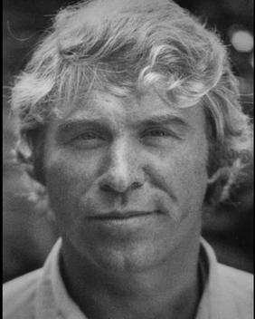

import Head from '@docusaurus/Head';

<Head>
  
</Head>

Investigative journalist found dead in a hotel bathtub with wrists slashed 12 times while investigating "The Octopus" — a network connecting PROMIS software, Iran-Contra, Area 51, and Majestic 12.

| Field | Details |
|-------|---------|
| **Full Name** | Joseph Daniel Casolaro |
| **Born** | June 16, 1947 |
| **Died** | August 10, 1991 |
| **Age at Death** | 44 |
| **Location of Death** | Sheraton Hotel, Martinsburg, West Virginia |
| **Cause of Death** | Exsanguination — wrists slashed 12 times, one cut severing a tendon |
| **Official Ruling** | Suicide |
| **Category** | Journalist / Investigator |

## Assessment: HIGHLY SUSPICIOUS

Casolaro was investigating a vast interconnected conspiracy he called "The Octopus," which linked the theft of INSLAW's PROMIS software, Iran-Contra, BCCI banking fraud, and — critically — Area 51 and what he believed was the Majestic 12 group connected to the 1947 Roswell crash recovery. He told his brother days before his death: "If something happens to me, don't believe it was an accident." He was found dead in a hotel bathtub with 12 deep slashes on his wrists — one severing a tendon, making further self-cutting nearly impossible. His hotel room was professionally cleaned the next day, destroying evidence. Two bloody towels suggested someone had cleaned blood before the crew arrived. His research files — the accumulated evidence of "The Octopus" — disappeared and have never been recovered.

## Circumstances of Death

On August 10, 1991, Danny Casolaro was found dead in the bathtub of Room 517 at the Sheraton Hotel in Martinsburg, West Virginia. Both wrists had been deeply slashed — 12 cuts total. One cut had severed a tendon in his wrist, which would have made it extremely difficult to continue cutting with that hand.

Critical scene details:
- **No suicide note** was found
- **Two bloody towels** were found in the room, suggesting someone had attempted to clean up blood before the body was discovered
- The hotel room was **cleaned by a professional crew the next day**, before investigators could process it thoroughly — destroying potential forensic evidence
- Casolaro's **research files, notes, and documents were missing** from the room. He had been carrying a thick briefcase of materials related to his investigation. It was never found
- He had traveled to Martinsburg to meet a source who he told friends would provide the final piece of his investigation

The Martinsburg police department ruled the death a suicide. The case was later reviewed by the House Judiciary Committee, which found the investigation inadequate but could not compel further action.

## Background

### The Journalist

Joseph Daniel Casolaro was a freelance investigative journalist based in the Washington, D.C., area. He had written for various publications and was working on a book-length investigation he called "The Octopus" — an interconnected web of covert operations, intelligence agencies, and criminal enterprises.

### The Octopus Investigation

Casolaro's investigation connected multiple threads:
- **INSLAW/PROMIS software**: The theft of a tracking software developed by INSLAW Inc., allegedly stolen by the U.S. Department of Justice and modified with backdoors for sale to foreign intelligence services
- **Iran-Contra connections**: Links between the PROMIS theft and the Iran-Contra arms-for-hostages network
- **BCCI banking**: The Bank of Credit and Commerce International's role as a conduit for covert operations funding
- **Area 51 and Majestic 12**: Casolaro's investigation led him to Pine Gap (Australia's classified facility) and to what he believed was Project Majestic 12 — the alleged secret group formed after the 1947 Roswell crash to manage recovered non-human technology
- **The Cabazon Indian Reservation**: Arms development on sovereign tribal land, allegedly connected to intelligence-linked weapons projects

### The UAP Connection

Casolaro believed that the various threads of "The Octopus" ultimately connected to the deepest classified programs in the U.S. government, including those managing recovered non-human materials. His research into Area 51 and MJ-12 was part of tracing the black-budget infrastructure that funded and concealed these programs.

He told associates that the PROMIS software theft was connected to the same network of intelligence operatives who managed the most classified aerospace programs — programs that some researchers believe included UAP reverse-engineering efforts.

## Why This Death Possibly Raises Questions

- Casolaro explicitly warned his brother: "If something happens to me, don't believe it was an accident"
- 12 slashes on the wrists — one severing a tendon — makes continued self-cutting extremely difficult
- No suicide note was found
- Two bloody towels suggest someone else was present and cleaned before discovery
- The hotel room was professionally cleaned the next day, destroying forensic evidence
- His research files and briefcase of investigation materials disappeared completely
- He was in Martinsburg specifically to meet a source for the "final piece" of his investigation
- The House Judiciary Committee found the police investigation inadequate
- His investigation connected directly to Area 51 and alleged Majestic 12 programs
- Friends and family universally described him as excited about his progress, not depressed or suicidal
- The case was featured in the 2024 Netflix documentary *American Conspiracy: The Octopus Murders*

## The Counterargument

- Casolaro had experienced financial difficulties and was behind on his book deadline
- Some associates noted he could be prone to seeing connections between unrelated events
- The coroner found no defensive wounds other than the wrist cuts
- Suicide by wrist-cutting, while uncommon, does occur — and multiple hesitation cuts are typical of suicide attempts
- The MJ-12/Area 51 connection in his investigation may have been speculative rather than evidence-based
- Some aspects of "The Octopus" narrative have been questioned by mainstream journalists as connecting too many disparate threads
- The missing briefcase could have been stolen by an opportunistic hotel employee rather than intelligence operatives

## Key Quotes from Media Coverage

> "If something happens to me, don't believe it was an accident." — Danny Casolaro to his brother Anthony, days before his death

> "Danny was not suicidal. He was the most excited I'd ever seen him. He said he was about to close the book on the whole thing." — Associate of Casolaro, quoted in multiple reports

> "The investigation into Casolaro's death was inadequate." — House Judiciary Committee review

## Netflix Documentary

In 2024, Netflix released [**American Conspiracy: The Octopus Murders**](https://www.netflix.com/title/81168725), a four-part documentary series directed by Zachary Treitz. The series follows photojournalist Christian Hansen as he picks up Danny Casolaro's investigation decades later, re-examining the PROMIS software theft, the Octopus network, and the circumstances of Casolaro's death. The documentary brought renewed public attention to the case and introduced a new generation to the questions surrounding his death.

## Legacy and Ongoing Investigation

- INSLAW's founders, Bill and Nancy Hamilton, have maintained that the PROMIS theft was real and that Casolaro was murdered for getting too close
- Multiple FOIA requests related to Casolaro's investigation have been filed with limited results
- His death has become a landmark case in the study of journalist deaths connected to national security investigations

## See Also

- [Dorothy Kilgallen](Dorothy_Kilgallen.mdx) — journalist found dead while investigating classified matters, notes disappeared
- [James Forrestal](James_Forrestal.mdx) — Secretary of Defense who allegedly knew about Roswell, fell from hospital window
- [Bob Lazar](Bob_Lazar.mdx) — Area 51 whistleblower who claimed to work on reverse-engineering alien craft
- [Philip Corso](Philip_Corso.mdx) — Army colonel who wrote about Roswell technology being seeded to defense contractors
- [Mae Brussell](Mae_Brussell.mdx) — conspiracy researcher who died of fast-acting cancer while investigating covert operations
- [Jim Keith](Jim_Keith.mdx) — conspiracy author who died after knee surgery under suspicious circumstances

## Other Shocking Stories
- [Phil Schneider](Phil_Schneider.mdx) — strangled with catheter tube after warning he'd be killed for exposing underground bases
- [Karl Wolfe](Karl_Wolfe.mdx) — Air Force analyst killed in hit-and-run after revealing moon base photographs
- [Mark McCandlish](Mark_McCandlish.mdx) — shotgun death ruled suicide days before testimony on classified anti-gravity craft

## Sources

- Danny Casolaro — Wikipedia: https://en.wikipedia.org/wiki/Danny_Casolaro
- *American Conspiracy: The Octopus Murders* — Netflix, 2024
- House Judiciary Committee review of the Casolaro case
- "The Last Circle" by Cheri Seymour — book-length investigation into Casolaro's research
- Listverse — "10 People Connected to UFOs Who Met Very Suspicious Ends": https://listverse.com/2022/02/05/10-people-connected-to-ufos-who-met-very-suspicious-ends/
- INSLAW case documentation — U.S. Senate Judiciary Committee

*This information was built by Grok and Claude AI research.*

**Status:** Deceased (1991)

---

## Additional context from the UAP Physics Murders investigation

Freelance journalist and writer who investigated a sprawling covert network he called "the Octopus," linking stolen intelligence software, black-budget technology programs, arms trafficking, and classified government operations, and who was found dead in a West Virginia hotel room with his wrists slashed ten to twelve times on August 10, 1991, at the age of 44.

| Field | Details |
|-------|---------|
| **Full Name** | Joseph Daniel Casolaro |
| **Born** | June 16, 1947, McLean, Virginia |
| **Died** | August 10, 1991, Martinsburg, West Virginia (age 44) |
| **Role** | Freelance Journalist / Investigative Writer |
| **Notable Works** | Unpublished manuscript "The Octopus" investigating PROMIS software theft, intelligence agency misconduct, and covert technology programs |

## Biography

Joseph Daniel Casolaro was born on June 16, 1947, in McLean, Virginia, the son of an obstetrician and the second of six children in a Catholic family. He attended Providence College until 1968. He married Terrill Pace, a former Miss Virginia; the couple had a son, Trey, and divorced after ten years, with Casolaro receiving legal custody. His interests included amateur boxing, writing poetry and short stories, and raising purebred Arabian horses.

Before turning to investigative journalism, Casolaro ran a small computer trade publication and pursued freelance writing. His earlier journalistic work touched on topics including the Soviet naval presence in Cuba, the Castro intelligence network, and Chinese opium smuggling into the United States. He was described by those who knew him as gregarious, optimistic, and persistent in his research pursuits.

## The "Octopus" Investigation

Beginning in approximately 1990, Casolaro became consumed by an investigation he came to call "the Octopus" -- a term he used to describe what he believed was an interlocking network of intelligence operatives, arms dealers, criminal bankers, and protected government insiders operating as a continuous enterprise across multiple decades.

The central thread of his investigation was the **PROMIS software scandal**. PROMIS (Prosecutor's Management Information System) was developed by Bill and Nancy Hamilton's company, Inslaw, Inc., under contract with the U.S. Department of Justice. The software was designed to organize and manage case data for law enforcement and courts. The Hamiltons accused the Department of Justice of stealing the software and distributing it without authorization or payment.

Casolaro's investigation connected the PROMIS affair to a series of other controversies:

- **Modified PROMIS with back-door surveillance**: Michael Riconosciuto, a key source for Casolaro, claimed in a March 21, 1991 affidavit that he had modified the PROMIS software at the Justice Department's behest, embedding a secret "back door" that allowed covert access to any computer system running it. He stated these modifications took place at the Cabazon Indian Reservation near Indio, California, as part of a joint venture between the Wackenhut Corporation and the Cabazon Band of Indians.
- **International arms and technology trafficking**: Casolaro believed the modified PROMIS software was sold to dozens of foreign governments and intelligence services, generating black-budget revenue while simultaneously allowing U.S. intelligence agencies to surveil those governments' data systems.
- **The Cabazon-Wackenhut operation**: Riconosciuto described a covert research and development operation on the Cabazon reservation involving weapons development, including fuel-air explosives and alleged biological warfare research, conducted in a jurisdictional gray zone on sovereign tribal land.
- **BCCI banking scandal**: Casolaro linked his investigation to the Bank of Credit and Commerce International (BCCI), which collapsed in 1991 amid revelations of massive fraud, money laundering, and intelligence connections.
- **Iran-Contra and the October Surprise**: He believed the Octopus network was connected to the Iran-Contra affair and to allegations that during the 1980 Iranian hostage crisis, operatives worked to delay the release of American hostages to benefit the Reagan presidential campaign.
- **Covert technology programs**: Casolaro's research reportedly extended into classified technology programs and black-budget operations, areas where intelligence agency misconduct and advanced weapons or surveillance technology intersected.

Casolaro was working on a book manuscript about these connections at the time of his death.

## Death Circumstances

On August 10, 1991, at approximately 12:30 PM, a housekeeper at the Sheraton Hotel in Martinsburg, West Virginia, discovered Casolaro's body in the bathtub of room 517. Both of his wrists had been slashed ten to twelve times. A note was found nearby. The Berkeley County medical examiner ruled the death a suicide.

Multiple circumstances surrounding the death raised questions:

- **Warning to family**: Before departing for Martinsburg, Casolaro told his brother Anthony that he had been receiving late-night harassing and threatening phone calls. He explicitly stated: "If something happens to me, don't believe it was an accident." He told his brother he was traveling to meet a source who would provide the final piece of evidence for his investigation.
- **Missing research materials**: Casolaro was known to carry a thick file of research notes, documents, and interview transcripts related to his Octopus investigation. When his hotel room was processed, none of these materials were found. His family confirmed the documents were never recovered.
- **Premature embalming**: Casolaro's body was embalmed before his family was notified of his death -- a decision that permanently destroyed toxicological and forensic evidence that could have helped determine the precise manner of death. His brother Anthony stated that the embalming was performed without the family's consent. The family was not informed of the death for approximately two days.
- **Housekeeper's account**: The housekeeper who discovered the body reported that the bathroom was unusually bloody, with blood on towels throughout the room, which some investigators noted was inconsistent with a typical suicide by wrist-cutting.
- **No history of suicidal ideation**: Friends and family members stated that Casolaro had shown no signs of depression or suicidal thoughts. Multiple acquaintances reported that he had been upbeat and excited about being close to completing his investigation in the days before his death.

## Official Investigations and Aftermath

The initial ruling of suicide was challenged by Casolaro's family and by journalists who had been aware of his work. Several subsequent investigations examined the case:

- The **House Judiciary Committee** investigated the Inslaw affair, and in a 1992 report stated that the committee had "received allegations that several persons who have been combative with the Department of Justice on Inslaw and related matters have died under suspicious circumstances."
- An **FBI task force** that examined Casolaro's death reportedly included members who "questioned the conclusion of suicide" and recommended further investigation. It was later revealed that the FBI had misled Congress about the extent of its investigation into Casolaro's death.
- Casolaro's surviving research notes were passed by his family to **ABC News** and **Time** magazine, both of which investigated the case but did not publish definitive findings about the manner of death.
- In **2024**, Netflix released a four-part documentary series titled [*American Conspiracy: The Octopus Murders*](https://www.netflix.com/title/81168725), directed by Zachary Treitz, which re-examined Casolaro's investigation and death, bringing renewed public attention to the case.

## The Counterargument

- The Berkeley County medical examiner ruled the death a suicide, and no physical evidence of a second person in the hotel room was reported by the initial investigators.
- Casolaro's investigation involved claims from sources whose credibility has been questioned; Michael Riconosciuto, his primary source, had a criminal record and some of his claims have not been independently verified.
- The Department of Justice conducted its own review of the Inslaw matter and concluded in 1994 that there was "no credible evidence" that Department officials conspired to steal the PROMIS software.
- Some journalists who reviewed Casolaro's notes described them as disorganized and lacking the kind of documentary evidence that would substantiate the sweeping conspiracy he described.
- The suicide note found in the room, while brief, was consistent with Casolaro's handwriting according to investigators.

## Relevance to UAP Physics

Casolaro's investigation is relevant to UAP physics research because the network he described -- connecting intelligence agencies, black-budget programs, covert technology development, and the suppression of information -- mirrors the infrastructure that UAP researchers have identified as responsible for concealing advanced technology and physics breakthroughs. The PROMIS software case demonstrated how government agencies could covertly acquire, modify, and deploy advanced technology outside of public oversight. The Cabazon-Wackenhut operation on sovereign tribal land illustrated how classified research could be conducted in jurisdictional gaps beyond normal regulatory scrutiny. The broader "Octopus" network, if it existed as Casolaro described, would represent exactly the kind of compartmentalized, cross-agency infrastructure that could manage the suppression of UAP-related physics and technology.

Casolaro's death at 44 -- while reportedly on the verge of completing his investigation, with his research notes missing and his body embalmed before his family could intervene -- fits a pattern documented across multiple cases of researchers, journalists, and whistleblowers who pursued information about classified technology programs and covert government operations.

## Related Perspectives

- [Exotic Metamaterials](Exotic_Metamaterials.mdx) -- Classified materials programs are part of the black-budget infrastructure Casolaro investigated
- [Zero Point Energy](Zero_Point_Energy.mdx) -- Advanced energy research conducted within covert programs connects to the suppressed technology Casolaro was tracking
- [Hal Puthoff](Hal_Puthoff.mdx) -- Physicist connected to government programs investigating exotic physics and advanced technology
- [Bob Lazar](Bob_Lazar.mdx) -- Claimed firsthand knowledge of classified technology programs at Area 51, the type of program Casolaro's Octopus allegedly protected
- [Eugene Mallove](Eugene_Mallove.mdx) -- Another researcher killed while pursuing unconventional science and challenging institutional narratives
- [Paul Brown](Paul_Brown.mdx) -- Alternative energy inventor killed after years of harassment; similar pattern of researcher suppression
- [GEC-Marconi Scientists](GEC_Marconi_Scientists.mdx) -- 25+ British defense scientists died under suspicious circumstances during the same era Casolaro was investigating covert government programs; the SDI "Star Wars" connection represents another facet of the black-budget infrastructure
- [William Colby](William_Colby.mdx) -- Former CIA Director who died under disputed circumstances in 1996; his willingness to disclose classified programs parallels the kind of insider sources Casolaro sought for his Octopus investigation

## Sources

- [Danny Casolaro - Wikipedia](https://en.wikipedia.org/wiki/Danny_Casolaro)
- [The Mysterious Death of Dan Casolaro - Unsolved Mysteries](https://unsolved.com/gallery/dan-casolaro/)
- [Danny Casolaro and the Octopus - The Truth Files](https://www.thetruthfiles.com/danny-casolaro-and-the-octopus/)
- [The Octopus - National Archives Text Message Blog](https://text-message.blogs.archives.gov/2010/12/02/the-octopus/)
- [A Victim of 'The Octopus'? - Newsweek](https://www.newsweek.com/victim-octopus-203170)
- [The Strange Death of Daniel Casolaro - Project Censored](https://www.projectcensored.org/11-the-strange-death-of-daniel-casolaro/)
- [FBI Cites Mystery FOIA Exemption to Withhold Danny Casolaro Death Video - MuckRock](https://www.muckrock.com/news/archives/2018/feb/08/casolaro-reenactment/)
- [The Last Circle: Danny Casolaro's Investigation into the Octopus and the PROMIS Software Scandal - Cheri Seymour (Book)](https://www.amazon.com/Last-Circle-Casolaros-Investigation-Software/dp/1936296004)
- [American Conspiracy: The Octopus Murders - Netflix (2024)](https://www.netflix.com/title/81168725)
- [Inslaw - Wikipedia](https://en.wikipedia.org/wiki/Inslaw)

*This information was compiled by Claude AI research.*

**Status:** Deceased (1991)

---

**Investigations:** UAPs Murders (General), UAP Physics Murders
