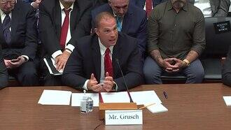

# David Grusch
Former U.S. Air Force intelligence officer and NGA official who testified before Congress in 2023 that the U.S. government possesses retrieved non-human craft and biologics, and who reported severe retaliation for his whistleblowing.

| Field | Details |
|-------|---------|
| **Full Name** | David Charles Grusch |
| **Born** | 1987 (Pittsburgh, Pennsylvania) |
| **Status** | ALIVE |
| **Current Location** | United States |
| **Category** | Intelligence Officer / UAP Whistleblower |

## Assessment: AT RISK

David Grusch is among the most significant UAP whistleblowers in history, having testified under oath before Congress that the U.S. government operates a multi-decade crash retrieval and reverse-engineering program for craft of non-human origin. He reported facing "very brutal" retaliation beginning in 2021, including attempts to revoke his security clearance and damage to his career. His claims were filed through proper channels via a PPD-19 Urgent Concern filing with the Intelligence Community Inspector General, who found his complaint "credible and urgent." The combination of his high-level credentials, formal whistleblower protections, and documented retaliation make him a significant figure at ongoing risk.

## Current Situation

Grusch retired from government service in April 2023, leaving the National Geospatial-Intelligence Agency (NGA) at the GS-15 civilian level. Following his public disclosures, he experienced what he described as months of retaliation and reprisals that began in 2021, including an attempt to revoke his TS/SCI security clearance. A Department of Defense Inspector General report initially concluded the clearance revocation resulted from "behavior issues, dishonesty, and untrustworthiness," but an appeals panel unanimously reinstated the clearance, deeming the revocation a mistake rather than reprisal.

Grusch has disclosed that he struggled with PTSD from combat deployments, and in 2014 and 2018 experienced personal crises related to grief and depression. The Intercept reported that Grusch had been psychiatrically detained at one point but retained his security clearance throughout.

## Background

David Grusch served as an intelligence officer for 14 years, including service in the U.S. Air Force at the rank of Major with multiple combat deployments to Afghanistan, where he collected intelligence on senior Taliban leaders. After his active military career, he joined the National Geospatial-Intelligence Agency (NGA) and the National Reconnaissance Office (NRO).

In 2019, Grusch was appointed as the NRO's representative to the Unidentified Aerial Phenomena Task Force (UAPTF). By late 2021, he served as co-lead for UAP analysis at the NGA and represented the organization in the task force, which later became the All-Domain Anomaly Resolution Office (AARO).

During the course of his official duties, Grusch states he was informed by multiple credentialed current and former military and intelligence community individuals about a multi-decade UAP crash retrieval and reverse-engineering program that was being operated with secrecy above Congressional oversight. When he sought access to these programs, he was denied.

On June 5, 2023, The Debrief published Grusch's claims, reporting that intelligence officials said the U.S. had retrieved craft of non-human origin. On July 26, 2023, Grusch testified under oath before the House Oversight Committee, stating that the U.S. has retrieved "non-human biologics" from crash sites and that he was aware of "multi-decade UAP crash retrieval and reverse-engineering programs." He stated he could provide classified details to members of Congress in a SCIF (Sensitive Compartmented Information Facility).

His testimony was corroborated in part by two other witnesses at the hearing: retired Navy Commander David Fravor, who described his 2004 encounter with the "Tic Tac" UAP, and former Navy pilot Ryan Graves, who described repeated UAP encounters by military aviators.

## Why This Person Matters

- Highest-credentialed UAP whistleblower to testify before Congress, with 14 years of intelligence experience and combat deployments
- Filed his complaint through formal channels (PPD-19 Urgent Concern) with the Intelligence Community Inspector General, who deemed it "credible and urgent"
- Testified under oath that the U.S. government possesses retrieved non-human craft and biologics
- Alleged the existence of crash retrieval and reverse-engineering programs operating above Congressional oversight
- Reported severe and sustained retaliation for his disclosures, including attempts to revoke his security clearance
- His testimony contributed directly to bipartisan Congressional efforts to legislate UAP transparency, including provisions in the National Defense Authorization Act
- Represents a shift from anonymous or unofficial UAP claims to formal, on-the-record government whistleblowing
- His case tests the strength of whistleblower protections for individuals disclosing information about classified UAP programs

## Key Quotes from Media Coverage

> "I have personal knowledge of people who have been harmed or injured in the effort to cover up or conceal extraterrestrial technology." — David Grusch, testimony before the House Oversight Committee, July 26, 2023

> "I was told, both by people in the legacy program and that it was made clear to me, that the information I have would cause grave national security damage if disclosed." — David Grusch, in his NewsNation interview, June 2023

## See Also

- [Lue Elizondo](Lue_Elizondo.mdx) — Former AATIP director who also testified before Congress about UAP programs
- [Ryan Graves](Ryan_Graves.mdx) — Navy pilot who testified alongside Grusch in July 2023
- [Bob Lazar](Bob_Lazar.mdx) — Earlier whistleblower who claimed to have worked on alien craft at S-4
- [Dylan Borland](Dylan_Borland.mdx) — Air Force veteran and UAP whistleblower facing career retaliation
- [Tim Burchett](Tim_Burchett.mdx) — Congressman who organized the 2023 UAP hearing and received death threats
- [George Knapp](George_Knapp.mdx) — Investigative journalist who testified before Congress in 2025
- [James Ryder](James_Ryder.mdx) — Lockheed Martin VP who proposed transferring UAP crash retrieval material to AAWSAP, named in Grusch's DOPSR-cleared statements
- [Mr. 35-Year-Old Murdered Whistleblower](Mr_35_Year_Old_Murdered_Whistleblower.mdx) — Unnamed whistleblower connected to Grusch, found dead with suicide note before coming forward
- [Matthew Sullivan](Matthew_Sullivan.mdx) — UAP whistleblower identified by Rep. Burlison as a Grusch/Barber colleague who died by reported suicide before a scheduled Congressional interview

## Other Shocking Stories

- [James E. McDonald](James_McDonald.mdx): Senior atmospheric physicist whose career and marriage were systematically destroyed before he was found dead in the Arizona...
- [Karla Turner](Karla_Turner.mdx): Abduction researcher with a Ph.D. who authored three books on the alien abduction phenomenon, died of fast-acting breast...
- [Victor Moore](Victor_Moore.mdx): Marconi engineer working on infrared satellite systems who died of a drug overdose — MI5 reportedly investigated his...
- [Uyrange Hollanda](Uyrange_Hollanda.mdx): Captain in the Brazilian Air Force who commanded Operation Saucer (Operacao Prato), the military investigation of UFO attacks...

## Sources

- [David Grusch UFO whistleblower claims - Wikipedia](https://en.wikipedia.org/wiki/David_Grusch_UFO_whistleblower_claims)
- [Whistleblower testifies U.S. salvaged 'non-human biologics' from UFO crash sites - NPR](https://www.npr.org/2023/07/27/1190390376/ufo-hearing-non-human-biologics-uaps)
- [Intelligence Officials Say U.S. Has Retrieved Craft of Non-Human Origin - The Debrief](https://thedebrief.org/intelligence-officials-say-u-s-has-retrieved-non-human-craft/)
- [UFO Whistleblower Kept Security Clearance After Psychiatric Detention - The Intercept](https://theintercept.com/2023/08/09/ufo-david-grusch-clearance/)
- [Whistleblower Claims Retaliation During Testimony at House Hearing on UFOs - Whistleblower Network News](https://whistleblowersblog.org/government-whistleblowers/whistleblower-claims-retaliation-during-testimony-at-house-hearing-on-ufos/)
- [David Grusch Congressional Testimony - House Oversight Committee](https://oversight.house.gov/wp-content/uploads/2023/07/Dave_G_HOC_Speech_FINAL_For_Trans.pdf)

*This information was built by Grok and Claude AI research.*

**Status:** Alive

---

## Additional context from the UAP Physics Murders investigation

Former Air Force intelligence officer and senior civilian intelligence official who filed a federal whistleblower complaint alleging the US government operates a multi-decade UAP crash retrieval and reverse-engineering program, then testified under oath before Congress in July 2023.

| Field | Details |
|-------|---------|
| **Full Name** | David Charles Grusch |
| **Role** | Intelligence Insider / Whistleblower |
| **Platform** | Congressional testimony, investigative journalism, podcast interviews |
| **Notable Works** | House Oversight Committee sworn testimony (July 26, 2023); The Debrief interview (June 5, 2023); Joe Rogan Experience #2065 (November 2023); Intelligence Community Inspector General whistleblower complaint (2022) |

## Their Claims

David Grusch served 14 years as a US Air Force intelligence officer, reaching the rank of Major, with a combat tour in Afghanistan. He subsequently served as a senior civilian intelligence official at the GS-15 level (equivalent to a full-bird Colonel) at the National Geospatial-Intelligence Agency (NGA) from 2021 to 2023. From 2019 to 2021, he was the National Reconnaissance Office's (NRO) representative to the Unidentified Aerial Phenomena Task Force.

Grusch stated that in the course of his official duties, he was informed of a "multi-decade UAP crash retrieval and reverse-engineering program" to which he was denied access. He claimed to have interviewed over 40 witnesses with direct knowledge of these programs over a four-year period. Based on these interviews and documentation he reviewed, Grusch alleged that the US government possesses recovered craft and materials of "non-human origin."

His claims extend beyond simple crash retrieval. Grusch stated that elements of the US government had systematically thwarted congressional oversight regarding these programs, keeping elected representatives in the dark about their existence and scope. He alleged that the programs operate within legacy Special Access Programs (SAPs) that predate modern oversight frameworks, effectively existing outside democratic accountability.

On the physics of UAP, Grusch referenced the "holographic principle" and the possibility that the operators of recovered craft could be "projected from higher dimensional space to lower dimensional" space. He stated that "it is a well-established fact, at least mathematically and based on empirical observation and analysis, that there most likely are physical, additional spatial dimensions." He also indicated that the operators could be interdimensional beings or potentially time-travelers, though he framed these as theoretical possibilities rather than confirmed conclusions.

In 2022, while at NGA, Grusch filed a federal whistleblower complaint with the Intelligence Community Inspector General (ICIG). The ICIG found the complaint "credible and urgent" in July 2022 and a summary was immediately submitted to the Director of National Intelligence, Avril Haines; the Senate Select Committee on Intelligence; and the House Permanent Select Committee on Intelligence.

In March 2025, Representative Eric Burlison (R-MO) appointed Grusch as a Special Advisor on UAP matters to the Task Force on the Declassification of Federal Secrets, a four-month appointment beginning April 1, 2025. In this role, Grusch advises Burlison and his staff on navigating the intelligence community and formulating questions for future congressional UAP hearings.

## Key Quotes

> "I was informed in the course of my official duties of a multi-decade UAP crash retrieval and reverse-engineering program to which I was denied access."
> — **David Grusch**, House Oversight Committee testimony, July 26, 2023

> "We are not alone. And I know that with a 100 percent certainty."
> — **David Grusch**, Joe Rogan Experience #2065, November 2023

> "Non-human biologics... that was the assessment of people with direct knowledge on the program I talked to, that are currently still on the program."
> — **David Grusch**, House Oversight Committee testimony, July 26, 2023, in response to questioning about whether biological material had been recovered alongside craft

> "If there's nothing to see here, why are Mike Rogers and Mike Turner in the House blocking this bill that is, in my opinion, the most important legislation for transparency in American history? If there's nothing to see here, then why don't we just pass this and see what happens."
> — **David Grusch**, Joe Rogan Experience #2065, November 2023, regarding congressional obstruction of the UAP Disclosure Act

> "It is a well-established fact, at least mathematically and based on empirical observation and analysis, that there most likely are physical, additional spatial dimensions."
> — **David Grusch**, discussing the holographic principle and extra-dimensional hypothesis in relation to UAP operators

## Key Arguments & Evidence They Cite

- **40+ witnesses with direct knowledge**: Grusch stated he interviewed over 40 individuals currently or formerly involved in classified UAP programs, conducted over a four-year period while serving in official intelligence roles
- **ICIG "credible and urgent" determination**: The Intelligence Community Inspector General independently assessed his complaint and found it met the threshold of "credible and urgent," the highest classification for whistleblower complaints forwarded to congressional intelligence committees
- **Denied access to programs**: Grusch claimed he was specifically denied access to UAP-related Special Access Programs despite holding appropriate clearances and having a need-to-know based on his UAP Task Force role — suggesting deliberate compartmentalization
- **Non-human biologics**: Testified under oath that people with direct program knowledge assessed that biological material of non-human origin had been recovered alongside craft
- **Congressional oversight failure**: Alleged that these programs have systematically evaded congressional oversight for decades, operating within legacy SAP frameworks that predate modern oversight requirements
- **Multi-decade timeline**: The programs Grusch described are not recent — they allegedly span multiple decades, suggesting a long-running retrieval and analysis effort
- **Recovered craft and materials**: Claimed the US government possesses "quite a number" of recovered craft of non-human origin, not merely fragments or debris
- **Holographic principle and extra dimensions**: Referenced established mathematical frameworks (holographic principle, extra-dimensional physics) as potential explanations for the nature and origin of UAP operators
- **Legislative obstruction**: Cited specific members of Congress (Rogers, Turner) as actively blocking UAP transparency legislation, which he argued would be unnecessary if there were truly nothing to disclose

## Where They've Said It

- **The Debrief** — June 5, 2023: Leslie Kean and Ralph Blumenthal broke Grusch's story in an article titled "Intelligence Officials Say U.S. Has Retrieved Craft of Non-Human Origin." This was the first public disclosure of his allegations. Major outlets including The New York Times, Washington Post, and Politico were offered the story but declined to publish it.
- **NewsNation interview** — June 2023: First on-camera interview discussing his whistleblower complaint and allegations
- **House Oversight Committee testimony** — July 26, 2023: Testified under oath before the Subcommittee on National Security, the Border, and Foreign Affairs, alongside Navy pilots Ryan Graves and David Fravor. This was the most significant congressional UAP hearing in decades.
- **Joe Rogan Experience #2065** — November 2023: Extended three-hour interview providing his most detailed public discussion of classified programs, threats he received, legislative obstruction, and his certainty about non-human intelligence
- **Intelligence Community Inspector General complaint** — Filed 2022, deemed "credible and urgent" July 2022: The formal whistleblower filing that initiated the chain of events leading to his public disclosures
- **UAP Disclosure Act of 2023 (Schumer Amendment)** — Grusch assisted in drafting provisions of the National Defense Authorization Act of 2023 related to UAP reporting, including whistleblower protections and exemptions to non-disclosure agreements

## The Counterargument

- **Pentagon denial**: The Department of Defense stated that its inquiries into Grusch's claims "had not turned up any verifiable information" substantiating the existence of UAP crash retrieval or reverse-engineering programs. The All-domain Anomaly Resolution Office (AARO) released a report in March 2024 stating it found no evidence of such programs.
- **No first-hand evidence presented publicly**: Grusch's testimony is based on what others told him — he has not personally handled recovered craft or materials. Critics note the distinction between first-hand and second-hand testimony.
- **Scientific skepticism**: Physicist Sean Carroll stated that Grusch was "talking about the holographic principle and extra dimensions and stuff like that" which should "set off your alarm bells," concluding that Grusch "has all of the vibes of a complete crackpot." Carroll and other physicists argue that invoking extra dimensions without testable predictions is not meaningful science.
- **Source credibility questions**: Some critics question whether Grusch's 40+ witnesses could all be reliable, noting the possibility of shared delusion, disinformation campaigns, or misidentification of classified conventional programs as non-human technology.
- **Mainstream media caution**: The New York Times, Washington Post, and Politico all declined to publish Grusch's story, suggesting their editorial standards found the evidence insufficient. The story was ultimately published by The Debrief, which critics note is a UFO-friendly outlet.
- **Classification as shield**: Some argue Grusch's inability to provide classified details in public settings conveniently prevents verification — he can make extraordinary claims while citing classification as the reason he cannot provide extraordinary evidence.
- **Personal credibility attacks**: The Intercept reported on Grusch's psychiatric history, though also noted that he maintained his security clearance throughout, which would not typically be the case if his judgment were considered impaired.

## Related Perspectives

- [Exotic Metamaterials](Exotic_Metamaterials.mdx) — Grusch's claims about recovered craft and materials of non-human origin directly connect to documented evidence of exotic metamaterials with non-terrestrial isotopic ratios
- [Gravity Manipulation](Gravity_Manipulation.mdx) — The propulsion capabilities Grusch described — including the flight characteristics observed by military witnesses — align with gravity manipulation theses
- [Interdimensional Hypothesis](Interdimensional_Hypothesis.mdx) — Grusch explicitly referenced the holographic principle and extra-dimensional beings as a framework for understanding UAP operators
- [Alcubierre Warp Drive](Alcubierre_Warp_Drive.mdx) — The craft capabilities Grusch described are consistent with spacetime warping propulsion models
- [Zero Point Energy](Zero_Point_Energy.mdx) — The energy source for the craft Grusch described remains unexplained by conventional physics, connecting to zero-point energy extraction theses
- [Books on UAP Physics](Books.mdx) — Multiple books document Grusch's disclosures and the broader context of UAP crash retrieval programs
- [Podcasts on UAP Physics](Podcasts.mdx) — Grusch's Joe Rogan Experience appearance is among the most significant UAP podcast episodes
- [YouTube Channels](YouTube_Channels.mdx) — Grusch's congressional testimony and interviews are widely covered across UAP-focused channels

## Sources

- [David Grusch UFO whistleblower claims — Wikipedia](https://en.wikipedia.org/wiki/David_Grusch_UFO_whistleblower_claims)
- [Intelligence Officials Say U.S. Has Retrieved Craft of Non-Human Origin — The Debrief](https://thedebrief.org/intelligence-officials-say-u-s-has-retrieved-non-human-craft/)
- [Grusch Opening Statement — House Oversight Committee](https://oversight.house.gov/wp-content/uploads/2023/07/Dave_G_HOC_Speech_FINAL_For_Trans.pdf)
- [Whistleblower testifies U.S. salvaged 'non-human biologics' from UFO crash sites — NPR](https://www.npr.org/2023/07/27/1190390376/ufo-hearing-non-human-biologics-uaps)
- [UFO hearing key takeaways — CBS News](https://www.cbsnews.com/news/ufo-hearing-congress-uap-takeaways-whistleblower-conference-david-grusch-2023/)
- [UFO Whistleblower Kept Security Clearance After Psychiatric Detention — The Intercept](https://theintercept.com/2023/08/09/ufo-david-grusch-clearance/)
- [Rep. Burlison Welcomes Former U.S. Air Force Officer David Grusch as Special Advisor — House.gov](https://burlison.house.gov/media/press-releases/rep-burlison-welcomes-former-us-air-force-officer-david-grusch-special-advisor)
- [Joe Rogan Experience #2065 — David Grusch — Spotify](https://open.spotify.com/episode/6D6otpHwnaAc86SS1M8yHm)

*This information was compiled by Claude AI research.*

**Status:** Alive

---

**Investigations:** UAPs Murders (General), UAP Physics Murders
