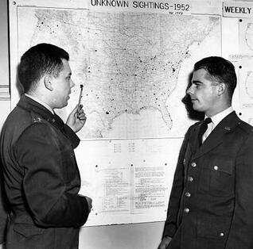

# Edward J. Ruppelt
First director of Project Blue Book and the man who coined the term "unidentified flying object," dead of a heart attack at 37.

| Field | Details |
|-------|---------|
| **Full Name** | Edward James Ruppelt |
| **Born** | July 17, 1923 |
| **Died** | September 15, 1960 |
| **Age at Death** | 37 |
| **Location of Death** | Long Beach, California |
| **Cause of Death** | Heart attack (second occurrence) |
| **Official Ruling** | Natural causes |
| **Category** | Military / Government UFO Investigator |

## Assessment: SUSPICIOUS

Ruppelt's death at 37 from a "sudden" heart attack raises questions primarily because of his age, his role as the most important early government UFO investigator, and the fact that he had recently added three debunking chapters to the revised edition of his book — chapters that contradicted the more open-minded original edition. Some researchers have speculated he was pressured to add those chapters and that his change of position may have put him in a complicated situation with both sides of the UFO debate.

## Circumstances of Death

Ruppelt suffered a second heart attack and died on September 15, 1960, in Long Beach, California. A local newspaper referred to his death as "sudden." He had experienced a first heart attack shortly before, but had apparently been recovering. He was only 37 years old.

## Background

Edward Ruppelt served as a bombardier-navigator in World War II, flying combat missions in the Pacific theater. After the war, he joined the Air Force's intelligence division and was assigned to investigate UFO reports.

In 1951, Ruppelt took over Project Grudge, the Air Force's UFO investigation program, and reorganized it into Project Blue Book in March 1952. He is generally credited with coining the term "unidentified flying object" (UFO) to replace the more sensational "flying saucer" and "flying disk."

Under Ruppelt's leadership, Blue Book took a more scientific approach to UFO investigations. He established a standardized reporting system, consulted with scientists, and treated UFO reports seriously. He left Blue Book in late 1953.

In 1956, Ruppelt published *The Report on Unidentified Flying Objects*, which is considered one of the most balanced and credible government insider accounts of the UFO phenomenon. The original edition acknowledged that many UFO cases remained genuinely unexplained.

However, in 1960, a revised edition was published with three additional chapters that took a much more dismissive tone toward UFOs, essentially debunking the phenomenon. The shift was so dramatic that many in the UFO community believed Ruppelt had been pressured by the Air Force to add the debunking material. Ruppelt died shortly after the revised edition was published.

## Why This Death Possibly Raises Questions

- Death at age 37 from a heart attack is statistically unusual, though not impossible
- He was the most knowledgeable government insider regarding UFO evidence from the early 1950s
- The timing — dying shortly after publishing a revised edition that contradicted his earlier, more open-minded work — has been noted by researchers
- The dramatic reversal in his book's tone between the 1956 and 1960 editions suggests possible external pressure
- No evidence of foul play has been documented; heart disease at young ages does occur naturally
- Some researchers have placed his death in the context of Otto Binder's list of 137 UFO researchers who died in the 1960s

## Key Quotes from Media Coverage

> In what one newspaper referred to as a "sudden" death, Ruppelt suffered a second heart attack at age 37.

## See Also

- [J. Allen Hynek](J_Allen_Hynek.md) — Scientific consultant to Project Blue Book
- [James McDonald](James_McDonald.md) — Examined Blue Book files and found systematic mishandling of evidence
- [Thomas Mantell](Thomas_Mantell.md) — Early UFO case investigated under Ruppelt's predecessor programs

## Other Shocking Stories

- [John Brittan](John_Brittan.md): Royal College of Military Science IT specialist found dead from carbon monoxide poisoning in his garage — had...
- [Robert Frost (Area 51 Worker)](Robert_Frost_Area51.md): Civilian contractor at Groom Lake (Area 51) who died at age 57 after his tissues were found to...
- [Morris K. Jessup](Morris_Jessup.md): Astronomer and UFO author who investigated antigravity and the Philadelphia Experiment, found dead in his car under disputed...
- [Eugene Mallove](Eugene_Mallove.md): Cold fusion advocate, science writer, and editor of Infinite Energy magazine who was beaten to death in 2004...

## Sources

- [Edward J. Ruppelt — Wikipedia](https://en.wikipedia.org/wiki/Edward_J._Ruppelt)
- [Edward James Ruppelt — First Director of Project Blue Book — Enigma Labs](https://enigmalabs.io/library/c68b0efb-98cc-4cb5-ae8d-dce8c265be0b)
- [Edward J. Ruppelt — The UFO Database](https://theufodatabase.com/people/edward-j-ruppelt)
- [Edward Ruppelt: 7 Untold Secrets of Project Blue Book's First Director — UAP Watchers](https://uapwatchers.com/uap-ufo-wiki/edward-ruppelt-project-blue-book/)
- [CPT Edward James Ruppelt — Find a Grave](https://www.findagrave.com/memorial/116480535/edward_james-ruppelt)

*This information was built by Grok and Claude AI research.*
