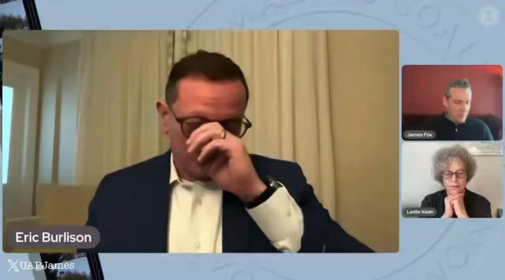

# Eric Burlison
U.S. Congressman from Missouri who has publicly disclosed that Army Special Forces and intelligence community personnel warned him he would be killed for naming two specific individuals in his UAP investigation — one of whom is reportedly former CIA Director of Science and Technology Glenn Gaffney.

| Field | Details |
|-------|---------|
| **Full Name** | Eric Burlison |
| **Born** | 1979 (Missouri) |
| **Status** | ALIVE |
| **Current Location** | Springfield, Missouri / Washington, D.C. |
| **Category** | Political Figure |

## Assessment: THREATENED

Burlison received a direct threat from individuals with Special Forces and intelligence community backgrounds warning that he and a colleague would be killed if they continued to name specific individuals connected to alleged UAP crash retrieval programs. The threat is significant because it identifies two names — reportedly former CIA Director of Science and Technology Glenn Gaffney and Lockheed Martin VP [James Ryder](James_Ryder.mdx) — as people so deeply embedded in UAP secrecy programs that pursuing them publicly puts a sitting U.S. congressman in physical danger. This mirrors the warning delivered to fellow congressman [Tim Burchett](Tim_Burchett.mdx), suggesting a coordinated effort to intimidate elected officials pursuing UAP transparency.

## Video: Rep. Burlison Describes the Death Threat

<video controls style={{maxWidth: '50vw', maxHeight: '50vh', display: 'block', margin: '1rem auto'}}>
  <source src="https://ipfs.io/ipfs/QmQg1wqnejWf3yydTQHd15QUmVkMgvZ7TmdCBNC18BUx5z" type="video/mp4" />
  <source src="https://ipfs.io/ipfs/QmQg1wqnejWf3yydTQHd15QUmVkMgvZ7TmdCBNC18BUx5z" type="video/mp4" />
  <source src="https://dweb.link/ipfs/QmQg1wqnejWf3yydTQHd15QUmVkMgvZ7TmdCBNC18BUx5z" type="video/mp4" />
  Your browser does not support the video tag.
</video>

*Rep. Burlison describes being warned by someone with Special Forces and Intel Community experience that he may be killed for pursuing the truth about UAPs. Source: [@UAPJames on X](https://x.com/UAPJames/status/2030365676901204133), March 7, 2026.*

## Current Situation

Burlison disclosed the death threat publicly during an interview with The Anomalous Coalition (a YouTube channel run by moderators of UAP-related Reddit communities), alongside filmmaker James Fox and researcher Leslie Kean. The interview was covered by the Irish Star on March 9, 2026.

The threat was delivered by individuals Burlison identified as having U.S. Army Special Forces and Intelligence Community backgrounds. The precise warning, as reported: *"You need to take those 2 names off your list and never talk about [them] again. They'd have no problem having you killed."*

UAP journalist and X user @UAPLuigi identified one of the two names as Glenn Gaffney — the former CIA Director of Science and Technology who was named by George Knapp in the Congressional Record at the September 9, 2025 UAP hearing. Gaffney has been alleged by multiple sources, including journalist Christopher Sharp of Liberation Times, to have blocked the transfer of alleged UAP crash-retrieved materials from Lockheed Martin Space Systems to the DIA's AAWSAP program in approximately 2011.

The second name has not been publicly confirmed but UAP researchers have speculated it may be connected to the Lockheed Martin side of the same blocked transfer — most likely [James Ryder](James_Ryder.mdx), the Lockheed VP who reportedly died unexpectedly in 2018 and whose death was already suspicious in the context of UAP research.

Burlison continued his UAP investigation after the threat and did not publicly withdraw the names.

## Background

Eric Burlison represents Missouri's 7th Congressional District (Springfield area). He has been one of the most active members of Congress on UAP disclosure, serving on the House Oversight Committee and participating in UAP hearings.

### UAP Congressional Work

- Attended classified Pentagon briefings where he reports seeing videos of UAPs "defying physics" and "intelligently controlled plasma orbs"
- Introduced the UAP Disclosure Act of 2025 as an amendment to the FY2026 NDAA
- Co-signed a congressional letter alongside Reps. Luna, Burchett, Mace, Carson, Crane, Perry, and Subramanyam demanding release of UAP files from Secretary Rubio, Defense Secretary Hegseth, and the DOE
- Was present at the September 9, 2025 UAP hearing where George Knapp named Glenn Gaffney and James Ryder in the Congressional Record under oath
- Raised questions about the suspicious disappearance of Maj. Gen. William Neil McCasland (missing Feb 27, 2026), calling him someone with "a lot of information" about UAPs
- Publicly disclosed on April 17, 2026 that his office had scheduled an interview with UAP whistleblower [Matthew Sullivan](Matthew_Sullivan.mdx) — a colleague of David Grusch and Jake Barber — who reportedly died by suicide within two weeks of the scheduled interview. Burlison's office sent a formal letter to the FBI; the Office of Inspector General deemed the report "credible and urgent" and referred it back to the FBI
- Publicly stated Trump's UAP executive disclosure orders made Trump "the Disclosure President"

### The Glenn Gaffney Connection

The two names Burlison was warned to drop from his investigation are almost certainly connected to the Lockheed/CIA materials transfer allegation that George Knapp raised at the 2025 hearing.

Glenn Gaffney served as CIA Deputy Director and later Director of Science and Technology (DS&T) for approximately a decade. According to multiple sources reported by Christopher Sharp at Liberation Times:

- In approximately 2011, Robert Bigelow and Lockheed Martin's James Ryder were coordinating to transfer alleged non-human materials from a Lockheed facility to DIA's AAWSAP program
- CIA's DS&T under Gaffney reportedly blocked this transfer
- A second attempt via a Prospective Special Access Program (PSAP) within DHS also failed — reportedly through CIA DS&T actions
- The exchanges with CIA officials left Ryder "feeling threatened due to the harshness of exchanges," according to reporting
- Christopher Sharp reported that Gaffney has denied blocking the transfer; Robert Cardillo at ODNI is also named in competing accounts as the blocking decision-maker

[James Ryder](James_Ryder.mdx) died unexpectedly in 2018 at age 72 in San Jose, CA, with no public cause of death disclosed despite months of searching by researchers. He is already profiled in this investigation.

## Why This Person Matters

- Sitting U.S. Congressman who received a direct death threat from individuals identifying as Army Special Forces and Intelligence Community personnel
- The threatened names connect directly to the alleged CIA blocking of UAP materials from Lockheed Martin — the most specific and documented chain of custody claim in UAP disclosure history
- His threat was received separately from, but mirrors exactly, the parallel warning given to Rep. [Tim Burchett](Tim_Burchett.mdx): same phrasing ("they'd have no problem having you killed"), same method (unofficial military/intel intermediaries), same subject (UAP-related names)
- Continued his investigation publicly after receiving the threat — did not withdraw the names
- Was present at the George Knapp hearing where Gaffney and Ryder were named under oath just months before the threat
- Part of a documented pattern of congressional UAP investigators being intimidated: both Burlison and Burchett received near-identical death warnings in 2025-2026

## The Counterargument

- The threat was disclosed to a UAP YouTube community rather than to the U.S. Capitol Police, raising questions about verification. No Capitol Police report has been publicly confirmed.
- The identity of the threatening parties (claimed Special Forces/IC background) is unverified
- Glenn Gaffney has publicly denied blocking UAP material transfers — this allegation remains contested and unproven
- The connection to the two specific names is inferential, not confirmed by Burlison publicly

## Key Quotes

> "They said, 'You need to take those 2 names off your list and never talk about [them] again. They'd have no problem having you killed.'" — Rep. Eric Burlison, March 2026

> "One is Glenn Gaffney, I bet I know the other one." — @UAPLuigi, March 7, 2026, identifying one of the names Burlison was warned about

> "The people that know are dying or disappearing... for the record, I'm not suicidal and I don't take risks." — Rep. Tim Burchett, in related coverage of congressional UAP threats, 2026

## See Also

- [Tim Burchett](Tim_Burchett.mdx) — Fellow congressman who received near-identical UAP death warnings
- [James Ryder](James_Ryder.mdx) — Lockheed Martin VP allegedly at center of the blocked UAP transfer; died unexpectedly 2018
- [George Knapp](George_Knapp.mdx) — Investigative journalist who named Gaffney under oath in September 2025 Congressional hearing
- [David Grusch](David_Grusch.mdx) — UAP whistleblower whose DOPSR-cleared statements named Ryder and the Lockheed transfer
- [Matthew Sullivan](Matthew_Sullivan.mdx) — UAP whistleblower and Grusch/Barber colleague who died by reported suicide within two weeks of his scheduled interview with Burlison's office
- [William McCasland](William_McCasland.mdx) — Retired Major General, missing since Feb 27, 2026; Burlison raised concerns about his disappearance
- [Lue Elizondo](Lue_Elizondo.mdx) — Former AATIP director who also stated "I am not suicidal" after receiving threats

## Other Shocking Stories

- [James Ryder](James_Ryder.mdx): Lockheed Martin VP who proposed transferring UAP crash-retrieved material to the DIA — "died unexpectedly" in 2018, no public cause of death ever confirmed, age 72.
- [Mark McCandlish](Mark_McCandlish.mdx): Aerospace illustrator who testified about the Alien Reproduction Vehicle at the 2001 Disclosure Project — shotgun blast to the head ruled suicide in 2021, reportedly scheduled for Senate UAP testimony.
- [William McCasland](William_McCasland.mdx): Retired Air Force Major General and former AFRL commander — vanished Feb 27, 2026 from his home in New Mexico, no witnesses, left phone and prescription glasses behind.
- [Ron Rummel](Ron_Rummel.mdx): Ex-Air Force intelligence agent who published Alien Digest — gunshot to the mouth ruled suicide, no blood on the barrel, no fingerprints on the gun.

## Sources

- [US Congressman Claims Death Threats After Demanding UFO Secrets Made Public — Irish Star](https://www.irishstar.com/news/politics/congressman-claims-hes-received-death-36840891)
- [Rep. Burlison Introduces UAP Disclosure Act of 2025 — Official Press Release](https://burlison.house.gov/media/press-releases/rep-burlison-introduces-uap-disclosure-act-2025-amendment-ndaa)
- [George Knapp Written Testimony — House Oversight (PDF)](https://oversight.house.gov/wp-content/uploads/2025/09/George-Knapp-Written-Testimony.pdf)
- [CIA's Glenn Gaffney and Lockheed Martin's Jim Ryder Named by George Knapp in Hearing — Escape Velocity](https://medium.com/@EscapeVelocity1/cias-glenn-gaffney-and-lockheed-martin-s-jim-ryder-named-by-ufo-researcher-george-knapp-in-hearing-5667db38ac23)
- [Glenn Gaffney Allegedly Blocked UAP Materials Transfer — Christopher Sharp (@ChrisUKSharp)](https://x.com/ChrisUKSharp/status/1905236006292316397)
- [Gaffney Denied Blocking Transfer — Christopher Sharp on X](https://x.com/ChrisUKSharp/status/1965449955549524285)
- [James T. Ryder and Glenn Gaffney: A Battle Between UFO Morals — Halfway123 Substack](https://halfway123.substack.com/p/james-t-ryder-and-glenn-gaffney-a)
- [@UAPJames Death Threat Report (Video) — X](https://x.com/UAPJames/status/2030365676901204133)
- [@UAPLuigi Identifies Glenn Gaffney — X](https://x.com/UAPLuigi/status/2030390247193006135)
- [Missouri Congressman Burlison Says Feds Actively Blocking UAP Information — Missourinet](https://www.missourinet.com/2025/09/16/missouri-congressman-burlison-actively-blocking-information-on-uaps-or-ufos/)

*This information was built by Grok and Claude AI research.*

**Status:** Alive
