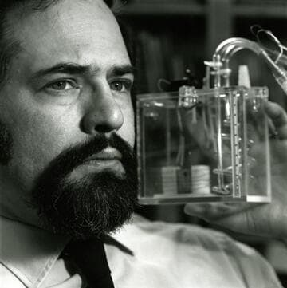

import Head from '@docusaurus/Head';

<Head>
  
</Head>

Cold fusion advocate, science writer, and editor of Infinite Energy magazine who was beaten to death in 2004 while cleaning a rental property; his murder was eventually linked to a robbery rather than his research.

| Field | Details |
|-------|---------|
| **Full Name** | Eugene Franklin Mallove |
| **Born** | June 9, 1947 (Norwich, Connecticut, USA) |
| **Died** | May 14, 2004 |
| **Age at Death** | 56 |
| **Location of Death** | Norwich, Connecticut, USA |
| **Cause of Death** | Beaten and stabbed to death (32 lacerations) |
| **Official Ruling** | Homicide |
| **Category** | Science Writer / Alternative Energy Advocate |

## Video Evidence

<video controls style={{maxWidth: '50vw', maxHeight: '50vh', display: 'block', margin: '1rem auto'}}>
  <source src="https://ipfs.io/ipfs/QmdEY5U4HjXFNriDoEboezC8ZiXQoi1yN9wXoKoNMSc3Ta" type="video/mp4" />
  <source src="https://ipfs.io/ipfs/QmdEY5U4HjXFNriDoEboezC8ZiXQoi1yN9wXoKoNMSc3Ta" type="video/mp4" />
  <source src="https://dweb.link/ipfs/QmdEY5U4HjXFNriDoEboezC8ZiXQoi1yN9wXoKoNMSc3Ta" type="video/mp4" />
  Your browser does not support the video tag.
</video>

*Amy Eskridge — murdered antigravity researcher (2022) — named "Eugene" as one of the people who independently discovered antigravity, with the government suppressing it each time. Eugene Mallove's advanced energy work and suspicious death fit the broader pattern Amy described. Source: [@UAPLuigi on X](https://x.com/UAPLuigi/status/2049485639142543816), April 29, 2026.*

## Assessment: MODERATE SUSPICION

Eugene Mallove was brutally murdered on May 14, 2004, beaten and stabbed while cleaning a recently vacated rental property owned by his parents in Norwich, Connecticut. He suffered 32 lacerations across his face and was beaten with a piece of pipe. The murder was eventually solved: Chad Schaffer pleaded guilty to first-degree manslaughter and was sentenced to 16 years, while Mozelle Brown was convicted of murder in 2014 and sentenced to 58 years. Police believed robbery was the motive. While the arrests and convictions point to a criminal act unrelated to Mallove's research, the nature and timing of his work -- he was a prominent advocate for cold fusion and had accused MIT of suppressing evidence -- led to conspiracy theories within the alternative energy community that his murder was connected to his research advocacy.

## Circumstances of Death

On May 14, 2004, Eugene Mallove was cleaning a recently vacated rental property owned by his parents -- the house he had grown up in -- in Norwich, Connecticut. Two men, Chad Schaffer and Mozelle Brown, beat Mallove until he was unconscious, and later continued to beat him, at times with a piece of pipe. He was left with 32 lacerations across his face. Police suspected robbery as the motive.

The case took years to solve. Chad Schaffer eventually pleaded guilty to the lesser charge of first-degree manslaughter and was sentenced to 16 years in prison. Mozelle Brown was convicted of Mallove's murder in October 2014 and sentenced to 58 years in prison on January 6, 2015. Brown's conviction was later overturned, and a new trial was ordered.

## Background

Eugene Franklin Mallove was an American scientist, science writer, and energy research advocate. He earned degrees from MIT and Harvard and worked as the chief science writer at MIT's news office. In 1991, Mallove resigned from MIT after alleging that MIT researchers had manipulated data to discredit the 1989 cold fusion experiments by Stanley Pons and Martin Fleischmann at the University of Utah.

Mallove authored *Fire from Ice: Searching for the Truth Behind the Cold Fusion Furor* (1991), which argued that Pons and Fleischmann had indeed produced greater-than-unity output energy but that the results were suppressed through an organized campaign of ridicule by mainstream physicists. He founded the nonprofit New Energy Foundation and served as editor-in-chief of *Infinite Energy* magazine, which he launched in 1995 to cover cold fusion and other alternative energy research.

At the time of his death, Mallove was one of the most vocal and credentialed advocates for cold fusion research. He had been publicly critical of the mainstream scientific establishment's dismissal of the field and had alleged institutional suppression of evidence.

## Why This Death Possibly Raises Questions

- Was the most prominent public advocate for cold fusion research in the United States
- Had accused MIT of data manipulation to suppress cold fusion evidence
- The brutal nature of the killing (32 lacerations, beaten with a pipe) seemed excessive for a simple robbery
- His death occurred at a time when he was actively working to advance cold fusion research
- However: two men were arrested, charged, and convicted -- the case was solved
- Police investigation pointed to robbery as the motive, not his research
- The property where he was killed was in a neighborhood with a history of crime
- The convictions significantly weaken the conspiracy theory, though some supporters still question whether the convicted men were hired

## See Also

- [Eugene Mallove (Zero Point Energy)](https://uapmurders.com/uaps/Details/Eugene_Mallove/) — This case also appears in the Zero Point Energy project
- [Stanley Meyer](Stanley_Meyer.mdx) — Water fuel cell inventor who died suddenly in 1998
- [Arie DeGeus](Arie_DeGeus.mdx) — Free energy inventor found dead at airport
- [Amy Eskridge](Amy_Eskridge.mdx) — Antigravity researcher found dead from gunshot wound
- [Paul Brown](Paul_Brown.mdx) — Nuclear battery inventor killed in car accident
- [Bruce DePalma](Bruce_DePalma.mdx) — N-Machine inventor who died weeks before scheduled testing

## Other Shocking Stories

- [Frank Edwards](Frank_Edwards.mdx): News commentator and UFO author who died on the 20th anniversary of the Kenneth Arnold sighting, after threats...
- [Peter Ferry](Peter_Ferry.mdx): 60-year-old retired Army Brigadier and Marconi assistant marketing director found electrocuted with stripped electrical leads jammed into his...
- [Ning Li](Ning_Li.mdx): Chinese-American physicist who published groundbreaking antigravity research, received a $448,970 DOD grant through her company AC Gravity, published...
- [Arie DeGeus](Arie_DeGeus.mdx): Inventor of a claimed zero-point energy battery who was found dead in his car in the long-term parking...

## Sources

- [Eugene Mallove - Wikipedia](https://en.wikipedia.org/wiki/Eugene_Mallove)
- [Foreign Policy - The Coldest Case](https://foreignpolicy.com/2016/07/07/the-coldest-case-cold-fusion-eugene-mallove-mit-infinite-energy/)
- [MIT Technology Review - Death of a Cold Fusion Proponent](https://www.technologyreview.com/2004/05/17/101669/death-of-a-cold-fusion-proponent/)
- [Hartford Courant - Energy Scientist's Murder Leaves A Void In The Field](https://www.courant.com/2014/10/06/energy-scientists-murder-leaves-a-void-in-the-field-hes-missed-daily/)
- [Bulletin of the Atomic Scientists - The life and brutal death of a cold fusion crusader](https://thebulletin.org/2016/07/the-life-and-brutal-death-of-a-cold-fusion-crusader/)

*This information was built by Grok and Claude AI research.*

**Status:** Deceased (2004)

---

## Additional context from the UAP Energy Systems Murders investigation

Cold fusion advocate and former MIT science writer, beaten to death while cleaning a rental property in Norwich, Connecticut.

| Field | Details |
|-------|---------|
| **Full Name** | Eugene Franklin Mallove |
| **Born** | June 9, 1947 |
| **Died** | May 14, 2004 |
| **Age at Death** | 56 |
| **Location of Death** | Norwich, Connecticut |
| **Cause of Death** | Beaten to death — crushed trachea, 32 lacerations to face |
| **Official Ruling** | Homicide (robbery/housing dispute) |
| **Category** | Energy Researcher / Energy Whistleblower |

## Video Evidence

<video controls style={{maxWidth: '50vw', maxHeight: '50vh', display: 'block', margin: '1rem auto'}}>
  <source src="https://ipfs.io/ipfs/QmdEY5U4HjXFNriDoEboezC8ZiXQoi1yN9wXoKoNMSc3Ta" type="video/mp4" />
  <source src="https://ipfs.io/ipfs/QmdEY5U4HjXFNriDoEboezC8ZiXQoi1yN9wXoKoNMSc3Ta" type="video/mp4" />
  <source src="https://dweb.link/ipfs/QmdEY5U4HjXFNriDoEboezC8ZiXQoi1yN9wXoKoNMSc3Ta" type="video/mp4" />
  Your browser does not support the video tag.
</video>

*Amy Eskridge — murdered antigravity researcher (2022) — named "Eugene" as one of the people who independently discovered antigravity, with the government suppressing it each time. Eugene Mallove's advanced energy work and suspicious murder fit the broader pattern Amy described. Source: [@UAPLuigi on X](https://x.com/UAPLuigi/status/2049485639142543816), April 29, 2026.*

## Assessment: SUSPICIOUS

Eugene Mallove was the most prominent advocate for cold fusion research in the United States. He was beaten to death in a savage attack that left him with a crushed trachea and 32 lacerations to his face, inflicted by a blunt instrument. While two people were eventually convicted — one of murder, one of manslaughter — and the motive was officially attributed to a housing dispute with former tenants, the timing and brutality of his death have led many in the alternative energy community to question whether more was involved. Mallove was killed just days before a scheduled appearance on Coast to Coast AM radio (audience of millions) and while actively lobbying Congress and the Department of Energy for renewed cold fusion funding.

## Circumstances of Death

On the evening of May 14, 2004, Eugene Mallove drove from his home in Bow, New Hampshire to Norwich, Connecticut to clean out a rental property owned by his parents — the house he had grown up in. The previous tenants, the Schaffer family, had recently been evicted.

Mallove was found beaten to death outside the property. The autopsy revealed:
- A crushed trachea (cause of death)
- 32 lacerations to his face caused by a blunt instrument
- Numerous other cuts and abrasions
- He had been stomped on repeatedly

His van, wallet, wedding band, cell phone, and digital camera were stolen from the scene.

The case went cold for a decade. In 2014, Mozelle Brown was convicted of Mallove's murder and sentenced to 58 years in prison. Chad Schaffer — son of the evicted tenants — pleaded guilty to first-degree manslaughter. A third person, Candace Foster, pleaded guilty to hindering prosecution.

Police stated the killing was motivated by the eviction and was a robbery, not a conspiracy. Detectives said the idea of a hitman was "too far-fetched."

## Background

### Career and Cold Fusion Advocacy

Eugene Mallove held a Bachelor of Science in aeronautical engineering from MIT (1969), a Master of Science from Harvard in environmental health sciences, and a ScD from MIT in environmental health sciences. He served as the Chief Science Writer at the MIT News Office from 1987 to 1991.

Mallove resigned from MIT in 1991 after alleging that MIT researchers had manipulated their cold fusion replication data. He claimed that raw data from MIT's calorimetry experiments actually showed excess heat — confirming Pons and Fleischmann's results — but that the data was processed in a way that eliminated the positive signal. MIT denied the allegation.

After leaving MIT, Mallove dedicated his life to cold fusion research:
- Founded **Infinite Energy** magazine in 1995, which he edited until his death
- Authored **Fire from Ice: Searching for the Truth Behind the Cold Fusion Furor** (1991)
- Founded the **New Energy Foundation**, a nonprofit promoting LENR research
- Testified before Congress and lobbied the Department of Energy
- Wrote an open letter to the scientific community calling for renewed investigation

### What He Was Working On When He Died

At the time of his death, Mallove was:
- Scheduled to appear on **Coast to Coast AM** radio, one of the largest late-night audiences in America, to discuss cold fusion breakthroughs
- Actively lobbying for a **new DOE review of cold fusion** (which did happen later in 2004, months after his death)
- Editing the next issue of *Infinite Energy* magazine
- Working to secure funding for replication experiments

### The MIT Data Manipulation Allegation

Mallove's most explosive claim was that MIT scientists had deliberately manipulated their 1989 cold fusion replication experiment. He alleged:
- MIT's raw calorimetry data showed excess heat consistent with Pons-Fleischmann
- The data was "shifted" during processing to eliminate the positive signal
- The null result was then used as a key piece of evidence to discredit cold fusion nationally
- MIT had financial conflicts of interest — the hot fusion program at MIT's Plasma Fusion Center stood to lose hundreds of millions in funding if cold fusion was validated

MIT conducted an internal review and denied any data manipulation. However, Mallove's allegations have never been fully resolved, and the controversy is documented in detail in his book and in multiple independent investigations.

### Dozens of Replications Ignored

Between 1989 and 2004, anomalous excess heat in cold fusion experiments was reportedly reproduced dozens of times by laboratories around the world — including by U.S. Navy researchers, Japanese institutions, and multiple independent labs. According to Mallove's reporting in *Infinite Energy* and statements documented across multiple sources (including X posts by @AshtonForbes, December 2025, which received over 857,000 views), the DOE and MIT continued to dismiss these replications despite the accumulating evidence. The 2004 DOE review — conducted months after Mallove's murder — again concluded the evidence was unconvincing, without Mallove present to challenge the review's methodology.

## Why This Death Possibly Raises Questions

- **Extreme brutality for a "robbery":** 32 lacerations to the face, crushed trachea, stomping — this level of violence is unusual for a property dispute or opportunistic robbery
- **Timing:** Mallove was killed days before a major media appearance and while actively gaining political traction for cold fusion funding
- **The cold fusion threat:** If cold fusion or LENR technology were validated, it would threaten the multi-trillion-dollar fossil fuel, nuclear, and utility industries
- **MIT whistleblowing:** Mallove had accused MIT — one of the most powerful research institutions in the world — of scientific fraud. He had named specific researchers
- **Stolen items:** His wallet, cell phone, digital camera, and van were taken. The camera and phone could have contained research data or contacts
- **10-year cold case:** Despite the brutal, public nature of the killing, arrests were not made until 2014 — a decade later
- **The Epstein connection:** Jeffrey Epstein later emailed that he had "killed pons years ago," directly claiming involvement in cold fusion suppression. Epstein had deep ties to MIT, donating millions to the institution and to individual researchers
- **DOE review proceeded without him:** The Department of Energy's 2004 review of cold fusion — which Mallove had lobbied for — happened months after his death. It concluded (again) that cold fusion evidence was not convincing. Mallove would have been the most vocal critic of that review

## The Counterargument

Police investigated the conspiracy angle and rejected it:
- The killing was committed by people with a direct, documented grievance (eviction)
- Chad Schaffer's parents had been evicted from the property
- Mozelle Brown and Chad Schaffer were identified through physical evidence
- Brown was convicted of murder; Schaffer pleaded to manslaughter
- Detectives stated the hitman theory was "too far-fetched"

The official explanation — that Mallove was killed by angry former tenants in a confrontation over the property — is plausible. Whether it is the complete explanation remains debated.

## Key Quotes from Media Coverage

> "Gene was the face of cold fusion in the United States. There was no one else who was doing what he was doing at the level he was doing it." — Quoted in *Foreign Policy*, 2016

> "Mallove's killing was devastating to the cold fusion community. He was the one person who had the scientific credentials, the publishing platform, and the political connections to push the field forward." — *Bulletin of the Atomic Scientists*, 2016

> "The nature of Mallove's work led to some conspiracy theories regarding the homicide, but police suspected robbery as the motive." — *Wikipedia*

## See Also

- [B. Stanley Pons](https://intelligencemurders.com/epstein-murders/Details/B_Stanley_Pons) — Co-discoverer of cold fusion; Epstein claimed to have "killed" his career
- Martin Fleischmann — Co-discoverer of cold fusion; career destroyed
- [Stanley Meyer](Stanley_Meyer.mdx) — Water fuel cell inventor who died suddenly at a restaurant
- [Brian O'Leary](Brian_OLeary.mdx) — NASA astronaut and New Energy Movement co-founder. Moved to Ecuador after Mallove's murder. Died of rapid-onset cancer 6 days after diagnosis
- [John Mullen](John_Mullen.mdx) — Nuclear physicist fatally poisoned with arsenic placed in a health supplement; sole suspect died days before arrest, another confirmed murder of a scientist with energy-adjacent research
- [Ken Shoulders](Ken_Shoulders.mdx) — Father of vacuum microelectronics whose charge cluster research connects to the LENR phenomena Mallove championed; Shoulders' work was institutionally ignored despite validation from Richard Feynman
- [Eugene Mallove (UAP Deaths project)](/uaps/Details/Eugene_Mallove) — Parallel profile in UAP Deaths project

## Other Shocking Stories

- [Frederick Hochstetter](Frederick_Hochstetter.mdx): Sole passenger killed in a train wreck after publicly debunking a fuelless motor inventor.
- [Wilhelm Reich](Wilhelm_Reich.mdx): FDA burned six tons of his books. Died in prison one day before parole.
- [Andrija Puharich](Andrija_Puharich.mdx): Water-splitting patent holder. CIA threats. Home destroyed by arson. Fell down stairs and died.
- [Gerald Schaflander](Gerald_Schaflander.mdx): Solar hydrogen fuel inventor framed with drug charges after exposing a U.S. senator.

## Social Media Coverage

Mallove's case remains one of the most widely discussed energy suppression deaths on social media. Notable posts include:

- @AshtonForbes (X.com, December 16, 2025) — "In 1989 Eugene Mallove blew the whistle on the cold fusion cover up by the DoE and MIT after anomalous excess heat was reproduced dozens of times. In 2004 he was found brutally murdered in his home." (15,167 likes, 3,862 reposts, 857,622 views)
- @iluminatibot (X.com, March 7, 2026) — Reposted the same narrative with Mallove's whistleblow video (2,274 likes, 58,244 views)
- @ErinnFL (X.com, July 28, 2025) — Listed Mallove as "cold fusion advocate, murdered in 2004; his work on free energy was suppressed amid skepticism" (456 likes)
- @k0k1eth (X.com, December 19, 2025) — "Eugene Mallove cold fusion advocate. Murdered in his home." (290 likes)
- @agent_mock (X.com, March 19, 2026) — "Eugene Mallove bludgeoned '04 for cold fusion expose"

## Sources

- [Eugene Mallove — Wikipedia](https://en.wikipedia.org/wiki/Eugene_Mallove)
- [Death of a Cold Fusion Proponent — MIT Technology Review, May 2004](https://www.technologyreview.com/2004/05/17/101669/death-of-a-cold-fusion-proponent/)
- [The Coldest Case — Foreign Policy, July 2016](https://foreignpolicy.com/2016/07/07/the-coldest-case-cold-fusion-eugene-mallove-mit-infinite-energy/)
- [The Life and Brutal Death of a Cold Fusion Crusader — Bulletin of the Atomic Scientists, July 2016](https://thebulletin.org/2016/07/the-life-and-brutal-death-of-a-cold-fusion-crusader/)
- [Energy Scientist's Murder Leaves a Void — Hartford Courant, October 2014](https://www.courant.com/2014/10/06/energy-scientists-murder-leaves-a-void-in-the-field-hes-missed-daily/)
- [Arrests Made in 2004 Slaying — Keene Sentinel](https://www.keenesentinel.com/arrests-made-in-2004-slaying-of-bow-scientist-by-the-concord-monitor/article_cf19d3d1-6205-5452-9265-d753cadec733.html)
- [Oxygen: Eugene Mallove, Scientist, Murdered After Housing Dispute](https://www.oxygen.com/an-unexpected-killer/crime-news/eugene-mallove-scientist-murdered-after-housing-dispute)
- Eugene Mallove, *Fire from Ice: Searching for the Truth Behind the Cold Fusion Furor* (1991)

*This information was built by Grok and Claude AI research.*

**Status:** Deceased (2004)

---

## Additional context from the UAP Physics Murders investigation

MIT and Harvard-trained engineer and science writer who became the foremost advocate for cold fusion (LENR) research, accusing MIT of manipulating data to suppress evidence of excess heat in Pons-Fleischmann experiments, and founding Infinite Energy magazine to publish alternative energy physics research.

| Field | Details |
|-------|---------|
| **Full Name** | Eugene Franklin Mallove |
| **Role** | Engineer / Science Writer / Alternative Energy Advocate |
| **Platform** | *Infinite Energy* magazine, books, lectures, New Energy Foundation |
| **Notable Works** | *Fire from Ice: Searching for the Truth Behind the Cold Fusion Furor* (1991), *Infinite Energy* magazine (founded 1995), MIT Special Report on cold fusion data |

## Video Evidence

<video controls style={{maxWidth: '50vw', maxHeight: '50vh', display: 'block', margin: '1rem auto'}}>
  <source src="https://ipfs.io/ipfs/QmdEY5U4HjXFNriDoEboezC8ZiXQoi1yN9wXoKoNMSc3Ta" type="video/mp4" />
  <source src="https://ipfs.io/ipfs/QmdEY5U4HjXFNriDoEboezC8ZiXQoi1yN9wXoKoNMSc3Ta" type="video/mp4" />
  <source src="https://dweb.link/ipfs/QmdEY5U4HjXFNriDoEboezC8ZiXQoi1yN9wXoKoNMSc3Ta" type="video/mp4" />
  Your browser does not support the video tag.
</video>

*Amy Eskridge — murdered antigravity researcher (2022) — named "Eugene" as one of the people who independently discovered antigravity, with the government suppressing it each time. Eugene Mallove's advanced energy research and suspicious murder exemplify the suppression pattern Amy described. Source: [@UAPLuigi on X](https://x.com/UAPLuigi/status/2049485639142543816), April 29, 2026.*

## Their Claims

Eugene Mallove's contribution to UAP-adjacent physics is his central role in documenting and defending **low-energy nuclear reactions (LENR)**, previously termed cold fusion -- a class of nuclear phenomena that, if validated, would represent a fundamental energy source with direct relevance to UAP propulsion and power generation.

Mallove held a B.S. (1969) and M.S. (1970) in aeronautical and astronautical engineering from MIT and a Sc.D. (1975) in environmental health sciences from Harvard. He served as chief science writer in MIT's news office from 1987 until his resignation in 1991.

His core physics claim was that the 1989 Pons-Fleischmann cold fusion experiments at the University of Utah did produce genuine excess heat -- energy output exceeding input -- indicating a nuclear-scale energy release at room temperature through electrochemical means. Mallove alleged that MIT researchers in the plasma fusion laboratory **manipulated calorimeter data** in their replication attempt, subtracting what appeared to be genuine excess heat signals as "artifacts" to produce a null result. He published detailed analysis of the raw data versus the published data, arguing that the subtraction was scientifically unjustifiable.

If LENR is real, it has profound implications for UAP physics:

- **Energy density**: Cold fusion would provide nuclear-scale energy from simple materials (palladium, deuterium) without the massive infrastructure of hot fusion or fission reactors
- **Compact power sources**: A working LENR device could power advanced propulsion systems in a compact form factor consistent with observed UAP dimensions
- **No radioactive waste**: Unlike conventional nuclear reactions, LENR produces minimal radiation, consistent with the absence of radiation signatures at many UAP encounter sites
- **Suppression parallel**: The institutional rejection of cold fusion mirrors the broader pattern of physics suppression that UAP researchers document

## Key Quotes

> "MIT researchers had manipulated their calorimeter data to erase evidence of excess heat production in their cold fusion replication experiments."
> -- **Eugene Mallove**, MIT Special Report on cold fusion, 1991

> "Cold fusion is real. It is not going away. The implications are enormous -- for energy, for physics, for our understanding of nature."
> -- **Eugene Mallove**, *Infinite Energy* magazine editorial

> "I resigned from MIT because I could not be part of an institution that was suppressing legitimate scientific findings."
> -- **Eugene Mallove**, explaining his 1991 departure from MIT

## Key Arguments & Evidence They Cite

- **MIT data manipulation**: Published side-by-side comparisons of raw calorimeter data from MIT's Phase II cold fusion experiment versus the published data, showing that a positive heat signal had been reduced to zero through what he called unjustified baseline shifting
- **Thousands of replications**: Documented over 14,000 experimental replications worldwide reporting excess heat, transmutation, or other anomalous effects in LENR systems
- **Institutional conflict of interest**: Argued that MIT's hot fusion program (which received hundreds of millions in federal funding) had a direct financial incentive to discredit cold fusion, which could render hot fusion research obsolete
- **Peer-reviewed LENR papers**: Through *Infinite Energy* and the New Energy Foundation, compiled and published peer-reviewed research that mainstream journals refused to consider
- **International research**: Documented LENR research programs in Japan, Italy, France, India, and other countries where institutional resistance was less severe than in the U.S.

## Where They've Said It

- *Fire from Ice: Searching for the Truth Behind the Cold Fusion Furor* (John Wiley & Sons, 1991)
- *Infinite Energy* magazine, Issues 1-95 (1995-2004), as editor-in-chief
- MIT Special Report analyzing cold fusion calorimeter data
- Lectures at International Conference on Cold Fusion (ICCF) events
- Testimony and presentations at New Energy Foundation events
- Various media interviews defending cold fusion legitimacy

## The Counterargument

- The majority of mainstream physicists maintain that the Pons-Fleischmann experiment was not successfully replicated under controlled conditions
- MIT has disputed Mallove's interpretation of the data, arguing that the baseline corrections were standard scientific practice
- Many attempted replications of cold fusion have produced null results
- The theoretical mechanism for nuclear fusion at room temperature in a palladium lattice has never been satisfactorily explained within standard nuclear physics
- Mallove's advocacy role may have compromised his objectivity as a scientific evaluator
- The Department of Energy reviewed cold fusion in both 1989 and 2004 and concluded the evidence was insufficient to support the claims
- Critics argue that the "14,000 replications" figure includes many poorly controlled experiments and that the most rigorous experiments fail to show the effect

## Related Perspectives

- [Zero Point Energy](Zero_Point_Energy.mdx) -- Alternative energy framework that, like LENR, is dismissed by mainstream physics but has implications for UAP power sources
- [Hal Puthoff](Hal_Puthoff.mdx) -- Physicist who has investigated both zero-point energy and LENR as potential UAP-relevant energy sources
- [Paul Brown](Paul_Brown.mdx) -- Nuclear physicist whose Resonant Nuclear Battery represented another unconventional approach to nuclear energy conversion
- [Arie DeGeus](Arie_DeGeus.mdx) -- Zero-point energy battery inventor whose work addressed the same fundamental question: compact, unconventional energy sources
- [Amy Eskridge](Amy_Eskridge.mdx) -- Gravity modification researcher whose Institute for Exotic Science explored similarly unconventional physics
- [Gravity Manipulation](Gravity_Manipulation.mdx) -- Some LENR researchers have reported anomalous gravitational effects during experiments, suggesting possible connection to gravity modification physics
- [Eugene Mallove (UAP Deaths)](/uaps/Details/Eugene_Mallove) -- Profile emphasizing the circumstances of his murder in 2004
- [Eugene Mallove (Zero Point Energy)](https://uapmurders.com/uaps/Details/Eugene_Mallove/) -- Profile in the Zero Point Energy project

## Sources

- [Eugene Mallove - Wikipedia](https://en.wikipedia.org/wiki/Eugene_Mallove)
- [MIT and Cold Fusion: A Special Report - Eugene Mallove (PDF)](https://lenr-canr.org/acrobat/MalloveEmitspecial.pdf)
- [The Coldest Case - Foreign Policy](https://foreignpolicy.com/2016/07/07/the-coldest-case-cold-fusion-eugene-mallove-mit-infinite-energy/)
- [The life and brutal death of a cold fusion crusader - Bulletin of the Atomic Scientists](https://thebulletin.org/2016/07/the-life-and-brutal-death-of-a-cold-fusion-crusader/)
- [Cold Fusion Now - Eugene Mallove Archive](https://coldfusionnow.org/tag/eugene-mallove/)
- [Death of a Cold Fusion Proponent - MIT Technology Review](https://www.technologyreview.com/2004/05/17/101669/death-of-a-cold-fusion-proponent/)

*This information was compiled by Claude AI research.*

**Status:** Deceased (2004)

---

**Investigations:** UAPs Murders (General), UAP Energy Systems Murders, UAP Physics Murders
