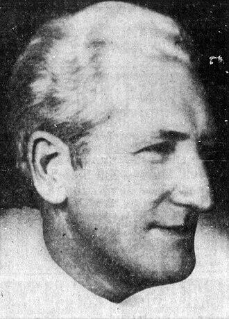

import Head from '@docusaurus/Head';

<Head>
  
</Head>

American journalist and author of *Behind the Flying Saucers*, the first major book claiming a UFO crash recovery, died of a heart attack on June 23, 1964.

| Field | Details |
|-------|---------|
| **Full Name** | Frank Scully |
| **Born** | April 28, 1892 |
| **Died** | June 23, 1964 |
| **Age at Death** | 72 |
| **Location of Death** | Palm Springs, California |
| **Cause of Death** | Heart attack |
| **Official Ruling** | Natural causes |
| **Category** | Journalist / UFO Author |

## Assessment: MODERATE SUSPICION

Scully's death at 72 from a heart attack, while working at his typewriter, is not inherently suspicious given his age and decades of poor health. However, the date of his death — June 23, 1964 — has drawn attention from UFO researchers because Frank Edwards, another prominent UFO author, died on June 23 (or June 24), 1967, and June 24 is the anniversary of Kenneth Arnold's landmark 1947 UFO sighting. The coincidence of dates has been noted but may be nothing more than that.

## Circumstances of Death

Frank Scully died on June 23, 1964, at his home in Palm Springs, California, reportedly while working at his typewriter. The cause of death was a heart attack. Scully had been in chronically poor health for most of his adult life, having undergone more than 40 operations over 30 years. He lived much of his life as an invalid, functioning with one lung and one leg, yet maintained a prolific writing career and was known for his humor despite constant pain.

## Background

Frank Scully was a prominent American journalist, author, and humorist who wrote a regular column for the entertainment trade magazine *Variety*. He was well connected in Hollywood circles and authored multiple books on various subjects.

In 1950, Scully published *Behind the Flying Saucers*, which became a controversial bestseller and was translated into multiple languages, reportedly selling over 10 million copies. The book described an alleged flying saucer crash near Aztec, New Mexico, in 1948, based primarily on information provided by oilman Silas M. Newton and a scientist Scully called "Dr. Gee" (later identified as Leo A. GeBauer). Scully described the recovered craft as operating on a "System of Nines" using magnetic propulsion, and claimed that small humanoid occupants were found dead inside.

In 1952, San Francisco Chronicle reporter J.P. Cahn exposed Newton and GeBauer as con artists, severely damaging Scully's credibility. Newton and GeBauer were eventually convicted of fraud in 1953, though the conviction was related to oil swindles rather than the UFO claims specifically.

Despite the hoax exposure, Scully maintained his belief in the Aztec crash. In his 1963 autobiographical book *In Armour Bright*, he reiterated his conviction that the 1948 saucer crash was real. Some modern researchers have revisited the Aztec case and argue that while Newton and GeBauer were indeed fraudsters, the underlying crash story may have had a separate, legitimate origin.

## Why This Death Possibly Raises Questions

- The date of his death (June 23) is one day before the anniversary of Kenneth Arnold's June 24, 1947 sighting — the same date (June 23 or 24) on which Frank Edwards also died three years later
- Otto Binder and other UFO researchers noted a pattern of UFO-connected deaths clustering around the June 24 anniversary date
- However, Scully was 72 years old with a lifetime of severe health problems, making a natural death entirely plausible
- No evidence of foul play has been documented or seriously alleged
- His main informants had already been exposed as con artists over a decade earlier, reducing any perceived need to silence him

## See Also

- [Frank Edwards](Frank_Edwards.mdx) — UFO author who also died on June 23, three years later
- [Morris Jessup](Morris_Jessup.mdx) — Another 1950s UFO author who died under disputed circumstances
- [Edward Ruppelt](Edward_Ruppelt.mdx) — Project Blue Book director who died at 37 in 1960

## Other Shocking Stories

- [Mark McCandlish](Mark_McCandlish.mdx): Aerospace illustrator and UFO disclosure advocate who died of a gunshot wound ruled as suicide in 2021, reportedly...
- [Roger Hill](Roger_Hill.mdx): Marconi radar designer found dead from a self-inflicted shotgun wound at his home in Surrey
- [Philip Haney](Philip_Haney.mdx): Department of Homeland Security founding member and counterterrorism whistleblower who was found dead from a single gunshot wound...

## Sources

- [Frank Scully — Wikipedia](https://en.wikipedia.org/wiki/Frank_Scully)
- [Frank Scully and Flying Saucers — American Heritage Center](https://ahcwyo.org/2021/11/29/frank-scully-and-flying-saucers/)
- [Flying Saucers and Frank Scully — SMU Physics](https://www.physics.smu.edu/pseudo/UFOs/Scully/)
- [Behind the Flying Saucers — Goodreads](https://www.goodreads.com/book/show/6012580-behind-the-flying-saucers)
- [Frank Scully — Wyoming History Day](https://www.wyominghistoryday.org/theme-topics/collections/frank-scully)

*This information was built by Grok and Claude AI research.*

**Status:** Deceased (1964)
