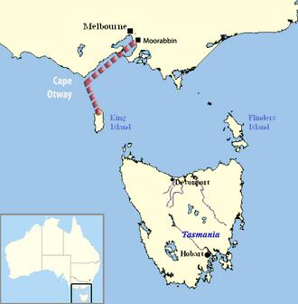

# Frederick Valentich
Australian pilot who disappeared over Bass Strait in 1978 after radioing Melbourne air traffic control to report an unidentified craft hovering above his Cessna 182; neither he nor his aircraft were ever found.

| Field | Details |
|-------|---------|
| **Full Name** | Frederick Valentich |
| **Born** | June 9, 1958 (Melbourne, Victoria, Australia) |
| **Died** | October 21, 1978 (presumed) |
| **Age at Death** | 20 (at time of disappearance) |
| **Location of Death** | Over Bass Strait, between mainland Australia and Tasmania |
| **Cause of Death** | Unknown -- disappeared; aircraft never recovered |
| **Official Ruling** | "The reason for the disappearance of the aircraft has not been determined" (Australian Department of Transport) |
| **Category** | Pilot / UFO Disappearance Case |

## Assessment: UNCERTAIN

Frederick Valentich disappeared on October 21, 1978, during a solo flight over Bass Strait in a Cessna 182L. His final radio transmissions to Melbourne air traffic control described an unidentified craft with a shiny metal surface and green light hovering and orbiting above him. His last words before transmission was cut off by metallic scraping sounds were "It is not an aircraft." Neither Valentich nor his aircraft were ever found despite an extensive search covering over 1,000 square miles. The Australian Department of Transport concluded the reason for the disappearance could not be determined. While this is one of the most well-documented pilot-UFO encounter cases, alternative explanations including disorientation and accidental crash into the sea have been proposed.

## Circumstances of Death

On the evening of Saturday, October 21, 1978, twenty-year-old Frederick Valentich departed Moorabbin Airport in Melbourne for a 125-nautical-mile (232 km) flight to King Island in a Cessna 182L light aircraft, registered VH-DSJ. The stated purpose of his flight was to pick up passengers, though it was later reported that there were no passengers waiting for him on King Island.

At approximately 7:06 PM, Valentich radioed Melbourne air traffic control to report that a large unknown aircraft was flying approximately 1,000 feet above him. Over the next several minutes, he provided the following descriptions:

- The aircraft was "orbiting" above him
- It had a shiny metal surface
- It had a green light
- "It is not an aircraft"
- His engine began running roughly

At 7:12 PM, his transmission was interrupted by unidentified noise described as "metallic, scraping sounds," and all contact was lost.

A sea and air search was launched, involving oceangoing ship traffic, an RAAF Lockheed P-3 Orion aircraft, and eight civilian aircraft. The search covered over 1,000 square miles (2,600 km2) and was called off on October 25, 1978, without result. No trace of Valentich or his aircraft was ever found.

## Background

Frederick Valentich was a 20-year-old Australian pilot from Melbourne. According to his father, Guido Valentich, Frederick was an ardent believer in UFOs and had expressed concern about being attacked by them. Six days before his disappearance, Valentich reportedly discussed with his girlfriend, Rhonda Rushton, the possibility of a UFO taking him away.

Valentich was described as an inexperienced pilot who had twice failed his commercial pilot license examination. He had a total of approximately 150 hours of flight time. Some investigators have pointed to his relatively limited experience as relevant to evaluating what may have happened during the flight.

Multiple witnesses reportedly saw "an erratically moving green light in the sky" in the area around the time of Valentich's disappearance. These accounts are considered significant by UFO researchers because they correspond with the "green light" Valentich described in his radio transmissions.

The Australian Department of Transport investigation concluded that "the reason for the disappearance of the aircraft has not been determined."

## Competing Theories

**UFO encounter:** Ufologists have argued that Valentich's detailed radio descriptions, the corroborating witness reports of green lights, and the complete disappearance of both pilot and aircraft are consistent with an extraterrestrial encounter.

**Disorientation and crash:** Skeptical investigators, including James McGaha and Joe Nickell writing in *Skeptical Inquirer*, proposed that the lights Valentich reported were probably the planets Venus, Mars, and Mercury, along with the bright star Antares. They suggested he may have become disoriented and crashed into the sea.

**Staged disappearance:** Some have speculated that Valentich staged his own disappearance, though no evidence has ever emerged to support this theory.

## Why This Death Possibly Raises Questions

- Detailed radio transmissions describing an unidentified craft with specific characteristics (metallic surface, green light, orbiting behavior)
- Final transmission cut off by unidentified "metallic, scraping sounds"
- Neither pilot nor aircraft ever found despite extensive search
- Multiple independent witnesses reported green lights in the sky at the time
- Australian Department of Transport could not determine the cause of disappearance
- One of the best-documented pilot-UFO encounter cases in history
- However: Valentich was an inexperienced pilot with only 150 hours flight time
- His pre-existing belief in UFOs and fear of UFO attack may be relevant to interpreting his radio reports
- Bass Strait is known for treacherous flying conditions

## See Also

- [Felix Moncla](Felix_Moncla.md) — USAF pilot who disappeared during a UFO intercept over Lake Superior in 1953
- [Thomas Mantell](Thomas_Mantell.md) — USAF pilot who crashed while pursuing a UFO in 1948
- [Todd Sees](Todd_Sees.md) — Pennsylvania man found dead after UFO sighting on the same morning
- [Jonathan Lovette](Jonathan_Lovette.md) — Alleged USAF airman mutilation case near Holloman AFB
- [Jim Sullivan](Jim_Sullivan.md) — Musician who vanished in the New Mexico desert in 1975

## Other Shocking Stories

- [Victor Moore](Victor_Moore.md): Marconi engineer working on infrared satellite systems who died of a drug overdose — MI5 reportedly investigated his...
- [Carl Grillmair](Carl_Grillmair.md): Caltech/IPAC astrophysicist who studied galaxy collisions and the search for water on exoplanets. Shot and killed on the...
- [Luis "Lue" Elizondo](Lue_Elizondo.md): Former head of the Pentagon's Advanced Aerospace Threat Identification Program (AATIP), UAP whistleblower, author of *Imminent*, and the...
- [Don Elkins](Don_Elkins.md): Physics professor, Boeing 727 captain, and co-author of the Ra Material (Law of One), who died of a...

## Sources

- [Disappearance of Frederick Valentich - Wikipedia](https://en.wikipedia.org/wiki/Disappearance_of_Frederick_Valentich)
- [Snopes - Frederick Valentich's 'UFO' Sighting and Disappearance](https://www.snopes.com/articles/383824/frederick-valentich-ufo-disappearance/)
- [Discovery UK - Mystery or Tragedy: The Frederick Valentich Disappearance](https://www.discoveryuk.com/mysteries/mystery-or-tragedy-the-frederick-valentich-disappearance/)
- [Skeptical Inquirer - The Valentich Disappearance: Another UFO Cold Case Solved](https://skepticalinquirer.org/2013/11/the-valentich-disappearance-another-ufo-cold-case-solved/)
- [Unsolved Mysteries - UFO Disappearance](https://unsolved.com/gallery/ufo-disappearance/)

*This information was built by Grok and Claude AI research.*

**Status:** Missing, presumed deceased (1978)
