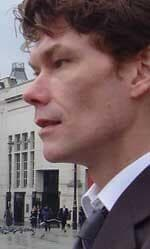

# Gary McKinnon
Scottish systems administrator who hacked into 97 U.S. military and NASA computers searching for evidence of UFO cover-ups, found references to "non-terrestrial officers," and faced 70 years in prison before the UK blocked his extradition on human rights grounds.

| Field | Details |
|-------|---------|
| **Full Name** | Gary McKinnon |
| **Born** | February 10, 1966 (Glasgow, Scotland) |
| **Status** | ALIVE |
| **Current Location** | United Kingdom |
| **Category** | Hacker / UFO Researcher |

## Assessment: MODERATE SUSPICION (historical threat, now resolved)

Gary McKinnon's case represents one of the most significant clashes between UFO disclosure efforts and U.S. national security. Between 2001 and 2002, he penetrated some of the most sensitive computer systems in the U.S. military and NASA, claiming to have found evidence of UFO cover-ups including a spreadsheet listing "non-terrestrial officers" and evidence of image tampering at NASA's Johnson Space Center. The U.S. government's pursuit of McKinnon was extraordinarily aggressive -- seeking extradition and up to 70 years in prison -- which some interpret as disproportionate to the damage caused and potentially motivated by what he may have accessed. His extradition was blocked in 2012 by UK Home Secretary Theresa May on human rights grounds.

## Current Situation

McKinnon lives freely in the United Kingdom. In October 2012, UK Home Secretary Theresa May blocked his extradition to the United States, citing his Asperger syndrome diagnosis and the risk of suicide, ruling that extradition would be incompatible with his human rights. The Crown Prosecution Service subsequently announced it would not prosecute him in the UK, citing the difficulty of bringing a case when the evidence was in the United States. No U.S. or UK charges remain active against him.

## Background

Gary McKinnon is a Scottish systems administrator and self-taught computer enthusiast who, between February 2001 and March 2002, hacked into 97 U.S. military and NASA computers from his girlfriend's aunt's house in London. He was accused by U.S. prosecutors of perpetrating the "biggest military computer hack of all time," with damages allegedly totaling $700,000.

McKinnon stated that he was searching for evidence of free energy suppression and a UFO cover-up by the U.S. government. He reportedly found the following:

- **"Non-terrestrial officers" spreadsheet:** McKinnon claims he accessed an Excel spreadsheet at U.S. Space Command listing names and ranks of officers under the heading "non-terrestrial officers," which he interpreted as suggesting an off-Earth military assignment or program. He did not have time to copy the file before his connection was interrupted.
- **NASA image tampering:** He investigated claims from a NASA photographic expert that at Johnson Space Center's Building 8, satellite images were regularly cleaned of evidence of UFO craft. McKinnon stated he accessed raw and processed versions of images and confirmed the alterations, including viewing a large cigar-shaped object in an unprocessed satellite photograph.
- **Fleet-to-fleet transfers:** He reportedly found references to ship-to-ship transfers of materials that did not correspond to any known naval vessels.

McKinnon was indicted in November 2002 by a federal grand jury in the Eastern District of Virginia on seven counts of computer-related crime, each carrying a potential ten-year sentence. The extradition battle lasted from 2002 to 2012, becoming a cause celebre in the UK, with support from figures including Pink Floyd's David Gilmour and various members of Parliament.

McKinnon was diagnosed with Asperger syndrome during the extradition proceedings, which factored into the eventual decision to block extradition.

## Why This Person Matters

- Claims to have found direct evidence of UFO-related information on U.S. military and NASA systems, including a "non-terrestrial officers" spreadsheet
- Alleged discovery of systematic image tampering at NASA's Johnson Space Center to remove evidence of craft from satellite photographs
- The disproportionate U.S. government response -- seeking 70 years in prison -- suggests the severity of what he may have accessed
- His case forced a high-profile legal and diplomatic confrontation between the U.S. and UK over extradition
- The "non-terrestrial officers" claim, if verified, would represent evidence of an undisclosed space-based military program
- His case demonstrated that sensitive UAP-related information may have been stored on systems with relatively poor security
- The UK government's decision to block extradition on human rights grounds set a legal precedent
- McKinnon has been unable to provide copies of what he found, as he did not download the files, making his claims unverifiable

## See Also

- [Bob Lazar](Bob_Lazar.mdx) — Physicist who claims to have reverse-engineered alien craft at S-4
- [David Grusch](David_Grusch.mdx) — UAP whistleblower who testified about recovered non-human craft
- [Lue Elizondo](Lue_Elizondo.mdx) — Former AATIP director and disclosure advocate
- [George Knapp](George_Knapp.mdx) — Journalist who has reported on UFO cover-ups for over 35 years

## Other Shocking Stories

- [Karl Wolfe](Karl_Wolfe.mdx): Former US Air Force sergeant and Disclosure Project witness who claimed he saw NASA photos of alien structures...
- [Monica Jacinto Reza](Monica_Jacinto_Reza.mdx): Aerospace materials scientist who worked as a Materials Science & Engineering Fellow at L3Harris and previously as a...
- [Wilbert B. Smith](Wilbert_Smith.mdx): Canadian government engineer who ran Project Magnet, Canada's official UFO study, and concluded UFOs were extraterrestrial in origin
- [Ann Livingston](Ann_Livingston.mdx): MUFON investigator and accountant who died of fast-acting ovarian cancer in 1994 after publishing research on electronic harassment...

## Sources

- [Gary McKinnon - Wikipedia](https://en.wikipedia.org/wiki/Gary_McKinnon)
- ["Non-terrestrial officers:" the UFO files Gary McKinnon says he found - Cybernews](https://cybernews.com/news/nasa-gary-mckinnon-hacking-ufo/)
- [Gary McKinnon: The Autistic Hacker - IEEE Spectrum](https://spectrum.ieee.org/the-autistic-hacker)
- [The UFO Hacker -- The Unbelievable Story of Gary McKinnon - Medium](https://medium.com/@svenpiper/the-ufo-hacker-the-unbelievable-story-of-gary-mckinnon-8b6ba74b768b)
- [UFO Hacker, Non-Terrestrial Officers & NASA's Hidden Craft - The Galactic Mind](https://www.thegalacticmind.com/the-ufo-hacker-gary-mckinnon/)

*This information was built by Grok and Claude AI research.*

**Status:** Alive
