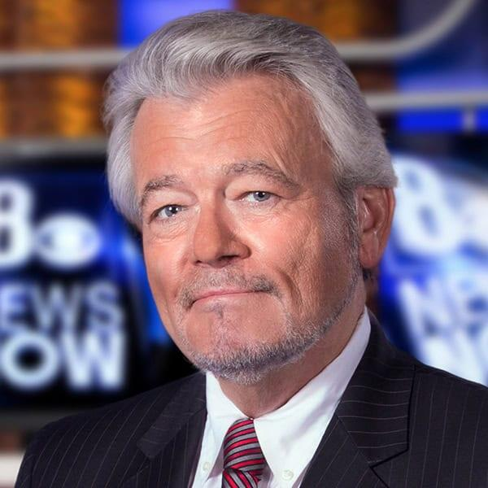

# George Knapp
Award-winning investigative journalist who broke the Bob Lazar / Area 51 story in 1989, has spent over 35 years investigating UAP, testified before Congress in 2025, and has reported that his sources have been surveilled and burglarized.

| Field | Details |
|-------|---------|
| **Full Name** | George T. Knapp |
| **Born** | April 18, 1953 (Northern California) |
| **Status** | ALIVE |
| **Current Location** | Las Vegas, Nevada |
| **Category** | Journalist / Investigator |

## Assessment: AT RISK

Knapp has reported that his phone was tapped and that associates and sources involved in his UAP reporting have been surveilled and burglarized. Over 35 years of investigating UAP and classified programs, Knapp has accumulated an extensive network of insider sources and classified knowledge. His 2025 Congressional testimony elevates his profile further. The pattern of UAP journalists and investigators dying under suspicious circumstances (see [Dorothy Kilgallen](Dorothy_Kilgallen.md), [Mae Brussell](Mae_Brussell.md)) underscores the risk.

## Current Situation

Knapp continues to work as chief reporter of the I-Team investigative unit at KLAS-TV (Channel 8) in Las Vegas, a position he has held since 1995. He frequently hosts *Coast to Coast AM*, a syndicated radio show. In November 2024, he hosted the Netflix docuseries *Investigation Alien*, which investigated UFO sightings and alien claims. On September 9, 2025, Knapp testified before the House Oversight and Accountability Committee, urging greater transparency and accountability in how the U.S. government investigates and discloses UAP encounters.

## Background

Knapp grew up in northern California and graduated from Franklin High School in Stockton, where he was senior class president. He was hired by KLAS-TV in Las Vegas in 1981 as a general assignment reporter.

In 1989, Knapp broke the [Bob Lazar](Bob_Lazar.md) story, conducting the first televised interviews with Lazar, who claimed to have worked on reverse-engineering alien spacecraft at a facility near Area 51 called S-4. The interviews aired on KLAS-TV in May and November 1989, attracting international attention and catapulting Area 51 into the public consciousness.

Knapp's work earned him five regional and two national Edward R. Murrow awards, a DuPont Award from Columbia University, and two Peabody Awards -- among the highest honors in broadcast journalism. In 1990, his UFO stories earned him an "Individual Achievement by a Journalist" award from United Press International.

In 2005, he co-authored *Hunt for the Skinwalker: Science Confronts the Unexplained at a Remote Ranch in Utah*, investigating the phenomena at Skinwalker Ranch.

Knapp has reported being under surveillance: "They were listening to my phone. They wanted to know who was offering to give me information." An investigator who worked on Bob Lazar's polygraph reported that his house was burglarized around the time of that work.

## Why This Person Matters

- Broke the Bob Lazar / Area 51 story in 1989, arguably the single most influential UAP media event in history
- Has investigated UAP for over 35 years, building an unmatched network of insider sources
- Testified before the House Oversight and Accountability Committee in September 2025
- National Peabody and DuPont Award-winning journalist, lending mainstream credibility to UAP reporting
- Reported surveillance of himself and burglaries targeting his sources
- His work directly connects to [Bob Lazar](Bob_Lazar.md) and the broader Area 51 / reverse-engineering narrative
- Hosted Netflix's *Investigation Alien* docuseries (2024), reaching a global audience
- One of the few journalists with decades of continuous UAP reporting, making him a living archive of source relationships and classified knowledge

## See Also

- [Bob Lazar](Bob_Lazar.md) — Physicist whose Area 51 story Knapp broke in 1989
- [David Grusch](David_Grusch.md) — UAP whistleblower who testified to Congress in 2023
- [Lue Elizondo](Lue_Elizondo.md) — Former AATIP director and disclosure advocate
- [Ryan Graves](Ryan_Graves.md) — Navy pilot and founder of Americans for Safe Aerospace
- [Tim Burchett](Tim_Burchett.md) — Congressman leading UAP hearings
- [Dorothy Kilgallen](Dorothy_Kilgallen.md) — Journalist who died while investigating UFO and JFK stories

## Other Shocking Stories

- [Gary McKinnon](Gary_McKinnon.md): Scottish systems administrator who hacked into 97 U.S. military and NASA computers searching for evidence of UFO cover-ups...
- [Brian Lynch](Brian_Lynch.md): Young psychic and contactee who died of a reported drug overdose in 1985 after alleged involvement with a...
- [Boyd Bushman](Boyd_Bushman.md): Lockheed Martin senior scientist with a 40-year career in defense aerospace, holder of 26 patents, who recorded a...

## Sources

- [George Knapp - Wikipedia](https://en.wikipedia.org/wiki/George_Knapp_(television_journalist))
- [George Knapp Written Testimony to Congress (Sept. 2025)](https://oversight.house.gov/wp-content/uploads/2025/09/George-Knapp-Written-Testimony.pdf)
- [Area 51, Whistleblower Retaliation: Inside the Files of George Knapp - NewsNation](https://www.newsnationnow.com/space/ufo/the-ufo-reporter-part-1-the-files-of-george-knapp/)
- [Lie Detectors, Russian Documents, Congressional Hearings: Part 2 - NewsNation](https://www.newsnationnow.com/space/ufo/ufo-reporter-part-2/)
- [George Knapp: Investigative Journalist & UFO Researcher - Sky Daily News](https://skydailynews.com/actualities/george-knapp)

*This information was built by Grok and Claude AI research.*
