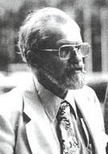

# J. Allen Hynek
Astronomer who served as scientific consultant to Project Blue Book, evolved from UFO skeptic to the field's most credible scientific advocate, died of brain tumor at 75.

| Field | Details |
|-------|---------|
| **Full Name** | Josef Allen Hynek |
| **Born** | May 1, 1910 |
| **Died** | April 27, 1986 |
| **Age at Death** | 75 |
| **Location of Death** | Scottsdale, Arizona |
| **Cause of Death** | Malignant brain tumor |
| **Official Ruling** | Natural causes |
| **Category** | Scientist / UFO Researcher |

## Assessment: UNCERTAIN

Hynek's death at 75 from a brain tumor is not inherently suspicious given his age. However, he is included here because of his singular importance to UFO research — he was the most scientifically credentialed and institutionally connected UFO researcher in history — and because brain tumors have appeared in a notable number of UFO researchers, including Ivan Sanderson. Hynek's death removed the single most respected scientific voice advocating for serious UAP study, and it would be 37 years before the topic regained mainstream scientific credibility.

## Circumstances of Death

Hynek died on April 27, 1986, at Memorial Hospital in Scottsdale, Arizona, from a malignant brain tumor. He had been diagnosed with the tumor some time before his death. According to those close to him, after learning of the diagnosis, Hynek quietly withdrew from the UFO research field he had done more than anyone to legitimize. He was 75 years old.

## Background

J. Allen Hynek was an American astronomer and professor who spent his career at Ohio State University, Harvard Observatory, Johns Hopkins Applied Physics Laboratory, and Northwestern University, where he served as professor and chairman of the astronomy department from 1960 until his retirement in 1978.

Hynek's involvement with UFOs began in 1948 when the U.S. Air Force hired him as a scientific consultant for Project Sign, the first official UFO investigation program. He continued in this role through Project Grudge and the much longer Project Blue Book (1952-1969). Initially a firm skeptic, Hynek was brought in specifically to debunk UFO reports by providing astronomical explanations.

Over two decades of reviewing thousands of UFO cases, Hynek's position shifted dramatically. He became increasingly frustrated with the Air Force's dismissive approach and recognized that a significant percentage of reports — particularly those from credible witnesses like pilots and military personnel — defied conventional explanation. His infamous "swamp gas" explanation for Michigan sightings in 1966, which he gave under Air Force pressure, became a source of lasting regret and public ridicule.

In 1972, Hynek published *The UFO Experience: A Scientific Inquiry*, in which he introduced the "Close Encounter" classification system (CE-1, CE-2, CE-3) that became standard terminology. Steven Spielberg later used this framework for his 1977 film *Close Encounters of the Third Kind*, in which Hynek made a cameo appearance.

In 1973, Hynek founded the Center for UFO Studies (CUFOS) in Chicago, which became the premier scientific organization for UFO research and continues to operate today. He was a close associate of [James McDonald](James_McDonald.mdx), the atmospheric physicist whose death is documented separately in this project.

## Why This Death Possibly Raises Questions

- Hynek was arguably the single most important figure in UFO research history — the only mainstream scientist with decades of official government UFO investigation experience
- His death from a brain tumor matches the cause of death of fellow anomalous phenomena researcher [Ivan Sanderson](Ivan_Sanderson.mdx)
- Brain tumors have been reported at what some researchers consider an elevated rate among UFO investigators, though no epidemiological study has confirmed this
- Hynek's death effectively decapitated the institutional scientific study of UFOs for decades — CUFOS continued but never had a figure of comparable stature
- However, Hynek was 75 years old, and brain tumors are not uncommon at that age
- There is no direct evidence of foul play in his death
- His death came 17 years after the closure of Project Blue Book, by which time the Air Force had largely succeeded in marginalizing UFO research

## See Also

- [James McDonald](James_McDonald.mdx) — McDonald and Hynek were the two most prominent scientist-ufologists of the 1960s
- [Ivan Sanderson](Ivan_Sanderson.mdx) — Another prominent paranormal researcher who died of brain cancer
- [Edward Ruppelt](Edward_Ruppelt.mdx) — Ruppelt ran Project Blue Book, on which Hynek served as consultant
- [Coral Lorenzen](Coral_Lorenzen.mdx) — APRO co-founder and contemporary of Hynek in civilian UFO research

## Other Shocking Stories

- [Ron Johnson](Ron_Johnson.mdx): MUFON Deputy Director of Investigations who collapsed and died suddenly during a scientific conference in 1994 under circumstances...
- [Shani Warren](Shani_Warren.mdx): GEC/Micro Scope employee found gagged, bound, and drowned in 18 inches of water at Taplow Lake — originally...
- [Gary McKinnon](Gary_McKinnon.mdx): Scottish systems administrator who hacked into 97 U.S. military and NASA computers searching for evidence of UFO cover-ups...
- [Walter Haut](Walter_Haut.mdx): USAF public information officer at Roswell Army Air Field who authored the famous July 8, 1947, press release...

## Sources

- [J. Allen Hynek — Wikipedia](https://en.wikipedia.org/wiki/J._Allen_Hynek)
- [J. Allen Hynek — Biography.com](https://www.biography.com/scientists/j-allen-hynek)
- [Meet J. Allen Hynek — HISTORY](https://www.history.com/articles/j-allen-hynek-ufos-project-blue-book)
- [Dr. J. Allen Hynek — Paradigm Research Group](https://www.paradigmresearchgroup.org/Hall%20of%20Fame/Hynek_Allen_J.htm)
- [Dr. J. Allen Hynek — UFO Evidence](http://ufoevidence.org/documents/doc1440.htm)
- [Hynek archival records — Northwestern University](https://findingaids.library.northwestern.edu/agents/people/1473)

*This information was built by Grok and Claude AI research.*

**Status:** Deceased (1986)
