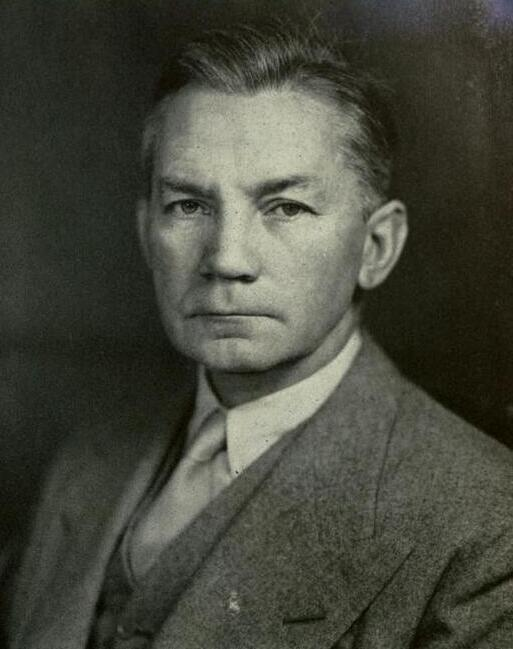

import Head from '@docusaurus/Head';

<Head>
  
</Head>

First United States Secretary of Defense, fell from the sixteenth floor of Bethesda Naval Hospital under disputed circumstances in 1949.

| Field | Details |
|-------|---------|
| **Full Name** | James Vincent Forrestal |
| **Born** | February 15, 1892 |
| **Died** | May 22, 1949 |
| **Age at Death** | 57 |
| **Location of Death** | Bethesda Naval Hospital, Bethesda, Maryland |
| **Cause of Death** | Injuries from fall from sixteenth-floor window |
| **Official Ruling** | The Navy review board concluded only that the fall caused his death and that no one in the U.S. Navy was responsible; the report did not formally conclude suicide |
| **Category** | Political Figure / Military / Intelligence |

## Assessment: HIGHLY SUSPICIOUS

Forrestal's death has been contested since 1949. A man reportedly on suicide watch was placed on the sixteenth floor rather than a ground-floor room as his caretakers preferred. A bathrobe cord was found wound tightly around his neck, yet no evidence indicated it had been tied to anything inside the bathroom. Broken glass was found on his bed. The official Navy review board notably did not conclude that Forrestal committed suicide — only that he died from the fall. UFO researchers have additionally claimed Forrestal was a member of the alleged MJ-12 group and was silenced because of his knowledge of recovered extraterrestrial technology, though these claims remain unsubstantiated.

## Circumstances of Death

In the early morning hours of May 22, 1949, Forrestal's body was found on a third-floor ledge outside room 384 of building one at the National Naval Medical Center in Bethesda, Maryland. He was pronounced dead at 1:55 a.m. He had fallen from the sixteenth floor, where he had been a patient since April 2, 1949, undergoing treatment for what was described as severe depression and a nervous breakdown.

The cord of his bathrobe was found wound tightly around his neck and tied in a knot. However, there was no evidence that the cord had been tied to the radiator or any fixture inside the bathroom window from which he allegedly jumped. Broken glass was reportedly found on his bed by the first person to enter his room after the fall. The bathroom window he allegedly exited was notably smaller than the window in his main room.

An official Navy review board completed its hearings on May 31, 1949, but waited until October 11, 1949, to release only a brief summary of its findings. The full report was not declassified until April 2004 — fifty-five years later.

## Background

James Forrestal served as the last cabinet-level Secretary of the Navy (1944-1947) and then as the first United States Secretary of Defense (1947-1949). He was a powerful and well-connected figure in the national security establishment during the critical early years of the Cold War.

Forrestal was forced to resign by President Truman in March 1949. His mental health reportedly deteriorated rapidly after his resignation, and he was admitted to Bethesda Naval Hospital. During his hospitalization, access to Forrestal was tightly controlled, and his family reportedly had difficulty visiting him.

In UFO lore, Forrestal is alleged to have been a member of MJ-12 (Majestic 12), a purported secret committee of scientists, military leaders, and government officials formed in 1947 by President Truman to investigate and manage the recovery of extraterrestrial craft. The MJ-12 documents, which surfaced in 1984, list Forrestal as a member. Most mainstream historians and many UFO researchers consider the MJ-12 documents to be fabricated, though some researchers argue elements of the story have merit. According to the MJ-12 narrative, Forrestal's growing instability and desire to go public with UFO information made him a liability who needed to be silenced.

## Why This Death Possibly Raises Questions

- The official Navy review board did not conclude that Forrestal committed suicide — only that the fall caused his death
- A man considered suicidal was placed on the sixteenth floor rather than a ground-floor room, as his caretakers had reportedly preferred
- The bathrobe cord was wound tightly around his neck but not tied to any fixture, raising questions about whether it was a failed hanging attempt or something else
- Broken glass was found on his bed, which was never adequately explained
- The bathroom window he allegedly jumped from was far smaller than his room window
- Access to Forrestal was tightly restricted during his hospitalization, with family visits limited
- The full review board report was not declassified until 2004, fifty-five years after his death
- He had been copying a passage from Sophocles' *Ajax* (a play about a warrior's despair and suicide) shortly before his death, which could support either the suicide or staged-suicide narrative
- Author David Martin published *The Assassination of James Forrestal* (2019), making a detailed case for murder
- UFO researchers claim his alleged MJ-12 membership and desire to reveal classified UFO information provided a motive for assassination, though the MJ-12 documents remain highly controversial

## The Counterargument

- Forrestal had a well-documented and severe mental breakdown following his forced resignation; his condition was diagnosed as "operational fatigue" — a contemporaneous term for serious depression — by the psychiatrist treating him
- He had exhibited paranoid behavior for weeks before his hospitalization, including telling multiple people he was being followed, that his phone was tapped, and that he was being poisoned — all consistent with a psychiatric crisis rather than grounded fear
- He had reportedly expressed suicidal ideation to colleagues and acquaintances during this period
- His Bethesda stay began as voluntary but transitioned to an involuntary psychiatric hold due to the severity of his condition
- The official Naval investigation concluded suicide, and the bathrobe sash wound around his neck is consistent with a failed or interrupted hanging attempt — not necessarily evidence of outside involvement
- The passage he was copying from Sophocles' *Ajax* — a meditation on a warrior's despair and suicide — is widely cited by those who accept the suicide ruling as evidence of his state of mind
- The primary claim that the CIA assassinated Forrestal was made by Seymour Hersh decades after the fact, without supporting documentary evidence; mainstream historians do not consider it established
- The 55-year delay in releasing the full report, while suspicious to some, may reflect standard Cold War classification practices for records involving the mental health of senior national security officials

## Key Quotes from Media Coverage

> "The body was found at 1:50 a.m. on the ledge of the third floor. He was pronounced dead at 1:55 a.m." — Navy review board findings

> "The cord of his bathrobe was wound tightly around his neck and tied in a knot." — Multiple accounts of the death scene

## See Also

- [Edward Ruppelt](Edward_Ruppelt.mdx) — Director of Project Blue Book during the early 1950s
- [Thomas Mantell](Thomas_Mantell.mdx) — Military pilot who died pursuing a UFO one year before Forrestal's death
- [Frank Edwards](Frank_Edwards.mdx) — News commentator who discussed the Forrestal case in his UFO writings
- [Damon Runyon Jr.](Damon_Runyon_Jr.mdx) — UFO writer who also fell from a bridge, ruled suicide — same method as Forrestal's disputed fall
- [John Rossi](John_Rossi.mdx) — Major General commanding Space and Missile Defense, found hanged two days before promotion to three-star general

## Other Shocking Stories

- [Gary McKinnon](Gary_McKinnon.mdx): Scottish systems administrator who hacked into 97 U.S. military and NASA computers searching for evidence of UFO cover-ups...
- [Todd Sees](Todd_Sees.mdx): Pennsylvania deer hunter whose body was found emaciated and in his underwear near his home after a UFO...
- [Ryan Graves](Ryan_Graves.mdx): Former U.S. Navy F/A-18 pilot who became the first active-duty military pilot to publicly testify before Congress about...
- [Dylan Borland](Dylan_Borland.mdx): Former U.S. Air Force geospatial intelligence specialist who testified before Congress in September 2025 about witnessing a silent...

## Sources

- [James Forrestal — Wikipedia](https://en.wikipedia.org/wiki/James_Forrestal)
- [Death of James Forrestal — Truman Library](https://www.trumanlibrary.gov/library/proclamations/2840/death-james-forrestal)
- [James V. Forrestal — Britannica](https://www.britannica.com/biography/James-V-Forrestal)
- [James Forrestal — Spartacus Educational](https://spartacus-educational.com/USAforrestal.htm)
- [Truman's Secretary of Defense James Forrestal: Murder or Suicide? — Criminal Element](https://www.criminalelement.com/secretary-of-defense-james-forrestal-murder-or-suicide-tony-hays/)
- [James Vincent Forrestal — Arlington National Cemetery](https://www.arlingtoncemetery.net/jvforres.htm)
- [The Assassination of James Forrestal — David Martin](https://www.amazon.com/Assassination-James-Forrestal-David-Martin/dp/0967352126)

*This information was built by Grok and Claude AI research.*

**Status:** Deceased (1949)

---

## Additional context from the UAP Physics Murders investigation

The first United States Secretary of Defense, who allegedly held knowledge of early UAP crash retrieval programs and was a purported member of the secret MJ-12 committee, died after falling from a 16th-floor window at Bethesda Naval Hospital on May 22, 1949, under circumstances that remain disputed to this day.

| Field | Details |
|-------|---------|
| **Full Name** | James Vincent Forrestal |
| **Born** | February 15, 1892, Matteawan (now Beacon), New York |
| **Died** | May 22, 1949 (age 57), Bethesda Naval Hospital, Bethesda, Maryland |
| **Role** | First U.S. Secretary of Defense (1947-1949), Secretary of the Navy (1944-1947) |
| **Cause of Death** | Fall from 16th-floor window; officially ruled suicide, widely disputed |
| **Burial** | Arlington National Cemetery |

## Biography

### Early Life and Education

James Vincent Forrestal was born on February 15, 1892, in Matteawan (now Beacon), New York, into a middle-class Irish Catholic family. His father owned a successful construction and contracting business. Forrestal was an excellent student with a keen interest in journalism, working for two local newspapers including the Matteawan Journal during his youth.

Forrestal enrolled at Dartmouth College in 1911, then transferred to Princeton University the following year. At Princeton, he served on the student council and became editor of the Daily Princetonian. His classmates voted him "most likely to succeed" -- a prediction that proved accurate in the short term and tragically ironic in its conclusion.

### Wall Street Career

After serving as a naval aviator during World War I, Forrestal joined the Wall Street investment firm William A. Read & Company (later Dillon, Read & Co.) as a bond salesman. He rose rapidly through the ranks, was elected to the partnership in 1923, and became one of the most prominent investment bankers of the Roaring Twenties. By 1940, he had been named president of the firm, placing him among the most powerful financiers in the United States.

### Government Service

Forrestal left Wall Street in 1940 to serve as Undersecretary of the Navy under President Franklin D. Roosevelt, entering government service as the United States prepared for potential entry into World War II. Following the death of Secretary of the Navy Frank Knox in May 1944, Forrestal was elevated to the position of Secretary of the Navy, where he oversaw the final stages of the Pacific naval campaign.

In 1947, President Harry S. Truman appointed Forrestal as the first Secretary of Defense under the newly created National Security Act. This legislation unified the military branches under a single Department of Defense -- a role Forrestal had helped shape but which proved to be severely underpowered in practice. As Secretary of Defense, Forrestal championed the racial integration of the armed services, a move that preceded the broader Civil Rights Movement.

### Political Conflicts and Forced Resignation

Forrestal's tenure as Secretary of Defense was marked by intense bureaucratic infighting over military unification, budget disputes among the service branches, and deepening Cold War tensions. His cautious stance on the partition of Palestine and the creation of Israel placed him at odds with dominant factions within the Truman administration and drew fierce opposition from powerful media figures.

Syndicated columnists Drew Pearson and Walter Winchell conducted a relentless press campaign against Forrestal. Their columns characterized him as unstable, anti-Semitic, and a tool of Wall Street and the oil industry. Pearson accused Forrestal of having prevented the Allies from bombing the I.G. Farben industrial works in Germany during the war because he allegedly owned stock in a parent company. Winchell, an ardent supporter of the Zionist movement, turned against Forrestal once the Secretary's position on Israel became publicly known.

On March 28, 1949, President Truman forced Forrestal's resignation. Forrestal was reportedly devastated by his removal from office. Within days, his behavior became erratic, and he was diagnosed with "severe depression" by Dr. William C. Menninger of the Menninger Clinic, who compared his condition to "operational fatigue" seen during the war.

## Alleged Connection to UAP Programs

### The MJ-12 Documents

According to controversial documents that surfaced in 1984, Forrestal was allegedly a founding member of Majestic 12 (MJ-12), a purported top-secret committee established by President Truman on September 24, 1947 -- just weeks after the reported Roswell incident -- to manage the recovery and investigation of crashed extraterrestrial craft. The alleged Truman memorandum, dated September 24, 1947, reportedly authorized Forrestal and Dr. Vannevar Bush to proceed with "Operation Majestic Twelve."

It must be noted that the FBI investigated the MJ-12 documents and declared them "completely bogus." Many mainstream ufologists, including respected researchers, consider the documents to be an elaborate hoax or disinformation operation. However, proponents argue that the documents' disputed authenticity does not preclude the existence of such a committee under a different name or classification.

### Timing and Context

The timing of Forrestal's career trajectory intersects with key events in UAP history:

- **July 1947** -- The Roswell incident occurs in New Mexico during Forrestal's tenure as Secretary of the Navy
- **September 17, 1947** -- Forrestal is sworn in as the first Secretary of Defense, placing him at the apex of the U.S. military command structure
- **September 24, 1947** -- The date of the alleged Truman-to-Forrestal MJ-12 authorization memorandum
- **March 28, 1949** -- Forrestal is forced to resign
- **May 22, 1949** -- Forrestal dies at Bethesda Naval Hospital

Some UAP researchers have noted that Forrestal showed no publicly documented signs of mental instability until the period following his alleged involvement with classified UAP programs. Proponents of the assassination theory suggest that Forrestal's desire to share information about UAP matters with the public or with political allies placed him in conflict with those who insisted on absolute secrecy, potentially including other members of the alleged MJ-12 group.

### The "Diary" Question

Forrestal kept detailed personal diaries throughout his government career. After his death, the diaries were held by the White House for over a year before a heavily edited version was published in 1951 by Walter Millis as *The Forrestal Diaries*. The original, unedited diaries were reportedly transferred to Princeton University's Mudd Manuscript Library, though researchers have claimed that sections were removed or remain classified. Whether the diaries contained references to UAP-related programs has never been established from available records.

## Death Circumstances

### Hospitalization

Following his forced resignation on March 28, 1949, Forrestal was taken to Hobe Sound, Florida, where he stayed at the home of Under Secretary of State Robert Lovett. His condition reportedly deteriorated rapidly. On April 2, 1949, Forrestal was admitted to the National Naval Medical Center at Bethesda, Maryland, and placed on the 16th floor in a VIP suite.

Forrestal was placed under the care of Captain George N. Raines, the chief psychiatrist at Bethesda. Notably, Forrestal's personal physician, Dr. Raines, reportedly restricted visitors, including Forrestal's own family members and close friends, for extended periods during his hospitalization. Forrestal's brother Henry reportedly objected to these restrictions and had been trying to have James released into his care.

### The Night of May 22, 1949

According to the official account, at approximately 1:50 a.m. on Sunday, May 22, 1949, Forrestal's body was found on a third-floor ledge below a 16th-floor kitchen window across the hall from his room. He was pronounced dead at 1:55 a.m. The sash of his bathrobe was found tied tightly around his neck.

The widely circulated narrative holds that Forrestal had been copying the poem "Chorus from Ajax" by Sophocles -- a meditation on the despair of a fallen warrior -- onto sheets of paper before he fell. However, the handwriting on the transcription was never formally authenticated as Forrestal's. Biographers Townsend Hoopes and Douglas Brinkley stated that a corpsman had looked in on Forrestal at 1:45 a.m. and found him "busy copying" the poem. However, testimony given to the Willcutts Review Board by the attending corpsman reportedly contradicted this account, indicating Forrestal was in his bed at that time.

### Suspicious Circumstances

Multiple elements of Forrestal's death have raised questions among investigators and historians:

- **The bathrobe sash**: The sash of Forrestal's dressing gown was found tied tightly around his neck. The official narrative suggested he used it in an attempt to hang himself from a radiator below the window before falling. However, no formal determination was made as to why the sash was around his neck, and some investigators have noted it is equally consistent with an assailant subduing the victim.

- **Broken glass**: Investigator David Martin, who obtained the Willcutts Report through the Freedom of Information Act in 2004, documented the presence of broken glass found on Forrestal's bed and on the carpet of his room, which he argues is consistent with a struggle having taken place.

- **Room condition**: The "crime scene" in Room 1618 was reportedly cleaned before official photographs were taken, potentially compromising physical evidence.

- **Window access**: Forrestal was in a secured VIP suite on the 16th floor. He allegedly crossed the hallway to a small kitchen or diet kitchen, where he accessed a window that was neither locked nor guarded. Questions have been raised about why a high-profile patient under psychiatric care for suicidal ideation had unsupervised access to an unguarded window.

- **Guard absence**: A Navy corpsman was assigned to watch Forrestal, but the guard was reportedly not present at the time of the fall. The Willcutts Report examined the circumstances of the guard's absence.

- **Visitor restrictions**: Forrestal's brother Henry had reportedly been planning to remove James from the hospital and into private care. Some researchers have noted that Henry Forrestal's visits were restricted in the weeks before the death, and that the death occurred just before a planned family visit.

## The Willcutts Review Board

Admiral Morton D. Willcutts, the commanding officer of the National Naval Medical Center, convened a review board to investigate Forrestal's death. The proceedings lasted five days and included testimony from hospital staff, the attending corpsman, and other witnesses.

The resulting report, approved on July 13, 1949, was kept classified for over 55 years. When it was finally obtained through the Freedom of Information Act in 2004, it revealed several notable points:

- The review board **did not formally conclude that Forrestal committed suicide**. It determined only that the fall caused his death and that no one in the U.S. Navy was responsible for it.
- Key witness testimony contradicted elements of the publicly reported narrative, including the claim that Forrestal was copying the Sophocles poem just before his death.
- The board absolved hospital staff and the Navy of negligence but did not address the full range of physical evidence.
- Several historians have called for a formal re-investigation based on discrepancies between the Willcutts Report testimony and the established public narrative.

## The Counterargument

The mainstream historical consensus, as presented by biographers Townsend Hoopes and Douglas Brinkley in their 1992 work *Driven Patriot: The Life and Times of James Forrestal*, is that Forrestal suffered a genuine mental breakdown brought on by the extreme pressures of his position, political attacks from the press, and the stress of the early Cold War. Under this view:

- Forrestal's depression was a well-documented medical condition diagnosed by qualified psychiatrists, including Dr. Menninger, one of the most respected psychiatric authorities in the country
- The intense pressures of serving as the first Secretary of Defense -- managing interservice rivalries, Cold War strategy, and budget disputes -- were sufficient to cause a breakdown without invoking any connection to UAP programs
- The MJ-12 documents linking Forrestal to a secret UFO committee have been dismissed as forgeries by the FBI and by many UFO researchers themselves
- Forrestal's known political conflicts -- his opposition to the recognition of Israel, his battles with Drew Pearson, and his deteriorating relationship with Truman -- provide ample motive for his psychological decline without requiring a UAP-related explanation
- Suicide among patients hospitalized for severe depression, even in supervised settings, was not uncommon in the era before modern psychiatric medications and protocols

However, even mainstream historians have acknowledged that the circumstances surrounding Forrestal's death contain unresolved questions, and the 55-year classification of the Willcutts Report has fueled legitimate concerns about transparency.

## Legacy

Forrestal's legacy extends well beyond the controversy surrounding his death:

- The USS Forrestal (CVA-59), the first supercarrier of the United States Navy, was named in his honor and commissioned in 1955
- The James Forrestal Building in Washington, D.C., serves as the headquarters of the United States Department of Energy
- He is buried at Arlington National Cemetery, where President John F. Kennedy -- who had served as Forrestal's aide in 1945 -- visited his grave on Memorial Day 1963, six months before Kennedy's own assassination
- His advocacy for military unification and racial integration of the armed forces shaped the modern Department of Defense

Within the UAP research community, Forrestal's death is frequently cited as one of the earliest and most significant examples of the alleged pattern of suspicious deaths among individuals connected to classified UAP programs. Whether his death was a suicide driven by genuine mental illness or an assassination motivated by what he knew, James Forrestal remains a central figure in the intersection of national security, government secrecy, and the UAP question.

## Related Perspectives

- [Bob Lazar](Bob_Lazar.mdx) -- Claimed to hold a "Majestic-level" security clearance at S-4, referencing the same MJ-12 classification allegedly connected to Forrestal
- [Philip Corso](Philip_Corso.mdx) -- Army officer who claimed involvement in reverse-engineering recovered UAP technology through military channels established during Forrestal's era
- [Stanton Friedman](Stanton_Friedman.mdx) -- Nuclear physicist and UFO researcher who extensively investigated the MJ-12 documents and the Roswell incident
- [Morris Jessup](Morris_Jessup.mdx) -- Astronomer and UFO researcher whose 1959 death was also ruled suicide under disputed circumstances, representing a similar pattern
- [Mark McCandlish](Mark_McCandlish.mdx) -- Aerospace illustrator and UAP researcher who died under disputed circumstances after claiming knowledge of classified antigravity programs
- [Phil Schneider](Phil_Schneider.mdx) -- Government contractor who claimed knowledge of underground bases and secret programs, found dead under suspicious circumstances in 1996
- [Luis Elizondo](Luis_Elizondo.mdx) -- Former Pentagon official who ran the modern AATIP program, the institutional descendant of the classified UAP efforts Forrestal allegedly oversaw
- [David Grusch](David_Grusch.mdx) -- Intelligence officer whose 2023 congressional testimony about UAP crash retrieval programs echoes the core claims of the MJ-12 narrative
- [Gravity Manipulation](Gravity_Manipulation.mdx) -- The physics behind the alleged recovered craft that Forrestal's MJ-12 committee was purportedly formed to study
- [William Colby](William_Colby.mdx) -- Former CIA Director whose 1996 death under disputed circumstances parallels Forrestal's case; both held apex national security positions, allegedly possessed classified UAP knowledge, and died under officially mundane circumstances that remain contested
- [GEC-Marconi Scientists](GEC_Marconi_Scientists.mdx) -- 25+ British defense scientists who died suspiciously during the 1980s SDI program; represents the broader pattern of defense insiders dying under contested circumstances that began with Forrestal's 1949 death

## Sources

- [James Forrestal -- Wikipedia](https://en.wikipedia.org/wiki/James_Forrestal) -- Comprehensive biographical article covering Forrestal's life, career, and death
- [James V. Forrestal -- Britannica](https://www.britannica.com/biography/James-V-Forrestal) -- Encyclopedic overview of Forrestal's political career and legacy
- [The Willcutts Report -- ariwatch.com](https://www.ariwatch.com/VS/JamesForrestal/WillcuttsReport.htm) -- Analysis of the declassified Navy investigation into Forrestal's death
- [Historians Support Inquiry into the Death of James Forrestal -- History News Network](https://www.historynewsnetwork.org/article/historians-support-inquiry-into-the-death-of-james) -- Academic support for re-investigating Forrestal's death
- [The Assassination of James Forrestal -- David Martin (Duke Report Books)](https://dukereportbooks.com/books/the-assassination-of-james-forrestal/) -- Book-length investigation using the declassified Willcutts Report to challenge the suicide ruling
- [Majestic 12 -- Wikipedia](https://en.wikipedia.org/wiki/Majestic_12) -- Overview of the MJ-12 documents and their disputed authenticity
- [James V. Forrestal -- Naval History and Heritage Command](https://www.history.navy.mil/content/history/nhhc/browse-by-topic/people/sec-nav/forrestal/james-forrestal.html) -- Official Navy biography
- [James V. Forrestal (1947-1949) -- Miller Center, University of Virginia](https://millercenter.org/president/truman/essays/forrestal-1947-secretary-of-defense) -- Academic analysis of Forrestal's role as Secretary of Defense
- [James Forrestal -- Spartacus Educational](https://spartacus-educational.com/USAforrestal.htm) -- Detailed biographical resource with primary source excerpts
- [Was the 1949 "Suicide" of Defense Secretary James Forrestal the First Major Domestic Political Assassination? -- CovertAction Magazine](https://covertactionmagazine.com/2021/10/27/was-the-1949-suicide-of-defense-secretary-james-forrestal-the-first-major-domestic-political-assassination-of-the-emerging-u-s-deep-state-after-wwii/) -- Investigation into the assassination hypothesis

*This information was compiled by Claude AI research.*

**Status:** Deceased (1949)

---

**Investigations:** UAPs Murders (General), UAP Physics Murders
