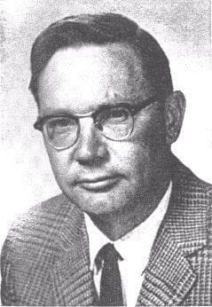

import Head from '@docusaurus/Head';

<Head>
  
</Head>

Senior atmospheric physicist whose career and marriage were systematically destroyed before he was found dead in the Arizona desert.

| Field | Details |
|-------|---------|
| **Full Name** | James Edward McDonald |
| **Born** | May 7, 1920 |
| **Died** | June 13, 1971 |
| **Age at Death** | 51 |
| **Location of Death** | Desert near Tucson, Arizona |
| **Cause of Death** | Gunshot wound to the head (.38 caliber revolver) |
| **Official Ruling** | Suicide |
| **Category** | Scientist / UFO Researcher |

## Assessment: SUSPICIOUS

McDonald was the most scientifically credentialed and effective UFO advocate of the 1960s. He testified before Congress, examined Project Blue Book files, and publicly accused the Air Force of mishandling UFO evidence. His career and personal life were systematically destroyed in the period before his death. While his documented mental health struggles and prior suicide attempt support the official ruling, the pattern — a scientist who threatens powerful interests being discredited, isolated, and ultimately dying — matches intelligence-service methods of neutralization.

## Circumstances of Death

On April 9, 1971, McDonald shot himself in the head but survived. The bullet damaged his optic nerve, leaving him blind. He was hospitalized.

On June 13, 1971, McDonald was found dead in a desert area near Tucson, Arizona, with a .38 caliber revolver nearby. A suicide note was found at the scene. He had apparently walked into the desert and shot himself.

## Background

James McDonald held a Ph.D. in physics from Iowa State University and was a senior physicist at the Institute of Atmospheric Physics and a professor of meteorology at the University of Arizona. He was a member of the American Meteorological Society, the American Geophysical Union, and the American Association for the Advancement of Science.

In the mid-1960s, McDonald became convinced that UFOs represented a genuine scientific phenomenon that warranted serious study. Unlike most UFO researchers of the era, McDonald brought impeccable academic credentials and rigorous methodology. He examined Project Blue Book files at Wright-Patterson Air Force Base (with ONR support) and concluded that the Air Force was systematically misidentifying and ignoring credible UFO cases.

McDonald testified before the House Committee on Science and Astronautics in 1968, making a detailed scientific case for the extraterrestrial hypothesis. He was one of very few credentialed scientists to publicly advocate for serious UFO research.

His downfall began when he testified before a congressional subcommittee on atmospheric sciences about the supersonic transport (SST) program's environmental impact. During the hearing, a congressman publicly mocked him for his UFO research, attempting to discredit his SST testimony. The humiliation was widely reported in the press.

Around the same time, McDonald's marriage deteriorated. Colleagues described a rapid personal and professional decline. He became increasingly isolated.

## Why This Death Possibly Raises Questions

- McDonald was the single most effective scientific advocate for serious UFO research in the United States — his elimination removed the strongest voice
- The pattern of career destruction followed by death mirrors known intelligence-service destabilization techniques: discredit, isolate, destroy
- The public humiliation in Congress over his UFO research — during unrelated SST testimony — appeared orchestrated
- McDonald had examined Project Blue Book files and found systematic evidence suppression by the Air Force
- He was supported by the Office of Naval Research, creating inter-service tension with the Air Force
- His first suicide attempt (blindness) and subsequent suicide are consistent with either genuine depression or a two-stage operation
- However, his personal circumstances — professional humiliation, divorce, blindness — provide a plausible path to genuine suicide
- His extensive UFO files were preserved by his wife Betsy for 25 years before being donated to the University of Arizona Library in 1996

## Key Quotes from Media Coverage

> "McDonald was not some crackpot ufologist; he was a highly respected atmospheric physicist who brought rigorous scientific methodology to UFO research." — Ann Druffel, *Firestorm: Dr. James E. McDonald's Fight for UFO Science*

## See Also

- [J. Allen Hynek](J_Allen_Hynek.mdx) — McDonald and Hynek were the two most prominent scientist-ufologists of the era
- [Edward Ruppelt](Edward_Ruppelt.mdx) — Ruppelt ran Project Blue Book, whose files McDonald examined
- [Morris Jessup](Morris_Jessup.mdx) — Another UFO researcher whose death was ruled suicide
- [Paul Bennewitz](Paul_Bennewitz.mdx) — Another case of career destruction preceding death
- [Damon Runyon Jr.](Damon_Runyon_Jr.mdx) — UFO writer whose 1968 death by bridge fall was also ruled suicide

## Other Shocking Stories

- [Jim Keith](Jim_Keith.mdx): Conspiracy author known for *Black Helicopters Over America* and *The Octopus* who died from a blood clot following...
- [David Grusch](David_Grusch.mdx): Former U.S. Air Force intelligence officer and NGA official who testified before Congress in 2023 that the U.S...
- [Philip Haney](Philip_Haney.mdx): Department of Homeland Security founding member and counterterrorism whistleblower who was found dead from a single gunshot wound...
- [John E. Mack](John_Mack.mdx): Pulitzer Prize-winning Harvard psychiatrist and alien abduction researcher, killed by a drunk driver while walking in London in...

## Sources

- [James E. McDonald — Wikipedia](https://en.wikipedia.org/wiki/James_E._McDonald)
- [James E. McDonald — Zenith City Press](https://zenithcity.com/archive/people-biography/james-e-mcdonald/)
- [James E. McDonald papers — University of Arizona Libraries](https://lib.arizona.edu/special-collections/collections/james-e-mcdonald-papers)
- Ann Druffel, *Firestorm: Dr. James E. McDonald's Fight for UFO Science* (2003)
- [James Edward McDonald — UAP Wiki](https://uap-wiki.org/wiki/James_Edward_McDonald)

*This information was built by Grok and Claude AI research.*

**Status:** Deceased (1971)

---

## Additional context from the UAP Physics Murders investigation

Senior atmospheric physicist, professor of meteorology at the University of Arizona, and the most prominent scientific advocate for serious UFO investigation in the 1960s, whose career was systematically destroyed through public ridicule before Congress and who died of a gunshot wound in the desert outside Tucson on June 13, 1971, officially ruled a suicide.

| Field | Details |
|-------|---------|
| **Full Name** | James Edward McDonald |
| **Born** | May 7, 1920, Duluth, Minnesota |
| **Died** | June 13, 1971, near Tucson, Arizona (age 51) |
| **Cause of Death** | Gunshot wound to the head, ruled suicide |
| **Role** | Atmospheric Physicist / Professor / UFO Researcher |
| **Affiliation** | University of Arizona, Institute for Atmospheric Physics |
| **Education** | B.A. Chemistry, University of Omaha (1942); M.S. Meteorology, MIT (1945); Ph.D. Physics, Iowa State College (1951) |
| **Military Service** | U.S. Navy cryptographer, World War II |

## Biography

James Edward McDonald was born on May 7, 1920, in Duluth, Minnesota. He earned a Bachelor of Arts in chemistry from the University of Omaha in 1942, then served as a cryptographer in the United States Navy during World War II. After the war, he completed a Master of Science in meteorology at the Massachusetts Institute of Technology in 1945 and a Ph.D. in physics from Iowa State College in 1951.

McDonald joined the University of Arizona, where he became a professor of meteorology and associate director of the Institute for Atmospheric Physics. He established himself as a respected figure in mainstream atmospheric science, with significant contributions to cloud physics, weather modification through cloud seeding, and the aerodynamics of raindrops. In 1956, he organized the Conference on the Scientific Basis of Weather Modification Studies at the University of Arizona, an influential event that assessed the state of weather modification research. He was a member of the American Meteorological Society (since 1944), the American Geophysical Union, and the National Academy of Sciences.

## UFO Research and Scientific Contributions

McDonald's first detailed public discussion of UFOs came in a lecture before an American Meteorological Society assembly in Washington, D.C., on October 5, 1966. From the mid-1960s onward, he devoted increasing time and effort to investigating UFO reports with the same rigor he applied to atmospheric physics.

McDonald personally interviewed over 500 UFO witnesses and uncovered many important government UFO documents. He examined the files of Project Blue Book at Wright-Patterson Air Force Base and concluded that the Air Force was systematically mishandling UFO evidence. He promoted the extraterrestrial hypothesis as a plausible scientific explanation for UFO phenomena, stating in 1967: "There is no sensible alternative to the utterly shocking hypothesis that UFOs are extraterrestrial probes."

His major scientific contributions to UFO research include:

- **United Nations address (1967)**: McDonald secured support from UN Secretary General U Thant, who arranged for him to speak to the UN's Outer Space Affairs Group on June 7, 1967, presenting the case for serious scientific study of UFOs at the international level.
- **Congressional testimony (1968)**: On July 29, 1968, McDonald testified before the U.S. House Committee on Science and Astronautics at a special hearing on UFOs, alongside scientists including Carl Sagan and J. Allen Hynek. His testimony was a detailed scientific presentation of UFO evidence.
- **Condon Report critique**: McDonald wrote detailed critiques of the 1969 Condon Report, the University of Colorado UFO study. He identified a fundamental contradiction: while Edward Condon's foreword claimed all UFO reports could be explained as hoaxes or misidentifications, the report itself marked over 30% of investigated cases as "unexplained."
- **"Science in Default" (1969)**: McDonald presented this landmark paper to the American Association for the Advancement of Science (AAAS), summarizing current UFO evidence and critiquing the Condon Report. Ufologist Jerome Clark called it "one of the most powerful scientific defenses of UFO reality ever mounted."
- **Extensive witness interviews**: McDonald's methodical approach of personally interviewing hundreds of witnesses and cross-referencing their accounts with weather data, radar records, and other physical evidence set a standard for scientific UFO investigation.

## Their Claims

McDonald argued that the UFO phenomenon represented a legitimate scientific problem being ignored by the scientific establishment due to institutional bias and government mishandling. He maintained that unexplained UFO cases -- those involving multiple credible witnesses, radar confirmation, and physical trace evidence -- could not be dismissed as weather phenomena, misidentified aircraft, or hoaxes.

His atmospheric physics expertise was directly relevant: McDonald could evaluate and rule out meteorological explanations for UFO sightings with authority that few other researchers possessed. He argued that many cases attributed to temperature inversions, ball lightning, or unusual cloud formations by Project Blue Book consultants were scientifically unsupportable explanations.

McDonald contended that the scientific community's refusal to investigate UFOs seriously represented a failure of scientific responsibility. He believed the extraterrestrial hypothesis deserved serious consideration based on the physical evidence, and that the Air Force's handling of UFO data through Project Blue Book was inadequate and sometimes deliberately misleading.

## The Campaign to Destroy His Reputation

McDonald's aggressive public advocacy for UFO research made him a target for professional ridicule. Several factors contributed to the systematic destruction of his credibility:

**The Condon Report conflict**: McDonald's public criticism of Edward Condon and the University of Colorado UFO study created powerful academic enemies. The Condon Report, published in 1969, was widely accepted by the scientific establishment as the definitive word on UFOs, and McDonald's detailed rebuttals were seen as an unwelcome challenge to the consensus.

**Government scrutiny of funding**: McDonald had used Office of Naval Research (ONR) grant funds to travel and investigate UFO cases, on the grounds that this was relevant to his atmospheric physics work. When this became public, it triggered investigations and criticism that he had misused government research funds.

**The SST hearing humiliation (March 1971)**: This was the most damaging single event. McDonald appeared before a subcommittee of the U.S. House Appropriations Committee to present scientific testimony that the proposed Supersonic Transport (SST) aircraft could damage the ozone layer, potentially causing thousands of additional skin cancer cases annually. During this testimony, Congressman Silvio O. Conte -- whose Massachusetts district included factories that would build SST components -- publicly ridiculed McDonald by bringing up his belief in "little green men" and UFOs to discredit his environmental testimony. Open laughter from some members of Congress was audible in the chamber. The incident was devastating to McDonald both personally and professionally, as it demonstrated that his UFO research could be weaponized to undermine his credibility on any scientific topic.

**Cumulative professional isolation**: The combination of academic hostility, funding controversies, media ridicule, and the congressional humiliation left McDonald increasingly isolated from the mainstream scientific community he had spent decades building credibility within.

## Key Quotes

> "There is no sensible alternative to the utterly shocking hypothesis that UFOs are extraterrestrial probes."
> -- Dr. James E. McDonald, 1967

> "Science in Default -- Twenty-Two Years of Inadequate UFO Investigations."
> -- Title of McDonald's 1969 AAAS presentation critiquing the Condon Report

## Death Circumstances

In early 1971, McDonald faced a convergence of personal and professional crises. His wife Betsy asked for a divorce in March 1971, reportedly feeling neglected due to his extensive travel and long working hours related to UFO research. The SST hearing humiliation by Congressman Conte occurred that same month.

On April 9, 1971, McDonald made a suicide attempt by gunshot. The attempt was not fatal but damaged his optic nerve, leaving him blind. He was committed to the psychiatric ward of a Tucson hospital.

McDonald signed himself out of the psychiatric facility against medical advice in early June 1971.

On June 12, 1971, McDonald took a cab from the university, stopped at a pawn shop where he purchased a .38 caliber pistol, and was dropped off in the desert outside Tucson. On June 13, 1971, a family walking along a creek near the bridge spanning the Canada del Oro Wash found his body. A .38 caliber revolver and a note described as a suicide note were found nearby. He was 51 years old. His death was ruled a suicide.

## Key Arguments & Evidence They Cite

- **Institutional credibility**: McDonald was not a fringe figure but a tenured professor and associate director at a major university research institute, with decades of published atmospheric physics research, making his UFO conclusions difficult to dismiss on grounds of incompetence
- **Methodical approach**: His personal interviews of over 500 witnesses, combined with cross-referencing of weather data, radar records, and physical evidence, represented the most systematic scientific investigation of UFOs conducted by any individual researcher of his era
- **Project Blue Book files**: McDonald's examination of Air Force UFO files revealed cases that had been incorrectly classified as "explained" using scientifically unsupportable rationales
- **Condon Report contradictions**: His identification of the internal contradiction between the Condon Report's conclusions and its own data demonstrated that the study was not conducted as objective science
- **Pattern of suppression**: McDonald's case is cited as evidence that scientists who take UFOs seriously face career destruction -- his experience demonstrated that the social and professional costs of UFO advocacy could be total
- **SST testimony vindicated**: McDonald's warnings about SST damage to the ozone layer were later proven scientifically correct, lending weight to the argument that his UFO research was equally sound and that the ridicule was politically motivated rather than scientifically justified

## The Counterargument

- McDonald's death followed a documented pattern of personal crisis including marital breakdown, a prior suicide attempt, hospitalization for depression, and loss of eyesight; these factors provide a conventional explanation for his death
- His use of ONR funds for UFO travel raised legitimate questions about research funding accountability, independent of any suppression campaign
- The Conte incident, while humiliating, reflected political gamesmanship common in congressional hearings rather than evidence of an organized conspiracy to silence McDonald
- McDonald's promotion of the extraterrestrial hypothesis went beyond what the evidence strictly supported; other scientists who studied UFOs, such as J. Allen Hynek, adopted more cautious positions and did not face the same level of professional consequences
- The suicide ruling is supported by the prior attempt, the purchase of a weapon the day before, and the presence of a note

## Legacy

Despite his death at age 51, McDonald's impact on UFO research has been enduring. His extensive files of UFO information were kept by his wife Betsy in their home for twenty-five years. In 1996, the entire collection was accepted by the University of Arizona Library Special Collections, where the James E. McDonald Papers remain available to researchers.

Ann Druffel's book *Firestorm: Dr. James E. McDonald's Fight for UFO Science* (2003) provides a comprehensive biography of McDonald and his research. Jacques Vallee wrote the foreword, underscoring McDonald's standing among serious UFO researchers.

McDonald's case is frequently cited in discussions of UAP disclosure as an example of how institutional ridicule and career destruction have been used to deter credentialed scientists from investigating the phenomenon. His scientific methodology -- direct witness interviews, cross-referencing with physical data, and rigorous critique of official explanations -- established a standard that subsequent UAP researchers have sought to follow.

His warnings about ozone depletion from supersonic aircraft, the very testimony that Congressman Conte ridiculed, were later validated by atmospheric science. The SST program was ultimately cancelled by Congress, and ozone layer protection became a major focus of environmental policy.

## Related Perspectives

- [Condon Report](Condon_Report.mdx) -- The 1969 study that McDonald critiqued for its contradictory conclusions
- [Project Blue Book](Project_Blue_Book.mdx) -- The Air Force program whose files McDonald examined and found inadequate
- [Hal Puthoff](Hal_Puthoff.mdx) -- Physicist who investigated UFO-related phenomena through government-connected programs
- [Amy Eskridge](Amy_Eskridge.mdx) -- Another researcher whose death was linked to her work on unconventional physics
- [Zero Point Energy](Zero_Point_Energy.mdx) -- Related field of exotic physics research

## Sources

- [James E. McDonald - Wikipedia](https://en.wikipedia.org/wiki/James_E._McDonald)
- [James E. McDonald Papers - University of Arizona Libraries Special Collections](https://lib.arizona.edu/special-collections/collections/james-e-mcdonald-papers)
- [James E. McDonald Biography - Zenith City Press](https://zenithcity.com/archive/people-biography/james-e-mcdonald/)
- [Dr. James McDonald Bio - Paradigm Research Group Hall of Fame](https://www.paradigmresearchgroup.org/Hall%20of%20Fame/McDonald_James_E.htm)
- [UFO Symposium 1968: McDonald Statement - Project 1947](https://www.project1947.com/shg/symposium/mcdonald.html)
- [McDonald's Statement to the United Nations, 1967](https://ufologie.patrickgross.org/htm/mcdonaldun.htm)
- [Publications of James Edward McDonald - Princeton](http://kirkmcd.princeton.edu/JEMcDonald/bib_jem.pdf)
- [Tales from the Morgue: UFOs Are Real - Arizona Daily Star (Tucson.com)](https://tucson.com/news/blogs/morgue-tales/tales-from-the-morgue-ufos-are-real/article_6593476e-745e-11e1-838d-001871e3ce6c.html)
- [Ann Druffel, *Firestorm: Dr. James E. McDonald's Fight for UFO Science* (2003)](https://www.amazon.com/Firestorm-James-McDonalds-Science-Voyagers/dp/0926524585)
- [FBI File of Dr. James E. McDonald - CUFON](https://www.cufon.org/cufon/fbimcdon.htm)

*This information was compiled by Claude AI research.*

**Status:** Deceased (1971)

---

**Investigations:** UAPs Murders (General), UAP Physics Murders
