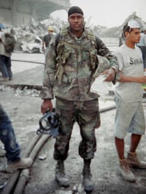

# Jason Thomas
Assistant director of chemical biology at Novartis Institutes for BioMedical Research (NIBR) in Cambridge, Massachusetts. Disappeared from his Wakefield, MA home on December 12, 2025, three days before MIT fusion physicist Nuno Loureiro was assassinated in nearby Brookline. His body was recovered from Lake Quannapowitt on March 17, 2026. Thomas, 45, had recently lost both parents within hours of each other in November 2025. Novartis holds active contracts with the U.S. Department of Defense and has previously worked with the Department of Health and Human Services. His death is part of a cluster of five scientists who died or vanished between June 2025 and March 2026.

| Field | Details |
|-------|---------|
| **Full Name** | Jason Thomas |
| **Born** | c. 1980-1981 |
| **Died** | Body recovered March 17, 2026 (missing since December 12, 2025) |
| **Age at Death** | 45 |
| **Location of Death** | Lake Quannapowitt, Wakefield, Massachusetts, USA |
| **Cause of Death** | Pending (medical examiner has not released cause/manner of death) |
| **Official Ruling** | "No foul play suspected" (Wakefield Police Department) |
| **Category** | Scientist / Chemical Biology / Pharmaceutical Research |

## Assessment: UNCERTAIN (UAP Link)

Jason Thomas's death is tragic but the UAP connection is speculative. His work at Novartis focused on chemical biology, drug discovery, and high-throughput screening — not aerospace, propulsion, or energy technology. The primary basis for inclusion in this cluster is timing: he vanished three days before Nuno Loureiro was murdered, his body was found during the same period that the McCasland and Reza disappearances were gaining national attention, and Congressman Tim Burchett explicitly named him as part of a pattern of five scientists dying or vanishing. Novartis does hold defense contracts, and the circumstances of his disappearance — leaving without phone or wallet, body found in a lake three months later — share surface similarities with other cases. However, police say no foul play is suspected, and Thomas was reportedly struggling with the sudden deaths of both his parents.

## Circumstances of Death

On the evening of December 12, 2025, Jason Thomas left his home on Murray Street in Wakefield, Massachusetts. He was last seen at approximately 11:53 p.m. walking in the area of Murray Street and Chestnut Street. According to his wife Kristen Bartoli, the couple had gone out socializing earlier that evening with friends — the first social outing since Jason's parents both died in November 2025. Thomas told his wife he was going for a "late-night walk."

Thomas's wife found his Apple Watch in the mailbox he had opened earlier that night. His phone and wallet were left on the bathroom counter.

Despite extensive searches by Wakefield police, state police, and volunteer groups, no trace of Thomas was found for three months. On March 17, 2026, a Wakefield police detective searching around Lake Quannapowitt spotted a body in the previously frozen water. Police used a drone to confirm the discovery, and fire crews recovered the body. Preliminary identification based on clothing suggested it was Thomas.

The Wakefield Police Department stated that "no foul play is suspected," though the medical examiner had not yet determined the cause and manner of death as of March 2026.

## Background

### Career and Expertise

Jason Thomas was the assistant director of chemical biology at Novartis Institutes for BioMedical Research (NIBR) in Cambridge, Massachusetts. His work focused on:

- **Chemical biology and chemoproteomics** — using chemistry and biology to discover and create new medicines
- **Phenotypic screening** — developing cellular models for drug discovery
- **Target identification and elucidation** — identifying novel drug targets
- **High-throughput screening** — developing methods to rapidly evaluate potential drug compounds
- According to the Daily Mail, his work included potential treatments for cancer

He held an ACS (American Chemical Society) fellowship early in his career. He co-authored publications in ACS Chemical Biology and other journals on topics including targeted protein degradation using PROTACs and molecular glues, and novel approaches to identifying chemical starting points for drug discovery.

### Novartis Defense Connections

According to the Daily Mail, Novartis has active contracts with the U.S. Department of Defense (referred to in the article as the "Department of War") and has previously worked with the Department of Health and Human Services. The specific nature of Thomas's involvement with any defense-related work, if any, has not been publicly reported.

### Personal Circumstances

Thomas had experienced devastating personal loss shortly before his disappearance. In November 2025, his mother died in hospice care. According to NBC News/Dateline reporting, just one hour later, as Jason and his father were preparing funeral details, his father collapsed in his arms and died of a heart attack. Both parents died within hours of each other.

His wife told reporters that Jason was struggling with the sudden loss of both parents when he vanished. She said: "This isn't like him." Thomas was described as a devoted husband, "fur dad" to five dogs, and beloved uncle.

## Why This Death Possibly Raises Questions

- **Part of a cluster:** Thomas is one of five scientists who died or vanished between June 2025 and March 2026. Congressman Tim Burchett has called this a pattern deserving investigation
- **Left without phone or wallet** — mirrors the pattern seen in McCasland's disappearance (left without phone, glasses, or wearable devices)
- **Body found in lake after three months** — disappeared in December, body not recovered until March when ice thawed; raises questions about how thoroughly the lake was searched initially
- **Proximity to Loureiro murder** — Thomas vanished on December 12, three days before Nuno Loureiro was shot in Brookline, approximately 10 miles away
- **Novartis defense contracts** — his employer holds DOD contracts, though Thomas's specific involvement in defense work is unknown
- **Timing** — his disappearance occurred during the same period as a cluster of scientist deaths/disappearances that Burchett has linked to UAP-adjacent research

## The Counterargument

- Thomas was reportedly struggling with severe grief after losing both parents within hours of each other just weeks earlier
- His wife described him as emotionally devastated by the double loss
- Police have stated no foul play is suspected
- His work in chemical biology and drug discovery has no apparent connection to aerospace, propulsion, or energy technology
- The UAP connection is based entirely on timing and the pattern identified by Congressman Burchett and the Daily Mail
- Bodies found in frozen lakes after winter disappearances, while tragic, are not uncommon in New England
- There is no evidence Thomas possessed classified information or was involved in any defense-related research

## Key Quotes from Media Coverage

> "The numbers seem very high in these certain areas of research. I think we'd better be paying attention, and I don't think we should trust our government."
> — **Congressman Tim Burchett** (R-TN), to the Daily Mail, March 2026

> "He literally vanished."
> — **Kristen Thomas**, wife of Jason Thomas, to reporters

> "No foul play is suspected."
> — **Wakefield Police Department**, press release, March 17, 2026

## See Also

- [Nuno Loureiro](Nuno_Loureiro.md) — MIT plasma physicist murdered three days after Thomas vanished, approximately 10 miles away
- [William McCasland](William_McCasland.md) — Retired USAF Major General who disappeared from Albuquerque two months after Thomas vanished
- [Monica Jacinto Reza](Monica_Jacinto_Reza.md) — Aerospace materials scientist missing since June 2025; part of the same five-scientist cluster
- [Carl Grillmair](Carl_Grillmair.md) — Caltech astrophysicist killed February 2026; part of the same five-scientist cluster

## Other Shocking Stories

- [Mark McCandlish](Mark_McCandlish.md): Aerospace illustrator who testified about alien reproduction vehicles — died of shotgun blast days before Senate testimony.
- [Ron Johnson](Ron_Johnson.md): MUFON deputy director collapsed dead at conference after sipping from a soda can — purple face, blood from nose.
- [Todd Sees](Todd_Sees.md): Pennsylvania deer hunter found dead near home with "cocaine toxicity" ruling — multiple witnesses reported UFO on same ridge that morning.
- [Amy Eskridge](Amy_Eskridge.md): Co-founded Institute for Exotic Science; ruled suicide, retired UK intel officer alleged to Congress she was murdered by private aerospace company.

## Sources

- [Daily Mail: Mystery of five missing scientists sends chill across America](https://www.dailymail.co.uk/sciencetech/article-14607417/mystery-five-missing-scientists-three-dead-troubling-link-dc.html)
- [NBC News/Dateline: Missing husband Jason Thomas was last seen three months ago in Wakefield](https://www.nbcnews.com/dateline/missing-in-america/jason-thomas-missing-wakefield-massachusetts-rcna263785)
- [Boston.com: Body pulled from Wakefield lake believed to be that of missing man](https://www.boston.com/news/local-news/2026/03/17/body-pulled-from-wakefield-lake-believed-to-be-that-of-missing-man/)
- [NBC Boston: Body recovered from lake in Wakefield believed to be that of missing man](https://www.nbcboston.com/news/local/wakefield-body-lake/3917208/)
- [Daily Voice: Body Of Wakefield Man Who Disappeared After Parents' Deaths Found In Lake](https://dailyvoice.com/ma/wakefield/body-of-jason-thomas-found-in-wakefield-lake-3-months-later/)
- [CrimeOnline: Scientist Still Missing Weeks After He's Seen Walking Near Train Tracks](https://www.crimeonline.com/2026/01/05/he-literally-vanished-scientist-still-missing-weeks-after-hes-seen-walking-near-train-tracks/)
- [Tampa Free Press: Tennessee Rep. Tim Burchett Warns Of Pattern As More U.S. Scientists Die Or Vanish](https://www.tampafp.com/scary-tennessee-rep-tim-burchett-warns-of-pattern-as-more-u-s-scientists-die-or-vanish/)

*This information was built by Grok and Claude AI research.*
