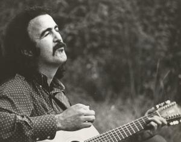

# Jim Sullivan
Singer-songwriter who recorded the prophetically titled album *U.F.O.* featuring lyrics about highway travel, leaving family behind, and alien abduction, then disappeared without a trace in the New Mexico desert in 1975 under circumstances that remain unexplained.

| Field | Details |
|-------|---------|
| **Full Name** | Jim Sullivan |
| **Born** | August 13, 1939 (Nebraska) |
| **Died** | Disappeared March 6, 1975 (presumed dead) |
| **Age at Death** | 35 (at time of disappearance) |
| **Location of Death** | Near Santa Rosa / Puerto de Luna, New Mexico, USA |
| **Cause of Death** | Unknown -- disappeared without a trace |
| **Official Ruling** | Missing person (never resolved) |
| **Category** | Musician / Disappeared Person |

## Assessment: SUSPICIOUS

Jim Sullivan's 1975 disappearance remains one of the most enigmatic missing person cases in American music history. He vanished in the New Mexico desert near Santa Rosa, leaving behind his car, money, clothes, guitar, and a box of unsold records. No body has ever been found, and no definitive explanation has emerged in over 50 years. The case is made more haunting by the content of his 1969 album *U.F.O.*, which contains lyrics about driving down long highways, leaving his family, and being taken by aliens -- themes that eerily mirror the circumstances of his disappearance. While the UFO connection is likely coincidental, the physical circumstances of his vanishing -- an abandoned car with all personal belongings intact -- remain genuinely unexplained.

## Circumstances of Death

On March 4, 1975, Jim Sullivan left Los Angeles alone in his Volkswagen Beetle, driving east toward Nashville, Tennessee, where he hoped to restart his stalled music career. The following day, March 5, he was pulled over by New Mexico state police on suspicion of driving under the influence near Santa Rosa. He passed a field sobriety test and checked into the La Mesa Motel in Santa Rosa.

On March 6, Sullivan was seen approximately 26 miles south of Santa Rosa, near the remote community of Puerto de Luna, at a ranch owned by the Gennitti family. His abandoned Volkswagen was later found nearby. Inside the car were his wallet with money, personal papers, guitar, clothes, and a box of his unsold records. There were no signs of struggle or foul play at the vehicle.

Despite extensive searches by law enforcement and his family, Sullivan was never found. At one point, a decomposed body resembling Sullivan was discovered in a remote area several miles from where he was last seen, but it was determined not to be him.

Sullivan left behind his wife Barbara and their young son.

## Background

Jim Sullivan was born in Nebraska in 1939, the seventh son of a blue-collar Irish-American family that relocated to San Diego, California, during World War II. In high school, he was both a guitar player and the quarterback of the varsity football team.

In the mid-1960s, Sullivan played with the San Diego rock group the Survivors. In 1968, he and his wife Barbara moved to Los Angeles, where he pursued a music career while she worked as a secretary for Capitol Records. Sullivan became a regular performer at the Raft club in Malibu, where he befriended Hollywood figures including Lee Majors, Lee Marvin, and Harry Dean Stanton.

In 1969, Sullivan recorded his debut album *U.F.O.*, backed by accomplished Los Angeles session musicians. The album featured psychedelic folk-rock with lyrics touching on themes of alienation, highway travel, desert landscapes, and extraterrestrial encounters. Despite critical quality, the album failed commercially. A second album, *Jim Sullivan*, was released in 1972 on Playboy Records but also failed to attract significant attention.

By 1975, frustrated by his lack of commercial success in Los Angeles, Sullivan decided to drive to Nashville to pursue opportunities in country music. He never arrived.

Sullivan's music, especially *U.F.O.*, was rediscovered and reissued by Light in the Attic Records in 2010, developing a cult following driven in part by the mysterious circumstances of his disappearance and the eerie prescience of his lyrics.

## Why This Death Possibly Raises Questions

- Vanished leaving behind all personal belongings including money, identification, guitar, and clothes -- inconsistent with voluntary disappearance
- His 1969 album *U.F.O.* contains lyrics about driving highways, leaving family, and being taken by aliens that eerily parallel the circumstances of his disappearance six years later
- Disappeared in the New Mexico desert, a region with extensive UFO lore and military installations
- No body has ever been found despite searches spanning decades
- The location where he was last seen (Puerto de Luna, south of Santa Rosa) was remote and sparsely populated
- A body found in the area was initially thought to be Sullivan but was determined to belong to someone else
- Various theories have been proposed including suicide, foul play, organized crime involvement, and alien abduction, but none have been substantiated
- The fact that he passed a sobriety test the night before his disappearance undermines theories of disoriented wandering
- His disappearance occurred on a route through an area near several restricted military installations

## See Also

- [Frederick Valentich](Frederick_Valentich.md) — Australian pilot who disappeared after reporting a UFO over Bass Strait
- [Felix Moncla](Felix_Moncla.md) — USAF pilot who disappeared during a UFO intercept over Lake Superior
- [Todd Sees](Todd_Sees.md) — Pennsylvania man found dead after UFO sighting on the same morning
- [Zigmund Adamski](Zigmund_Adamski.md) — Coal miner found dead under bizarre circumstances in Yorkshire

## Other Shocking Stories

- [Jaime Gustitus](Jaime_Gustitus.md): 1st Lieutenant in the U.S. Air Force, serving as an Operations Research Analyst at the 711th Human Performance...
- [Felix Moncla](Felix_Moncla.md): USAF pilot who vanished along with his radar operator while scrambled to intercept an unknown radar target over...
- [Vimal Dajibhai](Vimal_Dajibhai.md): 24-year-old Marconi software engineer working on the Stingray torpedo system who plunged from the Clifton Suspension Bridge —...
- [Stefan Michalak](Stefan_Michalak.md): Canadian amateur prospector who suffered severe grid-pattern burns and radiation sickness after encountering a landed disc-shaped craft at...

## Sources

- [Jim Sullivan's Mysterious Masterpiece: 'U.F.O.' - NPR](https://www.npr.org/2010/12/09/131936448/jim-sullivan-s-mysterious-masterpiece-u-f-o)
- [Jim Sullivan (musician) - Wikipedia](https://en.wikipedia.org/wiki/Jim_Sullivan_(singer-songwriter))
- [Mystery and History: the Strange Music and Stranger Tale of Jim Sullivan - FLOOD](https://floodmagazine.com/71829/mystery-and-history-the-strange-music-and-stranger-tale-of-jim-sullivan/)
- [Rock's Unsolved UFO Mystery: The Night Jim Sullivan Vanished - Ultimate Classic Rock](https://ultimateclassicrock.com/missing-ufo-singer-songwriter/)
- [What happened to musician Jim Sullivan near Santa Rosa 45 years ago? - Route 66 News](https://www.route66news.com/2019/11/21/musician-jim-sullivan-santa-rosa/)
- [Jim Sullivan | U.F.O. - Light in the Attic Records](https://lightintheattic.net/releases/502-u-f-o)

*This information was built by Grok and Claude AI research.*

**Status:** Missing, presumed deceased (1975)
