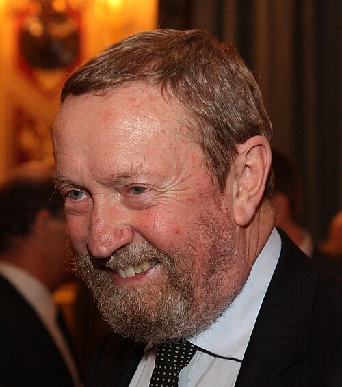

import Head from '@docusaurus/Head';

<Head>
  
</Head>

American inventor and audio engineer who pioneered electromagnetic energy recovery devices, died suddenly on November 5, 2016 — only four hours after his brother Gary also died.

| Field | Details |
|-------|---------|
| **Full Name** | John C. Bedini |
| **Born** | July 13, 1949 |
| **Died** | November 5, 2016 |
| **Age at Death** | 67 |
| **Location of Death** | United States |
| **Cause of Death** | Sudden, unexplained death |
| **Official Ruling** | Not publicly disclosed |
| **Category** | Energy Inventor |

## Assessment: UNCERTAIN

John Bedini was a well-known figure in both the audiophile and free energy research communities. He died suddenly on November 5, 2016, only four hours after his brother Gary — whom John had been caring for due to ill health — also died. While the simultaneous deaths of two brothers within hours of each other is extraordinarily unusual, Gary had been in poor health, and John's death could potentially be attributed to the extreme stress and grief of losing his brother. No official cause of death has been widely publicized, and no evidence of foul play has been publicly presented.

## Circumstances of Death

On November 5, 2016, John Bedini's brother Gary died after a period of ill health. John had been serving as Gary's caretaker during his illness. Approximately four hours after Gary's death, John Bedini also died suddenly.

The precise cause of John's death has not been widely reported. The extraordinary timing — two brothers dying within four hours of each other — drew attention from the free energy research community, where some viewed it as suspicious.

John was survived by his wife Ronda.

## Background

### Audio Engineering Career

John Bedini was a respected figure in the high-end audio world. He founded Bedini Electronics and designed amplifiers that were highly regarded by audiophiles. His audio equipment was known for its quality and innovative design, and he maintained a loyal following in the audiophile community throughout his career.

### Free Energy Research

Bedini was equally well known — and more controversial — for his work on electromagnetic energy recovery devices. His key contributions included:

- **The Bedini SG (Simplified School Girl) Motor:** First developed in the 1980s, this pulsed electromagnetic device was designed to capture and reuse back-EMF (back electromotive force) energy that is normally wasted in conventional motors. The device allegedly charged batteries using energy recovered from collapsing magnetic fields.
- **Collaboration with Tom Bearden:** Bedini worked with Lieutenant Colonel Thomas Bearden (U.S. Army, retired) for over 20 years on projects related to overunity energy systems, scalar electromagnetics, and energy from the vacuum.
- **Multiple patents:** Bedini obtained several patents related to his electromagnetic devices.
- **Public sharing:** Bedini was known for freely sharing many of his discoveries with the public. He published plans, gave demonstrations, and encouraged others to replicate his work, which led to a large community of experimenters building "Bedini motors" worldwide.

### Mainstream Scientific View

Mainstream physics considers Bedini's claims of overunity (more energy output than input) to be impossible under the laws of thermodynamics. His devices have been characterized by skeptics as misunderstood conventional motors with measurement errors. However, his supporters maintain that his devices demonstrated genuine energy recovery phenomena that are not adequately explained by conventional electromagnetic theory.

## Why This Death Possibly Raises Questions

- **Extraordinary timing:** Two brothers dying within four hours of each other is statistically very unusual, even accounting for stress-related cardiac events
- **Pattern:** Bedini's sudden death fits the pattern of other free energy researchers who died unexpectedly of apparent cardiac or sudden-onset events
- **Long career in controversial research:** Bedini had been publicly working on and promoting free energy devices for over 30 years, making him one of the most visible figures in the field
- **Collaboration with Bearden:** His partnership with Tom Bearden on "energy from the vacuum" research was well documented and placed him at the center of controversial energy claims
- **No widely reported cause of death:** The lack of a publicly disclosed official cause of death has fueled speculation

## The Counterargument

- Gary Bedini had been in poor health and his death was not unexpected
- Extreme grief and stress from a loved one's death are documented triggers for sudden cardiac events — a phenomenon sometimes called "broken heart syndrome" (takotsubo cardiomyopathy)
- John was 67 years old, an age at which sudden cardiac events are not uncommon
- No evidence of foul play has been publicly presented
- The free energy community's interpretation of the deaths as suspicious may reflect confirmation bias given the community's existing beliefs about suppression

## See Also

- [Arie DeGeus](Arie_DeGeus.mdx) — Clean energy inventor who died of heart failure en route to secure funding
- [Eugene Mallove](Eugene_Mallove.mdx) — Cold fusion advocate beaten to death
- [Stanley Meyer](Stanley_Meyer.mdx) — Water fuel cell inventor who died suddenly

## Other Shocking Stories

- [Dallis Hardwick](Dallis_Hardwick.mdx): Co-invented Mondaloy superalloy replacing Russian rocket engines. No obituary exists. All three key people now dead or missing.
- [Eugene Mallove](Eugene_Mallove.mdx): MIT cold fusion whistleblower beaten to death days before announcing a major energy breakthrough.
- [Dr. Frederick Hochstetter](Frederick_Hochstetter.mdx): Debunked Hendershot's fuelless motor in 1928. Sole passenger fatality in a B&O train wreck shortly after.
- [Chris Tinsley](Chris_Tinsley.mdx): Cincinnati Group nuclear transmutation researcher. Died of carbon monoxide — same method as colleague Stan Gleeson.

## Sources

- [John Bedini, Noted Free Energy Researcher, Died Unexpectedly — Educate-Yourself.org](https://educate-yourself.org/cn/John-Bedini-Noted-Free-Energy-Researcher-Died-Unexpectedly-on-Saturday-Nov-5-2016-06nov16.shtml)
- [John Bedini — johnbedini.net](https://www.johnbedini.net/)
- [John Bedini — diyAudio Forums](https://www.diyaudio.com/community/threads/john-bedini.299099/)
- [John Bedini Passed Away — Gearspace](https://gearspace.com/board/for-those-we-have-lost-memorials-rips-and-obituaries/1128763-john-bedini-passed-away.html)
- [John Bedini Has Passed Away — AudioShark Forums](https://www.audioshark.org/threads/john-bedini-has-passed-away.10772/)
- [Bedini — Grokipedia](https://grokipedia.com/page/bedini)

*This information was built by Grok and Claude AI research.*

**Status:** Deceased (2016)

---

## Additional context from the UAP Energy Systems Murders investigation

American inventor and audio engineer who pioneered electromagnetic energy recovery devices, died suddenly on November 5, 2016 — only four hours after his brother Gary also died.

| Field | Details |
|-------|---------|
| **Full Name** | John C. Bedini |
| **Born** | July 13, 1949 |
| **Died** | November 5, 2016 |
| **Age at Death** | 67 |
| **Location of Death** | United States |
| **Cause of Death** | Sudden, unexplained death |
| **Official Ruling** | Not publicly disclosed |
| **Category** | Energy Inventor |

## Assessment: UNCERTAIN

John Bedini was a well-known figure in both the audiophile and free energy research communities. He died suddenly on November 5, 2016, only four hours after his brother Gary — whom John had been caring for due to ill health — also died. While the simultaneous deaths of two brothers within hours of each other is extraordinarily unusual, Gary had been in poor health, and John's death could potentially be attributed to the extreme stress and grief of losing his brother. No official cause of death has been widely publicized, and no evidence of foul play has been publicly presented.

## Circumstances of Death

On November 5, 2016, John Bedini's brother Gary died after a period of ill health. John had been serving as Gary's caretaker during his illness. Approximately four hours after Gary's death, John Bedini also died suddenly.

The precise cause of John's death has not been widely reported. The extraordinary timing — two brothers dying within four hours of each other — drew attention from the free energy research community, where some viewed it as suspicious.

John was survived by his wife Ronda.

## Background

### Audio Engineering Career

John Bedini was a respected figure in the high-end audio world. He founded Bedini Electronics and designed amplifiers that were highly regarded by audiophiles. His audio equipment was known for its quality and innovative design, and he maintained a loyal following in the audiophile community throughout his career.

### Free Energy Research

Bedini was equally well known — and more controversial — for his work on electromagnetic energy recovery devices. His key contributions included:

- **The Bedini SG (Simplified School Girl) Motor:** First developed in the 1980s, this pulsed electromagnetic device was designed to capture and reuse back-EMF (back electromotive force) energy that is normally wasted in conventional motors. The device allegedly charged batteries using energy recovered from collapsing magnetic fields.
- **Collaboration with Tom Bearden:** Bedini worked with Lieutenant Colonel Thomas Bearden (U.S. Army, retired) for over 20 years on projects related to overunity energy systems, scalar electromagnetics, and energy from the vacuum.
- **Multiple patents:** Bedini obtained several patents related to his electromagnetic devices.
- **Public sharing:** Bedini was known for freely sharing many of his discoveries with the public. He published plans, gave demonstrations, and encouraged others to replicate his work, which led to a large community of experimenters building "Bedini motors" worldwide.

### Mainstream Scientific View

Mainstream physics considers Bedini's claims of overunity (more energy output than input) to be impossible under the laws of thermodynamics. His devices have been characterized by skeptics as misunderstood conventional motors with measurement errors. However, his supporters maintain that his devices demonstrated genuine energy recovery phenomena that are not adequately explained by conventional electromagnetic theory.

## Why This Death Possibly Raises Questions

- **Extraordinary timing:** Two brothers dying within four hours of each other is statistically very unusual, even accounting for stress-related cardiac events
- **Pattern:** Bedini's sudden death fits the pattern of other free energy researchers who died unexpectedly of apparent cardiac or sudden-onset events
- **Long career in controversial research:** Bedini had been publicly working on and promoting free energy devices for over 30 years, making him one of the most visible figures in the field
- **Collaboration with Bearden:** His partnership with Tom Bearden on "energy from the vacuum" research was well documented and placed him at the center of controversial energy claims
- **No widely reported cause of death:** The lack of a publicly disclosed official cause of death has fueled speculation

## The Counterargument

- Gary Bedini had been in poor health and his death was not unexpected
- Extreme grief and stress from a loved one's death are documented triggers for sudden cardiac events — a phenomenon sometimes called "broken heart syndrome" (takotsubo cardiomyopathy)
- John was 67 years old, an age at which sudden cardiac events are not uncommon
- No evidence of foul play has been publicly presented
- The free energy community's interpretation of the deaths as suspicious may reflect confirmation bias given the community's existing beliefs about suppression

## See Also

- [Arie DeGeus](Arie_DeGeus.mdx) — Clean energy inventor who died of heart failure en route to secure funding
- [Eugene Mallove](Eugene_Mallove.mdx) — Cold fusion advocate beaten to death
- [Stanley Meyer](Stanley_Meyer.mdx) — Water fuel cell inventor who died suddenly
- [Jim Watson](Jim_Watson.mdx) — Demonstrated 8-kW overunity motor at 1984 Tesla Conference, witnessed by Bedini. Vanished with entire family

## Other Shocking Stories

- [Dallis Hardwick](Dallis_Hardwick.mdx): Co-invented Mondaloy superalloy replacing Russian rocket engines. No obituary exists. All three key people now dead or missing.
- [Eugene Mallove](Eugene_Mallove.mdx): MIT cold fusion whistleblower beaten to death days before announcing a major energy breakthrough.
- [Dr. Frederick Hochstetter](Frederick_Hochstetter.mdx): Debunked Hendershot's fuelless motor in 1928. Sole passenger fatality in a B&O train wreck shortly after.
- [Chris Tinsley](Chris_Tinsley.mdx): Cincinnati Group nuclear transmutation researcher. Died of carbon monoxide — same method as colleague Stan Gleeson.

## Sources

- [John Bedini, Noted Free Energy Researcher, Died Unexpectedly — Educate-Yourself.org](https://educate-yourself.org/cn/John-Bedini-Noted-Free-Energy-Researcher-Died-Unexpectedly-on-Saturday-Nov-5-2016-06nov16.shtml)
- [John Bedini — johnbedini.net](https://www.johnbedini.net/)
- [John Bedini — diyAudio Forums](https://www.diyaudio.com/community/threads/john-bedini.299099/)
- [John Bedini Passed Away — Gearspace](https://gearspace.com/board/for-those-we-have-lost-memorials-rips-and-obituaries/1128763-john-bedini-passed-away.html)
- [John Bedini Has Passed Away — AudioShark Forums](https://www.audioshark.org/threads/john-bedini-has-passed-away.10772/)
- [Bedini — Grokipedia](https://grokipedia.com/page/bedini)

*This information was built by Grok and Claude AI research.*

**Status:** Deceased (2016)

---

## Additional context from the UAP Physics Murders investigation

American inventor, audio engineer, and free energy researcher who spent over four decades developing electromagnetic motor-generators and battery charging systems that allegedly produced more energy output than input, collaborating extensively with retired Army lieutenant colonel Tom Bearden on scalar electromagnetics and vacuum energy extraction theory.

| Field | Details |
|-------|---------|
| **Full Name** | John Charles Bedini |
| **Born** | July 13, 1949 (Glendale, California, USA) |
| **Died** | November 5, 2016 (Coeur d'Alene, Idaho, USA) — age 67 |
| **Role** | Inventor / Audio Engineer / Free Energy Researcher |
| **Platform** | Bedini Electronics, Bedini Technology Inc., Energenx Inc., A & P Electronic Media, conferences, books, patents |
| **Notable Works** | Bedini SG (Simplified/Schoolgirl) Motor, Bedini Monopole Motor, *Bedini's Free Energy Generator* (1984), *Free Energy Generation: Circuits and Schematics — 20 Bedini-Bearden Years* (with Tom Bearden), multiple US patents on audio and energy devices |
| **Evidence Rating** | **SPECULATIVE** |

## Biography

John Charles Bedini was born on July 13, 1949, in Glendale, California, to Alex and Rosalee Bedini. The family relocated to Spokane, Washington, when John was twelve years old. From an early age, Bedini demonstrated exceptional aptitude for electronics and circuit design.

In 1974, John and his brother Gary founded Bedini Electronics after John was reportedly fired from his employer for developing an audio amplifier circuit that outperformed the company's own designs. Their flagship product, the 25/25 dual mono audio amplifier, became notable as one of the first high-fidelity transistor amplifiers capable of competing with and outperforming the vacuum tube amplifiers that dominated the high-end audio market at that time.

Bedini's audio engineering career produced several patented innovations. In 1985, he invented a monaural-to-binaural audio processor using optical coupling with nonlinear transfer characteristics to create spatial, three-dimensional sound effects from standard audio sources. He also developed the Bedini Clarifier, a device designed to improve playback fidelity of digital recordings.

In 1990, John and Gary relocated Bedini Electronics from Los Angeles to Coeur d'Alene, Idaho. It was during this period that Bedini increasingly shifted his focus from audio engineering to energy systems, founding Bedini Technology, Inc. and later Energenx, Inc. to develop what he described as radiant energy charging systems and overunity motor-generators.

## Their Claims

John Bedini's central claim was that electromagnetic motor-generators could be designed to capture what he called "radiant energy" — energy drawn from the quantum vacuum — through precisely timed switching of magnetic fields and the exploitation of back electromotive force (back-EMF). He argued that conventional electrical engineering discarded or suppressed the very energy spikes that could be harnessed for useful work.

### The Bedini Motor

Bedini's most well-known device was the monopole motor-generator, first publicly demonstrated in the early 1980s. The device used a rotor containing permanent magnets of uniform polarity and a stator with bifilar-wound coils — a trigger coil and a power coil. The motor's operating principle involved using brief current pulses to energize the coil, repelling the rotor magnets, and then capturing the resulting back-EMF "radiant energy" spike to charge a secondary battery.

Bedini claimed that the energy delivered to the charging battery exceeded the energy drawn from the driving battery, yielding a coefficient of performance (COP) greater than 1 — the definition of overunity operation. He maintained that this did not violate conservation of energy because the excess energy was being drawn from the ambient vacuum, not created from nothing.

### The Bedini SG (Schoolgirl) Motor

In 2001, Bedini released simplified plans for what became known as the "SG" or "Schoolgirl" motor — named because a ten-year-old girl, Shawnee Baughman, built a version for a school science fair and won first place. The SG motor was designed to be easily replicated by hobbyists and experimenters using commonly available components: a bicycle wheel as a rotor, ceramic magnets, a simple bifilar coil, a transistor, and basic electronic components.

The SG motor became one of the most widely replicated free energy devices in history, with thousands of builders worldwide reporting varying degrees of success with battery charging anomalies. Multiple academic studies, including research at Nanyang Technological University in Singapore, have examined the Bedini circuit's performance characteristics.

### Collaboration with Tom Bearden

Bedini's most significant theoretical partnership was with Tom Bearden, a retired US Army lieutenant colonel with a master's degree in nuclear engineering. Their collaboration spanned over twenty years, beginning in the early 1980s. Bearden provided the theoretical framework — rooted in scalar electromagnetics and an interpretation of James Clerk Maxwell's original quaternion equations — while Bedini provided the practical engineering and device construction.

Together, they argued that Maxwell's original 1865 equations contained terms for energy extraction from the vacuum that were eliminated when Oliver Heaviside and others simplified the equations into the vector form used in modern textbooks. They contended that [Nikola Tesla](Nikola_Tesla.mdx) had independently discovered and exploited these same vacuum energy principles in his radiant energy experiments.

In 2004, Bedini and Bearden filed a 100-page Provisional Patent Application for a "Radiant Potential Energy Charger," which they placed into the public domain to prevent suppression through patent classification.

### Connection to Zero-Point Energy and UAP Physics

Bedini's work directly intersects with [zero-point energy](Zero_Point_Energy.mdx) research and UAP physics in several ways:

- His devices were claimed to extract energy from the quantum vacuum — the same energy source theorized to power UAP craft
- His collaboration with Bearden on scalar electromagnetics connects to theoretical frameworks for exotic propulsion
- The radiant energy spikes he described share characteristics with the pulsed electromagnetic effects reported in UAP encounters
- His battery charging anomalies, if genuine, would represent a practical demonstration of vacuum energy extraction — the same principle underlying the work of [T. Henry Moray](T_Henry_Moray.mdx) decades earlier

## Key Quotes

> "The energy is in the vacuum. It's always been there. You just have to know how to tap it."
> — **John Bedini**, describing the theoretical basis of his motor-generators

> "What we are doing is engineering the potential of the vacuum."
> — **Tom Bearden**, explaining the Bedini-Bearden theoretical framework

## Key Arguments & Evidence They Cite

- **Widely replicated device**: The Bedini SG motor has been built by thousands of experimenters worldwide, with many reporting anomalous battery charging behavior — batteries gaining more charge than the driving battery loses
- **Academic examination**: Research at Nanyang Technological University in Singapore and other institutions has studied the Bedini circuit's coefficient of performance
- **Multiple patents**: Bedini held US patents on various electromagnetic devices, lending technical credibility to his engineering claims
- **Maxwell's original equations**: Bearden argued that the original quaternion form of Maxwell's equations contains vacuum energy extraction terms that were removed during the Heaviside simplification — a historically verifiable mathematical claim, regardless of its physical interpretation
- **Decades of consistent demonstration**: From the early 1980s through 2016, Bedini consistently demonstrated his devices at conferences and to visitors at his Idaho laboratory
- **Public domain patent**: The 2004 decision to place the Radiant Potential Energy Charger patent application in the public domain was intended to prevent suppression through patent secrecy orders

## Death Circumstances

John Bedini died on Saturday, November 5, 2016, at the age of 67, in Coeur d'Alene, Idaho. The circumstances surrounding his death drew significant attention within the free energy research community.

John's brother and lifelong business partner, Gary Bedini, died on the same day — with John passing approximately four hours after Gary. Both deaths were described as sudden and unexpected.

John had reportedly been caring for Gary, who had been in declining health. The precise medical causes of death for both brothers have not been widely disclosed in public sources. Some within the free energy community noted the striking timing — two brothers dying within hours of each other — as unusual, though others pointed out that the intense grief and stress of losing a sibling with whom one has spent an entire life and career can itself trigger fatal cardiac events.

The deaths occurred after decades during which Bedini had publicly described facing harassment, threats, and attempts to suppress his work. Whether the timing of the dual deaths was coincidental or connected to his research activities remains a matter of speculation.

John Bedini was survived by his wife Jeannie and other family members. He was buried at Riverview Cemetery in Coeur d'Alene, Idaho.

## The Counterargument

- No Bedini device has been independently verified to produce sustained overunity performance under rigorous, controlled laboratory conditions with calibrated instrumentation
- Mainstream physics holds that overunity devices violate the first and second laws of thermodynamics, and that vacuum energy cannot be extracted in the manner described by Bearden's scalar electromagnetics theory
- Many replicators of the Bedini SG motor report that, when carefully measured, the devices do not achieve COP greater than 1 — the apparent battery charging anomalies may result from measurement errors or misunderstanding of battery chemistry
- Tom Bearden's scalar electromagnetics framework is not accepted by mainstream physics and has not been published in peer-reviewed journals
- The claim that Heaviside's simplification of Maxwell's equations "removed" vacuum energy terms is disputed by physicists who argue that the simplification was mathematically equivalent and did not eliminate any physical content
- Bedini's commercial ventures (Energenx, Inc.) did not produce devices that achieved market adoption or independent third-party validation
- The dual death of the Bedini brothers, while unusual in timing, does not by itself constitute evidence of foul play — simultaneous or near-simultaneous deaths of close family members, while rare, are documented in medical literature

## Related Perspectives

- [Zero Point Energy](Zero_Point_Energy.mdx) — Bedini's devices were claimed to extract energy from the quantum vacuum; his work is among the most widely replicated attempts at practical ZPE technology
- [Nikola Tesla](Nikola_Tesla.mdx) — Bedini cited Tesla's radiant energy experiments as a precursor to his own work and argued Tesla had discovered the same vacuum energy principles
- [T. Henry Moray](T_Henry_Moray.mdx) — Earlier inventor who similarly claimed to extract energy from the "sea of energy" surrounding all matter, facing comparable suppression
- [Floyd Sweet](Floyd_Sweet.mdx) — Fellow Bearden collaborator whose Vacuum Triode Amplifier represented a solid-state approach to the same vacuum energy extraction Bedini pursued with rotating machines
- [Bruce DePalma](Bruce_DePalma.mdx) — Contemporary overunity researcher whose N-Machine/Homopolar Generator claimed similar energy anomalies from rotating magnetic systems
- [Stanley Meyer](Stanley_Meyer.mdx) — Another inventor claiming anomalous energy production who died under circumstances the free energy community considers suspicious
- [Eugene Mallove](Eugene_Mallove.mdx) — Cold fusion advocate murdered in 2004 who documented suppression of unconventional energy research
- [Electromagnetic Propulsion](Electromagnetic_Propulsion.mdx) — The pulsed electromagnetic principles in Bedini's work connect to broader research on electromagnetic field manipulation for propulsion

## Sources

- [John Bedini Obituary — English Funeral Chapel, Coeur d'Alene](https://www.englishfuneralchapel.com/obituaries/john-bedini)
- [John Charles Bedini (1949-2016) — Find a Grave](https://www.findagrave.com/memorial/189788491/john-charles-bedini)
- [Eulogy for John and Gary Bedini — A & P Electronic Media](https://emediapress.com/2016/11/16/eulogy-for-john-and-gary-bedini/)
- [John Bedini, Noted Free Energy Researcher, Died Unexpectedly — Educate-Yourself.org](https://educate-yourself.org/cn/John-Bedini-Noted-Free-Energy-Researcher-Died-Unexpectedly-on-Saturday-Nov-5-2016-06nov16.shtml)
- [John C. Bedini Motor/Generator — Rex Research](https://www.rexresearch.com/bedini/bedini.htm)
- [Coefficient Performance of Battery Running and Charging by Magnet Generator Bedini — ResearchGate](https://www.researchgate.net/publication/323912714_Coefficient_Performance_of_Battery_Running_and_Charging_by_Magnet_Generator_Bedini)
- [Free Energy Generation: Circuits and Schematics — 20 Bedini-Bearden Years — Amazon](https://www.amazon.com/Free-Energy-Generation-Circuits-Schematics-Bedini-Bearden/dp/0972514686)
- [R.I.P. John Bedini — ZPEnergy.com](https://www.zpenergy.com/modules.php?name=News&file=article&sid=3718)

*This information was compiled by Claude AI research.*

**Status:** Deceased (2016)

---

**Investigations:** UAPs Murders (General), UAP Energy Systems Murders, UAP Physics Murders
