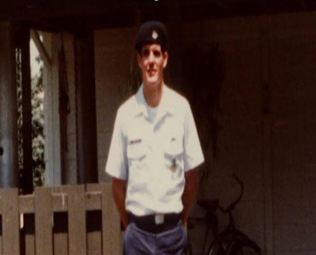

import Head from '@docusaurus/Head';

<Head>
  
</Head>

U.S. Air Force witness to the Rendlesham Forest incident of December 1980, who suffered permanent radiation injuries from the encounter and won an unprecedented VA disability settlement acknowledging UAP-related injuries.

| Field | Details |
|-------|---------|
| **Full Name** | John Burroughs |
| **Born** | c. 1960 |
| **Status** | ALIVE |
| **Current Location** | United States |
| **Category** | Military Witness |

## Assessment: AT RISK

Burroughs is among the very few individuals whose UAP-related injuries have been formally acknowledged by the U.S. government. The classification of his medical records under Special Access Programs (SAPs) indicates the government considered his case sensitive enough to require the highest levels of secrecy. His continued advocacy for other UAP-injured veterans places him in an ongoing confrontational relationship with the defense establishment.

## Current Situation

Burroughs continues to advocate for military personnel who have suffered health effects from UAP encounters. He received a total medical disability settlement from the VA acknowledging he was injured in the line of duty in December 1980. He has spoken publicly about his experiences and pushed for greater transparency regarding the health risks UAP encounters pose to military personnel.

## Background

In December 1980, Airman First Class John Burroughs was stationed at RAF Woodbridge in Suffolk, England, a joint U.S.-UK air base, when a series of unexplained events occurred in the adjacent Rendlesham Forest. Over several nights (December 26-28, 1980), multiple U.S. Air Force personnel witnessed unexplained lights and a craft in the forest. The incident, often called "Britain's Roswell," is one of the most well-documented UAP encounters in military history.

Burroughs was among the servicemen who approached the object at close range. Following the encounter, he developed serious health problems including heart damage and vision impairment. Specifically, his anterior mitral valve was "badly shredded," requiring lifesaving heart surgery.

Dr. Christopher "Kit" Green, a former CIA medical officer with Top Secret/SCI clearance, examined Burroughs and identified the cause of his injuries as "broad-band non-ionizing electromagnetic radiation" -- radio frequencies linked to cardiac and neurological injuries in various classified and unclassified studies. Dr. Green confirmed publicly that Burroughs's medical records were among only a handful in his entire intelligence career that were formally classified, with embedded connections to Special Access Programs (SAPs), sensitive technologies, and electromagnetic field studies.

In 2015, the U.S. government made an unprecedented acknowledgment by granting Burroughs total medical disability through the VA, effectively confirming that he was injured by something at Rendlesham Forest in 1980.

## Why This Person Matters

- One of the primary military witnesses to the Rendlesham Forest incident, one of the most well-documented UAP encounters in history
- Suffered permanent, medically documented radiation injuries (cardiac and vision damage) from close-range UAP encounter
- VA acknowledged his injuries were sustained in the line of duty in December 1980, effectively confirming the UAP encounter
- His medical records were classified under Special Access Programs, indicating the government recognized the sensitive nature of the encounter
- Dr. Kit Green (former CIA medical officer) identified the cause as broad-band non-ionizing electromagnetic radiation
- His case represents one of the only instances where the U.S. government has formally acknowledged physical harm from a UAP encounter
- Advocates for other veterans who have suffered UAP-related health effects

## See Also

- [David Grusch](David_Grusch.mdx) — UAP whistleblower who testified to Congress about recovered craft
- [Lue Elizondo](Lue_Elizondo.mdx) — Former AATIP director and disclosure advocate
- [Ryan Graves](Ryan_Graves.mdx) — Navy pilot who testified before Congress about UAP encounters
- [Bob Lazar](Bob_Lazar.mdx) — Physicist who claims to have worked on alien craft near Area 51
- [Dylan Borland](Dylan_Borland.mdx) — Air Force veteran facing retaliation for UAP whistleblowing
- [Stefan Michalak](Stefan_Michalak.mdx) — Civilian who suffered radiation burns from a close encounter at Falcon Lake

## Other Shocking Stories

- [Edward J. Ruppelt](Edward_Ruppelt.mdx): First director of Project Blue Book and the man who coined the term "unidentified flying object," dead of...
- [Vimal Dajibhai](Vimal_Dajibhai.mdx): 24-year-old Marconi software engineer working on the Stingray torpedo system who plunged from the Clifton Suspension Bridge —...
- [Walter Haut](Walter_Haut.mdx): USAF public information officer at Roswell Army Air Field who authored the famous July 8, 1947, press release...
- [Andrew Hall](Andrew_Hall.mdx): 33-year-old British Aerospace engineering manager found dead from carbon monoxide poisoning with a hosepipe connected to his car...

## Sources

- [John Burroughs and the Government's Unprecedented Acknowledgment - RDR News](https://www.rdrnews.com/news/national/john-burroughs-and-the-governments-unprecedented-acknowledgment/article_22fde1e0-eac0-11ed-bb5f-a3db8e1a9427.html)
- [Rendlesham Forest: John Burroughs Injuries Due to UAP - The Truth Hides](https://thetruthhides.wordpress.com/2015/02/26/rendlesham-forest-john-burroughs-injuries-due-to-uap/)
- [The Injury That Should Have Changed Everything - RDR News](https://www.rdrnews.com/free/the-injury-that-should-have-changed-everything-but-didn-t/article_bc14aebc-3cc3-4404-8806-48590602c6e8.html)
- [Veterans Deserve the Truth About UAP - New Paradigm Institute](https://newparadigminstitute.org/learn/library/veterans-deserve-the-truth-about-uap/)
- [Medical Payout for UFO Mystery Airman - East Anglian Daily Times](https://www.eadt.co.uk/news/21672773.medical-payout-ufo-mystery-airman-following-rendlesham-forest-encounter/)

*This information was built by Grok and Claude AI research.*

**Status:** Alive
