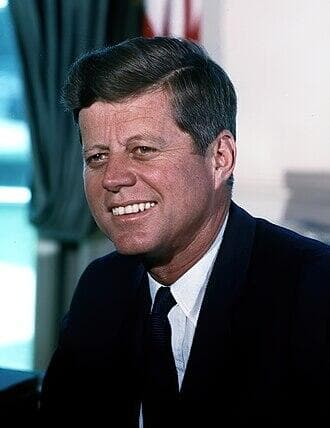

import Head from '@docusaurus/Head';

<Head>
  
</Head>

35th President of the United States, assassinated in Dallas on November 22, 1963. Some fringe theorists, including Steven Greer, claim UFO disclosure was among the motives for his killing, citing a disputed memo allegedly sent to the CIA ten days before his death. The UFO connection remains highly speculative; mainstream assassination theories center on Cold War politics, the CIA, organized crime, and Cuba.

| Field | Details |
|-------|---------|
| **Full Name** | John Fitzgerald Kennedy |
| **Born** | May 29, 1917 (Brookline, Massachusetts) |
| **Died** | November 22, 1963 |
| **Age at Death** | 46 |
| **Location of Death** | Dealey Plaza, Dallas, Texas, USA |
| **Cause of Death** | Gunshot wounds (assassination) |
| **Official Ruling** | Homicide; Lee Harvey Oswald named as lone assassin by Warren Commission |
| **Category** | Political Figure / Head of State |

## Assessment: UNCERTAIN (UFO Link)

John F. Kennedy's assassination is one of the most investigated events in modern history, with dozens of competing theories involving the CIA, the Mafia, Cuban exiles, the Soviet Union, and Lyndon Johnson, among others. The UFO disclosure theory is a fringe subset of these. It rests primarily on a memo dated November 12, 1963 — ten days before the assassination — in which Kennedy allegedly requested the CIA organize its UFO intelligence files and brief him on "unknowns." The memo's authenticity is disputed: a research technician at the JFK Library in Boston was unable to find a carbon copy in the presidential archive, despite Kennedy keeping carbon copies of all his letters, including classified ones. A separate "burned memo" surfaced anonymously in 1999, claiming to show a CIA directive related to JFK and UFOs, but its provenance is unverified. **The UFO-assassination link is speculative and not supported by mainstream historical evidence.**

## Circumstances of Death

On November 22, 1963, President Kennedy was shot while riding in an open motorcade through Dealey Plaza in Dallas, Texas. He was struck by two bullets — one in the upper back/neck and one in the head — and was pronounced dead at Parkland Memorial Hospital at 1:00 p.m. CST.

Lee Harvey Oswald was arrested that afternoon and charged with the murder. Oswald was himself shot and killed two days later by nightclub owner Jack Ruby while being transferred between jails, in full view of television cameras.

The Warren Commission (1964) concluded that Oswald acted alone. The House Select Committee on Assassinations (1979) concluded that Kennedy was "probably assassinated as a result of a conspiracy," though it did not identify co-conspirators. The assassination remains one of the most debated events in American history.

## Background

Kennedy served as the 35th President of the United States from January 20, 1961, until his assassination. A Navy veteran of World War II, he served as a congressman and senator from Massachusetts before winning the presidency in 1960. His brief presidency was marked by the Cuban Missile Crisis, the Bay of Pigs invasion, the beginning of the Vietnam War escalation, the Civil Rights Movement, and the space program.

### The UFO Memo Theory

The UFO-related theory centers on a memo dated November 12, 1963, in which Kennedy allegedly ordered the CIA director to organize intelligence files relating to UFOs and to brief him on all "unknowns" by February 1964. Author William Lester claimed to have obtained this memo through a FOIA request and published it in his book.

According to proponents of this theory, Kennedy's concern was that UFOs seen over Soviet airspace might be misinterpreted by the Soviets as American military technology, potentially escalating Cold War tensions. Kennedy allegedly wanted to establish a data-sharing arrangement with NASA.

However, the memo has never been independently verified. The JFK Library found no carbon copy in its archives. The separate "burned memo" — allegedly rescued from a CIA document-burning session — was provided anonymously to fringe media in 1999 by someone claiming to be a former CIA operative.

Steven Greer and authors such as Michael Salla (*Kennedy's Last Stand*) and Kenn Thomas (*JFK & UFO*) have promoted the theory that Kennedy was killed in part to prevent UFO disclosure, but no credible evidence supports this claim.

## Why This Death Possibly Raises Questions (UFO Context)

- A memo dated November 12, 1963 allegedly shows JFK requesting CIA UFO files ten days before his assassination — but its authenticity is disputed
- The JFK Library could not locate a carbon copy of the memo, despite Kennedy keeping copies of all correspondence
- A "burned memo" surfaced anonymously in 1999 with unverifiable provenance
- Steven Greer and other UFO disclosure advocates have promoted the theory, but it remains fringe
- Mainstream assassination theories focus on Cold War politics, CIA operations, organized crime, and Cuba — not UFOs
- No declassified documents or credible witnesses have linked the assassination to UFO secrecy

## Key Quotes

> "The objects were, in fact, in an area where some very sensitive things were going on. But the memo itself has never been authenticated." — NBC News analysis of the JFK UFO memo

## See Also

- [Robert F. Kennedy](Robert_F_Kennedy.mdx) — Brother, also assassinated; some theorists extend the UFO theory to his killing
- [Dorothy Kilgallen](Dorothy_Kilgallen.mdx) — Journalist investigating the JFK assassination who died under suspicious circumstances

## Other Shocking Stories

- [Frank Scully](Frank_Scully.mdx): American journalist and author of *Behind the Flying Saucers*, the first major book claiming a UFO crash recovery...
- [Mark Wisner](Mark_Wisner.mdx): MOD software engineer found dead from asphyxiation with a plastic sack and cling film over his face —...
- [David Sands](David_Sands.mdx): Easams/Marconi senior scientist working on SDI satellite radar who drove a car loaded with petrol cans into an...
- [Frank Jennings](Frank_Jennings.mdx): 60-year-old Plessey electronic weapons engineer who died of a heart attack — no inquest was held

## Sources

- [NBC News: Is that JFK memo to the CIA about UFOs real?](https://www.nbcnews.com/id/wbna42704241)
- [Live Science: CIA Cover-up Alleged in JFK's 'Secret UFO Inquiry'](https://www.livescience.com/33224-new-declassified-memos-jfk-kennedy-ufos-assassination.html)
- [CS Monitor: Ph.D says JFK asked CIA about UFOs](https://www.csmonitor.com/Science/2011/0421/Ph.D-says-JFK-asked-CIA-about-UFOs)
- [Wikipedia: UFO conspiracy theories](https://en.wikipedia.org/wiki/UFO_conspiracy_theories)
- [SPYSCAPE: JFK Files Reveal CIA Spy With Odd Links to Oswald & UFOs](https://spyscape.com/article/jfk-files-reveal-cia-spy-with-odd-links-to-oswald-ufos)

*This information was built by Grok and Claude AI research.*

**Status:** Deceased (1963)
