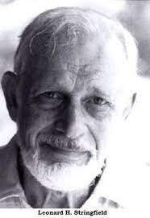

import Head from '@docusaurus/Head';

<Head>
  
</Head>

Pioneer of UFO crash-retrieval research, author of seven *Status Reports* documenting alleged government recovery of downed alien craft, former military intelligence officer, and founder of CRIFO -- one of the world's largest civilian UFO research organizations in the 1950s.

| Field | Details |
|-------|---------|
| **Full Name** | Leonard H. Stringfield |
| **Born** | December 17, 1920 (Cincinnati, Ohio) |
| **Died** | December 18, 1994 |
| **Age at Death** | 74 |
| **Location of Death** | Cincinnati, Ohio |
| **Cause of Death** | Lung cancer |
| **Official Ruling** | Natural causes |
| **Category** | Researcher / Former Military Intelligence |

## Assessment: MODERATE SUSPICION

Stringfield died of lung cancer at 74 after decades of researching the most sensitive aspect of the UFO phenomenon -- government crash-retrieval programs. While lung cancer can occur naturally, "unusual cancers" are among the suspicious causes of death documented by researcher G. Cope Schellhorn in his study of ufologist deaths. Stringfield reportedly faced government interference and intimidation throughout his career, and his 1978 MUFON presentation on crash retrievals was reportedly preceded by threats. His death followed a long illness and was not sudden, making it less suspicious than some other cases, but the pattern of cancer deaths among UFO researchers remains noteworthy.

## Circumstances of Death

Stringfield died on December 18, 1994 -- one day after his 74th birthday -- in Cincinnati, Ohio, following a long battle with lung cancer. He had continued publishing his crash-retrieval research until his final years.

## Background

Leonard Stringfield served in the U.S. Army Air Force during World War II as a military intelligence officer and pilot. During the war, he reportedly had his own UFO encounter while flying over the Pacific.

In 1954, he founded Civilian Research, Interplanetary Flying Objects (CRIFO) in Cincinnati, Ohio, which became one of the world's largest civilian UFO research organizations during the mid-1950s. He published the CRIFO newsletter *ORBIT* from 1953 to 1957.

In 1957, he became public relations adviser for the National Investigations Committee on Aerial Phenomena (NICAP) under Donald Keyhoe. He later served as Director of Public Relations and a board member of the Mutual UFO Network (MUFON).

Stringfield's most significant contribution was his series of seven *UFO Crash Retrievals: Status Reports*, which he self-published from 1978 until his death. The first report, *Retrievals of the Third Kind*, was based on a presentation he gave at the 1978 MUFON symposium -- a talk that was reportedly preceded by threats and intimidation. These reports systematically compiled testimony from military and government insiders who claimed firsthand knowledge of downed UFOs recovered by the U.S. government, including descriptions of alien bodies.

His 60 volumes of research documented what researcher John Ventre described as "government interference, the FBI and CIA stopping the ufologists at any cost."

## Why This Death Possibly Raises Questions

- Lung cancer is among the "unusual cancers" documented by G. Cope Schellhorn as a pattern in ufologist deaths
- He reportedly faced government interference and threats throughout his research career, particularly before his landmark 1978 MUFON crash-retrieval presentation
- His research focused on the single most sensitive aspect of the UFO phenomenon -- government recovery of alien craft and bodies
- His work documented dozens of firsthand testimonies from military insiders, making him a repository of classified knowledge
- The FBI and CIA allegedly attempted to stop his research
- However, his death at 74 from lung cancer after a long illness is not inherently suspicious
- His crash-retrieval research directly preceded and laid the groundwork for claims later made by [David Grusch](David_Grusch.mdx) before Congress

## See Also

- [David Grusch](David_Grusch.mdx) -- Testified before Congress about crash-retrieval programs Stringfield spent decades documenting
- [Stanton Friedman](Stanton_Friedman.mdx) -- Fellow prominent UFO researcher
- [J. Allen Hynek](J_Allen_Hynek.mdx) -- Astronomer and UFO researcher
- [Frank Edwards](Frank_Edwards.mdx) -- Author and broadcaster who died under suspicious circumstances

## Other Shocking Stories

- [Frank Edwards](Frank_Edwards.mdx): News commentator and UFO author who died on the 20th anniversary of the Kenneth Arnold sighting, after threats...
- [Stefan Marinov](Stefan_Marinov.mdx): Bulgarian physicist who fell to his death from a university library staircase in Graz, Austria in 1997 while...
- [Ron Rummel](Ron_Rummel.mdx): Ex-Air Force intelligence agent and publisher of *Alien Digest*, found dead of a gunshot wound in a Portland...
- [Stuart Gooding](Stuart_Gooding.mdx): RCMS postgraduate student killed in a head-on car collision in Cyprus — died on the same day as...

## Sources

- [Leonard H. Stringfield - Wikipedia](https://en.wikipedia.org/wiki/Leonard_H._Stringfield)
- [Leonard H. Stringfield: A Lifetime of Dedication to UFO Crash Research - UFO Report](https://uforeport.com/leonard-h-stringfield-a-lifetime-of-dedication-to-ufo-crash-research/)
- [Leonard Stringfield's UFO Research Goes Public](https://goldenageofgaia.com/2012/08/05/leonard-stringfields-ufo-research-goes-public/)
- [Leonard Stringfield - Grokipedia](https://grokipedia.com/page/Leonard_H._Stringfield)
- [Leonard H. Stringfield - Kook Science](https://hatch.kookscience.com/wiki/Leonard_H._Stringfield)

*This information was built by Grok and Claude AI research.*

**Status:** Deceased (1994)
