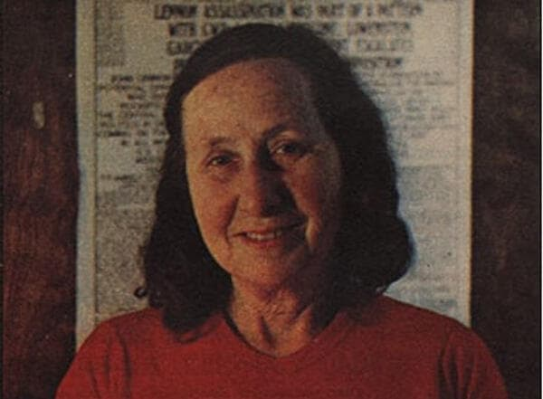

import Head from '@docusaurus/Head';

<Head>
  
</Head>

Pioneering conspiracy researcher and radio host who died of fast-acting cancer in 1988, seven months after receiving death threats while investigating the Presidio military base child abuse scandal.

| Field | Details |
|-------|---------|
| **Full Name** | Mae Magnin Brussell |
| **Born** | May 29, 1922 |
| **Died** | October 3, 1988 |
| **Age at Death** | 66 |
| **Location of Death** | Carmel-by-the-Sea, California |
| **Cause of Death** | Cancer (fast-acting) |
| **Official Ruling** | Natural causes |
| **Category** | Researcher / Radio Broadcaster / Conspiracy Analyst |

## Assessment: SUSPICIOUS

Mae Brussell died of a rapidly progressing cancer just seven months after receiving death threats that forced her off the air. At the time of the threats, she was actively investigating the Presidio child abuse scandal — a case involving allegations against Lt. Col. Michael Aquino, a military intelligence officer and founder of the Temple of Set. The speed of the cancer, the timing relative to her Presidio investigation and death threats, and the broader pattern of researchers dying of fast-onset cancers while investigating sensitive government programs raise legitimate questions. While cancer at age 66 is not uncommon, her followers — known as the "Brussell Sprouts" — suspected the worst and circulated theories that agents had her killed.

## Circumstances of Death

Mae Brussell died on October 3, 1988, in Carmel-by-the-Sea, California, from a rapidly progressing cancer. She was 66 years old.

In March 1988, Brussell gave up her weekly radio show after receiving a death threat from a caller to her home. She had been broadcasting for 17 years — 851 weekly editions of her show. Seven months after the death threat and her departure from broadcasting, she was dead from cancer.

The specific type and staging of her cancer are not well documented in the public record. What is consistently reported is that the cancer progressed with unusual speed from diagnosis to death.

## Background

Mae Brussell was born Mae Magnin in 1922 into a prominent family. She became one of the most dedicated conspiracy researchers in American history, spending decades compiling and cross-referencing news clippings, government documents, and investigative reports.

### Radio Career

Brussell hosted *Dialogue: Conspiracy* (later renamed *World Watchers International*) on KLRB in Carmel, California, beginning in 1971. From 1983 to 1988, she hosted the same program on KAZU, a radio station based in Pacific Grove. Over 17 years, she produced 851 weekly broadcasts.

Her research focused primarily on the assassination of President John F. Kennedy, but expanded to cover a wide range of topics including intelligence agency operations, political assassinations, neo-Nazi networks in the United States, and government cover-ups. Her articles were published in *The Realist*, a magazine published by Paul Krassner. John Lennon reportedly donated money so Krassner could afford to print Brussell's work.

### Presidio Investigation

In November 1987, Brussell began a series of broadcasts investigating the Presidio child abuse scandal. Starting in 1986, children at the daycare center at the Presidio of San Francisco military base had come forward with allegations of molestation. More than 60 children were reportedly sexually abused at the Army base's childcare center.

The case expanded when a child accused Lt. Col. Michael Aquino, an Army intelligence officer stationed at the Presidio who was also the founder of the Temple of Set, a Satanist organization. Brussell's November 9-23, 1987 broadcasts examined the Aquino connection and the broader pattern of child abuse at military facilities.

Brussell received death threats during her investigation of the Presidio case. She went off the air in March 1988 after a threatening call to her home.

## Why This Death Possibly Raises Questions

- She died of fast-acting cancer just seven months after receiving death threats that forced her off the air
- At the time of the threats, she was actively investigating the Presidio military base child abuse scandal
- The Presidio case involved Lt. Col. Michael Aquino, a military intelligence officer — making it a matter that intersected with classified military and intelligence operations
- She had been broadcasting controversial material about government conspiracies for 17 years without stopping — until the death threat
- Her followers suspected the cancer was induced, though no evidence of this has been presented
- The pattern of fast-acting cancers appearing in researchers investigating sensitive government programs has been noted by multiple investigators
- Directed-energy weapons and radiation exposure have been documented as capable of inducing cancer
- However, cancer at age 66 is not statistically unusual, and the specific type and progression of her cancer are not well documented enough to draw firm conclusions
- No autopsy results or detailed medical records have been made public

## See Also

- [Dorothy Kilgallen](Dorothy_Kilgallen.mdx) — Journalist who died while investigating classified information
- [Jim Keith](Jim_Keith.mdx) — Conspiracy author who died of a blood clot following knee surgery in 1999
- [Karla Turner](Karla_Turner.mdx) — Abduction researcher who died of fast-acting cancer at 48
- [Dean Warwick](Dean_Warwick.mdx) — Researcher who collapsed and died at a conference in 2006

## Other Shocking Stories

- [Jacob Prichard](Jacob_Prichard.mdx): Civilian employee at the Air Force Research Laboratory, Wright-Patterson Air Force Base. Perpetrator of an October 25, 2025...
- [Paul Bennewitz](Paul_Bennewitz.mdx): Businessman and UFO investigator who was deliberately driven to a mental breakdown by a coordinated AFOSI disinformation campaign...
- [Richard Pugh](Richard_Pugh.mdx): MOD computer consultant found dead with a plastic bag over his head and rope coiled four times around...
- [Ron Rummel](Ron_Rummel.mdx): Ex-Air Force intelligence agent and publisher of *Alien Digest*, found dead of a gunshot wound in a Portland...

## Sources

- [Mae Brussell — Wikipedia](https://en.wikipedia.org/wiki/Mae_Brussell)
- [Mae Brussell — Wikispooks](https://wikispooks.com/wiki/Mae_Brussell)
- [Mae Brussell — Find a Grave](https://www.findagrave.com/memorial/25568737/mae-brussell)
- [Suspicious Deaths: Mae Brussell](https://suspiciousdeaths.blogspot.com/2010/11/mae-brussell.html)
- [Recalling Mae Brussell — Voices of Monterey Bay](https://voicesofmontereybay.org/2018/06/20/recalling-mae-brussell/)
- [Mae Brussell, Conspiracy Theorist — UPI Archives](https://www.upi.com/Archives/1988/10/05/Mae-Brussell-conspiracy-theorist/9005223928710/)
- [Mae Brussell — Spartacus Educational](https://spartacus-educational.com/JFKbrussel.htm)

*This information was built by Grok and Claude AI research.*

**Status:** Deceased (1988)
